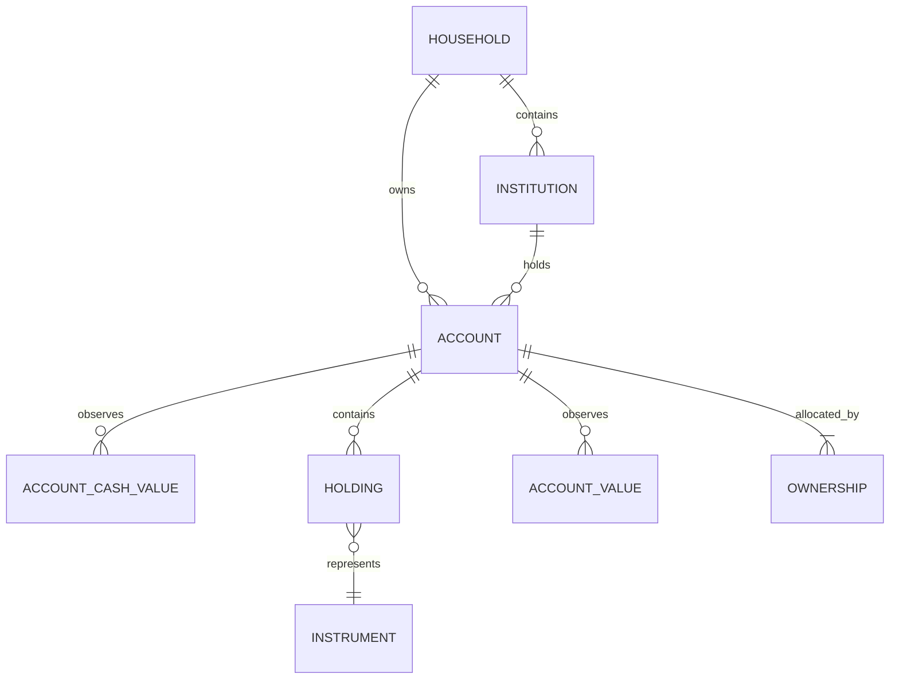

# Account 容器与金融头寸模型设计方案

## 1. 文档状态与决策摘要

- 状态：Implemented in Nestworth-go `0.2.1` / SQLite schema v7
- 适用基线：Nestworth-go current domain model and SQLite schema v7
- 文档目的：为 Account 模型重构提供可直接交给实现 Agent 的领域、数据库、应用和发布契约
- 本文描述已落地的 breaking cutover；不提供 v6 迁移

本设计保留当前整体架构，只修正职责边界和几个过窄的约束：

```text
Account      = 现实世界中的金融账户或资产容器
Cash Balance = Account 内部以法定货币计价的现金头寸
Holding      = Account 内部的 Instrument 头寸
Instrument   = 被 Holding 引用的底层金融资产定义与分类
```

不引入通用 `SubAccount`。`holdings` tracking 不再限定为 Investment；是否可用由本文的合法三元组表唯一决定。

Account 的三个正交维度正式定义为：

```text
account_type       = 这是什么类型的现实世界账户/容器？
balance_sheet_role = 它位于资产负债表的哪一侧？
tracking_mode      = Nestworth 如何记录和估值它？
```

`balance_sheet_role` 是正式持久化字段；`account_type` 只能在仍兼容当前 role/tracking 时编辑；`balance_sheet_role` 与 `tracking_mode` 在创建后保持不可变。资产分类按 Account 形态处理：Composite Account 由内部 component 决定，Simple Account 由 role 决定资产负债侧、由 `account_type` 决定 bucket。

本方案同时冻结以下产品决策：

- Overview 以 component 粒度的 `assetsByType` 取代旧账户级 `ByCategory`，并增加 `liabilitiesByType`；
- schema v7 是全新的 breaking schema，不提供旧数据库迁移、兼容读取或自动 reset；
- v7 Wails DTO 只暴露新字段，不设计双 API 优先级；
- SQLite 的 `accounts`、`account_state_observations`、`history_origin_account_states` 直接使用物理列 `include_in_portfolio`；
- Simple Account 的历史分类使用当前 metadata，并显式标记 `current-metadata-derived`。

## 2. 重构前仓库基线

本节记录 cutover 之前的 schema v6 状态，不是当前代码。当前仓库使用 schema v7 与下文冻结的 `account_type` / `balance_sheet_role` / `tracking_mode` 契约。

当时 `docs/architecture/domain-model.md` 和 `internal/infrastructure/sqlite/schema.sql` 使用 schema v6。`accounts` 仍包含：

- `primary_category`
- `secondary_category`
- `tracking_mode`
- `include_in_investment`

当前 Go domain model、SQLite repository 和 schema verifier 仍围绕 `PrimaryCategory`/`SecondaryCategory` 校验账户，并通过 `PrimaryCategory.IsLiability()` 判断负债。

当前估值实现已经有一部分目标行为：`internal/application/valuation.go` 会把有 Instrument 的 component 按 `Instrument.Type` 放入 instrument-type allocation，把 holdings Account 中没有 Instrument 的 component 放入 `cash`，把 Simple Account 放入 `manual`。因此本方案不要求重做估值骨架，而是要求把这部分行为正式化，并清除其他路径对旧 Account category 的不当依赖。

当前 Activity 代码和 schema 仍保存稳定的内部 kind 值，例如 `cash_in`、`cash_out`、`cash_transfer`、`fx_conversion`、`position_transfer`、`buy`、`sell`、`value_update`、`debt_draw`、`debt_payment` 和 `reversal`。本设计使用领域/产品层的既有语义名称描述它们，不新增另一套 Activity taxonomy，也不改写既有历史事实。

## 3. 背景与问题

现实中的一个账户通常可以同时包含多种资产：

```text
MooMoo SG Brokerage
├── SGD cash
├── USD cash
├── CNY cash
├── US stocks
├── Singapore ETFs
└── crypto assets
```

招商银行的一段客户关系也可能包含：

```text
招商银行综合账户
├── CNY 活期存款
├── USD 存款
├── 银行理财
├── 多个基金持仓
└── 黄金
```

当前结构已经可以存储一部分上述内容，但语义不完整：

1. `Account.primary_category`/`secondary_category` 同时试图描述账户身份和账户资产类别。
2. `holdings` tracking 被限制为 Investment，银行或交易所无法自然地表示“现金 + 持仓”。
3. 账户级的 `include_in_investment` 无法区分同一银行账户中的普通现金与投资头寸。
4. Simple Account 没有清楚规定“Account 自身作为资产”时如何分类。
5. 如果用通用 `SubAccount` 解决显示层级，会出现 USD Cash、基金账户和 Holding 的边界争议。

这些问题应通过职责重划解决，而不是增加一层没有稳定现实边界的实体。

## 4. 设计目标

- 让 Account 代表真实账户边界或真实资产对象。
- 让 Cash Balance 和 Holding 表达 Account 内部的可估值头寸。
- 让 `account_type` 描述账户形态，而不是占用底层资产分类职责。
- 让 `balance_sheet_role` 明确、持久、可审计地控制资产/负债语义。
- 让合法三元组中的 Account type 使用 `holdings` tracking。
- 保留 `balance` 和 `manual_value` 对 Simple Account 的支持。
- 使 Overview、Portfolio、History、Activity 和估值对同一模型保持一致。
- 在新 schema 内保持 Account、Holding、Activity、Origin、Snapshot 的身份和不可变事实。

## 5. 非目标

- 不引入通用 `SubAccount` domain entity。
- 不把每个币种、市场、证券类型或 UI 分组建成 Account。
- 不把 stablecoin 作为 fiat Cash Balance。
- 不实现 component-level Portfolio inclusion；该能力列为后续扩展。
- 不在本次设计中实现 balance/manual_value 与 holdings 的在线转换 workflow。
- 不实现银行/券商同步、交易导入、对账或外部 statement 解析。
- 不改变 Activity 的 immutable、reversal、correction 语义。
- 不提供旧 schema 数据迁移或兼容读取。

## 6. 核心领域模型

### 6.1 关系图



### 6.2 Account 的现实边界

只有现实世界存在独立账户或独立资产边界时才创建 Account。判断依据包括：

- 是否有独立的 statement 或对账边界；
- 是否有独立的外部账户号、合同或法律关系；
- 是否需要单独设置 ownership、lifecycle 或 inclusion policy；
- 是否能独立进行余额/持仓变更。

一个账户中的 SGD、USD、CNY 不是 Account；它们是该 Account 的 Cash Balance。一个账户中的 NVDA、QQQ 或 BTC 不是 Account；它们是 Holding。只有银行实际提供独立的基金账户或黄金账户时，才应另建 Account。

### 6.3 三个正交维度

| 维度 | 正式问题 | 例子 | 初始写入 | 后续修改 |
| --- | --- | --- | --- | --- |
| `account_type` | 现实世界中它是什么？ | `bank_account`、`brokerage`、`crypto_exchange` | 必填 | 可编辑，不产生财务 Activity |
| `balance_sheet_role` | 它属于资产还是负债？ | `asset`、`liability` | 必填 | 当前版本创建后不可变 |
| `tracking_mode` | 如何记录当前值？ | `holdings`、`balance`、`manual_value` | 必填 | 当前版本创建后不可变 |

这三个字段互不替代：

- `account_type` 不表示账户内资产配置。
- `balance_sheet_role` 不从账户内 Instrument 或 Cash Balance 动态推断。
- `tracking_mode` 不表示资产类别，只表示数据形态和估值入口。

除 `other` 外，role 不是可自由组合的 UI 选项，而是由合法三元组确定；UI 应展示最终 role，但不得允许选反。`other` 在创建时要求用户明确选择 role。持久化后的 `balance_sheet_role` 才是权威值。

### 6.4 Account Type

闭合的 `AccountType` 集合为：

```text
cash_on_hand
bank_account
brokerage
investment_account
crypto_exchange
digital_wallet
pension
insurance_policy
property
vehicle
collectible
receivable
credit_card
loan
other
```

`cash_on_hand`、`insurance_policy`、`collectible` 是新模型正式支持的现实资产类型，而不是迁移兼容项。枚举值必须在 Go、SQLite、Wails DTO 和前端 catalog 中一致。

以下是唯一合法的 `(account_type, balance_sheet_role, tracking_mode)` 集合；未列出的组合一律由 `NewAccount` 拒绝：

| `account_type` | 现实含义 | 合法 role | 合法 tracking |
| --- | --- | --- | --- |
| `cash_on_hand` | 现金盒、保险箱等独立实物现金边界 | `asset` | `balance` |
| `bank_account` | 银行存款或综合账户 | `asset` | `balance`, `holdings` |
| `brokerage` | 券商账户 | `asset` | `holdings`, `manual_value` |
| `investment_account` | 独立基金、贵金属或其他投资账户 | `asset` | `holdings`, `manual_value` |
| `crypto_exchange` | 加密货币交易所或托管账户 | `asset` | `holdings` |
| `digital_wallet` | 电子钱包 | `asset` | `balance`, `holdings` |
| `pension` | 养老金或退休账户 | `asset` | `holdings`, `manual_value` |
| `insurance_policy` | 有现金价值的保险保单 | `asset` | `manual_value` |
| `property` | 房产等单一资产对象 | `asset` | `manual_value` |
| `vehicle` | 车辆等单一资产对象 | `asset` | `manual_value` |
| `collectible` | 收藏品等单一资产对象 | `asset` | `manual_value` |
| `receivable` | 应收款或借出款 | `asset` | `balance`, `manual_value` |
| `credit_card` | 信用卡负债 | `liability` | `balance` |
| `loan` | 房贷、车贷或其他借款 | `liability` | `balance` |
| `other` | 无法归入以上类型的现实账户/对象 | `asset` | `balance`, `manual_value`, `holdings` |
| `other` | 无法归入以上类型的负债 | `liability` | `balance` |

特别禁止 `credit_card`/`loan + holdings` 和任何 `liability + holdings/manual_value`。当前版本不建模 margin liability composite；若未来需要，必须另做债务 component 与净额规则设计。

`account_type` 可以修改，但新 type 与当前不可变的 role、tracking 组成的三元组必须仍在上表内，否则拒绝。修改 type 不产生 Activity，也不改变金额、数量、cost basis、role、tracking 或 inclusion flags。

### 6.5 Balance Sheet Role

`balance_sheet_role` 是 Account 的正式字段：

```text
asset
liability
```

规则：

- `asset` Account 的估值进入资产侧。
- `liability` Account 的估值进入负债侧，净值计算使用负号。
- 数据库金额仍保存为非负精确 Money；符号是 role 的派生语义。
- Cash、股票、基金或加密货币位于某个 Account 内，不会改变 Account 的 role。
- `IsLiability()` 必须改为读取 `balance_sheet_role`，不能继续读取旧 `PrimaryCategory`。
- role 在 Account 创建后不可变，除非未来设计了显式 Account conversion workflow。

推荐在领域层使用 `BalanceSheetRole` 类型和解析函数，而不是在各个调用点比较字符串。

### 6.6 Tracking Mode

保留三种 tracking mode，但重新定义 `holdings`：

| tracking mode | 账户形态 | 数据来源 | 典型用途 |
| --- | --- | --- | --- |
| `holdings` | Composite Account | `account_cash_values` + `holdings` + quotes | 银行综合账户、券商、交易所 |
| `balance` | Simple Account | `account_values(value_kind=balance)` | 单一现金余额、信用卡、贷款、应收款 |
| `manual_value` | Simple Account | `account_values(value_kind=manual_value)` | 房产、车辆、未拆分投资 |

`holdings` 不再只属于 Investment。允许使用 holdings 的前提是 Account 的 tracking mode 为 `holdings`，而不是某个旧 category 值。

### 6.7 Account 内部 component

```text
Composite Account (holdings)
├── Cash Balance[currency]
└── Holding -> Instrument

Simple Account (balance/manual_value)
└── Account Value observation
```

约束：

- `balance`/`manual_value` Account 不能创建 Holding 或 Cash Balance。
- `holdings` Account 不写 Account Value 作为账户总值。
- 一个 Account 可以拥有多个 Cash Balance currency。
- 一个 Account 中同一 active Instrument 至多对应一个 Holding。
- Holding 的 ownership 继承 Account ownership。
- 不为 component 额外创建通用父表或 `SubAccount`。

## 7. 资产分类语义

### 7.1 总体规则

资产分类不是一个单一的 Account-level category，而是根据 Account 形态选择来源：

```text
Composite / holdings Account:
    Cash Balance                 -> cash
    Holding -> Instrument.type   -> instrument type

Simple / balance Account:
    Account itself               -> account_type-derived class

Simple / manual_value Account:
    Account itself               -> account_type-derived class
```

这是本方案必须保持的核心不变量：

> Composite Account 的资产分类 MUST NOT 从 `account_type` 得出；必须从内部 component 得出。
>
> Simple Account 的 Account 自身就是被估值的金融对象，因此其分类 MAY 从 `account_type` 得出。

### 7.2 Composite Account 分类

| component | 分类来源 | 例子 |
| --- | --- | --- |
| `AccountCashValue` | 固定为 `cash` | SGD、USD、CNY |
| `Holding` | `Holding.Instrument.instrument_type` | stock、etf、mutual_fund、crypto |

一个 `bank_account + holdings` 可以有 cash、mutual fund、precious metal 和 bank investment product；它不会因为 Account type 是 bank account 而把全部金额归入 cash，也不会因为含有基金而把全部金额归入 investment。

### 7.3 Simple Account 分类

Simple Account 没有可拆分的 Cash Balance/Holding；分类函数返回 `(role, bucket)`。role 决定 Overview 哪一侧、净值符号和是否有资格进入资产 Portfolio，type 只决定该侧的 bucket 名称。

| `account_type` | role | Simple tracking | bucket |
| --- | --- | --- | --- |
| `cash_on_hand` | `asset` | `balance` | `cash` |
| `bank_account` | `asset` | `balance` | `cash` |
| `digital_wallet` | `asset` | `balance` | `cash` |
| `brokerage` | `asset` | `manual_value` | `unclassified_investment` |
| `investment_account` | `asset` | `manual_value` | `unclassified_investment` |
| `pension` | `asset` | `manual_value` | `pension` |
| `insurance_policy` | `asset` | `manual_value` | `insurance` |
| `property` | `asset` | `manual_value` | `property` |
| `vehicle` | `asset` | `manual_value` | `vehicle` |
| `collectible` | `asset` | `manual_value` | `collectible` |
| `receivable` | `asset` | `balance` 或 `manual_value` | `receivable` |
| `credit_card` | `liability` | `balance` | `credit_card` |
| `loan` | `liability` | `balance` | `loan` |
| `other` | `asset` | `balance` 或 `manual_value` | `other_asset` |
| `other` | `liability` | `balance` | `other_liability` |

`crypto_exchange` 没有 Simple 组合。`brokerage`/`investment_account` 的手工总值不能假定为 stock、ETF、fund 或 cash，因此统一使用稳定 key `unclassified_investment`。任何未命中合法表的输入都是 domain validation error，不得回退猜测。

### 7.4 Fiat Cash 与 Stablecoin

规则已经确定，不作为开放问题：

```text
SGD -> Cash Balance(currency=SGD)
USD -> Cash Balance(currency=USD)
CNY -> Cash Balance(currency=CNY)

USDC -> Instrument(type=crypto) -> Holding
USDT -> Instrument(type=crypto) -> Holding
BTC  -> Instrument(type=crypto) -> Holding
ETH  -> Instrument(type=crypto) -> Holding
```

原因：Cash Balance 表示以 `CurrencyCode` 计价的法定货币现金；stablecoin 是 tokenized crypto instrument，可能脱锚，拥有数量和价格语义，不能被当作 USD/CNY 等法币现金。

Digital Wallet 和 Crypto Exchange 遵循同一规则。钱包中的 USDC 必须是 `Instrument(type=crypto)` 的 Holding，即使它的目标锚定货币是 USD。

## 8. MooMoo SG 与招商银行示例

### 8.1 MooMoo SG

```text
Institution: MooMoo SG
Account: MooMoo SG Brokerage
account_type: brokerage
balance_sheet_role: asset
tracking_mode: holdings
default_currency: SGD

Cash Balances:
- SGD 12,000              -> cash
- USD 8,500               -> cash
- CNY 3,000               -> cash

Holdings:
- NVDA 20 shares          -> stock
- QQQ 15 shares           -> etf
- ES3.SI 1,000 shares     -> etf
- BTC 0.2                 -> crypto
```

仍然只有一个现实账户。不同币种现金和不同证券是内部头寸，不是 SubAccount。Portfolio 可以得到 Cash、Stock、ETF、Crypto 的拆分，而不是 Investment 100%。

### 8.2 招商银行综合账户

当存款、理财、基金和黄金共享同一现实账户/statement 边界时：

```text
Institution: 招商银行
Account: 招商银行综合账户
account_type: bank_account
balance_sheet_role: asset
tracking_mode: holdings
default_currency: CNY

Cash Balances:
- CNY 100,000             -> cash
- USD 5,000               -> cash

Holdings:
- 招银理财 A              -> bank_investment_product
- 沪深 300 基金            -> mutual_fund
- 纳斯达克基金              -> mutual_fund
- 黄金                     -> precious_metal
```

### 8.3 招商银行独立账户边界

如果银行卡、基金账户和黄金账户拥有独立 statement 或外部账户号，则建多个 Account：

```text
Institution: 招商银行
├── 一卡通
│   └── bank_account + balance/holdings
├── 基金账户
│   └── investment_account + holdings
└── 黄金账户
    └── investment_account + holdings
```

这个拆分由现实账户边界决定，不由 Portfolio 分类或 UI 树形展示决定。

## 9. Portfolio Inclusion 语义

### 9.1 当前版本的字段语义

新 schema 直接使用：

```text
include_in_portfolio
```

它表示“这个 Account 是否整体进入 Portfolio”，不表示“Account 内只有投资资产”。数据库、domain、API 和 UI 使用同一个名称，不保留 `include_in_investment` alias。

### 9.2 Whole-account inclusion

当前版本采用简单且一致的规则：

> 如果 Account 被纳入 Portfolio，则该 Account 的所有可估值 component 都参与 Portfolio valuation 和 allocation。

因此一个 Brokerage 或 Bank composite Account 被纳入 Portfolio 时：

- 现金进入 Portfolio 的 cash allocation；
- 股票、ETF、基金、黄金、crypto 等进入对应 Instrument type allocation；
- Account 的所有 component 使用同一个 Account inclusion decision；
- 未被纳入 Portfolio 的 Account，其所有 component 都不进入 Portfolio。

这对券商账户很自然：settlement cash 通常就是投资组合的一部分。

### 9.3 混合银行账户的已知限制

如果招商银行综合账户同时有大量日常存款和投资头寸，`include_in_portfolio=true` 会让两者一起进入 Portfolio。当前版本不提供“只纳入基金/黄金、不纳入普通存款”的 component-level policy。

这是一个明确的产品限制，不应通过偷偷改变分类或让 Overview/Portfolio 使用不同分母来掩盖。用户有三个当前可用选择：

1. 把现实中有独立边界的投资账户拆成单独 Account；
2. 接受整个综合账户进入 Portfolio；
3. 将整个综合账户排除 Portfolio，但仍让它参与 net worth 和资产分类 Overview。

### 9.4 Deferred portfolio scope

未来可以引入更细粒度的字段或 policy：

```text
portfolio_scope:
- none
- whole_account
- investment_positions
```

其含义可以是：

- `none`：Account 不进入 Portfolio；
- `whole_account`：Cash Balance 和 Holding 全部进入 Portfolio；
- `investment_positions`：只纳入 Holding，或未来通过 component selection 明确选择部分 Cash。

本次设计不实现 `portfolio_scope`，也不在 schema 中提前加入没有完整 API、历史、迁移和 UI 契约的字段。

### 9.5 Liquid Assets Inclusion

`include_in_liquid_assets` 与 Portfolio inclusion 一样是 whole-account 开关。对 `holdings` Account 开启后，整户所有可估值 component 一起进入 liquid-assets 指标；系统不得只挑现金，也不得按 Instrument type 暗中排除基金或黄金。

因此 UI 对 `bank_account + holdings`、`digital_wallet + holdings` 和其他 mixed Account 开启该选项时必须提示“适用于整户现金与持仓”。component-level liquid policy 不在 v7 范围内。

### 9.6 创建默认值

Inclusion 默认值独立于资产分类规则；它们只是 UI 建议值，保存后的用户选择才是权威值，修改 `account_type` 时不得自动重算：

| 条件 | `include_in_net_worth` | `include_in_portfolio` | `include_in_liquid_assets` |
| --- | --- | --- | --- |
| 所有合法账户 | `true` | 见下 | 见下 |
| `brokerage`、`investment_account`、`crypto_exchange`、`pension` | — | `true` | — |
| 其他 type | — | `false` | — |
| `cash_on_hand + balance`、`bank_account + balance`、`digital_wallet + balance` | — | — | `true` |
| 所有 `holdings` 及其他 Simple 组合 | — | — | `false` |

前端不得再用 `type == investment` 一类推断自动勾选；catalog 应直接返回建议值或使用与 domain 共源的显式矩阵。

## 10. 估值、Overview 与 Portfolio

### 10.1 估值输入

统一的 ValuationService 继续使用当前的三种入口：

```text
holdings Account = Σ Cash Balance converted to base
                 + Σ Holding Quantity × Instrument Quote converted to base

balance Account = latest Account Value converted to base
manual Account  = latest Account Value converted to base
```

必须保持现有金融语义：

- 使用精确十进制；
- 同币种转换不需要 FX quote；
- 缺 quote 只影响对应 component，不补零；
- archived Account 或 `include_in_net_worth=false` 不参与净值；
- `balance_sheet_role=liability` 的金额在净值中为负；
- Portfolio 只选择 `include_in_portfolio=true` 且 role 为 asset 的 Account；
- 前端不能从已四舍五入的 view model 重新计算总额。

### 10.2 统一分类函数

应用层应有一个单一、可测试的分类决策，不要在 Overview、Portfolio 和 Account detail 中分别复制规则：

```text
classify(account, component):
  if account.tracking_mode == holdings:
    if component is CashBalance:
      return (account.balance_sheet_role, cash)
    if component is Holding and instrument exists:
      return (account.balance_sheet_role, instrument.instrument_type)
    if component is Holding and instrument is missing:
      return incomplete(missing_instrument)

  # Simple Account: the Account itself is the valued object.
  return classify_simple_account(account.account_type,
                                 account.balance_sheet_role,
                                 account.tracking_mode)
```

`classify_simple_account` 必须完全实现 §7.3 表。Holding 缺 Instrument 时不得标成 cash、manual 或补零；只排除受影响 component，并把 Account/上层结果标为 incomplete。Overview、Portfolio、Account detail 与历史 breakdown 必须调用同一分类函数。

### 10.3 Overview

v7 选择 component 粒度：旧 `Overview.ByCategory` 被 `assetsByType` 取代，并新增 `liabilitiesByType`。这不是字段改名，而是产品统计口径变化；`docs/architecture/domain-model.md`、Wails DTO、前端图表和测试必须在实现时同步更新。

`assetsByType` 按底层 component 或 Simple Account 自身聚合：

```text
cash                    = Composite Cash Balance + bank/digital Simple Account
stock                   = Holding.Instrument.type == stock
etf                     = Holding.Instrument.type == etf
mutual_fund             = Holding.Instrument.type == mutual_fund
bond                    = Holding.Instrument.type == bond
bank_investment_product = Holding.Instrument.type == bank_investment_product
precious_metal          = Holding.Instrument.type == precious_metal
crypto                  = Holding.Instrument.type == crypto
property                = Simple property Account
vehicle                 = Simple vehicle Account
receivable              = Simple receivable Account
unclassified_investment = Simple manual investment Account
insurance               = Simple insurance policy
collectible             = Simple collectible
other_asset             = Simple other asset
```

`liabilitiesByType` 使用 `credit_card`、`loan`、`other_liability` bucket，分母为 liabilities 总额。`assetsByType` 的分母为 assets 总额。缺失输入沿用 Overview 的 incomplete 语义，不以零值进入任何 bucket。

Composite Account 的 `account_type` 只能作为 Account filter、label 或 grouping 维度，不能将整个 Bank Account 强制归为 cash，也不能将整个 Brokerage 强制归为 investment。Account 卡片展示 account type；Cash/Holding 行展示 component type，两者不能共用一枚 category chip。

### 10.4 Portfolio

Portfolio 总额是所有 `include_in_portfolio=true`、active、complete、asset-role Account 的 complete base value 之和。对每个被纳入 Account：

- 所有完整 component 参加 allocation；
- Cash Balance 进入 `cash`；
- Holding 进入其 Instrument type；
- Simple Account 进入 account-type-derived 或 `manual` bucket；
- 缺 quote 的 component 不补零，并将 Account/Portfolio 标记为 incomplete；
- 同一总额和同一 complete-account denominator 用于 amount/percentage。

Portfolio 可继续按 native currency、country、Instrument type 提供 allocation；`account_type` 作为补充筛选维度而非资产类别。

### 10.5 Liability 与 mixed component

当前合法三元组禁止所有 `liability + holdings`，因此 v7 不存在 liability Composite Account。即使未来允许特殊托管/保证金模型，也必须保持：

- role 由 Account 决定；
- component type 由 Cash/Instrument 决定；
- role 不从 component 推断；
- Portfolio 过滤和净值符号使用 role。

## 11. Activity 与 History 影响

### 11.1 既有 Activity taxonomy

本设计不发明新的 Activity kind。以下是已有 Nestworth 领域语义及其作用目标：

| 领域语义 | 影响目标 |
| --- | --- |
| Opening Adjustment | 起始/对账时对余额或头寸的调整 |
| Balance Adjustment | `balance` Account 的 Account Value |
| Position Adjustment | Holding Quantity |
| Deposit | Account Cash，适用于 holdings Account 的现金增加 |
| Withdrawal | Account Cash，适用于 holdings Account 的现金减少 |
| Transfer | Account Cash 的内部转移；按已有 transfer legs 表达 |
| Buy | Holding Quantity 增加和按既有 trade semantics 生成的 trade cash leg |
| Sell | Holding Quantity 减少和按既有 trade semantics 生成的 trade cash leg |
| Income | 通过既有 cash effect/reason 产生的收入分类 |
| Fee | 通过既有 fee effect 产生的费用分类 |
| Debt Draw | 债务 Account Value 与 cash endpoint |
| Debt Payment | 债务 Account Value 与 cash endpoint |
| Debt Adjustment | 债务余额的调整 |
| Manual Valuation | `manual_value` Account 的 Account Value |
| Reversal | 对原 Activity 的精确逆向 Activity |

代码层使用稳定的 persisted kind 值（如 `cash_in`、`cash_out`、`value_update` 等）承载上述语义。产品 label、domain command 和 persisted kind 的映射保持单一，不因 Account 重构另造同义 kind。

### 11.2 Effect target 与 tracking mode

Activity effect 的 target 继续决定写入哪种观察：

```text
EffectTargetAccountValue    -> account_values
EffectTargetAccountCash     -> account_cash_values
EffectTargetHoldingQuantity -> holding_quantity_values / holdings state
```

Account 是 `holdings` 时，现金相关 Activity 必须使用 Account Cash target；Account 是 `balance` 或 `manual_value` 时，余额/估值相关 Activity 使用 Account Value target。这个判断来自 tracking mode，不来自旧 category。

### 11.3 FX conversion

本设计不新增第二个 FX Activity kind。当前代码已有 `fx_conversion` persisted kind，schema v7 继续把它作为唯一表示。

无论底层 kind 如何命名，FX conversion 的财务语义必须保持：同一 holdings Account 内减少一种 Cash Balance、增加另一种 Cash Balance，保留既有 transaction FX rate、fee 和 internal-transfer classification。

### 11.4 不变性声明

本设计：

- 不新增 Activity kinds；
- 不改变 Activity immutable 规则；
- 不改变 reversal/correction 语义；
- 不把 account_type 修改记录为财务 Activity；
- 不把账户 metadata 修改伪装成 Deposit、Transfer 或 Valuation；
- 不重写历史 Activity 的 classification、effect target 或原始金额。

## 12. Account Type 修改与历史分类

### 12.1 当前行为

`account_type` 是可编辑的账户元数据。修改它：

- 新 type 与当前 role、tracking 必须仍是 §6.4 的合法三元组，否则拒绝；
- 不生成 Activity；
- 不改变 Account Value；
- 不改变 Cash Balance；
- 不改变 Holding Quantity；
- 不改变 cost basis；
- 不改变已有 Activity、History Origin component 或 financial snapshot facts；
- 不自动改变 `balance_sheet_role`；
- 影响当前状态下 Simple Account 的 label/classification；
- 不影响 Composite Account 内 Cash/Instrument 的底层分类。

`balance_sheet_role` 继续保持创建后不可变。例如 `bank_account + asset + holdings` 可以改成 `brokerage`，但不能改成 `property` 或 `credit_card`；`bank_account + asset + balance` 也不能改成 `brokerage`。该规则应实现为唯一的 `IsValidAccountCombination(type, role, tracking)`，创建与更新共用。

### 12.2 历史分类限制

当前 `account_state_observations` 不保存 `account_type` 的历史版本。因而历史 breakdown 若依赖 Simple Account 的 `account_type`，系统不能声称知道过去某一天的真实 account type。

v7 采用唯一行为：Composite Account 的历史分类从 snapshot item 的 `InstrumentID` 派生；没有 Instrument 的 Account Cash component 归为 cash。Simple Account 使用当前 `account_type` 和不可变 role/tracking 进行分类，API 在对应 breakdown/result 上返回 `classificationBasis=current-metadata-derived`，UI 必须以说明文案或 tooltip 展示该限制。

该标记不是 incomplete：金额和当时的财务事实仍可完整，只是 bucket 名称来自当前 metadata。不得静默声称它是过去时点的真实 type。

`account_type` 编辑不得批量重写既有 Daily Snapshot 内容、content hash、Activity classification 或 Origin facts。

未来若需要可靠的历史账户分类，应在 Account metadata observation 中增加 `account_type` 和必要的 `balance_sheet_role`/display metadata 版本，并定义其对 snapshot invalidation 的影响。

## 13. Tracking Mode 生命周期

### 13.1 当前版本

当前实现继续将 `tracking_mode` 视为 Account 创建后不可变。用户在创建 Bank Account 时必须选择：

- `bank_account + balance`：只跟踪一个余额；或
- `bank_account + holdings`：跟踪多个 Cash Balance 和 Holding。

这保持了现有 observation、Activity target 和历史重放的简单性，但用户以后想把银行账户从单一余额升级为多资产跟踪时，需要新建合适的 Account 或等待未来转换能力。

### 13.2 未来 balance -> holdings

未来可以支持显式的 representation migration：

```text
Before:
  Account = bank_account + balance
  AccountValue(CNY 100,000)

After:
  Account = bank_account + holdings
  CashBalance(CNY 100,000)
```

这不是财富事件：

```text
net worth delta = 0
external flow   = 0
```

转换 workflow 必须保留：

- Account identity；
- Ownership；
- Institution 与 Group；
- lifecycle dates；
- include flags；
- History Origin boundary；
- 已有财务价值和历史事实。

实现上可以由一个原子 migration command 将当前 Account Value 转换为 origin/event-compatible 的 Cash Balance observation，但不能通过 Deposit 或 Withdrawal 伪造外部流量，也不能删除原始历史证据。具体历史投影规则需要单独的技术设计。

### 13.3 其他转换方向

建议未来 policy：

| 转换 | 建议 |
| --- | --- |
| `balance -> holdings` | 可能支持，但必须显式转换 workflow |
| `manual_value -> holdings` | 在能明确拆出 Cash/Holding 时可能支持 |
| `holdings -> balance` | 通常不安全，除非明确选择合并价值和损失 component identity |
| `holdings -> manual_value` | 通常不安全，不能无损保留逐项数量、报价和 cost basis |

本次不实现任何 tracking transition，也不修改 immutable 规则。

## 14. Database / schema breaking cutover

### 14.1 目标 Account 字段

schema v7 的 `accounts` 目标字段包含：

```sql
account_type        TEXT NOT NULL
balance_sheet_role  TEXT NOT NULL
tracking_mode       TEXT NOT NULL
include_in_portfolio INTEGER NOT NULL DEFAULT 0
```

`account_type`、role、tracking 的 CHECK 必须表达 §6.4 的闭合三元组，而不只是三个字段分别属于枚举。`portfolio_scope` 本次不加入。

### 14.2 全新 schema

schema v7 不包含以下旧字段或 alias：

```text
primary_category
secondary_category
include_in_investment
```

`accounts`、`account_state_observations`、`history_origin_account_states` 三张表直接使用 `include_in_portfolio`。repository、schema verifier、domain、Wails DTO 和 UI 全部只使用新命名，不保留双读、双写或 deprecated 字段。

schema 文件直接描述完整 v7，不编写从 v6 重建表或转换 row 的 SQL。测试 fixture、demo data 和开发数据库都从空 v7 创建。

### 14.3 启动与错误策略

数据库打开规则只有三种：

1. 路径不存在或文件为空：创建全新 schema v7；
2. `PRAGMA user_version == 7`：运行完整 schema 与 data verifier，通过后启动；
3. 任何其他版本、缺列、多余旧列、CHECK/index/foreign key 不符合 v7：关闭数据库并返回明确的 incompatible-schema error。

data verifier 至少运行 `PRAGMA integrity_check`、`foreign_key_check`，并验证无法完全由 SQLite CHECK 表达的领域不变量：ownership 合计 10,000 bps、Account 三元组合法、Holding/Account Cash 只属于 `holdings` Account、Account Value 只属于 Simple Account、同一 Account 不存在重复 active Instrument。任何失败都视为 incompatible database，不进入业务读写。

启动路径不得自动迁移、自动删除、自动 reset、静默修复或复制旧数据。错误必须至少包含 failure kind、found version、supported version、数据库路径和“请创建新的数据库”的行动说明。旧数据库文件保持原样，由用户自行决定保留或删除。

### 14.4 开发与测试数据

所有旧 schema fixture、golden DB 和本地 seed 必须删除或按新模型重新生成，不能伪装成 migration test。保留一个最小 v6/incompatible fixture 只用于验证“拒绝启动且文件不变”。

### 14.5 不新增 SubAccount 表

现有物理表足以表达目标模型：

- `account_cash_values` 表达 Cash Balance；
- `holdings` 表达 Account -> Instrument position；
- `instruments.instrument_type` 表达底层资产分类；
- `account_values` 表达 Simple Account 的 value observation。

不新增 `sub_accounts`、`account_components` 或 generic position supertype。只有未来出现具有独立数量、价格、历史重放和生命周期语义的第三类 component 时，才重新评估公共抽象。

## 15. Domain、Application、API 与 UI 改动面

### 15.1 Domain

需要引入：

```text
AccountType
BalanceSheetRole
```

需要调整：

- `Account` 增加 `AccountType` 和 `BalanceSheetRole`；
- 删除 `PrimaryCategory.IsLiability()`，新增基于 `BalanceSheetRole` 的判断；
- 删除按 `PrimaryCategory` 限定 tracking 的 `AllowedFor`/`TrackingModesByPrimary`；
- `NewAccount` 与 Update 共用 §6.4 闭合三元组校验；
- `NewHolding`/`NewAccountCashValue` 只校验 `TrackingHoldings`；
- 新增 Simple Account classification helper；
- `TrackingMode` 当前仍不可变；
- Account type 仅在仍兼容不可变 role/tracking 时可编辑，且不触发财务 Activity。

### 15.2 Application 与 SQLite

需要审查和更新：

- `internal/domain/model.go`：新增枚举、字段、role/ tracking validation；
- `internal/domain/change.go`：effect target、debt endpoint 和 liability 判断；
- `internal/application/service.go`：Create/Update Account DTO 和初始值规则；
- `internal/application/valuation.go`：Simple/Composite classification、Portfolio inclusion 和 role 过滤；
- `internal/application/historical_replay.go`/`historical_snapshot.go`：不重写历史 facts，明确 metadata 限制；
- `internal/infrastructure/sqlite/repository.go`：只读写新字段；
- `internal/infrastructure/sqlite/schema.sql`：新 schema version；
- `internal/infrastructure/sqlite/schema_verify.go`：字段、CHECK、index 验证；
- Account/portfolio repository：按新 field 过滤和返回。

### 15.3 DTO 与 Wails API

schema/API v7 的 Create/Update Account request 包含：

```text
name
accountType
balanceSheetRole
trackingMode
defaultCurrency
institutionId?
groupId?
ownership
includeInNetWorth
includeInPortfolio
includeInLiquidAssets
```

Wails 是与桌面应用同版本发布的本地边界，v7 不接收或返回 `primaryCategory`、`secondaryCategory`、`includeInInvestment`，避免双字段 precedence 和双写真相。Catalog 直接暴露合法三元组、展示 label 与 §9.6 建议默认值。

### 15.4 UI

Account 表单应分开显示：

- Account Type：银行、券商、交易所、房产等；
- Balance Sheet Role：除 `other` 外由 type 确定并只读展示；`other` 创建时明确选择；
- Tracking：Holdings/Balance/Manual Value；
- Include in Portfolio：整个 Account 是否进入 Portfolio。

UI 只能从合法三元组提供 tracking 选项，保存前展示最终 role 和 tracking。对于 `bank_account + holdings`，应提示“Portfolio/Liquid Assets inclusion applies to all cash and holdings in this account”。

Account 卡片建议展示 Account type，而 Holding/Cash 行展示底层资产类型；两者不要共享同一 category label。

## 16. Rollout 计划

### Phase 0：契约冻结

- 本文 §6.4、§7、§9、§10、§12、§14 已是冻结契约；实现不得重新选择另一套矩阵或兼容策略。
- 同步更新 `docs/architecture/domain-model.md`：Overview component 粒度、新三维字段和 inclusion 语义。
- 先写三元组、type edit、classification 与 incompatible-schema 的 table-driven tests。

### Phase 1：Domain 与全新 schema v7

- 增加新 domain types 和 DTO 字段。
- schema.sql 直接定义新字段、闭合三元组 CHECK 和 `include_in_portfolio`。
- repository、schema verifier 和 fixture 只支持 v7。
- 非 v7 数据库返回 incompatible-schema error，验证文件未被修改。

### Phase 2：应用规则切换

- 新写入只依赖新三维字段。
- 放宽 holdings 对 bank/brokerage/crypto exchange/digital wallet 的支持。
- 将 `IsLiability`、net worth filter 和 debt endpoint 切换到 role。
- 将 Simple Account classification 接入 Overview/Portfolio。
- 将 Portfolio inclusion 解释为 whole-account。

### Phase 3：UI 与历史边界

- 发布只含新字段的 Wails DTO、Account 表单和闭合 catalog。
- 清理旧 category label 和误导性的 “Investment only” 文案。
- 将 Overview 切换到 `assetsByType`/`liabilitiesByType`，移除旧 `ByCategory`。
- 在历史 Simple breakdown UI/API 中标明 `current-metadata-derived`。
- 增加 mixed bank account 的 whole-account warning。

### Phase 4：收尾

- 删除旧 category catalog、DTO、tests 和死代码。
- 更新 schema、API contract 和用户文档，验证干净安装与 incompatible database 拒绝路径。
- 记录未来 `portfolio_scope`、metadata versioning 与 tracking conversion 的独立设计任务。

## 17. 验证矩阵

### 17.1 Domain 与 storage

| 场景 | 验证点 |
| --- | --- |
| cash on hand + balance | 合法；Simple 分类为 cash |
| bank + balance | 合法；Simple 分类为 cash |
| digital wallet + balance | 合法；Simple 分类为 cash |
| bank + holdings | 合法；不再被 Investment-only 拒绝 |
| brokerage + holdings | Cash/stock/ETF 按 component 分类 |
| crypto exchange + holdings | crypto Holding 正常估值 |
| insurance + manual_value | Simple 分类为 insurance |
| property + manual_value | Simple 分类为 property |
| vehicle + manual_value | Simple 分类为 vehicle |
| collectible + manual_value | Simple 分类为 collectible |
| receivable + balance/manual_value | 分类为 receivable，role 为 asset |
| credit card + balance | role liability，净值为负 |
| loan + balance | role liability，debt Activity endpoint 正常 |
| Account type edit | 无 Activity，无金额/数量/cost basis 变化 |
| incompatible type edit | type 与冻结 role/tracking 不在合法表时拒绝 |
| role edit | 当前版本拒绝修改 |
| tracking edit | 当前版本拒绝修改 |
| liability + holdings/manual | 所有 type 均拒绝 |

### 17.2 Classification 与 Portfolio

| 场景 | 验证点 |
| --- | --- |
| MooMoo 多币种 cash + stocks | cash/stock/ETF/crypto buckets 正确 |
| CMB cash + fund + gold + bank product | 全部按 component 分类 |
| CMB include in portfolio | 所有完整 component 一起进入 Portfolio |
| CMB excluded from portfolio | 所有 component 一起排除，但仍可进 net worth |
| brokerage manual_value | `unclassified_investment`，不伪造 Instrument type |
| stablecoin | USDC/USDT 是 crypto Holding，不是 Cash Balance |
| missing quote | 只排除受影响 component，标 incomplete，不补零 |
| liability Account | 不进入 asset Portfolio，净值符号正确 |
| Overview assets | `assetsByType` 按 component 分类，不再按 account type 聚整户 |
| Overview liabilities | `liabilitiesByType` 使用 credit_card/loan/other_liability，分母为 liabilities |
| liquid mixed account | whole-account 生效并展示警告 |

### 17.3 Startup 与 History

- 空路径/空文件创建完整 v7，并通过 schema verifier。
- v6、未来版本或结构不符的数据库均拒绝启动，错误包含 found/supported version 和路径。
- v7 数据违反 ownership、tracking/component、唯一 active Instrument 或 SQLite integrity/foreign-key 约束时拒绝启动。
- incompatible database 在失败前后 bytes、user_version 和文件时间不变。
- 不存在 migrator、旧字段 fallback、自动 reset 或旧数据 fixture 转换路径。
- Account type 修改不会改变既有历史 facts。
- 没有 account_type 历史版本时，历史 Simple breakdown 明确标记 `current-metadata-derived`。
- balance -> holdings conversion 在未来测试中必须证明 net worth delta 和 external flow 都为零。

## 18. 开放问题

以下问题不阻塞 v7，不能在本次实现中临时扩展：

1. 未来是否允许用户自定义 `account_type` 显示 label；底层枚举和统计 key 仍须稳定。
2. 是否为历史 metadata versioning 建立单独 schema 版本。
3. `portfolio_scope=investment_positions` 未来是只选 Holding，还是也支持部分 Cash Balance。
4. 银行理财、结构性产品和货币基金是否需要更细的 `instrument_type`。
5. Account representation migration 的历史投影采用追加迁移标记还是专用 event。

Stablecoin 的处理不属于开放问题：法币使用 Cash Balance，stablecoin 使用 crypto Instrument Holding。

## 19. 结论

Nestworth 当前不需要 `SubAccount`。稳定的模型是：

```text
Institution
└── Account
    ├── Cash Balance[fiat currency]
    └── Holding -> Instrument[asset type]
```

Account 的新契约是：

```text
account_type       = 现实账户/容器是什么
balance_sheet_role = 它是资产还是负债
tracking_mode      = 如何记录和估值
```

Composite Account 的资产分类必须来自 Cash Balance 和 Instrument；Simple Account 因为自身就是被估值对象，可以从 account_type 派生。Portfolio inclusion 当前按 whole-account 处理，并明确承认混合银行账户的限制。`balance_sheet_role` 作为正式、权威且当前不可变的字段，保证 account_type 编辑不会无意改变净值。

该方案最大限度复用现有 schema、Activity、History 和 Valuation 结构，同时为 MooMoo SG、招商银行、数字钱包和加密货币交易所提供一致的现实表达能力。
