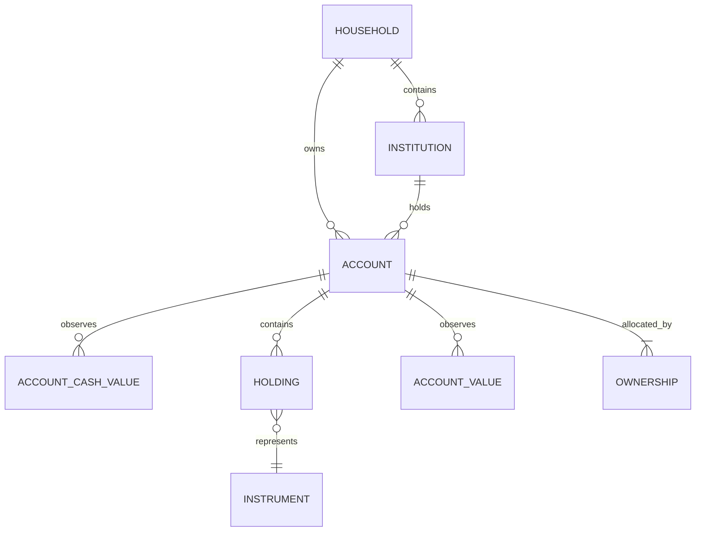

# Account Container and Position Model

## 1. Document status and decision summary

- Status: Implemented / current contract in Nestworth-go `0.2.1` / SQLite schema v9
- Baseline: Nestworth-go current domain model and SQLite schema v9
- Purpose: Record Account-model facts across domain, database, application, and release
- This document describes the landed breaking cutover; it does not provide a v6 migration

This design keeps the current overall architecture and only corrects a few
responsibility boundaries and overly narrow constraints:

```text
Account      = a real-world financial account or asset container
Cash Balance = a fiat-currency cash position inside an Account
Holding      = an Instrument position inside an Account
Instrument   = the underlying financial-asset definition and classification referenced by a Holding
```

Do not introduce a generic `SubAccount`. `holdings` tracking is no longer
limited to Investment; availability is decided only by the legal-combination
table in this document.

The three orthogonal Account dimensions are:

```text
account_type       = what kind of real-world account or container is this?
balance_sheet_role = which side of the balance sheet does it sit on?
tracking_mode      = how does Nestworth record and value it?
```

`balance_sheet_role` is a formal persisted field. `account_type` may be edited
only while it remains compatible with the current role and tracking.
`balance_sheet_role` and `tracking_mode` stay immutable after create. Asset
classification follows Account shape: a Composite Account is classified from
its internal components; a Simple Account uses role for the asset/liability
side and `account_type` for the bucket.

This design also freezes these product decisions:

- Overview replaces the old account-level `ByCategory` with component-grained
  `assetsByType` and adds `liabilitiesByType`;
- schema v9 is the current breaking schema with no legacy-database migration,
  compatibility reads, or automatic reset; older generations including v8 are rejected;
- current Wails DTOs expose only the new fields and do not define dual-API
  precedence;
- SQLite `accounts`, `account_state_observations`, and
  `history_origin_account_states` use the physical column `include_in_portfolio`;
- Simple Account historical classification uses current metadata and is
  explicitly marked `current-metadata-derived`.

## 2. Historical baseline before cutover

This section records the schema v6 state before cutover. It is not current
behavior. The current repository uses schema v9 and the
`account_type` / `balance_sheet_role` / `tracking_mode` contract defined here.

At that time `accounts` contained:

- `primary_category`
- `secondary_category`
- `tracking_mode`
- `include_in_investment`

The pre-cutover Go domain model, SQLite repository, and schema verifier
validated accounts around `PrimaryCategory` / `SecondaryCategory` and treated
liabilities through `PrimaryCategory.IsLiability()`.

Current valuation classifies by the v7 rules in this document: a Holdings
Account component with no Instrument is `cash`; a component with an
Instrument is classified by `Instrument.Type`; a Simple Account is classified
by `account_type` and role.

Activity still stores stable internal kind values such as `cash_in`,
`cash_out`, `cash_transfer`, `fx_conversion`, `position_transfer`, `buy`,
`sell`, `value_update`, `debt_draw`, `debt_payment`, and `reversal`. This
document describes those kinds with existing domain and product semantics. It
does not add another Activity taxonomy or rewrite existing historical facts.

## 3. Background and problems

A real-world account can hold several asset kinds at once:

```text
MooMoo SG Brokerage
├── SGD cash
├── USD cash
├── CNY cash
├── US stocks
├── Singapore ETFs
└── crypto assets
```

A China Merchants Bank (CMB) customer relationship can also contain:

```text
China Merchants Bank mixed account
├── CNY demand deposits
├── USD deposits
├── bank wealth-management products
├── several fund holdings
└── gold
```

The v6 structure could store some of this, but the semantics were incomplete:

1. `Account.primary_category` / `secondary_category` tried to describe both
   account identity and the assets inside the account.
2. `holdings` tracking was limited to Investment, so a bank or exchange could
   not naturally represent "cash + holdings".
3. Account-level `include_in_investment` could not distinguish ordinary cash
   from investment positions in the same bank account.
4. Simple Accounts had no clear rule for classifying "the Account itself as
   the valued object".
5. A generic `SubAccount` display layer would blur the boundaries among USD
   cash, a fund account, and a Holding.

These problems should be solved by reassigning responsibilities, not by
adding an entity without a stable real-world boundary.

## 4. Design goals

- Let Account represent a real account boundary or a real asset object.
- Let Cash Balance and Holding express the valuable positions inside an
  Account.
- Let `account_type` describe account shape instead of owning underlying asset
  classification.
- Let `balance_sheet_role` control asset/liability semantics in an explicit,
  persistent, auditable way.
- Let Account types in the legal-combination table use `holdings` tracking.
- Keep `balance` and `manual_value` support for Simple Accounts.
- Keep Overview, Portfolio, History, Activity, and valuation consistent with
  the same model.
- Preserve Account, Holding, Activity, Origin, and Snapshot identity and
  immutable facts inside the new schema.

## 5. Non-goals

- Do not introduce a generic `SubAccount` domain entity.
- Do not turn every currency, market, security type, or UI grouping into an
  Account.
- Do not treat stablecoins as fiat Cash Balances.
- Do not implement component-level Portfolio inclusion; that capability is
  a later extension.
- Do not implement an online conversion workflow among `balance`,
  `manual_value`, and `holdings` in this design.
- Do not implement bank/broker sync, trade import, reconciliation, or
  external statement parsing.
- Do not change Activity immutability, reversal, or correction semantics.
- Do not provide a legacy-schema data migration or compatibility read path.

## 6. Core domain model

### 6.1 Relationship diagram



### 6.2 Real-world Account boundary

Create an Account only when the real world has an independent account or asset
boundary. Clues include:

- an independent statement or reconciliation boundary;
- an independent external account number, contract, or legal relationship;
- a need for independent ownership, lifecycle, or inclusion policy;
- the ability to change balances or holdings independently.

SGD, USD, and CNY inside one account are not Accounts; they are Cash Balances
of that Account. NVDA, QQQ, or BTC inside one account are not Accounts; they
are Holdings. Create a separate Account only when the bank actually provides
an independent fund account or gold account.

### 6.3 Three orthogonal dimensions

| Dimension | Formal question | Examples | Initial write | Later edit |
| --- | --- | --- | --- | --- |
| `account_type` | What is it in the real world? | `bank_account`, `brokerage`, `crypto_exchange` | Required | Editable; does not create a financial Activity |
| `balance_sheet_role` | Is it an asset or a liability? | `asset`, `liability` | Required | Immutable after create in the current version |
| `tracking_mode` | How is the current value recorded? | `holdings`, `balance`, `manual_value` | Required | Immutable after create in the current version |

These fields do not substitute for one another:

- `account_type` does not describe the asset mix inside the account.
- `balance_sheet_role` is not inferred dynamically from Instruments or Cash
  Balances inside the account.
- `tracking_mode` is not an asset class; it only describes data shape and the
  valuation entry point.

Except for `other`, role is not a freely combinable UI option. It is decided
by the legal-combination table. The UI should display the resulting role and
must not allow the opposite choice. `other` requires an explicit role choice at
create. The persisted `balance_sheet_role` is the authority.

### 6.4 Account Type

The closed `AccountType` set is:

```text
cash_on_hand
bank_account
brokerage
investment_account
crypto_exchange
digital_wallet
pension
insurance_policy
property
vehicle
collectible
receivable
credit_card
loan
other
```

`cash_on_hand`, `insurance_policy`, and `collectible` are first-class
real-world asset types in the new model, not migration compatibility values.
Enum values must stay consistent across Go, SQLite, Wails DTOs, and the
frontend catalog.

The following table is the only legal
`(account_type, balance_sheet_role, tracking_mode)` set. Combinations not
listed are rejected by `NewAccount`:

| `account_type` | Real-world meaning | Legal role | Legal tracking |
| --- | --- | --- | --- |
| `cash_on_hand` | An independent physical cash boundary such as a cash box or safe | `asset` | `balance` |
| `bank_account` | A bank deposit or mixed bank account | `asset` | `balance`, `holdings` |
| `brokerage` | A brokerage account | `asset` | `holdings`, `manual_value` |
| `investment_account` | A standalone fund, precious-metal, or other investment account | `asset` | `holdings`, `manual_value` |
| `crypto_exchange` | A crypto exchange or custodial account | `asset` | `holdings` |
| `digital_wallet` | A digital wallet | `asset` | `balance`, `holdings` |
| `pension` | A pension or retirement account | `asset` | `holdings`, `manual_value` |
| `insurance_policy` | An insurance policy with cash value | `asset` | `manual_value` |
| `property` | A single property object | `asset` | `manual_value` |
| `vehicle` | A single vehicle object | `asset` | `manual_value` |
| `collectible` | A single collectible object | `asset` | `manual_value` |
| `receivable` | A receivable or money lent | `asset` | `balance`, `manual_value` |
| `credit_card` | Credit-card liability | `liability` | `balance` |
| `loan` | A mortgage, auto loan, or other borrowing | `liability` | `balance` |
| `other` | A real-world account or object that does not fit the types above | `asset` | `balance`, `manual_value`, `holdings` |
| `other` | A liability that does not fit the types above | `liability` | `balance` |

`credit_card`/`loan + holdings` and any `liability + holdings/manual_value` are
explicitly forbidden. The current version does not model a margin-liability
composite. If that is needed later, it requires a separate debt-component and
netting-rule design.

`account_type` may change, but the new type plus the frozen role and tracking
must still appear in the table above or the update is rejected. Changing type
does not create an Activity and does not change amounts, quantities, cost
basis, role, tracking, or inclusion flags.

### 6.5 Balance Sheet Role

`balance_sheet_role` is a formal Account field:

```text
asset
liability
```

Rules:

- An `asset` Account valuation enters the asset side.
- A `liability` Account valuation enters the liability side, and net worth uses
  a negative sign.
- Database amounts remain non-negative exact Money; the sign is derived from
  role.
- Cash, stocks, funds, or crypto inside an Account do not change the Account's
  role.
- `IsLiability()` reads `balance_sheet_role`, not the old `PrimaryCategory`.
- Role is immutable after Account create unless a future explicit Account
  conversion workflow is designed.

Prefer a domain `BalanceSheetRole` type and parse helpers instead of comparing
strings at each call site.

### 6.6 Tracking Mode

Keep the three tracking modes, but redefine `holdings`:

| Tracking mode | Account shape | Data source | Typical use |
| --- | --- | --- | --- |
| `holdings` | Composite Account | `account_cash_values` + `holdings` + quotes | Mixed bank accounts, brokerages, exchanges |
| `balance` | Simple Account | `account_values(value_kind=balance)` | A single cash balance, credit card, loan, or receivable |
| `manual_value` | Simple Account | `account_values(value_kind=manual_value)` | Property, vehicles, unsplit investments |

`holdings` is no longer Investment-only. The precondition for using holdings
is that the Account tracking mode is `holdings`, not an old category value.

### 6.7 Components inside an Account

```text
Composite Account (holdings)
├── Cash Balance[currency]
└── Holding -> Instrument

Simple Account (balance/manual_value)
└── Account Value observation
```

Constraints:

- A `balance` / `manual_value` Account cannot create a Holding or Cash
  Balance.
- A `holdings` Account does not write an Account Value as the account total.
- One Account may have Cash Balances in several currencies.
- One Account may have at most one Holding for the same active Instrument.
- Holding ownership inherits Account ownership.
- Do not add a generic parent table or `SubAccount` for components.

## 7. Asset-classification semantics

### 7.1 Overall rule

Asset classification is not a single Account-level category. The source depends
on Account shape:

```text
Composite / holdings Account:
    Cash Balance                 -> cash
    Holding -> Instrument.type   -> instrument type

Simple / balance Account:
    Account itself               -> account_type-derived class

Simple / manual_value Account:
    Account itself               -> account_type-derived class
```

This is the core invariant the design must keep:

> Composite Account asset classification MUST NOT come from `account_type`; it
> MUST come from internal components.
>
> A Simple Account is itself the valued financial object, so its
> classification MAY come from `account_type`.

### 7.2 Composite Account classification

| Component | Classification source | Examples |
| --- | --- | --- |
| `AccountCashValue` | Always `cash` | SGD, USD, CNY |
| `Holding` | `Holding.Instrument.instrument_type` | stock, etf, mutual_fund, crypto |

A `bank_account + holdings` Account can contain cash, a mutual fund, precious
metal, and a bank investment product. It must not dump every amount into cash
because the Account type is bank account, and it must not dump every amount
into investment because it contains funds.

### 7.3 Simple Account classification

A Simple Account has no split Cash Balance or Holding. The classification
function returns `(role, bucket)`. Role decides which Overview side, the net
worth sign, and eligibility for the asset Portfolio. Type only decides the
bucket name on that side.

| `account_type` | Role | Simple tracking | Bucket |
| --- | --- | --- | --- |
| `cash_on_hand` | `asset` | `balance` | `cash` |
| `bank_account` | `asset` | `balance` | `cash` |
| `digital_wallet` | `asset` | `balance` | `cash` |
| `brokerage` | `asset` | `manual_value` | `unclassified_investment` |
| `investment_account` | `asset` | `manual_value` | `unclassified_investment` |
| `pension` | `asset` | `manual_value` | `pension` |
| `insurance_policy` | `asset` | `manual_value` | `insurance` |
| `property` | `asset` | `manual_value` | `property` |
| `vehicle` | `asset` | `manual_value` | `vehicle` |
| `collectible` | `asset` | `manual_value` | `collectible` |
| `receivable` | `asset` | `balance` or `manual_value` | `receivable` |
| `credit_card` | `liability` | `balance` | `credit_card` |
| `loan` | `liability` | `balance` | `loan` |
| `other` | `asset` | `balance` or `manual_value` | `other_asset` |
| `other` | `liability` | `balance` | `other_liability` |

`crypto_exchange` has no Simple combination. A manual total for
`brokerage` / `investment_account` cannot be assumed to be stock, ETF, fund, or
cash, so it uses the stable key `unclassified_investment`. Any input that misses
the legal table is a domain validation error and must not fall back to a
guess.

### 7.4 Fiat cash and stablecoins

The rule is already decided and is not an open question:

```text
SGD -> Cash Balance(currency=SGD)
USD -> Cash Balance(currency=USD)
CNY -> Cash Balance(currency=CNY)

USDC -> Instrument(type=crypto) -> Holding
USDT -> Instrument(type=crypto) -> Holding
BTC  -> Instrument(type=crypto) -> Holding
ETH  -> Instrument(type=crypto) -> Holding
```

Reason: a Cash Balance is fiat cash priced in a `CurrencyCode`. A stablecoin
is a tokenized crypto instrument that can depeg and has quantity and price
semantics; it cannot be treated as USD/CNY fiat cash.

Digital wallets and crypto exchanges follow the same rule. USDC in a wallet
must be a Holding of `Instrument(type=crypto)`, even if its intended peg is
USD.

## 8. MooMoo SG and China Merchants Bank examples

### 8.1 MooMoo SG

```text
Institution: MooMoo SG
Account: MooMoo SG Brokerage
account_type: brokerage
balance_sheet_role: asset
tracking_mode: holdings
default_currency: SGD

Cash Balances:
- SGD 12,000              -> cash
- USD 8,500               -> cash
- CNY 3,000               -> cash

Holdings:
- NVDA 20 shares          -> stock
- QQQ 15 shares           -> etf
- ES3.SI 1,000 shares     -> etf
- BTC 0.2                 -> crypto
```

This is still one real-world account. Different cash currencies and securities
are internal positions, not SubAccounts. Portfolio can split Cash, Stock,
ETF, and Crypto instead of reporting Investment 100%.

### 8.2 China Merchants Bank mixed account

When deposits, wealth-management products, funds, and gold share one
real-world account or statement boundary:

```text
Institution: China Merchants Bank
Account: CMB mixed account
account_type: bank_account
balance_sheet_role: asset
tracking_mode: holdings
default_currency: CNY

Cash Balances:
- CNY 100,000             -> cash
- USD 5,000               -> cash

Holdings:
- CMB Wealth Management A  -> bank_investment_product
- CSI 300 fund            -> mutual_fund
- Nasdaq fund             -> mutual_fund
- Gold                    -> precious_metal
```

### 8.3 Independent China Merchants Bank account boundaries

If the bank card, fund account, and gold account have independent statements
or external account numbers, create multiple Accounts:

```text
Institution: China Merchants Bank
├── All-in-one card
│   └── bank_account + balance/holdings
├── Fund account
│   └── investment_account + holdings
└── Gold account
    └── investment_account + holdings
```

This split is decided by the real-world account boundary, not by Portfolio
classification or a UI tree.

## 9. Portfolio inclusion semantics

### 9.1 Current-version field semantics

The new schema uses:

```text
include_in_portfolio
```

This means "does this Account enter Portfolio as a whole" in persisted
metadata. Database, domain, and API still share the column
`include_in_portfolio`. Live Portfolio valuation no longer reads it: a
Holding (component with `instrumentId`) enters Portfolio, cash does not, and
the create/settings UI no longer shows the checkbox. See
[Trial UX optimization](../design/trial-ux-optimization.md).

### 9.2 Whole-account inclusion

The current **persisted** field is still whole-account, but live Portfolio
totals follow holdings-only:

> If an Account has holdings, those holdings participate in Portfolio.
> Cash in the same Account does not. `include_in_portfolio` is ignored.

Therefore, for a brokerage or mixed bank Composite Account:

- cash does **not** enter Portfolio;
- stocks, ETFs, funds, gold, crypto, and similar holdings enter the matching
  Instrument-type allocation;
- if the Account has no holdings, it does not appear on the Portfolio page.

This is natural for a brokerage: settlement cash is usually part of the
portfolio.

### 9.3 Known limitation for mixed bank accounts

If a CMB mixed account has both large everyday deposits and investment
positions, `include_in_portfolio=true` puts both into Portfolio. The current
version does not provide a component-level policy such as "include funds and
gold, exclude ordinary deposits".

This is an explicit product limit. Do not hide it by silently changing
classification or by giving Overview and Portfolio different denominators.
Users currently have three options:

1. Split real-world investment accounts that already have independent
   boundaries into separate Accounts;
2. Accept that the whole mixed account enters Portfolio;
3. Exclude the whole mixed account from Portfolio while still letting it
   participate in net worth and the asset-classification Overview.

### 9.4 Deferred portfolio scope

A later version may introduce a finer field or policy:

```text
portfolio_scope:
- none
- whole_account
- investment_positions
```

The meaning could be:

- `none`: the Account does not enter Portfolio;
- `whole_account`: Cash Balances and Holdings all enter Portfolio;
- `investment_positions`: only Holdings enter, or a later component
  selection explicitly includes some cash.

This design does not implement `portfolio_scope` and does not add a schema
field without a complete API, history, migration, and UI contract.

### 9.5 Liquid-assets inclusion

`include_in_liquid_assets` is a whole-account switch, like Portfolio inclusion.
When it is on for a `holdings` Account, every valuable component enters the
liquid-assets metric together. The system must not pick cash only, and it
must not silently exclude funds or gold by Instrument type.

Therefore the UI must warn that the option "applies to all cash and holdings"
when it is turned on for `bank_account + holdings`, `digital_wallet + holdings`,
and other mixed Accounts. Component-level liquid policy is outside v7.

### 9.6 Create defaults

Inclusion defaults are independent of asset-classification rules. They are
UI suggestions only. The saved user choice is the authority, and changing
`account_type` must not recompute them:

| Condition | `include_in_net_worth` | `include_in_portfolio` | `include_in_liquid_assets` |
| --- | --- | --- | --- |
| All legal accounts | `true` | See below | See below |
| `brokerage`, `investment_account`, `crypto_exchange`, `pension` | — | `true` | — |
| Other types | — | `false` | — |
| `cash_on_hand + balance`, `bank_account + balance`, `digital_wallet + balance` | — | — | `true` |
| All `holdings` and other Simple combinations | — | — | `false` |

The frontend must not auto-check from inferences such as `type == investment`.
The catalog should return suggested values directly or use an explicit matrix
shared with the domain.

## 10. Valuation, Overview, and Portfolio

### 10.1 Valuation inputs

The unified ValuationService still uses the current three entry points:

```text
holdings Account = Σ Cash Balance converted to base
                 + Σ Holding Quantity × Instrument Quote converted to base

balance Account = latest Account Value converted to base
manual Account  = latest Account Value converted to base
```

Keep the existing financial semantics:

- use exact decimals;
- same-currency conversion does not need an FX quote;
- a missing quote affects only the matching component and is not filled with
  zero;
- archived Accounts or `include_in_net_worth=false` do not participate in net
  worth;
- `balance_sheet_role=liability` amounts are negative in net worth;
- Portfolio selects holding components on active asset Accounts (cash and
  `include_in_portfolio` are ignored for the live total);
- the frontend must not recompute totals from already-rounded view models.

### 10.2 Unified classification function

The application layer should have one testable classification decision. Do not
copy the rules separately in Overview, Portfolio, and Account detail:

```text
classify(account, component):
  if account.tracking_mode == holdings:
    if component is CashBalance:
      return (account.balance_sheet_role, cash)
    if component is Holding and instrument exists:
      return (account.balance_sheet_role, instrument.instrument_type)
    if component is Holding and instrument is missing:
      return incomplete(missing_instrument)

  # Simple Account: the Account itself is the valued object.
  return classify_simple_account(account.account_type,
                                 account.balance_sheet_role,
                                 account.tracking_mode)
```

`classify_simple_account` must implement the §7.3 table completely. A
Holding with a missing Instrument must not be labeled cash or manual and must
not be zero-filled. Exclude only the affected component and mark the
Account/parent result incomplete. Overview, Portfolio, Account detail, and
historical breakdowns must call the same classification function.

### 10.3 Overview

v7 chooses component grain: the old `Overview.ByCategory` is replaced by
`assetsByType`, and `liabilitiesByType` is added. This is a product-statistics
change, not a field rename. `docs/architecture/domain-model.md`, Wails
DTOs, frontend charts, and tests must stay in sync at implementation time.

`assetsByType` aggregates by underlying component or by the Simple Account
itself:

```text
cash                    = Composite Cash Balance + bank/digital Simple Account
stock                   = Holding.Instrument.type == stock
etf                     = Holding.Instrument.type == etf
mutual_fund             = Holding.Instrument.type == mutual_fund
bond                    = Holding.Instrument.type == bond
bank_investment_product = Holding.Instrument.type == bank_investment_product
precious_metal          = Holding.Instrument.type == precious_metal
crypto                  = Holding.Instrument.type == crypto
property                = Simple property Account
vehicle                 = Simple vehicle Account
receivable              = Simple receivable Account
unclassified_investment = Simple manual investment Account
insurance               = Simple insurance policy
collectible             = Simple collectible
other_asset             = Simple other asset
```

`liabilitiesByType` uses `credit_card`, `loan`, and `other_liability` buckets,
with liabilities total as the denominator. `assetsByType` uses assets total
as the denominator. Missing inputs keep Overview incomplete semantics and do
not enter any bucket as zero.

A Composite Account's `account_type` may be used as an Account filter, label,
or grouping dimension. It must not force an entire bank account into cash, and
it must not force an entire brokerage into investment. Account cards show
account type; Cash/Holding rows show component type. The two views must not
share one category chip.

### 10.4 Portfolio

Portfolio total is the sum of complete holding-component base values on
active, asset-role Accounts. Cash is excluded. `include_in_portfolio` is
not used for the live total. For each included holding:

- the Holding enters its Instrument type;
- a component with a missing quote is not zero-filled, and the
  Account/Portfolio is marked incomplete;
- cash in the same Account is omitted.

Portfolio may still provide allocation by native currency, country, and
Instrument type. `account_type` is a complementary filter, not an asset
class.

### 10.5 Liability and mixed components

The current legal-combination table forbids every `liability + holdings`, so
v7 has no liability Composite Account. Even if a later special custody or
margin model is allowed, keep:

- role decided by the Account;
- component type decided by Cash/Instrument;
- role not inferred from components;
- Portfolio filtering and net-worth sign using role.

## 11. Activity and History impact

### 11.1 Existing Activity taxonomy

The current taxonomy includes Cash Dividend as a distinct persisted kind
(`cash_dividend`) because it carries Holding identity that `cash_in` cannot.
Do not invent synonym kinds for Account restructuring; Cash Dividend is a new
financial fact, not a relabel of Deposit/Income.

| Domain semantics | Effect target |
| --- | --- |
| Opening Adjustment | Opening or reconciliation adjustment to a balance or position |
| Balance Adjustment | Account Value of a `balance` Account |
| Position Adjustment | Holding Quantity |
| Deposit | Account Cash; cash increase on a holdings Account |
| Withdrawal | Account Cash; cash decrease on a holdings Account |
| Transfer | Internal Account Cash movement, expressed with existing transfer legs |
| Buy | Holding Quantity increase plus the trade cash leg from existing trade semantics |
| Sell | Holding Quantity decrease plus the trade cash leg from existing trade semantics |
| Cash Dividend | Account Cash increase on the Holding's Account, attributed to that Holding via `activity_dividend_details`; quantity and cost basis do not change |
| Income | Income classification through existing cash effect/reason |
| Fee | Fee classification through existing fee effect |
| Debt Draw | Debt Account Value and cash endpoint |
| Debt Payment | Debt Account Value and cash endpoint |
| Debt Adjustment | Debt-balance adjustment |
| Manual Valuation | Account Value of a `manual_value` Account |
| Reversal | An exact reverse Activity of the original Activity |

The code layer carries these semantics with stable persisted kind values such
as `cash_in`, `cash_out`, `cash_dividend`, and `value_update`. Product labels, domain commands,
and persisted kinds keep one mapping. Do not invent synonym kinds because
Accounts were restructured.

### 11.2 Effect target and tracking mode

The Activity effect target still decides which observation is written:

```text
EffectTargetAccountValue    -> account_values
EffectTargetAccountCash     -> account_cash_values
EffectTargetHoldingQuantity -> holding_quantity_values / holdings state
```

When the Account is `holdings`, cash-related Activities must use the Account Cash
target. When the Account is `balance` or `manual_value`, balance/valuation
Activities use the Account Value target. That decision comes from tracking
mode, not from an old category.

### 11.3 FX conversion

This design does not add a second FX Activity kind. Current code already has
the persisted kind `fx_conversion`, and the current schema continues to treat it as
the only representation.

Whatever the underlying kind is named, FX conversion financial semantics stay:
decrease one Cash Balance and increase another inside the same holdings
Account, keeping the existing transaction FX rate, fee, and internal-transfer
classification.

### 11.4 Immutability statement

This design:

- does not add Activity kinds;
- does not change Activity immutability rules;
- does not change reversal/correction semantics;
- does not record `account_type` edits as financial Activities;
- does not disguise Account metadata edits as Deposit, Transfer, or
  Valuation;
- does not rewrite historical Activity classification, effect targets, or
  original amounts.

## 12. Account type edits and historical classification

### 12.1 Current behavior

`account_type` is editable Account metadata. Changing it:

- requires the new type plus the current role and tracking to remain a §6.4
  legal combination, otherwise reject;
- does not create an Activity;
- does not change Account Value;
- does not change Cash Balance;
- does not change Holding Quantity;
- does not change cost basis;
- does not change existing Activities, History Origin components, or
  financial snapshot facts;
- does not automatically change `balance_sheet_role`;
- affects Simple Account labels/classification in the current state;
- does not affect underlying Cash/Instrument classification inside a
  Composite Account.

`balance_sheet_role` remains immutable after create. For example,
`bank_account + asset + holdings` may become `brokerage`, but not `property`
or `credit_card`. `bank_account + asset + balance` also cannot become
`brokerage`. Implement this as one `IsValidAccountCombination(type, role,
tracking)` used by both create and update.

### 12.2 Historical classification limit

Current `account_state_observations` do not store historical versions of
`account_type`. Therefore a historical breakdown that depends on a Simple
Account's `account_type` cannot claim to know the true account type on a past
day.

v7 uses one behavior: Composite Account historical classification is derived
from the snapshot item `InstrumentID`; Account Cash components with no
Instrument are cash. Simple Accounts are classified from the current
`account_type` and the immutable role/tracking. The API returns
`classificationBasis=current-metadata-derived` on the matching
breakdown/result, and the UI must show that limit in copy or a tooltip.

The marker is not incomplete: amounts and the financial facts at that time can
still be complete. Only the bucket name comes from current metadata. Do not
silently claim it is the true type at the past point in time.

Editing `account_type` must not bulk-rewrite existing Daily Snapshot contents,
content hashes, Activity classification, or Origin facts.

If reliable historical account classification is needed later, add
`account_type` and any required `balance_sheet_role` / display-metadata
versions to Account metadata observations, and define their effect on
snapshot invalidation.

## 13. Tracking-mode lifecycle

### 13.1 Current version

The current implementation continues to treat `tracking_mode` as immutable
after Account create. When creating a bank account, the user must choose:

- `bank_account + balance`: track one balance; or
- `bank_account + holdings`: track multiple Cash Balances and Holdings.

This keeps existing observations, Activity targets, and historical replay
simple. A later upgrade from a single bank balance to multi-asset tracking
requires creating a suitable new Account or waiting for a future conversion
capability.

### 13.2 Future balance -> holdings

A later version may support an explicit representation migration:

```text
Before:
  Account = bank_account + balance
  AccountValue(CNY 100,000)

After:
  Account = bank_account + holdings
  CashBalance(CNY 100,000)
```

This is not a wealth event:

```text
net worth delta = 0
external flow   = 0
```

The conversion workflow must preserve:

- Account identity;
- Ownership;
- Institution and Group;
- lifecycle dates;
- include flags;
- History Origin boundary;
- existing financial values and historical facts.

Implementation can use one atomic migration command that converts the current
Account Value into an origin/event-compatible Cash Balance observation. It
must not fake external flow through Deposit or Withdrawal, and it must not
delete original historical evidence. The exact historical-projection rules need
a separate technical design.

### 13.3 Other conversion directions

Suggested future policy:

| Conversion | Suggestion |
| --- | --- |
| `balance -> holdings` | May be supported, but only through an explicit conversion workflow |
| `manual_value -> holdings` | May be supported when Cash/Holding can be split clearly |
| `holdings -> balance` | Usually unsafe unless combining values and losing component identity is an explicit choice |
| `holdings -> manual_value` | Usually unsafe; cannot losslessly keep per-item quantities, quotes, and cost basis |

This version implements no tracking transition and does not change
immutability rules.

## 14. Database / schema breaking cutover

### 14.1 Current Account fields

The current schema `accounts` target fields include:

```sql
account_type        TEXT NOT NULL
balance_sheet_role  TEXT NOT NULL
tracking_mode       TEXT NOT NULL
include_in_portfolio INTEGER NOT NULL DEFAULT 0
```

The CHECKs on `account_type`, role, and tracking express the closed §6.4
combinations, not merely that each field belongs to an enum.
`portfolio_scope` is not in the current schema.

### 14.2 Fresh schema

schema v8 does not contain these old fields or aliases:

```text
primary_category
secondary_category
include_in_investment
```

`accounts`, `account_state_observations`, and
`history_origin_account_states` use `include_in_portfolio` directly.
Repository, schema verifier, domain, Wails DTOs, and UI all use the new
names only. There is no dual-read, dual-write, or deprecated field.

The schema file describes complete v9. It does not write SQL that rebuilds
tables from v6, v7, or v8 or converts rows. Test fixtures, demo data, and development
databases are created from empty v9.

### 14.3 Startup and error policy

Database open has only three outcomes:

1. Path missing or file empty: create a fresh schema v9;
2. `PRAGMA user_version == 9`: run the full schema and data verifier, then
   start if it passes;
3. Any other version, missing column, leftover old column, or CHECK / index /
   foreign key that does not match v9: close the database and return a clear
   incompatible-schema error.

The data verifier at least runs `PRAGMA integrity_check`,
`foreign_key_check`, and domain invariants that SQLite CHECKs cannot fully
express: ownership totals 10,000 bps, legal Account combinations, Holdings and
Account Cash belonging only to `holdings` Accounts, Account Values belonging
only to Simple Accounts, and no duplicate active Instrument in the same
Account. Any failure is an incompatible database and must not enter business
reads or writes.

The startup path must not auto-migrate, auto-delete, auto-reset, silently
repair, or copy old data. The error must at least include failure kind, found
version, supported version, database path, and an action that says to create
a new database. The old database file stays as-is for the user to keep or
delete.

### 14.4 Development and test data

`testdata/schema6/schema6-fixture.sql` and
`testdata/schema7/schema7-fixture.sql` only verify that incompatible older
databases are rejected and the files are left unchanged; they do not mean
migration is supported. The current schema is `8`, created from `schema.sql`.
Provider fixtures and development databases use the current model.

### 14.5 No SubAccount table

Existing physical tables already express the target model:

- `account_cash_values` express Cash Balance;
- `holdings` express an Account -> Instrument position;
- `instruments.instrument_type` express underlying asset classification;
- `account_values` express Simple Account value observations.

Do not add `sub_accounts`, `account_components`, or a generic position
supertype. Revisit a shared abstraction only if a third component kind appears
with independent quantity, price, historical replay, and lifecycle semantics.

## 15. Current implementation map

### 15.1 Domain

`internal/domain/account_type.go` owns `AccountType`, `BalanceSheetRole`,
the closed legal-combination catalog, inclusion defaults, and Simple/Composite
classification. `internal/domain/model.go` stores the three Account
dimensions and enforces ownership, initial-value, currency, and immutable
tracking rules. Account type updates are allowed only when the existing role
and tracking mode remain legal, and do not create financial Activities.

### 15.2 Application and SQLite

`internal/application/service.go` coordinates Account and ownership
mutations. `internal/application/valuation.go` is the current valuation
authority for Simple and Composite Accounts, whole-account Portfolio
inclusion, and role filtering. SQLite schema v9 and
`internal/infrastructure/sqlite/schema_verify.go` enforce the fields,
closed-combination CHECK, indexes, and data invariants before business writes.
History replay keeps Account metadata changes separate from financial facts.

### 15.3 DTO and Wails API

The current Create and Update Account requests contain:

```text
name
accountType
balanceSheetRole
trackingMode
defaultCurrency
institutionId?
groupId?
ownership
includeInNetWorth
includeInPortfolio
includeInLiquidAssets
```

Wails is the versioned local boundary for the desktop application. v7 does
not receive or return `primaryCategory`, `secondaryCategory`, or
`includeInInvestment`; Catalog exposes the legal combinations, display labels,
and suggested defaults.

### 15.4 UI

The current Account UI separates:

- Account Type: bank, brokerage, exchange, property, and similar product names;
- Balance Sheet Role: determined by type and shown read-only except for
  `other`, which is chosen explicitly at create;
- Tracking: Holdings / Balance / Manual Value;
- Include in Portfolio: whether the whole Account enters Portfolio.

The create wizard and settings form take tracking options from the legal
combination catalog. For `bank_account + holdings`, the UI explains that
Portfolio and Liquid Assets inclusion applies to all cash and holdings in the
Account.

Account cards show Account type, while Holding and Cash rows show their
underlying asset type; the two views do not share a category label.

## 16. Validation matrix

### 16.1 Domain and storage

| Scenario | Check |
| --- | --- |
| cash on hand + balance | Legal; Simple classification is cash |
| bank + balance | Legal; Simple classification is cash |
| digital wallet + balance | Legal; Simple classification is cash |
| bank + holdings | Legal; no longer rejected as Investment-only |
| brokerage + holdings | Cash/stock/ETF classified by component |
| crypto exchange + holdings | Crypto Holding values normally |
| insurance + manual_value | Simple classification is insurance |
| property + manual_value | Simple classification is property |
| vehicle + manual_value | Simple classification is vehicle |
| collectible + manual_value | Simple classification is collectible |
| receivable + balance/manual_value | Classified as receivable with role asset |
| credit card + balance | Role liability; net worth is negative |
| loan + balance | Role liability; debt Activity endpoint works |
| Account type edit | No Activity; no amount/quantity/cost-basis change |
| Incompatible type edit | Rejected when type plus frozen role/tracking is not in the legal table |
| Role edit | Rejected in the current version |
| Tracking edit | Rejected in the current version |
| Liability + holdings/manual | Rejected for every type |

### 16.2 Classification and Portfolio

| Scenario | Check |
| --- | --- |
| MooMoo multi-currency cash + stocks | cash/stock/ETF/crypto buckets are correct |
| CMB cash + fund + gold + bank product | All classified by component |
| CMB included in portfolio | All complete components enter Portfolio together |
| CMB excluded from portfolio | All components are excluded together, but may still enter net worth |
| brokerage manual_value | `unclassified_investment`; do not invent an Instrument type |
| stablecoin | USDC/USDT are crypto Holdings, not Cash Balances |
| missing quote | Exclude only the affected component, mark incomplete, do not zero-fill |
| liability Account | Does not enter the asset Portfolio; net-worth sign is correct |
| Overview assets | `assetsByType` classifies by component, not by whole-account type |
| Overview liabilities | `liabilitiesByType` uses credit_card/loan/other_liability with liabilities as denominator |
| liquid mixed account | Whole-account inclusion applies and the warning is shown |

### 16.3 Startup and History

- An empty path or empty file creates complete v7 and passes the schema
  verifier.
- v6, a future version, or a structurally mismatched database all refuse to
  start; the error includes found/supported version and path.
- v7 data that violates ownership, tracking/component, unique active
  Instrument, or SQLite integrity/foreign-key constraints refuses to start.
- An incompatible database has unchanged bytes, `user_version`, and file time
  before and after the failure.
- There is no migrator, old-field fallback, automatic reset, or legacy-data
  fixture conversion path.
- Account type edits do not change existing historical facts.
- When there is no historical `account_type` version, historical Simple
  breakdowns are explicitly marked `current-metadata-derived`.
- tracking-mode conversion is not supported by v7.

## 17. Conclusion

Nestworth currently does not need `SubAccount`. The stable model is:

```text
Institution
└── Account
    ├── Cash Balance[fiat currency]
    └── Holding -> Instrument[asset type]
```

The new Account contract is:

```text
account_type       = what the real-world account or container is
balance_sheet_role = whether it is an asset or a liability
tracking_mode      = how it is recorded and valued
```

Composite Account asset classification must come from Cash Balances and
Instruments. A Simple Account may derive classification from `account_type`
because the Account itself is the valued object. Portfolio inclusion is
currently whole-account, with the mixed-bank-account limitation stated
explicitly. `balance_sheet_role` is a formal, authoritative, currently
immutable field, so editing `account_type` cannot silently change net worth.

The design reuses as much of the existing schema, Activity, History, and
Valuation structure as possible, while giving MooMoo SG, China Merchants
Bank, digital wallets, and crypto exchanges a consistent real-world expression.
