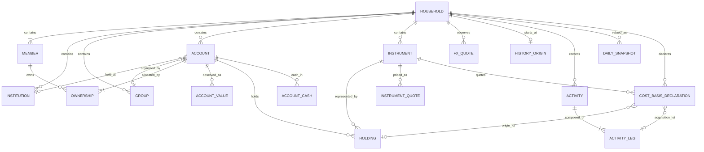

# Domain Model

## Model Boundary

This document is the canonical definition of Nestworth business concepts and financial semantics. Physical columns and application view models are implementation details described in [data and application contracts](data-and-ipc-contracts.md).



## Core Entities

### Household

A Household is the single root balance sheet. It has a name and one base currency. The database and domain reject a second Household. A one-person Household is valid.

The Household base currency is immutable after onboarding. Account default currencies, cash balances, and Instrument quote currencies may differ from that base. Conversion to base currency requires an explicit FX quote except when the native currency already equals the base.

### Member

A Member represents a person used in Ownership and allocation views. A Household must retain at least one active Member. Archiving a Member does not remove or rewrite existing Ownership. Every Member has a validated built-in icon key, defaulting to `user`.

### Institution

An Institution identifies where an Account is held. Its required type is Bank, Brokerage, Insurer, Exchange, Employer, Government, or Other. It is optional and organizational; it does not own the Account or determine its currency. Its validated built-in icon defaults from that type.

### Group

A Group is an optional Household-defined classification such as Emergency Fund, Retirement, or a geography. It is independent from Member, Institution, and Account type. Every Group has a validated built-in icon key, defaulting to `folder`.

### Account

An Account is the unit shown in the balance sheet. It has one `account_type`, one `balance_sheet_role`, one immutable `tracking_mode` after creation, one default currency, exact Ownership, optional Institution and Group references, a validated built-in icon key that defaults from account type, inclusion flags, lifecycle dates, and, for Balance and Manual Value modes, an append-only sequence of Account Values.

`account_type` names the real-world container. `balance_sheet_role` is the persistent asset or liability side and is immutable after create. `tracking_mode` is immutable after create. Type may be edited only when the new type remains legal with the frozen role and tracking. Create and update share one closed combination table.

An Account can represent cash on hand, a bank or brokerage account, a wallet, a pension or insurance policy, property, a receivable, a credit card, a loan, or an other container. A Holdings-tracked Account contains Holdings and cash-by-currency observations instead of an initial Account Value. An Account is not itself an Instrument. Composite (holdings) classification comes from cash and Instrument components; Simple classification comes from `account_type` and role.

### Ownership

Ownership relates one Account to one or more Members. It is stored in integer basis points and is used for member allocation. An Account with more than one owner is Shared; an Account with exactly one owner appears in that Member's sole-owned view.

### Account Value

An Account Value is an immutable observation, not a mutable balance column. Balance and Manual Value creation writes an initial observation, and each later update appends another. After History Origin, a positive initial amount or later value change posts an Opening Adjustment, Balance Adjustment, or Manual Valuation and links the new observation to that Activity. Holdings Accounts do not write an Account Value. The latest Account Value is used only for Balance and Manual Value modes. Legacy pre-origin observations remain unlinked to any Activity.

### Instrument

An Instrument describes what a Holding represents. It belongs to one Household and has a name, type, quote currency, quote preference (Manual or Provider), optional symbol, market code, country code, ISIN, provider identity, validated built-in icon key, and note. Its default icon is derived from Instrument type.

Instrument reuse is Household-scoped. Symbol alone is not unique. When both provider key and provider symbol are present, that pair is unique among the Household's non-null provider identities. Manual Instruments need no symbol or provider metadata.

### Holding

A Holding belongs to one Holdings Account and references one Instrument in the same Household. It has a current Quantity, optional note, and archive state. The same active Instrument appears at most once in one Account. After History Origin, a Quantity change posts an Opening Adjustment or Position Adjustment and an Activity-linked Quantity observation; note-only updates do not create an Activity. Zero quantity is valid; negative and short quantities are rejected. Ownership is inherited from the Account. Pre-origin Holding Quantity is origin baseline only and is never a fabricated Buy, Sell, Transfer, or Adjustment.

### Account Cash Value

Cash inside a Holdings Account is an append-only observation per Account and currency. An Account may have multiple cash currencies. After History Origin, a cash change posts Deposit, Withdrawal, or another kind-specific Activity and links the new observation to that Activity. Zero is valid. Negative cash and margin are not modeled.

### Instrument Quote and FX Quote

Instrument Quotes and FX Quotes are append-only observations with source kind,
source key, delayed flag, quote time, and creation time. Refresh appends a new
observation and never rewrites history. Quote preference is stored per
Instrument and per unordered FX pair. Instrument refresh uses the Instrument's
saved provider binding; explicit FX refresh uses the provider selected in
Settings. Yahoo supports current Instrument quotes only. Frankfurter is the
sole production FX provider, returns daily observations marked delayed, and
supplies no Instrument binding.

### Activity

An Activity is an immutable ledger header with one or more validated typed legs. It records why a Balance, cash, liability, or Holding Quantity changed. Users submit a kind-specific application command; Go constructs legs. There is no edit or delete of a posted Activity. Reversal posts the exact inverse. Correction posts a reversal and a replacement in one transaction.

Supported kinds are Opening Adjustment, Balance Adjustment, Position Adjustment, Deposit, Withdrawal, Transfer, Buy, Sell, Cash Dividend, Income, Fee, Debt Draw, Debt Payment, Debt Adjustment, Manual Valuation, and Reversal.

Classification is derived in Go from kind and leg role. Internal transfers and trade principal contribute zero external wealth flow. Explicit fees remain distinguishable from principal. A cross-currency internal transfer may change base-currency net worth by conversion spread versus market FX; that spread is a computed overlay, not a fee and not external flow.

### History Origin

History Origin is a cutover boundary, not an Activity. It states that Nestworth knows this Household state existed at this time but does not know how it was acquired. Each Household has exactly one origin with an IANA timezone. The current generation captures the initial state as baseline items; it does not migrate legacy database generations or accept `legacy` projection semantics. Fresh onboarding creates an empty origin. Trustworthy reconstructed daily history starts at the origin.

### Daily Snapshot

A daily snapshot is an append-only valuation revision for one closed local calendar day in the History Origin timezone. It records how reconstructed state was valued at that cutoff, including quote provenance and incomplete diagnostics. Missing components are excluded from totals and never treated as zero. The current local day is a live ValuationService point, not a persisted final snapshot.

### Average Cost Evidence

Starting Point capture records a per-unit cost for every positive Holding, and
an already-existed increase records the same input when it establishes a
Holding's first positive quantity. Buys, sells, transfers, corrections, and
reversals remain immutable Activities. These inputs are evidence for replay;
they do not create a synthetic trade or a mutable cost column on the Holding.

### Derived Average Cost and Gain

`ReplayCostBasis` blends cost-bearing increases by quantity, keeps the average
cost of remaining quantity across reductions, and emits signed realized gain
events for sells. Transfers resolve the sending Holding's average cost at the
transfer time. `GainService` derives native and base-currency cost/value/gain
views plus the exact two-part Instrument/currency decomposition. These results
are recomputed on reads and are never stored as financial facts. FIFO lots,
unknown-basis declarations, and return calculations remain deferred.

### Gain, Return, and Attribution

Native/base gain, realized-gain periods, and the two-part currency
decomposition are implemented output-only analytics: they never become
valuation inputs, ledger facts, or current-state projections. Time-weighted
and money-weighted return, benchmarks, and a full net-worth attribution bridge
remain deferred. Unavailable inputs produce an explicit unavailable or
incomplete result rather than zero, one, or an estimate.

## Identity, Money, and Time

### Identifiers

HouseholdId, MemberId, InstitutionId, AccountGroupId, AccountId, AccountValueId, InstrumentId, HoldingId, AccountCashValueId, InstrumentQuoteId, FxQuoteId, ActivityId, ActivityLegId, HistoryOriginId, HistoryOriginItemId, AccountStateObservationId, HoldingQuantityValueId, QuotePreferenceObservationId, ValuationSnapshotId, ValuationSnapshotItemId, and CostBasisDeclarationId are distinct Go types backed by UUID v7. A derived `LotRef` is `OriginHolding(HoldingId)` or `Acquisition(ActivityLegId)`, not a generated UUID. IDs are lowercase hyphenated UUID strings at persistence and application boundaries. IDs from different entity types are not interchangeable. A provider symbol is metadata, never a Nestworth business ID. A reversal or correction link references an `ActivityId`; it is not encoded in notes.

### Currency

A CurrencyCode is exactly three uppercase ASCII letters. CNY, SGD, and USD are common onboarding choices, but any syntactically valid code is accepted. A syntactically valid code does not imply that an exchange-rate provider supports it.

### Money

Money consists of a non-negative exact decimal value and a CurrencyCode. Binary floating-point is forbidden for persisted values, application amounts, ownership, FX, quantities, or financial calculations.

Accepted Money input has:

- One to twelve integer digits
- No leading zero unless the integer part is exactly `0`
- An optional fractional part of one to four digits
- No sign, whitespace, grouping separator, or exponent
- A maximum value of `999999999999.9999`

Additional decimal types:

| Type | Integer digits | Fractional digits | Extra rule |
| --- | --- | --- | --- |
| Quantity | Up to 18 | Up to 8 | Zero allowed |
| UnitPrice | Up to 12 | Up to 8 | Zero allowed and distinct from a missing quote |
| FxRate | Up to 8 | Up to 12 | Must be greater than zero |
| SignedMoney | Up to 12 | Up to 4 | Output-only; leading `-` allowed; never converted into `Money` |
| ReturnRate | Up to 8 | Up to 6 | Output-only fraction, not a percentage; `0.0404` means 4.04% |

Canonical output removes insignificant trailing zeros: `1.2300` becomes `1.23`, and `0.0000` becomes `0`. Valuation uses checked decimal operations and rounds only values that cross the Money DTO boundary to four fractional digits using midpoint-nearest-even. Overflow returns `DECIMAL_OVERFLOW`.

### Time

Authoritative timestamps are UTC RFC 3339 strings with millisecond precision and a trailing `Z`. Calendar-only fields such as `opened_on` and `closed_on` use `YYYY-MM-DD`. A closed date cannot precede an opened date. Activity effective time is resolved in the History Origin IANA timezone from local date and time; the persisted local date is used for filters and snapshot invalidation.

## Account Types and Tracking Modes

`account_type` identifies the real-world Account or container. The persistent
`balance_sheet_role` is either `asset` or `liability`, and `tracking_mode`
defines whether the Account stores one value, one manual valuation, or
component-level cash and Holdings. The legal combinations are closed:

| Account type | Balance-sheet role | Allowed tracking modes |
| --- | --- | --- |
| `cash_on_hand` | asset | `balance` |
| `bank_account` | asset | `balance`, `holdings` |
| `brokerage` | asset | `holdings`, `manual_value` |
| `investment_account` | asset | `holdings`, `manual_value` |
| `crypto_exchange` | asset | `holdings` |
| `digital_wallet` | asset | `balance`, `holdings` |
| `pension` | asset | `holdings`, `manual_value` |
| `insurance_policy` | asset | `manual_value` |
| `property` | asset | `manual_value` |
| `vehicle` | asset | `manual_value` |
| `collectible` | asset | `manual_value` |
| `receivable` | asset | `balance`, `manual_value` |
| `credit_card` | liability | `balance` |
| `loan` | liability | `balance` |
| `other` | asset | `balance`, `manual_value`, `holdings` |
| `other` | liability | `balance` |

`balance_sheet_role` and `tracking_mode` are immutable after Account creation.
`account_type` can change only when the new value remains legal with the
existing role and tracking mode. Create and update use the same combination
catalog. Balance and Manual Value Accounts require an initial Account Value;
Holdings Accounts use Account Cash and Holding components instead.

For a Holdings Account, cash is classified as `cash` and each Holding is
classified from its Instrument type. A Balance or Manual Value Account is
classified from its current `account_type` and role, with historical Simple
Account buckets explicitly marked `current-metadata-derived`.

## Ownership Rules

- Every Account has at least one owner.
- Each Member appears at most once.
- Each share is between 1 and 10,000 basis points.
- Shares must total exactly 10,000 basis points.
- Manual input is never silently normalized to 100%.
- Percentage input supports at most two decimal places and converts exactly to basis points.
- Equal split assigns remainder basis points from the first owner forward; three owners become `3334 / 3333 / 3333`.

Ownership updates and Account updates are one atomic transaction.

## Value and Net-Worth Semantics

Asset and liability values are both stored as non-negative Money. Sign is a property of `balance_sheet_role`, not persisted input. Overview, Account, and Portfolio totals come from one Go ValuationService. Historical closed-day totals come from HistoricalValuationService reconstructing origin plus ordered Activities at the cutoff. The live current Overview point must agree with ValuationService for the same read snapshot.

```text
assets      = sum(included non-liability base values)
liabilities = sum(included liability base values)
net worth   = assets - liabilities
```

An Account contributes nothing when it is archived or `include_in_net_worth` is false. A missing required quote excludes only the affected component, marks parent aggregates incomplete, and never substitutes zero or one. Identity conversion (native currency equals base) needs no FX quote and carries no FX freshness; it must not override the Instrument Quote freshness. Direct and inverse FX against the Household base currency must produce the same rounded Money result. Multi-hop FX is not used.

The Portfolio total is the sum of complete holding components (InstrumentID present) on active, non-liability Accounts. Cash is excluded. The persisted `include_in_portfolio` flag is unused for this total. An incomplete holding is reported in missing inputs, excluded from the valued subtotal, and never treated as zero. Simple investment Accounts without holdings do not enter Portfolio. Overview still uses `include_in_net_worth`.

The Go service retains full checked decimal precision through quantity × price, FX conversion, and aggregation. Only application view-model construction rounds to four fractional digits with midpoint-nearest-even. Overview, Account detail, and Investments never reconstruct aggregate inputs from rounded strings.

The latest Account Value or Account Cash observation is selected deterministically by:

1. `effective_at` descending
2. `created_at` descending
3. ID descending

The latest Instrument Quote or FX Quote for a preference is selected by:

1. `quoted_at` descending
2. `created_at` descending
3. ID descending

Freshness of a selected provider quote is Fresh when it is younger than the
global quote cache TTL (Settings: 1h / 3h / 12h / 24h, default 12 hours),
Delayed when the provider marks it delayed and it is still within that TTL,
and Stale when it is at least as old as the TTL. Manual quotes are labeled Manual. A missing required quote is Unavailable. Identity FX is neutral and preserves the selected Instrument Quote state.

Overview breakdowns follow these definitions:

| Breakdown | Amount | Percentage denominator |
| --- | --- | --- |
| Assets by type | Complete component or Simple Account amount on the asset side | Total assets |
| Liabilities by type | Complete component or Simple Account amount on the liability side | Total liabilities |
| Member | Ownership-weighted net contribution | Ownership-weighted total assets |
| Institution | Net contribution for the bucket | Asset amount for the bucket |
| Group | Net contribution for the bucket | Asset amount for the bucket |

Portfolio allocation reports current value by native currency, country, and Instrument type. The Investments page reports current value, not return. Simple brokerage or investment Accounts without holdings use the unclassified-investment bucket because they cannot be attributed to an Instrument. Historical Simple buckets use the Account's current metadata and are marked `current-metadata-derived`. Member allocation distributes rounding remainders deterministically and keeps each `shareBps` within `0..=10000`. Institution and Group include an unassigned bucket when applicable. The frontend formats these results but does not recalculate them.

## Lifecycle and Reference Rules

Archive is reversible and preserves identity and history. Permanent delete is not exposed.

- Archived objects are excluded from default lists and creation pickers.
- Archived Accounts are excluded from Overview, portfolio totals, and the default Account list.
- Archived Instruments and Holdings are omitted by default while retained references remain resolvable.
- An active Account continues to display and calculate an archived Member, Institution, or Group that it already references.
- Editing may retain an existing archived reference but may not add or switch to a different archived reference.
- Archiving a Member does not alter Ownership.
- Restoring one object does not restore related objects automatically.
- Archiving and restoring an already matching state is idempotent.

Foreign keys protect structural references, while application transactions enforce aggregate rules such as exact Ownership and the last-active-Member requirement.

## Deferred Domain Extensions

These concepts are planned but are not current behavior:

- A later sustainable-use release may add pending/recurring Activity
  preparation, freshness reminders, Backup/Restore, controlled data exchange,
  comparison data, search, and command-palette workflows. Each capability
  needs a new product and technical contract before implementation.

Future models may extend the current identity, Money, Ownership, lifecycle,
quote, Activity, origin, and sign semantics. A pending item is not a financial
fact before posting. Average-cost results remain derived interpretations of
immutable Activity and Starting Point evidence; they never become imported
transactions or mutable Holding state.
