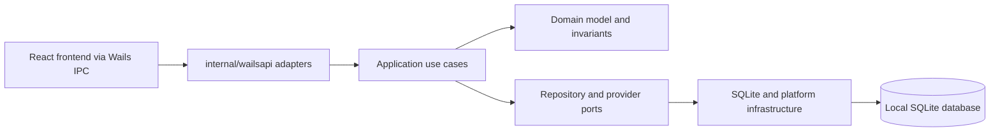
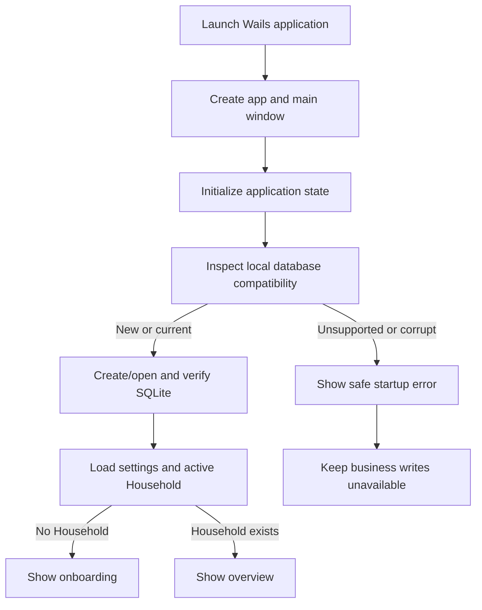

# System Overview

## Current baseline

Nestworth `0.3.0` is a local-first desktop application with a Wails v3 shell
(Go backend plus a React TypeScript frontend). The current implementation
provides typed domain contracts, SQLite bootstrap with one current schema `9`,
onboarding, multi-currency Accounts, Instruments, Holdings, immutable
Activities, replay, historical snapshots, History, average-cost gain replay,
currency decomposition, Analytics, exact valuation, explicit
Yahoo/Frankfurter refresh routing, local backup/restore, and CSV portability.
The React UI renders application results through `internal/wailsapi` DTOs; it
does not open SQLite, call HTTP, or recalculate financial totals.

The initial platform targets macOS on Apple Silicon. Wails keeps the option of
supporting other desktop platforms later without introducing a second UI stack.
Core browsing and editing must remain usable without registration or a network
connection.

## Application layers

### Frontend UI

The React frontend owns presentation, interaction state, layout, accessibility
affordances, and chart rendering. Pages call bound `internal/wailsapi`
services and render returned DTOs. They must not open SQLite, construct SQL,
or recalculate authoritative financial totals. Chart code maps returned values
to pixels; it does not derive gain, return, allocation, FX, or net-worth
totals.

### Application layer

Application use cases coordinate validation, authorization to the active
Household, transactions, repository queries, domain construction, and view
model assembly. Overview and portfolio summaries are application-level reads
because they combine several repositories under one consistent snapshot.

The application layer is the only place allowed to coordinate a multi-entity
mutation. Provider calls remain behind interfaces and are never required for
startup, onboarding, ordinary reads, or valuation reads. Only explicit user
refresh actions may invoke a configured provider.

### Domain

The domain owns identifiers, money, quantities, currencies, ownership,
timestamps, account lifecycle, instruments, holdings, quotes, Activities,
History Origin, average-cost replay, signed gain values, and financial sign
rules. It must not import Wails, React, SQL drivers, or operating-system APIs.

### Infrastructure

Infrastructure owns the database path, connection options, current-schema
integrity checks and platform integration. It implements
interfaces defined toward the application/domain layers and does not decide
product-level validation or presentation.

## Dependency rules

- Dependencies point inward toward the domain.
- The React UI calls `internal/wailsapi` services, never repositories directly.
- Only infrastructure opens or mutates business data.
- Financial formulas execute in Go application/domain code and cross into UI as
  results.
- A multi-row mutation is one application transaction.
- A summary composed from multiple collections uses one read snapshot.
- List implementations use bounded queries and must not query once per result row.
- Raw SQL errors and sensitive local data never reach user-facing UI models.

Stable business semantics are defined in the [domain model](domain-model.md). Current persistence and application behavior are defined in [data and application contracts](data-and-ipc-contracts.md).

## Startup and bootstrap

The compatibility inspection, schema verification, and blocked-startup paths are implemented in `internal/infrastructure/sqlite`. Non-empty older databases are rejected without writes, and unsupported future versions are rejected before schema writes. The application then bootstraps the active Household, opens onboarding when needed, and renders the live Overview or the GainService-backed Investments and Analytics views.

## State ownership

| State | Owner |
| --- | --- |
| Durable business data | SQLite through infrastructure repositories |
| Financial calculations | Go domain/application services |
| Navigation and filters | React page state |
| Form input | Feature-owned React forms and Zod validation |
| Language, appearance, and FX route | Local JSON settings plus i18next/theme store and application provider selection |
| Chart geometry | UI-only rendering model derived from authoritative results |

The UI must not optimistically invent financial totals. After a mutation it
reloads the authoritative application result.

## Technology decisions

| Area | Choice | Boundary |
| --- | --- | --- |
| Language | Go 1.26 | Application, domain, and infrastructure code |
| Persistence | SQLite, verified schema 9 | Local durable source of truth |
| Decimal arithmetic | shopspring/decimal-backed domain Money | No binary floating point for financial values |
| Charts | Apache ECharts | Rendering only; no financial calculations |
| Desktop shell | Wails v3 | Bound Go services + embedded React frontend |
| Module/build | Go modules, pnpm, Wails Taskfile | `go test`, `pnpm test`, `wails3 task darwin:package:release` |

Dependency versions are owned by `go.mod` and `go.sum`, not duplicated here.

## Privacy and security boundaries

- No account registration or required internet connection for core operation.
- Business data remains local and is not sent to the webview or external providers.
- Provider integrations are explicit adapters with safe failure behavior and
  no startup dependency. Yahoo supplies instrument quotes and Frankfurter
  supplies FX refresh.
- Logs must not include balances, notes, quantities, account names, instrument
  symbols, quote values, raw legs, credentials, or database rows.
- User-facing errors expose stable safe codes; detailed diagnostics stay local.

## Evolution rules

Later releases may add providers, imports, or sync, but must preserve these
boundaries:

- The local store remains usable when integrations fail.
- Provider implementations stay behind application interfaces.
- One valuation path supplies current summaries; history reconstructs from the
  History Origin and ordered Activities.
- Analytics remain a read-only interpretation of the ledger.
- Historical facts are appended or explicitly corrected, never silently edited.
- Compatibility checks occur before business writes; this generation does not migrate older databases.
