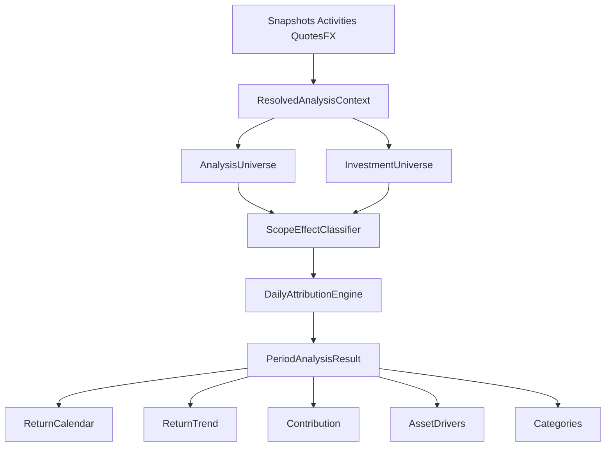

# Nestworth Analytics Redesign — Technical Architecture

**Status:** Phase 1a complete; Return/API/UI phases not started
**Product:** Nestworth  
**Target:** Desktop application (Wails v3)  
**Replaces:** Existing Insights `Analysis` page  
**Companions:** [Product & interaction design](analytics-product-design.md), [Wireframes](analytics-wireframes.md), [Development plan](analytics-development-plan.md), [Domain model](../../architecture/domain-model.md), [Data and IPC contracts](../../architecture/data-and-ipc-contracts.md)

This document is the **how**. The product design is the **what**. Implementation must not start from rejected shortcuts: simple `amount / beginning` percentages, start-of-day TWR that ignores intra-day flows, opening-quantity-only Price/FX, FX Impact computed as a leftover, a synthetic transaction price for a split or in-kind transfer, interest treated as capital, transfer-only scope rewrite, or `Unrealized = Total − Realized − Dividend`.

Go remains the calculation authority. The frontend formats, navigates, and never recomputes return or waterfall totals.

**Gate:** no Insights page starts before the engine cases behind *that page* pass. The gate is per track, not one global gate — Asset Changes reads only `AssetBucket`, so it is gated on the identity and Price/FX cases; Return Analysis is gated on the return, Dietz, and linking cases as well. See the [development plan](analytics-development-plan.md) for the per-phase allocation. Reconciling beginning to ending is not sufficient if Price, FX, or return % have the wrong financial meaning.

---

## 1. Target

Full product v1: two Insights pages, six tabs, shared filters, drill-down sheets, and History links.

```text
Insights
  Return Analysis     收益分析
    Return Calendar | Return Trend | Contribution
  Asset Changes       资产变动
    Change Drivers | Trend | Categories
```

The old `Analysis` navigation item and dashboard are removed after the replacement pages are functional.

---

## 2. What exists today (and why it is not enough)

The current Insights item is one page, [`frontend/src/features/analytics/AnalyticsPage.tsx`](../../../frontend/src/features/analytics/AnalyticsPage.tsx), over three read models:

- `RealizedGain` / `DividendIncome` — period **sell** gains and **cash dividends** only ([`internal/application/gain_service.go`](../../../internal/application/gain_service.go))
- `NetWorthTrend` — household **level** series, named ranges only, no scope ([`internal/application/trend.go`](../../../internal/application/trend.go))

There is no daily investment return, no waterfall, no universe-relative effect classification, and no period mark-to-market attribution.

Reusable foundations:

- Closed-day snapshots with per-item native/base amounts, quote/FX IDs, and completeness ([`daily_valuation_snapshots` / `_items`](../../../internal/infrastructure/sqlite/schema.sql), [`internal/application/historical_snapshot.go`](../../../internal/application/historical_snapshot.go))
- Activity effect classifications: `external_inflow`, `external_outflow`, `income`, `fee`, `internal_transfer`, `trade_principal`, `debt_principal`, `remeasurement` ([`internal/domain/change.go`](../../../internal/domain/change.go))
- Missing-input vocabulary (never coerce missing to zero)
- 31-day chunked snapshot rebuild already used by trend reads
- Average-cost realized gain and point-in-time unrealized (end market − remaining cost) in `GainService`

Keep existing Wails `HoldingGain` / `AccountGains`. Investments still depends on them via [`useHoldingGainsByAccounts`](../../../frontend/src/queries/analytics.ts).

---

## 3. Shared calculation kernel

Both product pages are projections of one kernel. Wails stays view-shaped; the engine must not recompute the period independently per API method.

```text
Snapshots + Activities + Quotes/FX
        │
        ▼
ResolvedAnalysisContext
        ├── AnalysisUniverse      (Scope ∩ Filters) → Asset Changes, classification
        └── InvestmentUniverse    (instruments ± cash) → Return amount, Dietz, %
                │
                ▼
ScopeEffectClassifier — three orthogonal fields on one event
        ├── AssetBucket           (physical; AnalysisUniverse → Asset Changes identity)
        ├── ReturnComponent       (economic; InvestmentUniverse → return amount)
        └── DietzCapitalFlow      (non-return capital → Dietz denominator)
        │
        ▼
Daily Attribution Engine
        ...
```



---

## 4. Core identity (Asset Changes only; signed; residual kept separate)

This identity is **Asset Changes** over `AnalysisUniverse`. It sums **`AssetBucket`** amounts only. It must not include `ReturnComponent` amounts whose physical cash sits outside that universe.

Every `AssetBucket` value is a **signed contribution to the selected universe's ending value**.

- Asset snapshot amounts enter as **positive**.
- Liability snapshot amounts enter as **negative**. A debt that moves 100k → 120k contributes **−20k** to net worth.
- Waterfall and tables consume those signed amounts. They must not re-negate by account role.

```text
EndingValue - BeginningValue
  = ExternalToScopeFlows
  + Income
  + Spending
  + DividendInterest
  + PriceChange
  + FXImpact
  + Fees
  + LiabilityImpact
  + Adjustments
  + Residual
```

All addends are **already signed `AssetBucket` amounts**. Waterfall, tables, and Go must **sum** them. Never write `- Spending` or `- Fees` in the identity.

Examples of signed contributions:

```text
Income              +5,000
Spending              -800
DividendInterest      +100
Fees                   -20
LiabilityImpact     -2,000
```

Loan interest of 500 cash leaving the universe is **`Spending` = −500** (a `cash_out` with reason `expense`; §7.2 precedence resolves it to Spending before the fee rule). Adding that term yields −500, not `− (−500)`. Interest **capitalised into principal** with no cash leg is a different event: `LiabilityImpact`, not Spending.

Ex-dividend, `Scope = QQQ`, `IncludeCash = false`: QQQ 100 → 99, $1 cash paid outside the instrument components. Identity is **PriceChange −1** only. The dividend is a `ReturnComponent`, not an `AssetBucket`. Putting both on the waterfall would reconcile to 0 against an ending-beginning of −1.

Invariant: one economic event may set **at most one** of each orthogonal field: `AssetBucket`, `ReturnComponent`, `DietzCapitalFlow`. Any of them may be nil. Projections must not re-classify or mix the three. See §7.

`Adjustments` and `Residual` stay distinct.

- Residual defaults to hidden when it is within money precision of zero.
- If `abs(Residual) > tolerance`, status is `partial` and the UI may show `Unexplained difference`.
- Zero-amount drivers are omitted.
- Beginning + visible drivers + residual must still equal ending.

Do not fold unexplained remainder into `Adjustments`. A manual value update and an unreconciled ¥37.21 are different facts.

### 4.1 Residual tolerance

`tolerance` decides when a residual is rounding noise versus an `Unexplained difference`. It is used by §4, §8.1, §8.2, and §14, and it is **one definition**, per component per day, in the valuation currency:

```text
tolerance(component, day) = max(
    2 × minorUnit(valuationCurrency),   // absolute rounding floor
    1e-9 × abs(beginningValue)          // relative floor for large positions
)
```

`minorUnit` comes from the currency's decimal places (JPY 1, CNY 0.01, BTC 1e-8) — never a hardcoded `0.01`. Rolling a period up sums component-day tolerances in quadrature (`sqrt(Σ t²)`), not linearly, so a 3-year window does not become permanently `partial` from rounding alone.

A residual within tolerance is dropped to zero and hidden. Above tolerance it is kept, shown, and marks the day `partial`.

---

## 5. Return amount vs return rate

### Amount

Used by calendar cell amounts and contribution **Total Return** amounts. Sum **`ReturnComponent`** over `InvestmentUniverse`, not `AssetBucket`:

```text
InvestmentReturn =
    ReturnPriceChange
  + ReturnDividendInterest
  + ReturnFXImpact           // 0 in native valuation
  + ReturnInvestmentFee      // signed; a commission of −20 is added as −20
```

A QQQ dividend whose cash sits outside the QQQ `AnalysisUniverse` still has `ReturnDividendInterest` and therefore enters `InvestmentReturn`. It does not enter Asset Changes. A QQQ commission paid from outside cash is `ReturnInvestmentFee` and is not an Asset Changes fee on QQQ.

`ReturnInvestmentFee` is the economically associated subset of fees (§10.1). Do not subtract them again. Do not build this total by summing Asset Changes `Fees`.

### Rate: daily Modified Dietz, then geometric linking

True intra-day TWR would split the day at each external flow and mark the whole universe to market at that instant. Closed-day snapshots do not provide those marks. V1 therefore uses **Modified Dietz per local day**, then links those daily rates geometrically. This is not XIRR.

```text
weight_i = (local day end - flow EffectiveAt) / local day length

DailyInvestedCapital_d =
  BeginningInvestedValue_d of the InvestmentUniverse
  + Σ (weight_i × DietzCapitalFlow.Amount_i)

DailyReturnRate_d =
  DailyInvestmentReturn_d / DailyInvestedCapital_d

PeriodReturnRate =
  Π (1 + DailyReturnRate_d) - 1
```

**Dietz does not use the `ExternalToScopeFlows` bucket as its denominator.** The three fields are different dimensions:

```text
                   One economic event
                          │
          ┌───────────────┼────────────────┐
          ▼               ▼                ▼
    AssetBucket      ReturnComponent   DietzCapitalFlow
          │               │                │
   Asset Changes      Return amount       Dietz %
```

`DietzCapitalFlow.Amount` is every **non-return** movement of capital into or out of the **InvestmentUniverse**, already signed (`+` in, `−` out), weighted by `EffectiveAt`. Sum it. Do not derive it by negating `AssetBucket`.

| Example | AssetBucket | ReturnComponent | DietzCapitalFlow |
|---|---|---|---|
| Contribution / withdrawal | ExternalFlow | none | +principal / −principal |
| Salary into included cash | Income | none | +salary |
| Salary, `IncludeCash = false` | Income | none | none |
| Bank interest into included cash | DividendInterest | DividendInterest | **none** (§5.2) |
| Gift into included cash | Income (§7.2) | none | +gift |
| Spending from included cash | Spending | none | −spending |
| Bank maintenance fee | Fee | none | −fee |
| Dividend, cash in universe | DividendInterest | DividendInterest | none |
| QQQ dividend, cash outside QQQ | **nil** | DividendInterest | none |
| Trade commission, cash in universe | Fee | InvestmentFee | none |
| QQQ commission, cash outside QQQ | **nil** | InvestmentFee | none |
| Buy QQQ, instrument universe | ExternalFlow | none | +principal |
| Buy QQQ, account universe (cash+security in) | omitted / internal | none | none |

Do not put the same cash in both the Dietz numerator (`ReturnComponent`) and the denominator. Dividend and investment fees are return; salary and spending that change **included** cash are capital flows. When cash is outside `InvestmentUniverse`, those cash movements stay on the Asset Changes waterfall only if they are also inside `AnalysisUniverse`.

Example, IncludeCash, household:

```text
Start cash            ¥10,000
Noon salary           +¥90,000    DietzCapitalFlow +90,000, weight ≈ 0.5
Later FX / price       +¥1,000
End                   ¥101,000

DailyReturnRate ≈ 1,000 / (10,000 + 90,000 × 0.5) ≈ 1.82%
```

Waterfall still shows Income +90,000 once, not ExternalFlow. If Dietz used only `ExternalToScopeFlows`, this day would wrongly report 10%.

If `DailyInvestedCapital_d` is zero or not positive, omit that day's **rate** (`—`). That day is not a 0% day. Linked period rate compounds only days with a defined rate. Amounts remain defined (for example open-and-close-same-day profit).

Local day length is **not** always 24h. On a DST transition the Origin-local day is 23 or 25 hours, and `weight_i` must divide by the actual local midnight-to-midnight duration. Do not hardcode 86400.

### 5.1 Rate coverage vs amount coverage

A period's linked **rate** and its summed **amount** can cover different day sets: days with non-positive invested capital are skipped by the linker, and `partial` / `unavailable` days have no defined rate. Silently reporting both as if they described the same period is the trap.

Rules:

- The linker skips a day only when its rate is undefined (non-positive capital, missing open/close input). It never substitutes 0%.
- Every rate-bearing DTO carries `ratedDays` and `totalDays`. When they differ, the value is `status: "partial"` and the UI labels the % as covering a subset.
- Amounts are summed over **all** days with defined amounts, independent of rate coverage.
- A period where fewer than half the days have a defined rate returns no period rate at all (`—`), not a rate compounded from a minority of days.

Never derive one from the other. A period % is not `amount / capital`, and a period amount is not `rate × capital`.

### 5.2 Interest is return, not capital

Interest credited on cash is **investment return of that cash**, not a capital contribution. If it were classified as `Income` with `DietzCapitalFlow +amount`, it would inflate the Dietz denominator while contributing nothing to the numerator — every household with a savings balance would see its return rate *pushed down* by earning interest. That is worse than the current behaviour, not a neutral simplification.

The current ledger cannot distinguish salary from interest: both are `cash_in` with reason `income`. Phase 1a therefore adds a distinct **`interest` reason** (a domain-level reason value; no schema migration if `reason` is already a string column):

| Reason | AssetBucket | ReturnComponent | DietzCapitalFlow |
|---|---|---|---|
| `income` (salary, gift, refund, …) | Income | none | +amount when cash in `InvestmentUniverse` |
| `interest` (deposit, savings, bond coupon, …) | DividendInterest | DividendInterest when cash in `InvestmentUniverse` | **none** |

This keeps the flagship noon-salary case intact (salary *is* capital, §16 case 19–20) while stopping interest from acting as a drag.

Existing rows stay `income` until the user reclassifies them. That is a bounded, visible limitation — an unreclassified interest credit behaves as capital — rather than a permanent structural one. Do not backfill by guessing from the amount or the account type.

V1:

- No XIRR / money-weighted IRR.
- No intra-day mark-to-market TWR.
- Percentages = daily Modified Dietz + geometric linking.
- Amount attribution stays on the daily engine above.

Calendar, month, year, and trend **Total Return** % share this definition.

### 5.3 Analysis day timezone

Modified Dietz and daily snapshots must use the **same day boundary**.

`AnalysisDayTimezone` is the Household **History Origin IANA timezone** — the same zone used to persist `effective_local_date` and to build closed-day valuation snapshots ([domain model](../../architecture/domain-model.md)). Convert every `EffectiveAt` into this timezone before assigning a `LocalDate` and before computing Dietz `weight_i` against local midnight–midnight.

Do **not** mix:

```text
stock → New York session day
cash  → Singapore day
UI    → Settings / system timezone
```

Settings timezone is presentation only. It must not change which snapshot day a flow belongs to, or the Dietz weight of that flow. A Sep 3 calendar cell is exactly the Origin-local Sep 3 snapshot plus Origin-local Sep 3 activities.

---

## 6. Resolved universe, not `scope.Kind` switches

Scope kind, valuation, and return basis are **typed**, not bare strings, matching the enum style used elsewhere in `internal/domain`.

```go
type ScopeKind string

const (
    ScopeHousehold  ScopeKind = "household"
    ScopeAccount    ScopeKind = "account"
    ScopeCurrency   ScopeKind = "currency"
    ScopeInstrument ScopeKind = "instrument"
    ScopeAssetClass ScopeKind = "asset_class"
)

type Valuation string

const (
    ValuationBase   Valuation = "base"
    ValuationNative Valuation = "native"
)

// v1 accepts only ReturnBasisInvestment. The field exists so the UI control and
// the DTOs do not have to change when other bases are added (§17).
type ReturnBasis string

const (
    ReturnBasisInvestment ReturnBasis = "investment"
)

type AnalysisScope struct {
    Kind ScopeKind
    ID   string // empty for household
}

type AnalysisQuery struct {
    Scope       AnalysisScope
    From, To    LocalDate
    Valuation   Valuation
    Basis       ReturnBasis // v1: always ReturnBasisInvestment
    IncludeCash bool
    Filters     AnalysisFilters // AND: account, currency, asset class, instrument, member
}

type AnalysisUniverse struct {
    Accounts     set[AccountID]
    Instruments  set[InstrumentID]
    Currencies   set[CurrencyCode]
    AssetClasses set[string]
    Components   // snapshot-item identity: account + optional holding/instrument/cash
}

type InvestmentUniverse struct {
    Components // instrument-backed items, plus cash/simple items iff IncludeCash
}

type ResolvedAnalysisContext struct {
    Universe              AnalysisUniverse
    InvestmentUniverse    InvestmentUniverse
    AnalysisDayTimezone   string // History Origin IANA; same as snapshot LocalDate
}
```

`AnalysisUniverse` is **Scope ∩ Filters**. `Scope = Household` plus `Filter = MooMoo` is the MooMoo universe. Classification, Asset Changes identity, and opening/ending **asset** value use this set — never `if scope.Kind == "account"`.

`InvestmentUniverse` is derived from that universe plus `IncludeCash`:

```text
InvestmentUniverse =
  instrument-backed components in AnalysisUniverse
  + cash / simple components in AnalysisUniverse when IncludeCash
```

Return amount, Dietz capital, and Return % use **only** `InvestmentUniverse`. `IncludeCash` must not change Asset Changes income/spending classification.

### 6.1 When native valuation is allowed

Native valuation requires every valued component in the universe **that the calling projection reads** to share one currency; otherwise the API returns base and `valuationForced: "base"`. Multi-currency native totals are never invented.

The universe tested differs per projection, so the two pages can legitimately disagree under one shared filter bar:

| Projection | Universe tested |
|---|---|
| ReturnCalendar, ReturnDay, ReturnTrend, Contribution | `InvestmentUniverse` |
| AssetChange, AssetDriverDetail, AssetTrend, Categories | `AnalysisUniverse` |

A household holding only USD instruments plus a CNY bank account can therefore render Return Analysis natively in USD while Asset Changes is forced to base. `valuationForced` is returned **per response**, and the shared `AnalysisFilterBar` renders the native option as selected-but-overridden with the reason, rather than flipping the stored filter value. Switching tabs must not mutate the user's stored `valuation` choice because one tab could not honour it.

**Member filter:** accounts whose ownership includes that member. **Tags are omitted in v1** — there is no tag model.

---

## 7. ScopeEffectClassifier (three orthogonal fields)

Persisted classifications are household-absolute. At read time, **every** value-moving effect is classified once, then assigned **at most one** of each field below. They are not the same bucket reused by two pages.

```text
AssetBucket        physical value movement on AnalysisUniverse
ReturnComponent    economic contribution to InvestmentUniverse return
DietzCapitalFlow   non-return capital into/out of InvestmentUniverse
```

Same numbers on two fields is not double-count: Asset Changes and Return Analysis are different projections.

### 7.1 Universe relation

```text
internal_to_universe      // both sides in; AssetBucket omit; ReturnComponent none unless a fee/dividend association
inflow_to_universe        // destination in, source out (or none)
outflow_from_universe     // source in, destination out (or none)
outside_universe          // AssetBucket nil; ReturnComponent may still be set via economic association
```

This applies to `internal_transfer`, `trade_principal`, `debt_principal`, FX conversion, and other paired movements — not only cash transfers.

| Activity | Universe | Relation |
|---|---|---|
| DBS → MooMoo | household | `internal_to_universe` (net worth 0, return 0) |
| Same transfer | MooMoo account | `inflow_to_universe` |
| Buy QQQ from MooMoo cash | MooMoo account | `internal_to_universe` (account value unchanged except fee) |
| Same buy | QQQ instrument | `inflow_to_universe` principal; PriceChange comes from the holding bridge, not this leg |
| Filter drops one leg of an otherwise-internal movement | remaining leg | inflow or outflow |

### 7.2 AssetBucket precedence (mutually exclusive, physical only)

Universe relation is not the waterfall bucket. After deciding the **physical** cash or holding movement is in `AnalysisUniverse`, assign one `AssetBucket` with this precedence:

```text
1. Semantic cash
   cash_dividend                         → DividendInterest
   cash_in  + reason interest            → DividendInterest   (§5.2)
   cash_in  + reason income              → Income
   cash_out + reason expense             → Spending
   classification fee or tax             → Fee
   remeasurement / value_update          → Adjustment
2. Otherwise funding / principal
   contribution, withdrawal,
   scope-relative trade principal,
   debt principal, other neutral funding → ExternalToScopeFlows
3. Otherwise
   internal_to_universe                  → omit (not a driver)
```

The precedence is only unambiguous if the reason values are enumerated. Rule 1 is checked **before** rule 2, so anything that carries a semantic reason never reaches the funding rule:

| Ledger reason | AssetBucket | Note |
|---|---|---|
| `interest` | DividendInterest | New in Phase 1a (§5.2) |
| `income` — salary, bonus, refund, rebate, **gift** | Income | A gift is `cash_in + reason income`, so it is **Income**, not ExternalToScopeFlows |
| `expense` | Spending | Includes cash loan interest (§4) |
| `fee`, `tax` | Fee | Only when no earlier rule matched |
| no semantic reason — contribution, withdrawal, trade/debt principal | ExternalToScopeFlows | Rule 2 |

Whether a gift reads better as Income or as an external flow is a **product** question, not an engine one; it does not affect Dietz (both are capital flows) and it does not affect the identity (both are signed the same way). What matters is that exactly one answer is written down. If the product later wants gifts separated, add a `gift` reason and a row here — do not special-case it inside a projection.

If the physical movement is **outside** `AnalysisUniverse`, `AssetBucket` is **nil** — even when `RelatedInstrumentID` is in the investment universe.

`ExternalToScopeFlows` **must not** include legs already in Income, Spending, DividendInterest, or Fee. A salary `cash_in` is Income once, never also an inflow. A dividend whose cash is in-universe is DividendInterest once, never also Income or ExternalToScopeFlows.

PriceChange and FXImpact as `AssetBucket` values are produced by the holding/cash bridge (§8), not by classifying the same cash legs a second time.

### 7.3 DietzCapitalFlow (orthogonal)

```go
type DietzCapitalFlow struct {
    Amount      // signed; + capital in, − capital out; zero when none
    EffectiveAt time.Time
}
```

Set on the same `AttributedEffect`. Asset Changes ignores it. Dietz sums `DietzCapitalFlow.Amount` only when the movement actually enters or leaves `InvestmentUniverse`.

There is deliberately **no** `in` / `out` role enum. A direction label alongside an already-signed amount invites the exact `−(−x)` bug §4 warns about. The signed amount is the whole contract; "in" is `Amount > 0`. Zero or nil is no flow.

### 7.4 ReturnComponent vs physical cash

Physical cash may sit outside `AnalysisUniverse.Components` while still belonging to return. `AssetBucket` follows the cash/holding item. `ReturnComponent` follows economic association.

`cash_dividend` already carries `DividendDetail.HoldingID` / `InstrumentID`. Trade fees sit on the buy/sell activity that names the holding.

```go
type ReturnComponent string

const (
    ReturnPriceChange       ReturnComponent = "price_change"
    ReturnFXImpact          ReturnComponent = "fx_impact"
    ReturnDividendInterest  ReturnComponent = "dividend_interest"
    ReturnInvestmentFee     ReturnComponent = "investment_fee"
)

type AttributedEffect struct {
    AssetBucket         *AttributionBucket // nil if physical movement is outside AnalysisUniverse
    ReturnComponent     *ReturnComponent   // nil if not investment performance
    DietzCapitalFlow    *DietzCapitalFlow  // nil / zero = none
    Amount              // signed value shared by AssetBucket and ReturnComponent when those fields are set
    // Dietz uses DietzCapitalFlow.Amount, not this field via a second negation
    SourceEffect        ActivityEffect
    Component           // physical item, if any
    RelatedHoldingID    *HoldingID
    RelatedInstrumentID *InstrumentID
}
```

When both `AssetBucket` and `ReturnComponent` are set (for example a dividend whose cash stays in the selected account), the signed amount is the same fact projected twice — once as asset change, once as return. Do not add it twice inside one projection.

Rules:

| Event | AssetBucket | ReturnComponent | Dietz |
|---|---|---|---|
| QQQ dividend, scope = QQQ, cash outside | **nil** | DividendInterest +1 | none |
| Same dividend, scope = MooMoo, cash stays in MooMoo | DividendInterest +1 | DividendInterest +1 | none |
| QQQ 100 → 99 on ex-div, cash outside | PriceChange −1 | PriceChange −1 | none |
| QQQ buy commission, cash outside QQQ | **nil** | InvestmentFee | none |
| Unassociated bank/tax fee | Fee | **nil** | −fee if cash in InvestmentUniverse |

Inclusion in Return Analysis is **economic association** (related holding/instrument in `InvestmentUniverse`), not “did the cash leg land on an AnalysisUniverse component?”

If a fee/tax has **no** trade, holding, dividend, or other investment activity association: `AssetBucket = Fee` when the cash is in-universe; `ReturnComponent` stays nil. Do not guess.

---

## 8. Path-aware Price / FX

Do **not** compute `PriceChange = Q0 × (P_close − P_open) × FX_open` and dump the remainder into FX.

That mis-attributes same-day buys: the new quantity's mark-to-market lands in FX in the base view, or in Residual in the native view. USD/CNY can be unchanged while FX Impact is non-zero.

Daily holding bridge is **transaction-path aware**. Walk: opening position → each quantity-changing event at event price/time → closing position. Each step between two consecutive events is a **segment**, carrying a quantity `q`, a reference price `P_ref`, a reference FX `X_ref`, and the day's closing price/FX `(P_c, X_c)`.

| Segment | `q` | `P_ref` | `X_ref` |
|---|---|---|---|
| Opening lot | opening quantity | opening snapshot unit price | opening snapshot FX rate |
| Acquired lot | `+acquired_qty` | transaction price | FX at transaction time |
| Disposed lot | `−disposed_qty` | transaction price | FX at transaction time |

`X_ref` for the opening lot is the FX rate **recorded on the previous closed-day snapshot item** — the same rate that produced the beginning base value. Do not re-fetch a "day open" rate from the quote table; the bridge must reconcile against the snapshot it was handed.

```text
Price P&L (native) = Σ_segments  q × (P_c - P_ref)
```

### 8.1 Holding component

**Base-currency FX is two contracts.** There is no unique split of Price vs FX vs Price×FX, so the split is **defined by formula**, not derived as a leftover:

```text
Price Effect (base) = Σ_segments  q × (P_c - P_ref) × X_ref

HoldingFXImpact     = Σ_segments  q × P_ref × (X_c - X_ref)      // pure revaluation
                    + Σ_segments  q × (P_c - P_ref) × (X_c - X_ref)   // Price × FX cross term
```

Price × FX cross-effect belongs to FX Impact. Per segment the two terms sum exactly to `q × (P_c × X_c − P_ref × X_ref)`, so the pair is complete by construction.

**Do not** define FX as `Δbase − principal − Price`. That makes Residual identically zero in base valuation and hides every quantity, quote, and unrecorded-leg error inside FX Impact — the same error that native valuation would correctly report as `partial`. Residual is computed *after* both formulas:

```text
Residual = Δbase
         − Price Effect (base)
         − HoldingFXImpact
         − trade / debt principal legs converted at event FX
```

Residual must be able to be non-zero in **both** native and base valuation, and it drives `partial` per §4.1.

Example: $100 → $110 and 7.0 → 7.2, quantity 1. Base 700 → 792, Δ = 92.

```text
Price Effect = 1 × 10 × 7.0                 = 70
FX Impact    = 1 × 100 × 0.2 + 1 × 10 × 0.2 = 22
Residual     = 92 − 70 − 22                 =  0
```

Native valuation: FX Impact is 0 (`X_c = X_ref = 1`) and the same Residual formula applies.

- Fees on those events are `AssetBucket = Fee` when the fee cash is in `AnalysisUniverse`; `ReturnComponent = InvestmentFee` when associated. Never Price.
- Dividends do not change holding quantity. They are not Price. Cash credit is classified in §7.4.
- Same-day open-and-close is required: opening quantity may be 0; acquired then disposed still produces Price P&L versus transaction prices.

### 8.1.1 Quantity changes that are not trades

A split, stock dividend, merger, or in-kind transfer changes quantity with **no meaningful transaction price**. Feeding those into the segment walk books an enormous phantom Price P&L: a 4:1 split of 100 shares at $400 looks like `+300` shares acquired at price 0.

| Event | Handling |
|---|---|
| Split / reverse split / stock dividend | Restate the **opening** quantity and price by the ratio before walking. The corporate action itself contributes no segment, no Price, no FX, no `AssetBucket`. |
| In-kind transfer of a holding between accounts | `AssetBucket = ExternalToScopeFlows` at market value on the receiving universe, `internal_to_universe` when both accounts are in the universe. Not a segment; contributes no Price. |
| Merger / spin-off / any quantity change the engine cannot price | **Never** synthesise a transaction price. Mark the day `partial` for that component and leave the difference in Residual. |

The engine must reject, not guess, an unexplained quantity change. `abs(closing_qty − opening_qty − Σ traded_qty − Σ corporate_action_qty) > 0` is a `partial` day, not a Price number.

### 8.2 Cash component

Cash components (`instrumentId == nil`) have no instrument price. **Do not** reuse the holding formula that subtracts only principal, and — as in §8.1 — **do not** define FX as the leftover.

```text
CashFXImpact =
    opening_native × (X_c - X_open)
  + Σ_movements  movement_native × (X_c - X_event)

Residual =
    Δbase
  − Σ_movements (movement_native × X_event)     // the classified AssetBucket amounts
  − CashFXImpact
```

`X_open` is the FX rate on the previous closed-day snapshot item, as in §8.1.

Explicit cash movements include every recorded native cash leg: contribution, withdrawal, salary/income, spending, dividend cash, fees/taxes, internal transfers, FX conversion legs, trade cash legs, and debt cash legs. An unrecorded leg now shows up as a non-zero Residual and a `partial` day, instead of being absorbed silently into FX.

Example, USD cash in a CNY-base household:

```text
Open $100 @ 7.0     beginning base 700
Noon salary +$10 @ 7.1
Close $110 @ 7.2    ending base 792
Δbase = 92

Income AssetBucket     = 10 × 7.1               = +71
CashFXImpact           = 100 × 0.2 + 10 × 0.1   = +21
Residual               = 92 − 71 − 21           =   0
```

If the engine subtracted only “principal”, Δbase 92 would be labelled FX and the salary 71 would disappear from Income. `Scope = USD` with `IncludeCash` depends on this split.

These FX amounts are `AssetBucket = FXImpact` when the cash component is in `AnalysisUniverse`, and `ReturnComponent = ReturnFXImpact` when that cash is also in `InvestmentUniverse`.

### Quantity source

Start from existing snapshot items. Inferring `qty = nativeAmount / unitPrice` is an implementation tactic, not a design invariant.

If golden cases fail on rounding, fractional shares, quote precision, or `native ≠ qty × quote`, **add `quantity` to snapshot items (schema v10)** rather than keep an inferred quantity. Migration cost is lower than a permanently untrustworthy Price/FX split.

Days with missing open or close quote/FX: `partial` or `unavailable`. **Never a 0% / ¥0 return cell.** Asymmetric missing (open missing, close valid) is partial, not a fabricated open price. Future dates: unavailable. Today is not a closed snapshot; v1 leaves today muted.

---

## 9. Contribution: independent views, not a closed decomposition

Do **not** define `Unrealized = Total − Realized − Dividend`. That mixes FX, fees, and attribution residuals into a label users read as floating P&L.

V1 Contribution return-type control is four **independent** views:

| Control | Meaning | Source |
|---|---|---|
| Total Return | Period investment return from the attribution engine | Daily engine rolled up by `groupBy` |
| Realized Gain | Average-cost sell gains in range | Existing `GainService` |
| Unrealized Gain | Position market value **at range end** − remaining cost basis at range end | Existing cost-basis / holding gain, scoped to the universe |
| Dividend & Interest | Cash dividends (and later dedicated interest) in range | Effects |

They are **not** required to sum to Total Return. The UI must not imply they are a partition of the same number.

If end-of-period unrealized (cost basis at range end, not live-only) cannot be delivered in the first engine slice, **omit the Unrealized tab** until it can. Do not ship a subtraction placeholder.

`groupBy`: instrument, account, currency, asset class ([`internal/domain/account_type.go`](../../../internal/domain/account_type.go)).

### 9.1 Row amount vs row Return %

The `%` column is **not** the same contract on every Contribution view. Do not reuse Total Return Dietz % on Realized or Dividend rows.

| View | Amount | % |
|---|---|---|
| Total Return | Signed `InvestmentReturn` of that group | Daily Modified Dietz of **that group as its own `InvestmentUniverse`**, then geometric linking. Never `row amount / opening row value`. |
| Realized Gain | Average-cost sell gains | **Omit** in v1 |
| Unrealized Gain | Range-end market − remaining cost | **Only if** remaining cost is available and positive: `unrealized / remaining cost`. This is the existing GainService cost-basis ratio, not Dietz. Otherwise omit. |
| Dividend & Interest | Cash dividend (and later dedicated interest) | **Omit** in v1. Do not show Dietz, yield, or `dividend / average capital`. |

Example: the Total Return QQQ row treats QQQ holdings (and QQQ-associated dividends/fees) as the investment universe and runs the same Dietz linker as the calendar.

**Do not read that literally as N full engine passes.** Daily Modified Dietz is additive in both numerator and denominator across components, so for any group `G`:

```text
DailyReturnRate_d(G) = Σ_{c ∈ G} DailyInvestmentReturn_d(c)
                     / Σ_{c ∈ G} DailyInvestedCapital_d(c)
```

One component-level daily pass (already required by `PeriodAnalysisResult`, §11.1) plus a per-group link is **exactly equivalent** to resolving each group as its own `InvestmentUniverse` and re-running the engine. Recomputing per group would be ~200 instruments × ~1,100 days on a 3Y window; the aggregation is a single pass. The equivalence is a golden case (§16 case 42), not an assumption.

A later optional column **contribution share** is different and must not reuse the Return % header:

```text
contribution share = row return amount / portfolio InvestmentReturn amount
```

Income yield and realized-return % are out of v1; define them separately if added later.

---

## 10. Driver mapping (honest to the current ledger)

Nestworth has kinds + reasons, not Household / Travel budget categories. Product wireframes may show long-term category trees; v1 does not invent a budgeting taxonomy.

Engine result types. `AttributionBucket` is **Asset Changes / physical scope only**. Return uses `ReturnComponent` (§7.4). Do not reuse one enum for both pages.

```go
type AttributionBucket string

const (
    BucketExternalFlow      AttributionBucket = "external_flow"
    BucketIncome            AttributionBucket = "income"
    BucketSpending          AttributionBucket = "spending"
    BucketDividendInterest  AttributionBucket = "dividend_interest"
    BucketPriceChange       AttributionBucket = "price_change"
    BucketFXImpact          AttributionBucket = "fx_impact"
    BucketFee               AttributionBucket = "fee"
    BucketLiabilityImpact   AttributionBucket = "liability_impact"
    BucketAdjustment        AttributionBucket = "adjustment"
    BucketResidual          AttributionBucket = "residual"
)
```

`AttributedEffect` is defined in §7.4 (`AssetBucket`, `ReturnComponent`, `DietzCapitalFlow`).

- Asset Changes waterfall, Categories, and Asset Trend **flow** metrics consume `AssetBucket`.
- Return Calendar, Return Trend, and Contribution **Total Return** consume `ReturnComponent`.
- Dietz % consumes `DietzCapitalFlow`.
- No projection re-implements classifier rules.

| Bucket | Source |
|---|---|
| External Flows | Remaining in-universe funding after §7.2: contribution, withdrawal, scope-relative trade/debt principal. **Not** gift — a gift carries `reason=income` and is Income (§7.2). |
| Income | `cash_in` + reason `income`, excluding `cash_dividend` |
| Spending | `cash_out` + reason `expense` |
| Dividend & Interest | `cash_dividend` **and** `cash_in + reason interest` (§5.2) |
| Price Change | holding bridge §8; corporate actions contribute nothing (§8.1.1) |
| FX Impact | computed by formula — holding §8.1, cash §8.2 — never as a leftover; hidden when valuation is native |
| Fees | classification `fee` or `tax` |
| Liability Impact | signed universe liability change after debt-principal flows that were classified as External or internal |
| Adjustments | `remeasurement` / `value_update` only |
| Unexplained difference | Residual; hide at 0; partial if above tolerance |

**Categories tab v1** groups income / spending / fees by **account**, and investment return / dividend by **instrument or asset class**. Drill-down lists activities, then History.

### 10.1 Investment fee vs other fee

`AssetBucket = Fee` is every in-universe fee/tax (signed). `ReturnComponent = ReturnInvestmentFee` is the economically associated subset:

| ReturnInvestmentFee | AssetBucket Fee only (`ReturnComponent` nil) |
|---|---|
| Buy/sell commission (`EffectRoleFee` on `buy` / `sell`) | Bank / card account maintenance |
| Brokerage / holdings-account custody fee | Mortgage or loan processing fee |
| FX conversion fee on a holdings account | Property tax, personal income tax, bank-related tax with no investment association |
| Tax on the **same** trade / dividend / holding activity | Separate tax with no instrument/holding/activity link |

If association cannot be established: Asset Changes → `Fee` when cash is in `AnalysisUniverse`; Return Analysis → **excluded**. Do not guess. If the fee cash is outside `AnalysisUniverse` (QQQ commission from account cash), `AssetBucket` is nil and only `ReturnInvestmentFee` is set.

A household-scope Return Analysis with cash included must not treat a CMB maintenance fee as portfolio return. That fee is `DietzCapitalFlow` **−fee** when cash is in `InvestmentUniverse`.

### 10.2 Dividend is net cash credited

[`buildCashDividend`](../../../internal/domain/change.go) credits `CashDividendInput.Amount` to account cash. There is no gross/withholding split on the activity. V1 follows that ledger (**option B**):

```text
cash_dividend amount = net cash received = DividendInterest
```

Do **not** treat that amount as gross and also subtract a synthetic withholding from return (`70 − 30 = 40` when only $70 was recorded).

If the user also records a separate `reason=tax` cash-out **associated with that dividend or holding**, that effect is `ReturnInvestmentFee` (signed −30). When that tax cash is also in `AnalysisUniverse`, `AssetBucket = Fee` as well. A tax with no investment association is Asset Changes only.

### 10.3 Asset Trend aggregation

`AssetTrend(query, granularity, metric)` must not average levels or sum percentages.

| Metric kind | Examples | Week / month aggregation |
|---|---|---|
| Level | Net worth, total assets, total liabilities | End-of-period value |
| Flow | Income, spending, fees, net inflow, transfers | Sum of daily signed amounts |
| Return amount | Investment return, dividend, FX, fees | Sum of daily signed amounts |
| Return % | Linked Dietz | Geometric link of that window's daily Dietz rates; never sum or average % |

---

## 11. Engine packages and memoization

New code, not more charts on `GainService`:

| Layer | Path |
|---|---|
| Domain types | [`internal/domain/analysis.go`](../../../internal/domain/analysis.go) (new) — universe, classifier result, daily attribution, signed money, completeness |
| Engine | [`internal/application/analysis_service.go`](../../../internal/application/analysis_service.go) plus `analysis_universe.go`, `analysis_classifier.go`, `analysis_daily.go`, `analysis_link.go` |
| Wails | [`internal/wailsapi/analysis/`](../../../internal/wailsapi/analysis/) registered in [`cmd/nestworth/main.go`](../../../cmd/nestworth/main.go) |
| Wire DTOs | [`internal/wailsapi/wire/wire.go`](../../../internal/wailsapi/wire/wire.go) |

Internal structure:

```text
AnalysisService
    analysisDataGeneration     // in-process monotonic counter
    PeriodAttributionEngine.Compute(query) → PeriodAnalysisResult
        memo key: canonical query hash + analysisDataGeneration
    ReturnCalendar / ReturnTrend / Contribution / AssetChange / ...
        = projections of that result
```

### 11.1 `PeriodAnalysisResult` granularity

Every projection is a projection of **one** compute, and §9.1 needs per-group Dietz. Both are only possible if the result is kept at **day × component** granularity. This is the load-bearing contract of the whole engine, so it is written down rather than left to the implementation:

```go
type ComponentDay struct {
    Date      LocalDate
    Component ComponentID          // account + optional holding/instrument/cash

    AssetBuckets     map[AttributionBucket]Money  // signed; Asset Changes
    ReturnComponents map[ReturnComponent]Money    // signed; Return amount
    DietzFlow        Money                        // signed, already time-weighted
    BeginningValue   Money                        // for the Dietz denominator
    Status           Completeness                 // ok | partial | unavailable
}

type PeriodAnalysisResult struct {
    Query    AnalysisQuery
    Days     []ComponentDay        // dense over the window × universe components
    Coverage RateCoverage          // ratedDays / totalDays, §5.1
}
```

Projections **fold** this: Asset Changes sums `AssetBuckets` over the window, Contribution folds by `groupBy` and links per group, the calendar folds by date. No projection re-reads snapshots or re-classifies effects.

### 11.2 Memo policy

Do not key the memo on `dirty_from` / last completed date alone. After a rebuild those fields can return to a previous value and reuse a stale result.

Increment `analysisDataGeneration` (or drop the entire memo) on any event that changes analytics inputs: activity mutation, snapshot rebuild, instrument or FX quote correction, account / holding / cash mutation. A process restart starts at generation 0 with an empty memo, which is sufficient for a desktop app.

The memo is a **bounded LRU of 2 entries**, not an unbounded map. The query hash includes scope, dates, valuation, `includeCash`, and every filter, so a user exploring filters would otherwise accumulate one full day × component result per combination — a 3Y window over 500 components is on the order of half a million rows each. Two entries covers the only access pattern that matters (the two Insights pages sharing one filter set); correctness already comes from the generation counter, so eviction can never serve stale data.

Stale-memo behaviour is a regression test, not just a convention: mutate an activity, re-query the identical window, assert the result changed (development plan Phase 2a).

Reuse [`ensureClosedDaySnapshots`](../../../internal/application/trend.go) (31-day chunks). Long All / 3Y windows may rebuild on first open; the UI keeps chrome and section skeletons.

---

## 12. Wails surface (view-shaped projections)

```text
AnalysisService
  ReturnCalendar(query, cursor, granularity) → summary, cells[], topContributors[], completeness, issues[]
  ReturnDay(query, date) → composition, contributors[], issues[]
  ReturnTrend(query, display) → points[], sources[], summary   // % = linked daily Dietz, never averaged
  Contribution(query, returnType, groupBy, sort) → rows[]      // amount always; % only per §9.1
  ContributionItem(query, groupKey) → components, byAccount[], historyHint
  AssetChange(query) → summary, waterfall[], groups[] (cash vs market vs other vs residual)
  AssetDriverDetail(query, driverKey) → byInstrument[], byAccount[]
  AssetTrend(query, granularity, metric) → points[], summary   // aggregation: §10.3
  Categories(query, categoryType) → total, rows[]
  CategoryDetail(query, categoryType, rowKey) → children[], activityRefs[]
```

Amounts are canonical strings plus currency, with `available` / `status` / `missingReason`. The frontend uses [`formatAmount`](../../../frontend/src/lib/money.ts) only.

Every response carries `valuationForced` (§6.1) and, when it contains a rate, `ratedDays` / `totalDays` (§5.1).

### 12.1 Fields the UI actually needs

Three product surfaces have no DTO to read from unless these are stated explicitly:

- **Calendar cell hover composition.** Product design shows Price / FX / Dividend / Fees on hover. `cells[]` therefore carries the per-day `ReturnComponent` breakdown inline. Calling `ReturnDay` once per hovered cell is not a design; a month is ~30 cells and the data is already in `PeriodAnalysisResult`.
- **Period-level data issues.** `ReturnCalendar` returns `issues[]` (the same shape as `ReturnDay.issues[]`, keyed by date) so the completeness banner can open a list of what is missing, not just say that something is.
- **Calendar summary.** `summary` carries `beginningInvestedValue`, `endingInvestedValue`, `returnAmount`, `returnRate`, and the coverage pair — the product header shows all of them.

`Contribution(sort)` is an enum, not a free string:

```go
type ContributionSort string

const (
    SortAmountDesc ContributionSort = "amount_desc" // default
    SortAmountAsc  ContributionSort = "amount_asc"
    SortRateDesc   ContributionSort = "rate_desc"   // Total Return only (§9.1)
    SortRateAsc    ContributionSort = "rate_asc"    // Total Return only
    SortNameAsc    ContributionSort = "name_asc"
)
```

Requesting a rate sort on a view whose `%` is omitted falls back to `amount_desc` rather than erroring.

`historyHint` is structured (`kinds`, `accountId`, `instrumentId?`, `from`, `to`).

After the UI is live, stop calling `RealizedGain` / `DividendIncome` / `NetWorthTrend` from pages. Leave the old methods for Investments until a later cleanup.

---

## 13. Frontend information architecture

There is no URL router. [`frontend/src/App.tsx`](../../../frontend/src/App.tsx) switches `activePageId`. Follow the Accounts `selectedAccountId` pattern.

**Nav** ([`frontend/src/app/navigation.ts`](../../../frontend/src/app/navigation.ts)):

```text
Insights
  return-analysis    nav.returnAnalysis     收益分析
  asset-changes      nav.assetChanges       资产变动
```

Remove `analytics`. Lazy-load two pages under [`frontend/src/features/insights/`](../../../frontend/src/features/insights/). Secondary tabs use existing [`Tabs`](../../../frontend/src/components/ui/tabs.tsx) below `PageIntro`.

### Typed navigation (no pseudo-URL)

```ts
type NavigationTarget =
  | { page: "return-analysis"; tab?: "calendar" | "trend" | "contribution"; analysis?: AnalysisNavigationContext }
  | { page: "asset-changes"; tab?: "drivers" | "trend" | "categories"; analysis?: AnalysisNavigationContext }
  | { page: "history"; filters?: HistoryNavigationFilters }
  | { page: Exclude<PageId, "return-analysis" | "asset-changes" | "history"> };
```

`App.handleNavigate` takes `NavigationTarget`. No encode/decode string protocol.

Session store (in-memory only): shared universe inputs (`scope`, `valuation`, `includeCash`, `moreFilters`) plus per-page tab / period / cursor. Switching Return ↔ Asset Changes copies compatible scope and dates. Switching secondary tabs does not reset filters.

Lift History initial filters like `selectedAccountId`. Extend [`ActivityQuery`](../../../internal/domain/change.go) with optional `instrumentId`.

### Page composition

Shared: `AnalysisFilterBar`, `CompletenessBanner`, `SignedAmount`, scope option loader (`FilterableSelect` for long instrument lists).

Return Analysis:

- `ReturnCalendarTab` — CSS 7-column grid. Cell shows daily Dietz % and amount. Year view is a 4→3→2 month grid with geometrically linked monthly %. Day click opens a right `Sheet`.
- `ReturnTrendTab` — existing [`TrendChart`](../../../frontend/src/components/charts/TrendChart.tsx), one series; display = cumulative amount | linked Dietz % | period return amount.
- `ContributionTab` — ranked rows with inline bars; return-type tabs are independent views; % column only where §9.1 defines it.

Asset Changes:

- `ChangeDriversTab` — summary + `WaterfallChart` as stacked ECharts bars (no Calendar/Heatmap module) + grouped list with Residual separate from Adjustments.
- `AssetTrendTab` — one metric, day / week / month.
- `CategoriesTab` — ranked list primary; optional [`CompositionChart`](../../../frontend/src/components/charts/CompositionChart.tsx).

Sheets: [`frontend/src/components/ui/sheet.tsx`](../../../frontend/src/components/ui/sheet.tsx). Loading: section skeletons only — do not unmount title, tabs, or filters.

i18n in [`en.json`](../../../frontend/src/i18n/locales/en.json), [`zh-CN.json`](../../../frontend/src/i18n/locales/zh-CN.json), [`zh-TW.json`](../../../frontend/src/i18n/locales/zh-TW.json) **and** [`additions.ts`](../../../frontend/src/i18n/additions.ts). Terminology is fixed by §19 — use it as the source of truth when writing keys. `Return`, never `P&L`. Unrealized means cost-basis floating gain, not a residual of Total.

---

## 14. Default states and trust UX

Return Analysis: Calendar, household, base currency, cash included, current month. No instrument-backed components → product empty state, not a zero calendar.

Asset Changes: Change Drivers, current month, household.

Completeness banner when any visible cell is partial. Calendar: positive/negative tint, near-zero neutral, partial marker, missing muted, future disabled. Incomplete ≠ zero. Unexplained residual is visible only when non-zero.

The banner is not a dead end: it opens the period `issues[]` list (§12.1) — which days, which component, which input is missing (quote, FX, or an unpriced quantity change). "Some data is incomplete" with no way to see what is not a trust affordance.

**Residual needs a designed surface.** It is a first-class engine concept (§4, §4.1, §8) that the product design and wireframes never draw. Minimum:

- Waterfall: its own bar, labelled `Unexplained difference`, visually distinct from `Adjustments`, present only when non-zero.
- Grouped driver list: its own row in the `other` group, never merged into Adjustments.
- Driver detail sheet: names the component and day, and links to History for that day.

**Rate vs amount coverage** (§5.1): when `ratedDays < totalDays`, the `%` carries a marker and its tooltip states the covered day count. The amount is never marked by rate coverage alone.

**Today** is not a closed snapshot (§8). The `Today` period preset selects the range but renders the current day muted with an explanatory empty state — it does not return a zero day, and it does not silently shift the range to yesterday.

---

## 15. Delivery sequence

Phasing, dependencies, and per-phase exit criteria live in the [development plan](analytics-development-plan.md).

Engine identity **and** financial meaning land before UI, per track: the Asset Changes page waits on the identity, Price/FX, and corporate-action cases; the Return Analysis page additionally waits on the return, Dietz, and linking cases. Neither page starts on an unproven kernel. Invalidate new query keys from [`invalidateActivityChange`](../../../frontend/src/queries/invalidation.ts) / `invalidateCurrentValuation`.

---

## 16. Golden cases (engine gate)

These must pass before Insights UI work:

1. Household transfer: DBS → MooMoo is not wealth or return.
2. Account-scope rewrite of the same transfer.
3. Filter drops one leg of an otherwise-internal movement.
4. Buy mid-day, then price rises (Price, not FX).
5. Buy mid-day, then price falls.
6. Partial sell during the day.
7. Multiple buys and sells on the same day.
8. Position opened and closed within one day.
9. Trade in a foreign currency with FX movement the same day; Price×FX cross-term in FX Impact (example: $100→$110 and 7.0→7.2 → Price 70, FX 22).
10. FX conversion USD → SGD.
11. Buy with a transaction fee: fee is InvestmentFee, not Price.
12. Dividend net cash only: `cash_dividend` 70 → DividendInterest 70, no synthetic withholding. Associated tax cash-out is InvestmentFee; unassociated tax is Asset Changes Fee only.
13. Instrument scope around a purchase (principal inflow + return).
14. Account scope where cash → security stays internal.
15. Loan drawdown: cash +100,000 and debt +100,000; household net worth change = 0.
16. Loan principal repayment: cash −10,000 and debt −10,000; household net worth change = 0.
17. Loan interest paid in cash: cash −500, debt principal unchanged; `AssetBucket = Spending` −500 (not Fee — §7.2 precedence); net worth −500.
17b. Loan interest **capitalised** into principal, no cash leg: `AssetBucket = LiabilityImpact` −500; not Spending, not Fee.
18. Beginning invested value = 0.
19. Same-day noon **contribution** (ExternalFlow): start 10,000, inflow 90,000, profit 1,000 → Dietz % ≈ 1.82, not 10, and not `amount / beginning`.
20. Salary `cash_in` is Income once; not also ExternalToScopeFlows. With `IncludeCash`, the same salary **is** Dietz capital (noon salary case → ≈ 1.82%, not 10%). With `IncludeCash = false`, Dietz capital omits it.
21. QQQ ex-dividend, `IncludeCash = false`: holding 100 → 99, $1 cash outside QQQ. Asset identity = PriceChange −1 (reconciles to ending − beginning). Dividend `AssetBucket` is nil. `ReturnComponent` DividendInterest +1. QQQ `InvestmentReturn` includes the $1. DietzCapitalFlow none.
22. QQQ buy commission paid from account cash outside QQQ: `ReturnInvestmentFee`; `AssetBucket` nil; QQQ holding value change does not include the commission.
23. Missing opening quote, valid closing quote.
24. Fractional share precision.
25. Manual `value_update` and residual present together (two lines).
26. Native versus base FX.
27. Missing quote never shown as 0.
28. Include-cash household: bank maintenance fee is Asset Changes Fee, not InvestmentReturn; DietzCapitalFlow −fee.
29. Unassociated tax (property / personal income / bank) is Asset Changes Fee only; not ReturnInvestmentFee.
30. Contribution **Total Return** row % is that group's own Dietz+link, not `row amount / opening`. Realized and Dividend views omit %. Unrealized % is remaining-cost ratio or omitted — never Total Dietz.
31. Beginning + drivers + residual = ending. Identity **sums** signed `AssetBucket` Spending/Fees (loan interest −500 adds as −500). Dividend/`ReturnComponent` outside the universe must not be added to this identity.
32. USD cash: open $100 @ 7.0, noon salary +$10 @ 7.1, close $110 @ 7.2. Income +71; CashFXImpact +21; not FX = 92.

Added by review — these cover the failure modes that reconciliation alone cannot catch:

33. **Injected error surfaces as Residual in base valuation.** Take case 9 and corrupt the closing quantity by one unit. Assert Price and FX still match their §8.1 formulas, the difference lands in `Residual`, and the day is `partial` — in **both** native and base. A base-valuation run that reports Residual 0 and a distorted FX Impact is a failure.
34. **4:1 stock split**, 100 shares @ $400 → 400 @ $100, no cash. Price 0, FX 0, Residual 0, no `AssetBucket`. Not a `+300` acquisition.
35. **In-kind transfer of a holding** between two accounts. Household scope: `internal_to_universe`, net worth 0, Price 0. Receiving-account scope: `ExternalToScopeFlows` at market value, Price 0.
36. **Unexplained quantity change** (closing qty ≠ opening + traded + corporate actions). Day is `partial`, difference is Residual, engine does not synthesise a transaction price.
37. **Interest into included cash** (§5.2): `AssetBucket = DividendInterest`, `ReturnComponent = DividendInterest`, `DietzCapitalFlow` **none**. Assert the household return rate goes **up**, not down. The same amount recorded as `reason=income` must instead be Income + Dietz capital — the two must produce different rates.
38. **Gift into included cash** is Income once (§7.2), never also ExternalToScopeFlows, and is Dietz capital.
39. **Rate coverage** (§5.1): a month with one `unavailable` day returns `ratedDays = 30, totalDays = 31`, `status: "partial"`, a linked rate over the 30 rated days, and an amount over all days with defined amounts. A month where 20 of 31 days lack a rate returns **no** period rate.
40. **DST day.** A 23-hour and a 25-hour Origin-local day: a noon flow's Dietz weight is computed against the actual local day length, not 86400.
41. **Tolerance is currency-aware** (§4.1): the same nominal residual is noise in JPY and material in BTC. A 3-year window does not become `partial` from accumulated rounding alone.
42. **Group Dietz equivalence** (§9.1): a Contribution row's linked rate computed by folding `ComponentDay` rows equals resolving that group as its own `InvestmentUniverse` and re-running the full engine, to the money precision. This is the test that licenses the single-pass implementation.
43. **Native and base disagree on forced valuation** (§6.1): a household of USD-only instruments plus a CNY cash account returns `valuationForced: null` from `ReturnCalendar` and `"base"` from `AssetChange`, in the same query. Switching tabs does not mutate the stored `valuation`.
44. **Memo is not stale** (§11.2): compute a window, mutate an activity inside it, recompute the identical query, assert the result changed. Repeat for a snapshot rebuild that restores a previous `dirty_from`.

---

## 17. Explicit v1 cuts

- No XIRR / money-weighted IRR. No intra-day mark-to-market TWR. Percentages are daily Modified Dietz linked geometrically.
- No income-yield or realized-return % on Contribution in v1 (omit those columns).
- Analysis days follow History Origin timezone only — not exchange sessions, not Settings/system timezone.
- No tax engine, no budget category tree, no tags, no multi-select scope, no persisted filters across app restarts.
- No per-currency native sections. Multi-currency native forces base with a reason (§6.1); it does not split the page.
- No "investment vs non-investment" or "include liabilities" filters. Scope + filters + `IncludeCash` are the only universe controls.
- No Contribution data-table / export view. The ranked table is the table.
- No gross-dividend field; v1 does not invent withholding inside `cash_dividend`.
- Return basis is a typed query field fixed to `investment` in v1 (§6); the UI may hide the control entirely.
- Interest **is** separated from salary in v1 (new `interest` reason, §5.2) because merging them structurally depresses the return rate. Existing rows are not backfilled.
- Corporate actions are recognised only well enough not to fabricate Price (§8.1.1). There is no split-adjusted price history, no spin-off cost-basis allocation.
- No ECharts Calendar / Heatmap modules.
- Schema v10 quantity is allowed if snapshot inference cannot support the golden cases.
- Memo generation may be in-process only (cleared on restart).

---

## 18. Verification

- Go: the golden list above in `internal/application/analysis_*_test.go`, plus Wails DTO mapping.
- Frontend: typed navigation, filter persistence across tabs, waterfall shows Residual separately, empty/partial states, i18n coverage, keyboard sheet close.
- After UI lands: exercise both pages in the Wails desktop window. Automated tests cover meaning; native GUI is the visual check.

### 18.1 Performance budgets

The engine reads day × component, `ensureClosedDaySnapshots` may rebuild on first open, and Contribution folds every component. Without a number, the first real household discovers the limit. Phase 2a / 2b exit criteria:

| Scenario | Budget |
|---|---|
| Warm memo, any projection, any window | < 100 ms |
| Cold compute, 1 month, ~200 components | < 300 ms |
| Cold compute, 3Y / All, ~500 components | < 3 s, and progressively rendered — chrome, tabs, and filters stay mounted |
| Snapshot rebuild required | unbounded, but reported with progress; never a frozen window |

Measure with a fixture household at the upper bound, not with three accounts.

---

## 19. Canonical terminology

The product design, the wireframes, and this document have drifted into several names for one concept, which collides in i18n keys. These are the canonical names. Any other spelling in a companion doc is a bug in that doc.

| Concept | Engine identifier | English UI | 中文 |
|---|---|---|---|
| Page | — | Return Analysis | 收益分析 |
| Page | — | Asset Changes | 资产变动 |
| Tab | — | Return Calendar | 收益日历 |
| Tab | — | Return Trend | 收益趋势 |
| Tab | — | Contribution | 标的贡献 |
| Tab | — | Change Drivers | 变化原因 |
| Tab | — | Asset Trend | 资产趋势 |
| Tab | — | Categories | 分类统计 |
| Bucket | `external_flow` | External Flows | 外部资金流动 |
| Bucket | `income` | Income | 收入 |
| Bucket | `spending` | Spending | 支出 |
| Bucket | `dividend_interest` | Dividend & Interest | 股息与利息 |
| Bucket | `price_change` | Price Change | 价格变动 |
| Bucket | `fx_impact` | FX Impact | 汇率影响 |
| Bucket | `fee` | Fees | 费用 |
| Bucket | `liability_impact` | Liability Impact | 负债影响 |
| Bucket | `adjustment` | Adjustments | 手动调整 |
| Bucket | `residual` | Unexplained difference | 未解释差额 |
| Contribution view | — | Total Return | 总收益 |
| Contribution view | — | Realized Gain | 已实现收益 |
| Contribution view | — | Unrealized Gain | 未实现收益 |

Notes:

- **Return Trend** is 收益趋势 and **Asset Trend** is 资产趋势. Neither is bare `Trend` / 时间趋势; the i18n keys must be distinct.
- **Price Change**, not "Market Change" or "Investment market change".
- **Gain** for the cost-basis views (Realized Gain, Unrealized Gain), **Return** for the Dietz views. Do not mix "Realized Return" and "Realized Gain".
- **External Flows** everywhere in UI. `ExternalToScopeFlows` is engine prose for the identity term; `BucketExternalFlow` is the identifier. Not "Inflow", not "External Cash Flow".
- `P&L` never appears in UI copy. It appears in §8 only as the name of a native intermediate quantity.
