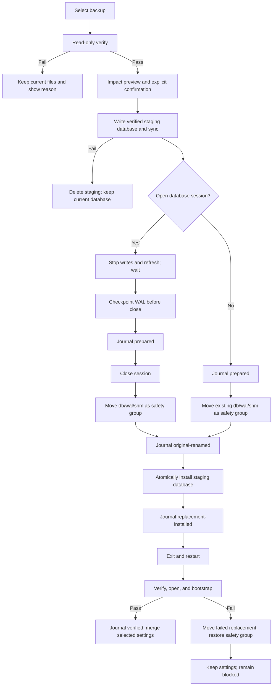

# Backup, Restore, and CSV Portability

- Owner: Product, Application, and Infrastructure
- Status: **Implemented**
- Current release: Nestworth `0.3.0`, build `1`
- Database: SQLite schema `9`
- Platform: macOS Apple Silicon with Wails v3
- Companion: [Data and Application Contracts](../architecture/data-and-ipc-contracts.md)
- Release scope: [v0.3.0 contract](../releases/v0.3.0.md)

This document defines the current local backup, restore, and CSV portability
contract. SQLite remains the local business-data source, Go remains authoritative
for validation and financial calculations, and React owns workflow state,
preview, and presentation. None of these flows requires a network connection.

## 1. Product contract

Nestworth provides two complementary forms of portability:

- A `.nestworth-backup` package preserves the database, settings, and history
  for disaster recovery.
- UTF-8 CSV profiles provide readable, editable exchange for Accounts and
  Holdings. CSV is not a backup replacement.

The implementation guarantees:

- A successfully created backup passes member checksum, schema, SQLite
  integrity, and representative business-invariant verification.
- Verification and preview are read-only. Until explicit confirmation and
  successful validation, the live business database is unchanged.
- Restore keeps a safety copy of the previous database file group and can roll
  back if replacement or the next startup verification fails.
- CSV import is create-only and all-or-nothing. It never silently updates,
  deletes, merges, or skips an invalid row.
- Stable error codes cross the Wails boundary; SQL, driver errors, credentials,
  raw provider payloads, and sensitive local paths do not.

Cloud backup, synchronization, remote accounts, automatic uploads, scheduled
background backup, bank connections, and full historical Activity import are
outside this contract.

## 2. Entry points and service availability

Normal startup exposes these Settings entries:

- `Back up data`
- `Restore from backup`
- `Import / Export CSV`

Settings shows a filename-only summary of the most recent backup: creation time,
format, app/build, schema, and verification result. The summary is stored in
`.nestworth-backup-status.json` beside the live database and never stores an
absolute path or financial data. It uses owner-only permissions (`0600`).

`RecoveryService` remains bound even when the business database cannot open.
The blocked-startup screen can therefore select and verify a backup, perform a
safe replacement, and request application restart without depending on a live
repository or business service. `DataService` is available only after a live,
verified database session exists.

Recovery succeeds by replacing files, recording the restart requirement, and
exiting. The next launch processes the journal before normal open, verification,
and bootstrap. In-process service rebinding is not part of this contract.

## 3. Backup package

### 3.1 Fixed container format

The extension is `.nestworth-backup`. Version 1 is a standard ZIP container with
exactly these members, in this order:

```text
manifest.json
database.sqlite
settings.json
```

`database.sqlite` is a consistent snapshot and never relies on adjacent `-wal`
or `-shm` files. Temporary package files are created in the destination
filesystem, flushed, synchronized where supported, and atomically renamed into
place. The implementation never copies an active SQLite main file as a backup.

The manifest includes at least:

```json
{
  "format_version": 1,
  "backup_kind": "full",
  "app_name": "Nestworth",
  "app_version": "0.3.0",
  "app_build": "1",
  "schema_version": 9,
  "created_at": "2026-09-01T00:00:00Z",
  "members": {
    "database.sqlite": {"sha256": "...", "size_bytes": 0},
    "settings.json": {"sha256": "...", "size_bytes": 0}
  },
  "row_counts": {}
}
```

Rules:

- Only the three fixed members are accepted. Directories, extra members,
  nested archives, path traversal, and symbolic links are rejected.
- Every payload member has a SHA-256 and byte-size entry. `row_counts` assists
  preview but never replaces SQLite or domain validation.
- A member is limited to `1 GiB`; total uncompressed data is limited to
  `1 GiB + 1 MiB`; `manifest.json` is limited to `64 KiB`; and `settings.json`
  is limited to `1 MiB`.
- `format_version` and `schema_version` are independent. A supported container
  format does not imply that a future database schema is readable.
- The package and its temporary files use private owner permissions. The
  manifest contains no password, provider payload, network response, or raw
  diagnostic log.

### 3.2 Settings included in a backup

The settings member contains only recoverable user preferences. Restore presents
three independent categories:

- `chrome`: window size, appearance, accent, and interface language;
- `format`: display currency, grouping and decimal format, timezone, week start,
  and date/time format;
- `routing`: FX provider and quote-cache TTL.

All categories default to preserving the current settings. A user may explicitly
select categories to restore. The selection is written to the restore journal
and is merged into the live `settings.json` only after the journal reaches
`verified`. A rollback never changes the pre-restore settings.

### 3.3 Backup creation

1. The user selects `Back up data` and chooses a destination in the save dialog.
2. The default name is `Nestworth Backup YYYY-MM-DD HH-mm.nestworth-backup`.
3. An existing destination requires an explicit replace confirmation; renaming
   is the default safer choice.
4. The application quiesces business writes and provider-refresh writes. The
   UI disabled state is not the synchronization mechanism.
5. SQLite creates a consistent snapshot using the verified snapshot mechanism
   rather than copying an active main file.
6. The application writes the manifest, settings, and checksums to a temporary
   container in the destination filesystem, flushes it, and atomically renames
   it.
7. The temporary result is reopened read-only and checked for checksums, schema,
   foreign keys, integrity, and representative domain invariants.
8. A successful operation returns the filename, timestamp, version/build,
   schema, size, entity counts, and verification result.

A failure removes incomplete temporary files and leaves the live database
untouched. Detailed failure data stays in local diagnostics and excludes
balances, quantities, notes, Account names, and raw CSV values.

## 4. Restore verification and confirmation

### 4.1 Read-only verification

Restore always starts in a dedicated read-only/query-only path. It must not use
a normal `Open` path that creates a schema, changes directories, enables WAL,
or repairs schema-9 constraints. The verifier checks, in order:

1. The container can be read and has the fixed member set.
2. `format_version` is supported.
3. Manifest fields, checksums, sizes, and member order match the payload.
4. The database is schema `9` and passes current table, column, index, and
   constraint verification.
5. `foreign_key_check`, `integrity_check`, and required domain invariants pass.
6. The database can be reopened read-only and representative Household,
   Account, Holding, Activity, quote, FX, and snapshot data can be read.
7. Settings can be parsed. An unrecoverable preference warns in the preview but
   does not invalidate otherwise valid business data.

A blocking failure shows the reason, a repair suggestion, and an explicit
statement that the current file is unchanged. It never creates a database,
modifies the live database, or overwrites the backup.

### 4.2 Impact preview and explicit confirmation

After validation, the confirmation view compares:

| Current data | Backup data |
| --- | --- |
| Household name and base currency | Household name and base currency |
| Account, Holding, and Activity counts | Account, Holding, and Activity counts |
| Current database state | Backup creation time and source version/build |
| Current file location | The current location used after restore |

The confirmation text states that:

- the current database will be replaced;
- the original database and any existing WAL/SHM sidecars will be moved to a
  safety copy;
- unsaved form data will be lost;
- restore performs no download and sends no provider request;
- no settings category is restored unless the user explicitly selects it;
- selected settings are applied only after restart verification succeeds; and
- the application exits after replacement and must be started again.

The user must check the confirmation box and enter `RESTORE` (case-insensitive)
before the destructive action becomes available. Navigation and other writes
are disabled while restore is running.

## 5. File replacement, journal, and rollback

Restore uses a file-level state machine rather than clearing and importing into
the live business database.



The implementation requirements are:

- Safety files use one timestamp and random suffix, such as
  `nestworth.db.pre-restore-<stamp>-<rand>`, with matching `-wal` and `-shm`
  names when those sidecars exist. Existing safety copies are never silently
  overwritten.
- Checkpoint occurs only when a writable database session is open, and always
  before Close. In blocked-startup with no session, the application does not
  call `Open` to checkpoint a rejected database; it moves any existing live
  file group as-is.
- Main database and existing WAL/SHM sidecars move as one file group. Staging
  and live database files share a directory so replacement is same-filesystem.
- The journal is `.nestworth-restore-journal.json` beside the database, with
  `0600` permissions. It contains operation, state, filenames, timestamps,
  backup member hashes, app/schema/format versions, and selected settings
  categories. It contains no absolute paths or financial values.
- Startup processes the journal before ordinary `Open`. A journal is not marked
  successful merely because a replacement was installed; schema, integrity, and
  bootstrap must pass after restart.
- The original unreadable database is retained unless the user explicitly
  deletes it. Automatic deletion is not provided.

### 5.1 Crash recovery states

| Journal state | Live path | Safety group | Startup action |
| --- | --- | --- | --- |
| `prepared` | Exists | Any | Keep live, delete staging, and do not create a new database |
| `prepared` | Missing | Exists | Restore safety; do not create an empty schema-9 database |
| `original-renamed` | Missing | Exists | Restore safety |
| `original-renamed` | Exists | Exists | Treat as `replacement-installed`; read-only verify live, otherwise preserve a failed copy and restore safety |
| `replacement-installed` | Exists | Exists | Read-only verify live, otherwise preserve a failed copy and restore safety |
| `verified` | Exists | Exists | Remove staging/journal, retain safety for later manual cleanup, then merge selected settings |

A failure in schema verification, integrity, bootstrap, or settings handling
leaves the application in a safe blocked state and does not claim restore success.

## 6. CSV profiles

CSV is an explicit exchange format for current Accounts and Holdings. It does
not carry the complete Activity, History Origin, snapshot, quote, FX, cost-basis,
or correction/reversal history required for disaster recovery.

### 6.1 Accounts profile

One row represents an Account and its current or initial value observation.
Imports are create-only.

| Field | Required | Meaning |
| --- | --- | --- |
| `account_name` | Yes | Account name |
| `account_type` | Yes | A legal value from the current Catalog |
| `balance_sheet_role` | Yes | `asset` or `liability` |
| `tracking_mode` | Yes | `balance`, `manual_value`, or `holdings` |
| `currency` | Yes | Three uppercase currency letters |
| `current_value` | Conditional | Required for `balance`/`manual_value`; empty for `holdings` |
| `value_date` | Conditional | Required with `current_value`; `YYYY-MM-DD` |
| `ownership` | Yes | For example `Alice:50%;Bob:50%`, converted exactly to BPS |
| `include_in_net_worth` | No | Missing input uses Catalog suggestion and is shown in preview |
| `institution_name` | No | Map to an existing Institution or create one |
| `institution_type` | Conditional | Required only when creating an Institution |
| `group_name` | No | Map to an existing Group or create one |
| `include_in_portfolio` | No | Compatibility field; missing input uses the persisted suggestion |
| `include_in_liquid_assets` | No | Compatibility field; missing input uses the persisted suggestion |
| `icon_key` | No | Missing input uses the domain constructor default |
| `note` | No | Plain text |

`value_date` is an observation date, not the import time. The writer stores it
in `AccountValue.EffectiveAt`; it never substitutes the current clock. A
calendar-only date means the start of that day in the History Origin timezone,
or UTC day start when no Origin exists. Future dates and dates before an
existing Origin are blocking errors.

### 6.2 Holdings profile

One row represents a current Holding in an Account and may include an Instrument
and one latest manual quote.

| Field | Required | Meaning |
| --- | --- | --- |
| `account_name` | Yes | Existing Account or an Account created in the same import plan |
| `instrument_type` | Conditional | Required for a new Instrument; must be a Catalog value |
| `instrument_name` | Yes | Instrument name |
| `quantity` | Yes | Exact decimal quantity; no automatic rounding |
| `quote_currency` | Conditional | Required for a new Instrument |
| `unit_price` | No | Must appear with `quote_date`; missing quote remains incomplete |
| `quote_date` | No | Must appear with `unit_price` |
| `symbol` | No | Instrument metadata; never triggers a network request |
| `market_code` | No | Instrument metadata; no provider binding |
| `country_code` | No | Instrument metadata |
| `isin` | No | Instrument metadata |
| `note` | No | Plain text |

The referenced Account must allow `holdings` tracking. A combined Accounts and
Holdings session can create the Account first and use one transaction for both
profiles. A standalone Holdings import can reference only an existing Holdings
Account. Import creates no Trade Activity and makes no cost-basis claim; missing
cost evidence preserves the existing unavailable/incomplete Analytics state.
Holdings Account cash is not part of the CSV profile.

### 6.3 File and parsing rules

- Export is UTF-8 with BOM, comma-separated, CRLF, and RFC 4180 quoting.
- Import recognizes UTF-8/BOM, comma, semicolon, and Tab separators, including
  quoted newlines. The detected encoding and separator are confirmed before
  preview.
- Decimal, quantity, FX, and percentage parsing uses Go exact-decimal rules.
  Empty values are not zero and negative values are not made positive.
- Ownership percentages allow at most two fractional digits and convert exactly
  to integer basis points. `33.33% + 66.67%` is valid; implicit rounding is
  rejected.
- The default number format uses `.` without grouping. A comma decimal or
  grouping format must be selected explicitly when needed; ambiguous input is
  blocked.
- ISO dates are the default. Other date formats require explicit selection;
  format is not guessed from a small sample.
- Empty required fields, unknown enums, invalid currencies, overflow, invalid
  ownership totals, and domain-invalid negative values block the import.
- Export keeps canonical decimal strings and does not lose precision to display
  formatting.
- Limits are `8 MiB` per file, `5,000` data rows, `4 KiB` per cell, and `128`
  source columns. Limits are checked at file selection.

## 7. CSV workflows

### 7.1 Export

1. Select the `Accounts` or `Holdings` profile.
2. Select active-only or include-archived; active-only is the default.
3. Go generates stable-sorted CSV from one consistent read snapshot.
4. Saving over an existing file requires explicit replacement confirmation.
5. The saved file is parsed again for a round-trip check, and the UI shows
   profile, row count, path, version, and build.

Export never calls a provider and never exposes raw HTTP responses or internal
SQL columns. Complete recovery remains a backup-package operation.

### 7.2 Import steps

The import wizard has four ordered steps. A later step is unavailable until the
previous step succeeds.

#### Step 1: Profile and file

The user selects Accounts or Holdings and chooses a file. The UI shows detected
encoding, separator, column count, row count, and headers. The user can correct
encoding, separator, number format, and date format.

A shared session may include Accounts first and Holdings second. Both files use
one import plan and one transaction. Separate sessions are also supported; a
standalone Holdings session must reference an existing Holdings Account.

#### Step 2: Field mapping

The UI displays source headers beside target fields. Standard template names
may map automatically; aliases are suggestions with visible confidence. Required
fields must be mapped exactly once, and incompatible or conflicting mappings
block preview. References to Members, Institutions, Groups, Accounts, and
Instruments require an explicit choice to map to an existing entity, create a
new entity, or block.

#### Step 3: Preview and errors

Go parses rows into a normalized import plan without writing the live database.
The preview shows at least the first 50 rows and full counts:

| State | Meaning |
| --- | --- |
| Create | A new entity or observation will be created |
| Reference | An existing entity will be reused |
| Warning | The row is usable but needs user attention, such as a missing quote |
| Error | The row cannot be safely interpreted; commit is blocked |
| Duplicate | A file or current-data conflict requires a decision |

Errors identify row, target field, source value in the user-requested error
export, stable error code, explanation, and repair suggestion. Ordinary logs
contain only code, profile, and row number. One blocking error prevents all
writes; there is no skip-invalid-rows mode.

#### Step 4: Confirm and commit

The confirmation view shows valid rows, new Account/Holding/Instrument/Directory
entity counts, warnings, conflicts, and the target Household. The user confirms
`create only; update nothing; delete nothing` and selects `Import all`.

The application then:

1. stops competing application writes and waits for provider refresh writes to
   quiesce;
2. rechecks the current Household, references, uniqueness, and domain invariants
   inside one SQLite write transaction;
3. uses a transaction-aware application writer rather than calling independently
   committing public use cases or inserting SQL from a Wails adapter;
4. writes Directory entities, Accounts, Instruments, Holdings, observations, and
   quotes in dependency order;
5. rolls the entire transaction back if any validation, reference, constraint,
   or persistence operation fails;
6. returns actual created counts and warnings after commit; and
7. clears the in-memory plan, invalidates related queries, and reloads
   authoritative DTOs.

The commit phase rechecks everything because the database can change after
preview. A conflict requires a new preview and leaves no partial write. The
import plan is not persisted and is discarded when the window closes or a
restore begins.

### 7.3 Conflicts and references

- Source IDs are not imported as database primary keys. Cross-file references
  use names and explicit user mappings.
- Account names are not assumed unique by the schema. A create-only import
  nevertheless reports a clear duplicate when the selected name, currency,
  Institution, or other mapping combination conflicts; it never overwrites.
- Holding conflicts use Account plus Instrument. Quantities are not added or
  merged, and cost is not overwritten.
- Existing entity reuse requires an exact name match. Multiple candidates or
  normalized whitespace/case conflicts block until resolved.
- Unmatched references require an explicit map-existing or create-new choice.
- Ownership members must already exist or be explicitly created in the same
  plan. The first Member is never selected implicitly.
- Provider symbols and market codes are metadata only. CSV import does not set a
  provider binding or refresh a quote; missing quotes remain missing inputs.
- CSV import is available only for an onboarded Household from Settings. It is
  not a blocked-startup recovery path and does not create an implicit Household.

## 8. Stable error categories

Backup and restore expose stable categories including:

```text
backup_invalid_format
backup_missing_member
backup_checksum_failed
backup_schema_unsupported
backup_integrity_failed
backup_business_invariant_failed
backup_restore_confirmation_required
backup_restore_busy
backup_restore_swap_failed
backup_restore_rollback_failed
```

CSV exposes:

```text
csv_invalid_encoding
csv_invalid_format
csv_mapping_required
csv_mapping_conflict
csv_row_invalid
csv_reference_unresolved
csv_duplicate
csv_limit_exceeded
csv_commit_failed
```

Errors cross the Wails boundary through the existing safe wire-error shape.
Fields, row numbers, and column names are structured DTO data; full local paths
and underlying driver errors remain local diagnostics.

## 9. Security and future boundaries

The current package is a sensitive local file, not an encrypted archive. The UI
must advise users to store it in a protected location. Password-based backup,
key management, secure deletion, scheduled retention, cloud storage, device
sync, merge/update imports, Activity and History import, and full-fidelity CSV
round trips require separate privacy, security, historical-fact, and schema
compatibility decisions.
