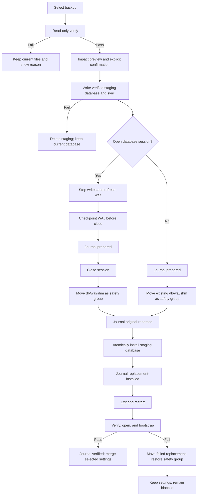

# Backup, Restore, and JSON Export

- Status: **Implemented**
- Database: SQLite schema `11`
- Platform: Wails v3
- Companion: [JSON export format](json-export-format.md)

## 1. Product contract

Settings provides **Back up data**, **Restore from backup**, and **Export data**.
A `.nestworth-backup` package preserves the database and settings for recovery.
A `.nestworth.json` file exposes versioned structured business data to other
applications and scripts. JSON export includes archived data and locally saved
market history. It has no import path. Use backup/restore for recovery and
migration; the JSON export is not a restorable backup.

Export opens a native save dialog directly. A pending export disables its button.
Cancellation is silent; success identifies the saved filename. The destination
is written atomically with owner-only permissions. Existing files require the
native replacement confirmation. CSV import/export, mapping, preview, sessions,
and related IPC endpoints have been removed.

## 2. Service availability

`DataService` is available when the live database is open. It exposes
`CreateBackup`, `LastBackupStatus`, and `ExportJSON`. Export reads facts and
calculation inputs in one SQLite read transaction without triggering network
requests, rebuilding history, or writing business data.

`RecoveryService` remains available when the business database cannot open.
Verification and preview are read-only. Restore installs a verified backup,
requests restart, and verifies the replacement on the next launch. A filename-only
backup status file records the latest successful backup.

## 3. Backup package

### 3.1 Fixed container format

The extension is `.nestworth-backup`. Version 1 is a standard ZIP container with
exactly these members, in this order:

```text
manifest.json
database.sqlite
settings.json
```

`database.sqlite` is a consistent snapshot and never relies on adjacent `-wal`
or `-shm` files. Temporary package files are created in the destination
filesystem, flushed, synchronized where supported, and atomically renamed into
place. The implementation never copies an active SQLite main file as a backup.

The manifest includes at least:

```json
{
  "format_version": 1,
  "backup_kind": "full",
  "app_name": "Nestworth",
  "app_version": "0.3.1",
  "app_build": "2",
  "schema_version": 9,
  "created_at": "2026-09-01T00:00:00Z",
  "members": {
    "database.sqlite": {"sha256": "...", "size_bytes": 0},
    "settings.json": {"sha256": "...", "size_bytes": 0}
  },
  "row_counts": {}
}
```

Rules:

- Only the three fixed members are accepted. Directories, extra members,
  nested archives, path traversal, and symbolic links are rejected.
- Every payload member has a SHA-256 and byte-size entry. `row_counts` assists
  preview but never replaces SQLite or domain validation.
- A member is limited to `1 GiB`; total uncompressed data is limited to
  `1 GiB + 1 MiB`; `manifest.json` is limited to `64 KiB`; and `settings.json`
  is limited to `1 MiB`.
- `format_version` and `schema_version` are independent. A supported container
  format does not imply that a future database schema is readable.
- The package and its temporary files use private owner permissions. The
  manifest contains no password, provider payload, network response, or raw
  diagnostic log.

### 3.2 Settings included in a backup

The settings member contains only recoverable user preferences. Restore presents
three independent categories:

- `chrome`: window size, appearance, accent, and interface language;
- `format`: display currency, grouping and decimal format, timezone, week start,
  and date/time format;
- `routing`: FX provider and quote-cache TTL.

All categories default to preserving the current settings. A user may explicitly
select categories to restore. The selection is written to the restore journal
and is merged into the live `settings.json` only after the journal reaches
`verified`. A rollback never changes the pre-restore settings.

### 3.3 Backup creation

1. The user selects `Back up data` and chooses a destination in the save dialog.
2. The default name is `Nestworth Backup YYYY-MM-DD HH-mm.nestworth-backup`.
3. An existing destination requires an explicit replace confirmation; renaming
   is the default safer choice.
4. The application quiesces business writes and provider-refresh writes. The
   UI disabled state is not the synchronization mechanism.
5. SQLite creates a consistent snapshot using the verified snapshot mechanism
   rather than copying an active main file.
6. The application writes the manifest, settings, and checksums to a temporary
   container in the destination filesystem, flushes it, and atomically renames
   it.
7. The temporary result is reopened read-only and checked for checksums, schema,
   foreign keys, integrity, and representative domain invariants.
8. A successful operation returns the filename, timestamp, version/build,
   schema, size, entity counts, and verification result.

A failure removes incomplete temporary files and leaves the live database
untouched. Detailed failure data stays in local diagnostics and excludes
balances, quantities, notes, Account names, and raw exported values.

## 4. Restore verification and confirmation

### 4.1 Read-only verification

Restore always starts in a dedicated read-only/query-only path. It must not use
a normal `Open` path that creates a schema, changes directories, enables WAL,
or repairs schema-9 constraints. The verifier checks, in order:

1. The container can be read and has the fixed member set.
2. `format_version` is supported.
3. Manifest fields, checksums, sizes, and member order match the payload.
4. The database is schema `9` and passes current table, column, index, and
   constraint verification.
5. `foreign_key_check`, `integrity_check`, and required domain invariants pass.
6. The database can be reopened read-only and representative Household,
   Account, Holding, Activity, quote, FX, and snapshot data can be read.
7. Settings can be parsed. An unrecoverable preference warns in the preview but
   does not invalidate otherwise valid business data.

A blocking failure shows the reason, a repair suggestion, and an explicit
statement that the current file is unchanged. It never creates a database,
modifies the live database, or overwrites the backup.

### 4.2 Impact preview and explicit confirmation

After validation, the confirmation view compares:

| Current data | Backup data |
| --- | --- |
| Household name and base currency | Household name and base currency |
| Account, Holding, and Activity counts | Account, Holding, and Activity counts |
| Current database state | Backup creation time and source version/build |
| Current file location | The current location used after restore |

The confirmation text states that:

- the current database will be replaced;
- the original database and any existing WAL/SHM sidecars will be moved to a
  safety copy;
- unsaved form data will be lost;
- restore performs no download and sends no provider request;
- no settings category is restored unless the user explicitly selects it;
- selected settings are applied only after restart verification succeeds; and
- the application exits after replacement and must be started again.

The user must check the confirmation box and enter `RESTORE` (case-insensitive)
before the destructive action becomes available. Navigation and other writes
are disabled while restore is running.

## 5. File replacement, journal, and rollback

Restore uses a file-level state machine rather than clearing and importing into
the live business database.



The implementation requirements are:

- Safety files use one timestamp and random suffix, such as
  `nestworth.db.pre-restore-<stamp>-<rand>`, with matching `-wal` and `-shm`
  names when those sidecars exist. Existing safety copies are never silently
  overwritten.
- Checkpoint occurs only when a writable database session is open, and always
  before Close. In blocked-startup with no session, the application does not
  call `Open` to checkpoint a rejected database; it moves any existing live
  file group as-is.
- Main database and existing WAL/SHM sidecars move as one file group. Staging
  and live database files share a directory so replacement is same-filesystem.
- The journal is `.nestworth-restore-journal.json` beside the database, with
  `0600` permissions. It contains operation, state, filenames, timestamps,
  backup member hashes, app/schema/format versions, and selected settings
  categories. It contains no absolute paths or financial values.
- Startup processes the journal before ordinary `Open`. A journal is not marked
  successful merely because a replacement was installed; schema, integrity, and
  bootstrap must pass after restart.
- The original unreadable database is retained unless the user explicitly
  deletes it. Automatic deletion is not provided.

### 5.1 Crash recovery states

| Journal state | Live path | Safety group | Startup action |
| --- | --- | --- | --- |
| `prepared` | Exists | Any | Keep live, delete staging, and do not create a new database |
| `prepared` | Missing | Exists | Restore safety; do not create an empty schema-9 database |
| `original-renamed` | Missing | Exists | Restore safety |
| `original-renamed` | Exists | Exists | Treat as `replacement-installed`; read-only verify live, otherwise preserve a failed copy and restore safety |
| `replacement-installed` | Exists | Exists | Read-only verify live, otherwise preserve a failed copy and restore safety |
| `verified` | Exists | Exists | Remove staging/journal, retain safety for later manual cleanup, then merge selected settings |

A failure in schema verification, integrity, bootstrap, or settings handling
leaves the application in a safe blocked state and does not claim restore success.

## 6. JSON export

The [version 1 contract](json-export-format.md) and its
[JSON Schema](json-export-v1.schema.json) define the public export independently
of SQLite schema versions and frontend DTOs. The export includes reference data,
opening positions, business history, effective configuration history, market
observations, and a derived current-state summary. Runtime caches and secrets are
excluded. Missing financial inputs remain explicit null values and status flags.

## 7. Error and privacy boundaries

Backup and restore retain their existing `backup_*` error categories, verification,
confirmation, journaled replacement, and rollback behavior. Export uses the existing
safe wire error contract; database errors and local paths are not exposed to the UI.

Both files contain sensitive financial information and are not encrypted. Export
excludes application settings, credentials, local paths, UI icon references, logs,
mutation deduplication records, daily valuation caches, and scheduling state.
User-authored notes and names are preserved verbatim. Backup's existing settings
policy remains unchanged.
