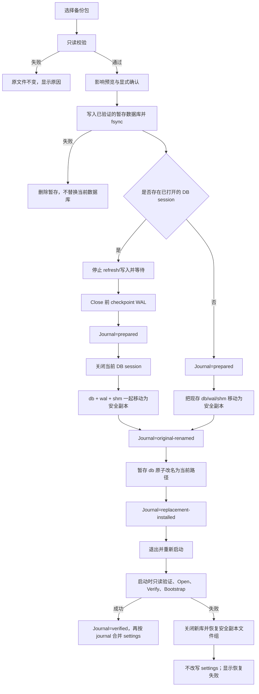

# Nestworth v0.3.0 备份/恢复与 CSV 导入/导出设计方案

## 文档状态

- 状态：已实现（打包烟测 `wails3 task darwin:package:release` 仍为人工门禁）
- 目标版本：`v0.3.0`
- 目标 build：`1`
- 当前基线：`v0.2.1`、build `2`
- 当前数据库基线：代码中的 SQLite schema `9`
- 目标平台：macOS Apple Silicon；Wails v3 桌面端
- 本文不是实现承诺；完成条件以代码、测试和发布验收为准

## 1. 设计结论

本版本定位为“数据安全与可迁移性”版本。建议将版本从 `v0.2.1` 提升到
`v0.3.0`，build 从 `2` 重新开始为 `1`：这是新增完整用户能力，不是补丁级修复。

核心决策如下：

| 项目 | 决策 |
| --- | --- |
| 备份格式 | `.nestworth-backup` 本地容器，包含 SQLite 一致性快照、manifest 和校验信息 |
| 恢复策略 | 先验证，后预览；关闭并 checkpoint 后把当前文件组移动为安全副本；暂存替换；退出并重启验证，失败自动回滚 |
| 覆盖策略 | 不允许静默覆盖；备份文件和当前数据库都必须经过明确确认 |
| CSV 范围 | `Accounts` 与 `Holdings` 两种 profile；导出和导入都使用 UTF-8 CSV |
| CSV 写入 | 默认仅新建，不更新、不删除、不跳过错误行；所有有效行一次原子提交 |
| 数据库迁移 | 本版本不改变 SQLite schema，继续使用 schema `9`；交换格式版本独立为 `1` |
| 网络依赖 | 无；备份、恢复、CSV 解析、预览和写入全部本地完成 |
| 完整迁移 | 全量、保留历史语义的迁移使用备份包；CSV 是可读、可编辑、可互操作的交换格式，不是备份替代品 |

这一拆分保护现有产品边界：SQLite 仍是本地业务数据源，Go 仍是财务校验和计算的唯一权威，React 只负责流程状态、预览和展示。

## 2. 用户价值与成功标准

### 2.1 用户要解决的问题

用户需要在不依赖云端的情况下：

1. 用一个动作把当前资产状态保存到自己控制的位置。
2. 在恢复前知道文件是否可用、来自哪个版本、会影响哪些数据。
3. 即使恢复失败，也能保留当前数据并恢复到原状态。
4. 从银行、券商或个人表格导入初始资产，避免逐条重新录入。
5. 在真正写入前看到字段映射、规范化结果、错误行和可能创建的实体。

### 2.2 可验收的产品指标

- 成功创建的每个备份包都能通过 checksum、schema、SQLite integrity 和重新打开验证。
- 未经过用户确认或校验失败时，恢复流程对当前业务数据库不产生写入。
- 恢复替换或重开失败时，当前数据库或恢复前安全副本仍可用。
- CSV 只要存在一个阻断级错误，提交按钮不可用，业务数据库写入行数为零。
- CSV 提交期间任何一行失败，整个事务回滚，不能留下半批数据。
- 导入不会静默覆盖现有 Account、Holding、Instrument、Member、Institution 或 Group。
- 所有新按钮、错误、状态和预览列都覆盖现有语言（英文、简体中文、繁体中文）与键盘操作。

## 3. 版本边界与非目标

### 3.1 v0.3.0 包含

- Settings 中的 Data Management 区域。
- 一键创建本地备份包。
- 备份包的格式、checksum、schema、SQLite 完整性和业务不变量校验。
- 恢复前影响预览、关闭后的文件组安全副本、可回滚替换和恢复后重启验证。
- 应用无法打开当前数据库时，从 blocked-startup 页面恢复备份。
- CSV 导出：Accounts、Holdings，支持 active/all 选择和稳定排序。
- CSV 导入：Accounts、Holdings，字段映射、格式选项、预览、错误报告、原子写入。
- 失败原因的稳定错误码，不向前端暴露 SQL、驱动错误、凭据或内部路径细节。
- 版本、build、release 文档、README、About 和打包产物的同步。

### 3.2 明确不包含

- 云备份、自动上传、同步、多设备合并或远程账户。
- 自动定时备份、后台扫描或网络依赖。
- 银行/券商直连和自动对账。
- CSV 导入 Activities、History Origin、历史快照、成本基础事件或修正链。
- CSV 自动更新或删除已有数据；本版本不做模糊合并。
- 备份密码加密、密钥管理、云端密钥托管。备份包是敏感本地文件，UI 必须明确提示用户保存到受保护位置；加密备份作为后续版本的独立安全设计。
- 通过增加临时导入表、导入日志表或 schema revision 表来扩大本版本数据库 schema。

CSV 不包含完整的历史事实，因此不能作为灾难恢复手段。用户要保留 Nestworth 的完整历史、快照、报价、FX 和 correction/reversal 语义，应使用备份包。

## 4. 信息架构与入口

### 4.1 正常启动

在 `Settings → Data Management` 中增加三个入口：

- `Back up data`
- `Restore from backup`
- `Import / Export CSV`

Settings 页面显示最近一次备份的本地摘要（时间、文件名、schema、验证结果）。摘要持久化在 **live 数据库同一目录** 的 `.nestworth-backup-status.json` sidecar 中（与 restore journal 同目录，通常是 Application Support 下的数据库目录），只保存文件名，不保存绝对路径或财务数据，也不把敏感内容写入日志。该 sidecar 不放在用户选择的备份文件旁：备份可能在桌面或外置盘，Settings 启动时找不到，而且本版本禁止把绝对路径写入业务状态。

### 4.2 blocked-startup

如果当前数据库打不开、schema 不兼容或完整性失败，页面仍提供 `Restore from backup`。RecoveryService 必须始终注册，并和业务 Service 解耦；在没有可用 Repository 时也能：

1. 选择和验证备份包；
2. 对当前数据库路径执行安全替换。若 **没有已打开的 DB session**（blocked-startup 的常态），跳过 quiesce、checkpoint 和 Close，也不为了 checkpoint 去调用会创建 schema 或 repair 的 `Open`；只要 live 路径上存在主库或 WAL/SHM 文件，就把现存文件组移动为安全副本。若存在已打开的 session，则先 quiesce、在 Close 前 checkpoint，再移动文件组；
3. 安装已经验证过的暂存数据库；
4. 退出应用并提示用户重新启动；
5. 下次启动由 journal 恢复未完成状态，再执行正常 open/verify/bootstrap；失败则回滚并停留在 blocked-startup。

这样恢复能力本身不会依赖一个已经损坏的业务 Service。

## 5. 备份设计

### 5.1 备份包格式

扩展名为 `.nestworth-backup`，内部使用标准容器格式，建议第一版采用 ZIP，以便用户能够长期保存和检查文件。内部文件固定为：

```text
manifest.json
database.sqlite
settings.json
```

`database.sqlite` 是一致性快照，不包含旁车的 `-wal` 或 `-shm` 文件。所有文件都由应用生成，临时文件位于目标目录，完成后再原子改名。

manifest 至少包含：

```json
{
  "format_version": 1,
  "backup_kind": "full",
  "app_name": "Nestworth",
  "app_version": "0.3.0",
  "app_build": "1",
  "schema_version": 9,
  "created_at": "2026-09-01T00:00:00Z",
  "members": {
    "database.sqlite": {"sha256": "...", "size_bytes": 0},
    "settings.json": {"sha256": "...", "size_bytes": 0}
  },
  "row_counts": {}
}
```

规则：

- manifest 不保存密码、provider payload、网络响应或原始日志。
- v0.3.0 只接受三个固定 member：`manifest.json`、`database.sqlite`、`settings.json`；拒绝未知 member、目录、嵌套 archive、路径穿越和符号链接。
- manifest 必须记录每个 member 的 SHA-256 和大小，而不只记录 database 的 hash。解压前限制单个 member 不超过 `1 GiB`、总未压缩大小不超过 `1 GiB + 1 MiB`；`manifest.json` 不超过 `64 KiB`，`settings.json` 不超过 `1 MiB`。
- `row_counts` 只用于预览和完整性辅助检查，不能代替 SQLite/domain 校验。
- 备份包中的 settings 只包含可恢复的用户偏好。恢复策略按三类展示：`chrome`（窗口尺寸、外观、accent、界面语言）、`format`（显示货币、分组/小数格式、时区、周起始日、日期/时间格式）和 `routing`（FX provider、quote cache TTL）。三类默认都是“保留当前偏好”，用户可逐类勾选恢复。勾选结果写入 restore journal，**只在 journal 到达 `verified` 时** 合并进当前 `settings.json`；回滚时不得改写现有 settings 文件。
- 备份文件创建权限使用用户私有权限（macOS 下目标文件至少为 owner-only）。
- `format_version` 与 `schema_version` 分开。格式相同不代表未来 schema 一定可打开。
- member 顺序固定为 manifest、database、settings；格式 v1 不接受额外 member，避免未知内容绕过校验或形成 zip-bomb 入口。
- live 数据库目录中的 `.nestworth-backup-status.json` 权限为 `0600`，字段至少为 `format_version`、`backup_file_name`、`created_at`、`schema_version`、`app_version`、`app_build`、`verification_result`；路径字段只保存文件名。它与用户保存 `.nestworth-backup` 的目录无关。

### 5.2 创建备份流程

1. 用户点击 `Back up data`。
2. 默认文件名为 `Nestworth Backup YYYY-MM-DD HH-mm.nestworth-backup`，打开系统保存对话框。
3. 如果目标已存在，显示明确的路径和“替换现有备份”确认；默认建议改名，不静默覆盖。
4. 应用进入 database quiesce：禁止新的业务写入和 refresh，取消或等待正在进行的 provider refresh 写入；不能只依赖前端按钮禁用。
5. 通过 SQLite online backup 或等效的经验证快照机制生成临时 `database.sqlite`；禁止直接复制正在使用的主库文件。
6. 生成 manifest、settings 和每个 member 的 checksum，写入目标目录旁的临时容器，flush/sync 后原子改名；不得在 `/tmp` 生成后再跨卷复制作为提交。
7. 重新以只读方式打开临时产物，验证 checksum、schema、外键、integrity 和代表性业务不变量。
8. 验证成功后显示摘要：文件、时间、版本/build、schema、数据库大小、实体数量和验证结果。

备份失败时删除未完成临时文件，不影响当前数据库。失败信息使用稳定错误码；详细原因仅进入本地诊断日志，日志不得包含余额、数量、笔记、账户名或原始 CSV 值。

### 5.3 恢复前校验

恢复来源永远先进入只读检查，不能调用会创建 schema 或执行 v9 修复的普通 `Open` 路径。新增 `sqlite.OpenReadOnlyForVerify`（或等价的专用 API）：使用 SQLite read-only/query-only 连接，不执行 `MkdirAll`、schema 创建、v9 repair 或 WAL 设置。检查顺序如下：

1. 容器可读、文件成员齐全、无路径穿越成员。
2. `format_version` 在支持范围内。
3. manifest 字段、每个 payload member 的 checksum、文件大小和固定 member 列表一致。
4. `schema_version == 9`，数据库表、列、索引和约束通过当前 verifier。
5. `foreign_key_check`、`integrity_check` 和必要的 domain invariant 检查通过。
6. 数据库可在只读模式下重新打开并读取 Household、Account、Holding、Activity、quote、FX、snapshot 等代表性数据。
7. 备份中的 settings 可解析；不可恢复的偏好不会阻断业务数据恢复，但会在预览中提示。

任一阻断项失败，显示“不能恢复”的原因、修复建议和原文件不变声明。校验失败绝不能自动创建新数据库、修改当前数据库或覆盖原备份。

### 5.4 恢复影响预览与确认

校验通过后显示双栏摘要：

| 当前数据 | 备份数据 |
| --- | --- |
| Household 名称、base currency | Household 名称、base currency |
| Account / Holding / Activity 数量 | Account / Holding / Activity 数量 |
| 当前数据库状态 | 备份创建时间、来源版本/build |
| 当前文件位置 | 恢复后将使用当前文件位置 |

确认页必须明确写出：

- 当前数据库将被替换；应用会在数据库关闭后把原主库及其 WAL/SHM sidecar 移动为恢复前安全副本。
- 未保存的前端表单内容会丢失，用户需要先取消或提交这些表单。
- 恢复不会下载数据，也不会向任何 provider 发起请求。
- 默认不恢复任何应用偏好；只有用户显式勾选对应恢复类别才恢复应用偏好。勾选的类别记入 journal，在重启且业务库验证通过后才合并；若下次启动回滚数据库，当前 settings 保持恢复前的值。
- 恢复成功后应用会退出，用户需要重新启动；这是 v0.3.0 的明确流程，不承诺在同一 Wails 进程中动态重绑服务。

高风险操作需要勾选确认框并输入 `RESTORE`（大小写不敏感）后按钮才可用。恢复进行中禁用导航和其他写入。

### 5.5 安全替换与回滚

采用文件级状态机，而不是在业务数据库内执行“清空再导入”。恢复前的安全副本不是 live copy：有打开的 session 时，它是 Close 并 checkpoint 后移动的原数据库文件组；没有 session 时，它是把 live 路径上现存文件组原样移动后的结果。



实现要求：

- 安全副本文件组使用同一个时间和随机后缀：`nestworth.db.pre-restore-<stamp>-<rand>`，以及同名的 `-wal`、`-shm`（只保留实际存在的 sidecar）；不能覆盖已有副本。
- 仅当存在已打开的 writable session 时才 checkpoint；checkpoint 必须发生在 Close 之前。没有 session 时禁止为 checkpoint 去 `Open` 已经拒绝打开的文件。移动时主库和存在的 WAL/SHM 必须作为一个文件组处理。
- 每一步都在数据库目录 flush 文件并尽可能同步目录项；暂存文件必须和 live db 位于同一目录，保证 rename 是同卷操作。
- journal 放在数据库目录：`.nestworth-restore-journal.json`，权限为 `0600`，只保存 operation、state、live/safety/staging 的文件名、started_at、backup member hash、app/schema/format 版本，以及用户勾选的 settings 恢复类别（`chrome` / `format` / `routing`），不保存绝对路径或财务值。
- 应用每次启动先处理 journal，再进入普通 `Open`；如果同时存在多个候选，只接受通过只读 schema/integrity 验证的文件组。journal 未到 `verified` 之前不得合并备份中的 settings；回滚时不得改写当前 `settings.json`。
- 在原数据库不可读时仍保留它，除非用户明确选择删除；本版本不提供自动删除旧数据库的路径。
- schema/integrity/bootstrap 任一步失败，恢复视为失败，不得把“文件已替换”当成成功；v0.3.0 恢复成功的终点是“重启后验证通过”。

journal 崩溃窗口：

| Journal | Live 路径 | Safety 文件组 | 启动动作 |
| --- | --- | --- | --- |
| `prepared` | 存在 | 任意 | 保留 live，删除 staging；禁止 `Open` 创建空库 |
| `prepared` | 缺失 | 存在 | 恢复 safety；禁止创建空的 schema `9` 数据库 |
| `original-renamed` | 缺失 | 存在 | 恢复 safety |
| `original-renamed` | 存在 | 存在 | **视为 `replacement-installed`**：只读校验 live；失败则把 live 改名为 failed-restore 副本并恢复 safety。这覆盖“staging 已改名、journal 尚未写成 replacement-installed”的崩溃窗口 |
| `replacement-installed` | 存在 | 存在 | `OpenReadOnlyForVerify` live；失败则 failed-restore + 恢复 safety |
| `verified` | 存在 | 存在 | 删除 staging/journal，保留 safety 供用户稍后手动删除；此时才合并 journal 中勾选的 settings 类别 |

## 6. CSV 导入/导出设计

### 6.1 CSV 的数据范围

v0.3.0 提供两个独立 profile：

#### Accounts CSV

一行表示一个 Account 及其当前/初始 value observation。Accounts CSV 只支持创建型导入；导入后的值是新的观察事实，不代表文件中未提供的历史 Activity。

| 字段 | 必需 | 说明 |
| --- | --- | --- |
| `account_name` | 是 | Account 名称 |
| `account_type` | 是 | 使用当前 Catalog 的合法值 |
| `balance_sheet_role` | 是 | `asset` 或 `liability` 等当前合法值 |
| `tracking_mode` | 是 | 当前 Catalog 的 `balance`、`manual_value` 或 `holdings` |
| `currency` | 是 | 三位大写货币代码 |
| `current_value` | 条件必需 | `balance` / `manual_value` 必须提供；`holdings` 必须为空；账户货币中的精确十进制值 |
| `value_date` | 条件必需 | 有 `current_value` 时必须提供；`YYYY-MM-DD`，不带时区 |
| `ownership` | 是 | 例如 `Alice:50%;Bob:50%`；百分比最多两位小数并必须精确转换为整数 BPS，总和必须为 10000 BPS；`33.33% + 66.67%` 合法 |
| `include_in_net_worth` | 否 | 导出总是包含；导入缺失时使用 `SuggestedInclusion` 并在预览中显示结果 |
| `institution_name` | 否 | 可映射或创建 Institution |
| `institution_type` | 条件必需 | 只有创建新 Institution 时必需；映射现有 Institution 时由现有记录提供 |
| `group_name` | 否 | 可映射或创建 Group |
| `include_in_portfolio` | 否 | 导出总是包含；导入缺失时使用 `SuggestedInclusion` 并在预览中显示结果 |
| `include_in_liquid_assets` | 否 | 导出总是包含；导入缺失时使用 `SuggestedInclusion` 并在预览中显示结果 |
| `icon_key` | 否 | 导入缺失时使用现有 domain constructor 的明确默认 icon，不写入空值 |
| `note` | 否 | 纯文本 |

`value_date` 和 Holdings 的 `quote_date` 是观察时间，不是导入时间。v0.3.0 import writer **必须** 把它们写入 `AccountValue.EffectiveAt` 和 `InstrumentQuote.QuotedAt`，不得用 `clock()` 或导入时刻替换。日期列只有日历日：解释为 History Origin 时区当天的起始时刻；尚无 Origin 时使用 UTC 当天起始时刻。未来日期阻断。已有 History Origin 且日期早于 `origin.StartedAt` 的阻断。该 writer 是 v0.3.0 的交付范围，不是“若能力尚不具备则阻断”的可选项。

#### Holdings CSV

一行表示一个 Account 下的一个当前 Holding，并可附带 Instrument 和最新手工 quote。

| 字段 | 必需 | 说明 |
| --- | --- | --- |
| `account_name` | 是 | 必须解析到当前数据库中的 Account，或同一 import plan 中将创建的 Account |
| `instrument_type` | 条件必需 | 创建新 Instrument 时必须使用当前 Catalog 的合法值；复用现有 Instrument 时可由现有记录提供 |
| `instrument_name` | 是 | Instrument 名称 |
| `quantity` | 是 | 精确十进制数量，不自动四舍五入 |
| `quote_currency` | 条件必需 | 创建新 Instrument 时必须提供合法货币；复用现有 Instrument 时可由现有记录提供 |
| `unit_price` | 否 | 与 `quote_date` 必须同时提供或同时为空；缺失不会伪造报价，资产可显示为 incomplete |
| `quote_date` | 否 | 与 `unit_price` 必须同时提供或同时为空 |
| `symbol` | 否 | Instrument 身份 metadata；不触发网络请求，也不自动设置 provider binding |
| `market_code` | 否 | Instrument 身份 metadata；provider binding 不属于 v0.3.0 CSV |
| `country_code` | 否 | Instrument 元数据 |
| `isin` | 否 | Instrument 元数据 |
| `note` | 否 | 纯文本 |

导入 Holdings 时，Account 必须使用允许 Holdings 的合法 `tracking_mode`。Holdings CSV 可以在同一个 import session 中接在 Accounts CSV 后面，使新建 Account 可被同批 Holding 引用；单独导入 Holdings CSV 时，目标 Account 必须已经存在。导入不会创建 Trade Activity，也不会声称拥有成本基础；缺少成本证据时，现有 Analytics 的 unavailable/incomplete 语义必须保留。Holdings account 的 cash sub-ledger 不在 v0.3.0 CSV 范围内。

### 6.2 CSV 文件规则

- 导出为 UTF-8 with BOM，以便常见表格软件正确识别中文；使用逗号、CRLF 和 RFC 4180 quoting。
- 导入识别 UTF-8/BOM、逗号、分号或 Tab 分隔符，以及带引号的换行字段；识别结果必须让用户在预览前确认。
- 金额、数量、FX 和百分比解析使用 Go 的 decimal；不使用 binary float，不把空值当作零，不自动取绝对值。
- ownership 百分比沿用现有 `PercentToBasisPoints` 规则：最多两位小数，`33.33%` 精确对应 `3333 BPS`；超过两位小数或无法精确转换时阻断，不做隐式四舍五入。
- 默认数字格式为小数点 `.`、无千位分隔符。用户可以在导入设置中显式选择逗号小数点或千位分隔符；存在歧义时阻断并要求选择。
- 日期默认 ISO-8601；其他日期格式必须由用户选择，不能根据少量样本猜测导致日期错位。
- 空的必需字段、未知枚举、非法货币、金额/数量溢出、ownership 不等于 100%、负数不符合当前 domain 规则，都是阻断错误。
- 导出值使用 canonical decimal strings，不因显示小数位设置而丢失精度。
- v0.3.0 固定限制为：每个 CSV 文件最大 `8 MiB`、最多 `5,000` 条数据行、单个 cell 最大 `4 KiB`、最多 `128` 个 source columns；在文件选择阶段检查并拒绝超限，不等到 commit 才失败。

### 6.3 导出流程

1. 用户选择 `Accounts` 或 `Holdings` profile。
2. 选择 active only 或 include archived；默认 active only。
3. Go 在一个一致性读快照中生成稳定排序的 CSV：Account 名称、ID、日期等字段的排序规则固定。
4. 系统保存到用户选定位置；已有文件必须显式确认替换，默认建议新文件名。
5. 保存后执行重新读取和 CSV parser round-trip 检查，显示文件路径、行数、profile、版本/build。

CSV 导出不调用 provider，不把 raw HTTP payload 或内部数据库列直接暴露给用户。导出是用户可读的交换结果，完整数据库恢复仍以备份包为准。

### 6.4 导入向导

向导固定为四步，任何下一步都必须依赖上一步的成功结果：

#### Step 1：选择 profile 和文件

用户选择 Accounts 或 Holdings，并选择要加入本次 session 的 CSV 文件。界面显示编码、分隔符、列数、行数和检测到的表头；用户可修正编码、分隔符、数字格式和日期格式。

共享 import session 允许一次挂两个文件：先 Accounts CSV，再 Holdings CSV。两个文件进入 **同一个 import plan、同一次事务提交**。也可以分开跑两次向导：先提交 Accounts，再单独提交 Holdings；后一次只能引用已经存在于数据库中的 Holdings Account。单独加入 Holdings CSV、且 session 中没有 Accounts 文件时，目标 Account 必须已经存在。

#### Step 2：字段映射

左侧显示源文件表头，右侧显示当前 profile 的目标字段。系统只做建议映射，不代替用户确认：

- 标准模板名自动匹配。
- 常见别名只作为建议，并显示置信度。
- 一个源字段不能静默映射到两个互相冲突的目标字段。
- 必需目标字段未映射、重复映射或映射类型不兼容时不能进入预览。
- Account、Member、Institution、Group、Instrument 等引用字段显示“映射到现有 / 创建新 / 阻断”选择。

#### Step 3：预览与错误

Go 将源行解析为规范化 import plan，不写入当前数据库。预览至少显示前 50 行，并提供全量统计：

| 状态 | 含义 |
| --- | --- |
| Create | 将创建的新实体/观察 |
| Reference | 将复用的现有 Member、Institution、Group、Account 或 Instrument |
| Warning | 不阻断但需要用户确认，例如没有 quote、Holdings 没有成本证据 |
| Error | 该行或字段无法安全解释，整个提交被阻断 |
| Duplicate | 文件内重复或与当前数据库存在明确冲突 |

错误表包含：行号、目标字段、源值、稳定错误码、中文/英文说明和修复建议。用户可下载 error CSV；该用户主动下载的错误文件可以包含出错的 cell，以便修复，但不复制该行其余余额/数量。普通诊断日志只记录错误码、profile 和行号，不记录源值。

默认策略是“一个错误也不写入”。不提供“跳过错误行继续导入”，以避免用户误以为数据已经完整迁移。

#### Step 4：确认与原子写入

确认页显示：有效行数、将新建的 Account/Holding/Instrument/Directory 实体数、warning 数、冲突数和写入目标 Household。用户必须确认“仅新建、不更新、不删除”，并点击 `Import all`。

提交时 Go：

1. 获取现有 `changeMu`，阻止同一应用内的其他业务写入；同时要求 refresh quiesce gate 已停止新的 provider refresh 并等待进行中的 quote/cash 写入结束。
2. 在一个 SQLite write transaction 内重新检查当前 Household、引用、唯一性和 domain invariants。
3. 通过 transaction-aware application import writer 写入。它复用 Account/Instrument/Holding 的 domain constructor 与现有 history-aware create/handoff 语义，但不能逐行调用各自会独立提交的 public use case，也不能在 Wails adapter 中直接 INSERT。writer 将 `value_date` / `quote_date` 作为观察时间写入，规则见 §6.1。
4. 按 Directory → Account → Instrument → Holding → observation/quote 的依赖顺序写入。
5. 任一校验、引用、约束或持久化失败，整批 rollback。
6. commit 成功后返回实际创建数量和 warning，不构造乐观财务总额。
7. 前端清理 import plan，invalidate 相关 TanStack Query，重新读取 authoritative DTO。

预览到提交之间若当前数据发生变化，提交阶段必须再次校验；如果出现冲突，整批停止并要求用户重新预览。import plan 不持久化，窗口关闭或恢复数据库时直接丢弃。

### 6.5 冲突与引用策略

- 不导入源 ID 作为数据库主键。v0.3.0 的 Accounts / Holdings profile 不导出内部 ID 列；跨文件关联只用名称和用户确认的映射。
- Account 冲突不靠名称猜测。当前 schema 不禁止同名 Account，因此 Duplicate 是 v0.3.0 create-only import policy，不是声称数据库有同名唯一约束；名称、currency、institution 等组合产生明确冲突时标记 Duplicate，不覆盖旧数据。
- Holding 冲突按 Account + Instrument 识别；不自动加数量、不覆盖数量、不合并成本。
- Member、Institution、Group、Instrument 的名称精确匹配后才可建议复用；多个候选或大小写/空白归一化后冲突时阻断。
- 未匹配的引用必须由用户逐项选择“映射到现有”或“创建新”；创建的新实体会在预览中单独列出，并和主批次一起原子写入。
- ownership 的成员必须是现有或本批次明确创建的 Member；禁止默认归属第一个成员。
- Provider symbol 只作为身份 metadata；v0.3.0 CSV 不接受 provider binding，也不因 symbol/market 自动设置 `quote_source=provider`。导入过程不刷新报价。无 quote 时保留明确的 missing input，而不是写零。
- CSV 只允许在已有 Household 且已完成 onboarding 后从 Settings 进入；没有 Household 时不创建隐含 Household，也不把 CSV 导入当作 blocked-startup 恢复路径。

## 7. 技术架构方案

### 7.1 Backend 分层

建议新增以下职责，不让 Wails adapter 直接操作文件或 SQL：

| 层 | 职责 |
| --- | --- |
| Application | `BackupService`、`CSVImportService`、`CSVExportService`；编排校验、预览、事务和 Household 边界 |
| Domain | 复用现有 Account、Ownership、Instrument、Holding、Money、Quantity、date 和 legal-combination 校验 |
| SQLite infrastructure | 一致性快照、只读检查、schema/integrity verifier、暂存与替换、transaction writer |
| Archive/codec | backup container、manifest、checksum、CSV RFC 4180 编解码 |
| Platform | macOS 文件选择/保存对话框和文件权限；不把平台 API 带入 domain |
| Wails API | 只返回 typed DTO、preview rows、progress、stable errors；不返回 raw SQL/path diagnostics |
| Frontend | 向导步骤、mapping 状态、预览表、错误定位、确认、query invalidation 和 i18n |

### 7.2 数据库 session 管理

v0.3.0 明确选择“恢复后退出并重启”，不在同一个 Wails 进程内动态新增或重绑业务 service。当前启动路径在 `main` 中直接打开 DB 并在 `application.New()` 时绑定 service；因此：

- RecoveryService 始终注册，且不依赖 `*application.Service` 或可用 Repository；正常启动和 blocked-startup 都可以调用它。
- 数据库可用时，现有业务 adapters 继续按当前方式绑定 application Service；数据库不可用时只暴露恢复、Catalog 和安全启动状态。
- 恢复成功只完成文件替换、写入 `restart_required` 以及 journal 中的 settings 勾选，并请求应用退出；用户重新启动后先处理 journal，验证通过才 `Open`、bootstrap，并仅在 `verified` 时合并 settings。
- 恢复失败或回滚失败时不继续提供业务写入，也不改写 settings；应用保持 blocked-startup，并让用户使用可验证的安全副本重试。
- 如果未来选择 in-process session swap，必须先单独设计 Session handle、所有 adapter 的 nil/unavailable 行为、并发关闭和前端 bootstrap 重置；这些不属于 v0.3.0 的隐含实现细节。

### 7.3 事务与一致性

- Backup 使用一致性读快照，禁止裸复制正在使用的 SQLite 主文件。database quiesce gate 必须停止新的 refresh/业务写入并等待进行中的 quote/cash 写入结束；不能只依赖 React 的 disabled 状态。
- refresh quiesce 不等于长时间持有 `changeMu`：不能把 provider 网络请求包在 `changeMu` 内。应取消或等待 refresh worker 完成，再在数据库仍打开时 checkpoint WAL，最后关闭 session 并创建快照/进行文件替换。
- CSV 解析和预览在事务外完成；最终写入只发生在一个事务中。
- 提交阶段重新做所有关键校验，不能信任过期 preview plan。
- CSV importer 使用 transaction-aware application writer，复用现有 create/handoff/domain 语义，而不是逐行调用各自提交事务的 public use case。
- 不增加 import history 表或 backup metadata 表；本版本的交换 metadata 在 artifact/内存中，恢复 journal 和最近备份摘要属于数据库旁的 sidecar，不属于业务 schema。
- 如果未来必须持久化 revision、导入批次或恢复历史，应先建立 schema migration/compatibility 设计，不能顺手修改 schema `9`。

### 7.4 稳定错误码

至少覆盖以下类别：

下面列出的标识必须实现为 `domain.ErrorCode` 常量或等价的稳定 domain error；不能只在 Wails adapter 中拼接字符串，否则现有 `apierror.Wrap` 会把它们降级为 `internal`。`backup_restore_busy` 需要对应真实的 busy/operation-in-progress 错误码。

```text
backup_invalid_format
backup_missing_member
backup_checksum_failed
backup_schema_unsupported
backup_integrity_failed
backup_business_invariant_failed
backup_restore_confirmation_required
backup_restore_busy
backup_restore_swap_failed
backup_restore_rollback_failed
csv_invalid_encoding
csv_invalid_format
csv_mapping_required
csv_mapping_conflict
csv_row_invalid
csv_reference_unresolved
csv_duplicate
csv_limit_exceeded
csv_commit_failed
```

错误通过现有 `WireError` 结构跨 Wails 边界，`field` 可指向 mapping target，行号和列名作为专门的 safe DTO 字段传递；不把用户选择的完整本地路径或底层错误文本塞进默认错误消息。

## 8. 实施分阶段计划

### Phase 0：版本与契约准备

- 将 `internal/version` 目标设为 `v0.3.0` / `1`。
- 统一当前文档对 schema 的描述为代码实际的 schema `9`。
- 冻结 v0.3.0 的 session 策略：RecoveryService 始终注册，恢复成功后退出并重启；删除任何“同进程动态重绑 service”的隐含承诺。
- 冻结 WAL/SHM 文件组、sidecar journal、**live 数据库目录** 中的 backup-status sidecar，以及 journal crash-restart 状态表（含 `original-renamed` 且 live 仍存在时视为 `replacement-installed`）。
- 冻结 settings 恢复：勾选类别写入 journal，仅 `verified` 时合并；回滚不改 `settings.json`。
- 冻结 blocked-startup：无 session 时跳过 quiesce/checkpoint/Close，仍移动现存文件组。
- 固化 backup manifest v1、CSV profiles、错误码和恢复状态机。
- 固化 schema 9 的 Account 字段、三个 inclusion flags、真实 tracking mode、条件性 value/institution/instrument 字段和 ownership BPS 规则。
- 固化 CSV 观察时间：writer 必须把 `value_date` / `quote_date` 写入 EffectiveAt / QuotedAt。
- 固化 CSV 数量限制：`8 MiB`、`5,000` 数据行、`4 KiB`/cell、`128` source columns。
- 增加不依赖 UI 的测试 fixture。

### Phase 1：备份基础设施

- 实现一致性 snapshot、container、manifest、checksum、只读 verifier。
- 实现 `OpenReadOnlyForVerify`、严格 ZIP member/解压限制、sidecar journal 和恢复前安全副本文件组。
- 先完成 blocked-startup restore，再接 Settings UI。

### Phase 2：恢复替换与回滚

- 实现确认、有 session 时 checkpoint-before-close、无 session 时跳过 checkpoint、主库/WAL/SHM 同组移动、暂存替换、退出重启后的验证和失败回滚。
- 覆盖权限错误、损坏包、未来 schema、当前库不可读、blocked-startup 无 session，以及 `original-renamed` 且 live 已存在的进程中断场景。
- 验证 settings 勾选只在 `verified` 后合并；回滚后 settings 与恢复前一致。

### Phase 3：CSV 编解码与 Accounts profile

- 实现 BOM/分隔符/引用字段/decimal/date parser。
- 实现 mapping、preview、error report 和 create-only atomic commit。
- writer 将 `value_date` 写入 `AccountValue.EffectiveAt`；覆盖未来日期、早于 History Origin 的日期，以及不得改写成导入时刻。
- 完成 Accounts 导出/导入端到端流程。

### Phase 4：Holdings profile 与 UI 质量

- 实现 Instrument/Holding/quote 的引用和 preview；`quote_date` 写入 `QuotedAt`。
- 支持 Accounts CSV → Holdings CSV 的共享 import session（两文件一事务）；单独 Holdings CSV 只允许引用已有 Holdings Account。
- 完成 active/all 导出、缺 quote warning 和成本基础边界说明。
- 完成三语言、键盘、窄窗口、loading/error/empty 状态。

### Phase 5：发布候选

- 完成全量自动测试、macOS package smoke、人工破坏恢复测试。
- 同步 CHANGELOG、README、release contract、About 和 DMG 名称。
- 仅在所有 release gates 通过后宣称 `v0.3.0 build 1` 可发布。

## 9. 测试与验收矩阵

### 9.1 Go/backend

- backup 包创建、manifest、每个 payload member checksum、权限和可重开验证。
- WAL/并发读取期间备份内容保持一致；验证 refresh quiesce gate、checkpoint-before-close，并禁止用主库裸复制通过测试。
- 损坏 ZIP、未知/额外 member、缺 member、错误 checksum、未知 format、schema 8/10、坏外键和坏 integrity 都被拒绝，原文件不变。
- 恢复前安全副本文件组创建失败时不替换；替换后重启 open/verify/bootstrap 失败时回滚。
- 模拟 `prepared`、`original-renamed`（含 live 缺失和 live 已存在）、`replacement-installed`、`verified` 每个 journal 状态后的下次启动恢复。
- blocked-startup 下可恢复且不 checkpoint、不为 checkpoint 调用 `Open`；恢复成功后退出并重新启动，不能假设同进程动态重绑 service。
- settings 勾选在 `verified` 前不写入 `settings.json`；回滚后设置与恢复前一致。
- CSV BOM、分隔符、引号换行、空值、数字/日期格式、精度、真实 tracking mode、三个 inclusion flags、ownership BPS 和枚举校验。
- `33.33% + 66.67%` 作为合法 10000 BPS 案例；超过两位百分比小数作为阻断错误。
- Accounts 的 balance/manual_value/holdings 条件性 value 规则、Holdings 的 instrument_type、Institution 的条件性 institution_type 和默认 icon。
- `value_date` / `quote_date` 写入观察时间；导入时刻不得出现在 EffectiveAt/QuotedAt；未来日期和早于 Origin 的日期被拒绝。
- 文件内重复、现有数据冲突、引用歧义和 missing quote warning。
- 注入任意一行 commit failure 后整批 rollback，数据库行数和摘要不变。
- preview 后并发变更导致冲突时，commit 被拒绝且没有部分写入。

### 9.2 Frontend/Wails

- Settings 入口、blocked-startup 入口；恢复成功后进程退出，下一次启动是普通 `Startup()`（可用）或回滚后的 blocked 页，而不是同进程重新 bootstrap。
- mapping → preview → error → confirm 的步骤不可越级。
- 错误定位到行/字段，error CSV 可下载。
- restore 确认必须勾选并输入 `RESTORE`；进行中禁用其他写入，成功后显示退出/重启状态。
- settings 恢复分别覆盖 chrome、format、routing 三类，且只在重启验证通过后生效；并验证 backup-status sidecar 位于 live 数据库目录。
- 成功或失败后 query cache 正确失效，不显示过期账户/持仓数量。
- 英文、简体中文、繁体中文；键盘 focus、表格语义、按钮名称、屏幕阅读器状态。

### 9.3 发布命令

在 managed 环境使用可写的 Go cache，例如：

```bash
GOCACHE=/tmp/nestworth-go-0.3.0 go test ./...
GOCACHE=/tmp/nestworth-go-0.3.0 go test -race ./...
GOCACHE=/tmp/nestworth-go-0.3.0 go vet ./...
gofmt -l cmd internal
GOCACHE=/tmp/nestworth-go-0.3.0 go build ./cmd/nestworth
cd frontend && pnpm run lint && pnpm run typecheck && pnpm run test
git diff --check
wails3 task darwin:package:release
```

包装验收必须确认：

- About、运行时和打包产物都显示 `0.3.0`、build `1`。
- DMG 命名为 `Nestworth-0.3.0-arm64.dmg`，bundle ID 仍为 `com.nestworth.app`。
- 生成的 app 在隔离数据库路径下完成新建、备份、恢复和 CSV 导入 smoke test。
- 不声称已完成签名、notarization、VoiceOver 或公开发布，除非这些手工 gate 有独立证据。

## 10. 发布后的可观测性与支持

本地优先产品不发送遥测。每次备份、恢复和导入只在本地保留本次操作的 UI 摘要；默认不写入财务值。用户可以复制安全的错误报告，其中包括版本/build、格式/schema、步骤和错误码，但不包括账户名、余额、数量、路径或原始 CSV 内容。

恢复成功后提示保留恢复前安全副本，建议用户在确认新数据正确后再手动清理。恢复失败后优先指导用户使用安全副本重试，而不是建议删除或覆盖原始文件。

## 11. 后续版本候选

以下内容不能通过本版本的实现细节隐式带入：

- 密码加密备份、密钥轮换和安全擦除。
- 定时本地备份、备份保留策略和磁盘空间预警。
- 多文件 CSV package 的完整 schema、History/Activity 可解释导入和 full-fidelity round-trip。
- 同一现有账户的显式 merge/update 模式及其审计/撤销策略。
- 云端备份、跨设备同步、冲突合并和权限模型。

这些能力需要单独的隐私、安全、历史事实和 schema 兼容性决策。
