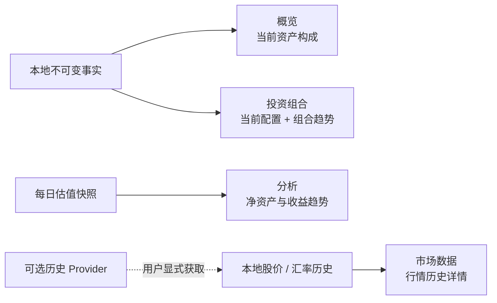

# 可视化分析与市场历史方案

- Owner: Product / Design / Analytics
- Status: **Planned**
- Date: 2026-09-01
- Baseline: Nestworth-go `0.2.1`、schema v9、当前 Wails v3 + React 界面
- Scope: 概览、投资组合、分析、市场数据中的图表与本地行情历史
- Non-goal: 本文不代表功能已实现，也不授权页面加载时自动访问外部服务

## 1. 目标与结论

本方案让用户回答四类不同问题：

1. **概览：** 我现在的钱主要放在哪里，负债主要是什么？
2. **投资组合：** 当前持仓如何配置，组合总值如何变化？
3. **分析：** 净资产、资产、负债、已实现收益和分红在一段时间内怎样变化？
4. **市场数据：** 本地保存过哪些股价和汇率，这些观测来自哪里、何时有效？

建议分两层交付：

- 第一层只消费本地已有的估值、快照、股价和汇率事实，页面打开时零网络请求。
- 第二层再增加显式的“获取历史数据”动作；提供方必须声明历史能力，获取结果仍先落成本地不可变事实，再供图表读取。

图表类型保持克制：

| 数据关系 | 默认图表 | 不使用的方式 |
| --- | --- | --- |
| 当前构成 | 环形图 + 排序明细 | 用折线图表达占比 |
| 时间变化 | 折线图 | 用饼图表达历史 |
| 分类比较 | 横向条形图 | 类别过多时堆叠多个饼图 |
| 正负收益 | 以零为轴的条形图 | 把负值塞进饼图 |

## 2. 当前基础与缺口

当前代码已经具备以下基础，不需要从头建立图表体系：

- `EChart` 已按需注册折线图、条形图、饼图、图例、Tooltip 和缩放组件，并支持无障碍摘要与数据表。
- 分析页已有净资产趋势折线图，数据来自每日估值快照；范围已有 `30d`、`1y`、`all`。
- 概览已有资产类型、负债类型、机构、账户类型、成员和分组的后端汇总结果，但目前只显示列表。
- 投资组合已有按投资标的类型的当前配置和占比，但目前只显示列表。
- SQLite 已以追加方式保存 `instrument_quotes` 和 `fx_quotes`。
- Quote Wails 服务已经暴露 `InstrumentQuoteHistory` 和 `FXQuoteHistory`；它们只读本地数据，不会调用网络。
- 当前 Yahoo 与 Frankfurter 适配器只实现最新报价；虽然能力模型预留了 `DailyHistory`，Provider 接口还没有历史序列方法，生产 Provider 也未声明该能力。

主要缺口是：

- Portfolio、Overview 尚未复用 `EChart`。
- Analytics 只有净资产单折线，收益与分红仍是分组列表。
- 前端没有股价/汇率历史查询 hooks，也没有历史详情界面。
- 现有 FX 历史接口一次返回全部币对，缺少面向某一币对、方向和范围的稳定读模型。
- 组合趋势尚无独立应用层读模型。

## 3. 页面信息架构



### 3.1 概览

概览只放“一眼读懂当前状态”的图表，不承担深度分析。

建议布局：

1. 保留当前净资产、资产、负债总额卡片。
2. 在总额卡片下增加“资产构成”卡片：
   - 左侧环形图，使用 `assetsByType`。
   - 中心显示已估值资产总额。
   - 右侧保留排序后的分类、金额、占比列表。
3. 有负债时增加“负债构成”卡片，使用独立环形图或横向条形图；不把资产与负债混入同一个饼图。
4. 机构、成员、分组仍以列表为主，不默认各放一个饼图，避免概览变成图表墙。

交互规则：

- 点击扇区只高亮对应列表项；第一阶段不跳转。
- 分类超过 6 个时显示前 5 个，其余合并为“其他”；展开数据表仍显示全部分类。
- 缺少估值的成分不按零计入。图表中心和说明明确标记“已估值小计”，并显示缺失数量。

### 3.2 投资组合

投资组合回答“现在持有什么”和“组合价值怎样变化”。

建议顺序：

1. **组合总值卡片：** 当前已估值小计、完整性、缺失行情数量。
2. **配置环形图：** 默认按标的类型，数据使用现有 `byInstrumentType`。
3. **配置维度切换：** 后续可扩展为“标的类型 / 币种 / 国家地区 / 账户”，所有维度必须来自同一后端 Portfolio 读模型。
4. **组合价值趋势：** `30 天 / 1 年 / 全部`折线图，按每日快照中带 `instrumentId` 的已估值项目汇总。
5. **账户与持仓明细：** 保留当前列表，作为图表的精确数据和下钻入口。

组合趋势的新读模型建议为：

```text
PortfolioTrendDTO
  range
  currency
  points[]
    localDate
    valuedSubtotal
    complete
    missingCount
```

`valuedSubtotal` 必须由 Go 从历史快照项目计算，前端不能根据当前持仓倒推历史。当天点使用当前 Portfolio 权威读模型；闭市日使用已保存每日快照。

### 3.3 分析

分析页保留一个全局时间范围，并把现有列表升级为“图表 + 可展开明细”。

建议内容：

1. **财富趋势折线图：** 在现有净资产折线上增加资产、负债两条可开关序列。
   - 净资产：主色实线。
   - 资产：正向辅助色。
   - 负债：按绝对金额显示，使用警示色；Tooltip 明确写“负债”。
2. **期间结果摘要：** 起点、终点、净变化、已实现收益、分红收入。
3. **已实现收益条形图：** 可切换“按标的 / 按账户”，以零为轴，盈利和亏损使用语义色。
4. **分红收入条形图：** 默认按标的排序；无负值，不需要饼图。
5. **当前资产构成：** 若需要在分析页保留构成视角，复用 Overview 的环形图数据，不在前端重新聚合。

每日快照已经保存 `assets_amount`、`liabilities_amount` 和 `net_worth_amount`。建议扩展现有趋势 DTO，而不是新增第二套财富趋势接口：

```text
NetWorthTrendPointDTO
  localDate
  netWorth
  assets
  liabilities
  complete
  missingCount
```

### 3.4 市场数据：股价与汇率历史

每个已保存标的和汇率对增加“查看历史”入口，打开右侧 Sheet 或页面内详情区。

#### 股价历史

- 标题：标的名称、证券代码、报价货币、当前来源。
- 主图：单位价格折线图。
- 点信息：价格、`quotedAt`、来源类型、来源名称、是否延迟。
- 筛选：`30 天 / 1 年 / 全部`、全部来源 / 手工 / 提供方。
- 下方提供完整数据表，按观测时间倒序。

#### 汇率历史

- 标题固定显示用户选择的方向，例如 `USD/CNY`。
- 主图：`1 USD = x CNY` 的汇率折线图。
- 提供“交换方向”按钮；倒数计算必须由 Go 返回，前端不得自行计算。
- 筛选与股价历史一致，并显示来源、延迟状态和观测时间。

#### 本地序列规则

- 第一阶段默认只显示本地保存事实。
- 同一时间存在多条事实时，按 `quotedAt`、`createdAt`、ID 做确定性选择；数据表仍保留全部事实。
- 不跨缺失日期插值，不把缺失日补成零，折线保持断点。
- 30 天可显示原始观测；1 年和全部范围由后端按当地日期取每日最后一条，避免前端处理大量点。
- 当前来源与历史来源可能不同；图例和 Tooltip 必须展示来源，不能把来源切换后的折线伪装成单一 Provider 的连续历史。

面向前端的接口建议收窄为：

```text
InstrumentQuoteSeries(instrumentId, range, sourceFilter)
FXQuoteSeries(currencyA, currencyB, range, sourceFilter)

QuoteSeriesDTO
  range
  displayCurrency / pair direction
  points[]
    quotedAt
    value
    sourceKind
    sourceKey
    delayed
```

现有无参数历史接口可保留用于兼容和测试；图表使用新的有界读模型。

## 4. 外部历史 API 策略

外部历史不是第一阶段的前置条件。推荐在本地图表稳定后单独实现。

### 4.1 用户动作

- 页面只读本地历史，绝不因展开图表自动联网。
- 仅在 Provider 声明支持时显示“获取历史数据”。
- 用户选择范围后显式发起请求；结果显示获取、跳过、失败和限流数量。
- 获取完成后重新读取本地序列，不直接把 Provider 响应塞给图表。

### 4.2 Provider 合同

当前单一 `DailyHistory` 能力过于模糊，建议拆成：

```text
DailyInstrumentHistory
DailyFXHistory
```

并增加独立端口方法，例如：

```text
InstrumentHistory(ctx, identity, from, to)
FXHistory(ctx, identity, from, to)
```

Provider 返回值必须经过现有的币种、价格、汇率、时间和响应大小校验。网络适配器不直接写数据库。

### 4.3 写入与去重

- 每个外部点转成现有 `InstrumentQuote` 或 `FXQuote`，继续使用追加写入。
- 以目标、来源、`quotedAt` 和规范化值做幂等去重。
- 已有手工事实不覆盖，Provider 事实也不修改历史手工事实。
- 一个批次先完成验证，再在一个事务中写入；批次部分失败时不留下半批数据。
- 请求有明确最大日期范围、响应大小、并发数和超时；遵守现有限流错误分类。

Yahoo 与 Frankfurter 当前都只声明最新值能力。因此历史 API 属于 Provider 能力扩展，不能仅凭现有 URL 形态假设已支持。

## 5. 共用图表与交互合同

### 5.1 视觉

- 继续使用现有 ECharts tree-shaken 入口，不再引入第二套图表库。
- 使用现有主题 token；资产、负债、盈利、亏损颜色必须保持语义一致。
- 环形图中心只放一个主数字和一行范围说明，不塞多项指标。
- 默认高度：概览 280px，Portfolio/Analytics 320px，历史详情 300px。
- 小屏转为图表在上、图例在下；不依赖横向滚动才能看到关键数字。

### 5.2 无障碍

- 每张图都有本地化 `aria-label` 和一句结论型摘要。
- 每张图都提供“查看数据表”，不能只让鼠标用户通过 Tooltip 获取精确值。
- 图例、范围、维度切换必须可键盘操作并有可见焦点。
- 颜色不是唯一编码：Tooltip、图例和数据表同时写出名称、数值和状态。
- 动画尊重 `prefers-reduced-motion`。

### 5.3 数字与完整性

- 所有权威金额、占比、倒数汇率、趋势点和分类汇总由 Go 返回。
- DTO 中继续使用规范十进制字符串；ECharts 所需 Number 转换仅用于绘制位置，Tooltip 和数据表使用原始字符串格式化。
- 饼图只接收正数分类；零值隐藏，负值改用条形图。
- 不完整点保留日期但值为空，折线断开；不得连接缺失值。
- 饼图分母是“已估值小计”，不是假设完整的总资产。

## 6. 页面状态

| 状态 | 设计 |
| --- | --- |
| 无账户/无持仓 | 保留当前 EmptyState，并给出创建账户或持仓的动作 |
| 只有一个趋势点 | 显示“历史数据不足”，同时展示该点的数据表 |
| 有事实但不在所选范围 | 显示范围为空，并提供“全部”快捷动作 |
| 部分估值 | 图表展示可用部分，卡片标记“部分”，列出缺失数量 |
| 本地无报价历史 | 显示“还没有本地历史”；手工报价和显式刷新仍可用 |
| Provider 不支持历史 | 不显示获取按钮；本地图表正常工作 |
| Provider 获取失败 | 保留现有本地图表，在独立区域显示可重试错误 |
| 历史重建中 | 保留旧图或骨架，明确显示正在重建，不显示伪造的零点 |

## 7. 实施阶段

### Phase 1 — 共用图表语义与当前构成

- 扩展 `EChart` 支持多序列数据表、统一 Tooltip、主题色和 reduced-motion。
- Overview 增加资产构成环形图；有负债时增加负债构成图。
- Portfolio 把现有类型配置列表升级为环形图 + 原列表。
- 不增加新数据库或网络能力。

### Phase 2 — 本地股价与汇率历史

- 增加有界、定向的 Quote Series 应用层读模型和 Wails DTO。
- 增加前端 query keys/hooks。
- Market Data 增加标的和汇率历史 Sheet、折线图和数据表。
- 只读本地 `instrument_quotes` / `fx_quotes`。

### Phase 3 — Portfolio 与 Analytics 趋势

- 扩展财富趋势点，返回资产、负债、净资产和缺失数量。
- 新增 Portfolio Trend，只汇总历史快照中带标的的项目。
- Analytics 增加多序列折线、收益条形图和分红条形图。
- Portfolio 增加组合价值折线图。

### Phase 4 — 可选 Provider 历史导入

- 拆分历史能力声明并扩展 Provider 端口。
- 实现显式获取、范围限制、批量验证、事务写入和幂等去重。
- Provider 不支持时保持本地模式，不降级其他页面。

## 8. 验收标准

### 产品验收

- Overview 能用一张构成图回答“资产主要在哪里”，且缺失值不会被当成零。
- Portfolio 同时提供当前配置和组合价值趋势，现金不会误计入组合。
- Analytics 的资产、负债、净资产、收益和分红图表与后端读模型一致。
- 任一标的或已保存币对都能查看本地历史；无本地事实时状态明确。
- 关闭网络或 Provider 不可用时，本地图表仍可查看。
- 页面加载不产生历史 Provider 请求。

### 工程验收

- Go 单元测试覆盖范围裁剪、每日取点、方向换算、缺失点和确定性排序。
- Wails 测试覆盖 DTO 的规范十进制字符串、来源、延迟和完整性字段。
- 前端测试覆盖 loading / empty / partial / error、范围切换和数据表。
- 键盘测试覆盖图例、范围、维度、展开数据表和历史 Sheet。
- 图表聚合不在 React 中重新实现；前端只完成渲染所需的 Number 投影。
- `go test ./...`、前端测试、typecheck、lint 和 `git diff --check` 通过。

## 9. 明确不做

- 不做实时行情、WebSocket 或后台静默轮询。
- 不在图表中预测未来价格、收益或净资产。
- 不把缺失数据插值为“估计值”。
- 不在第一阶段引入 K 线、成交量、技术指标或交易信号。
- 不让图表绕过现有本地优先、显式刷新和 Provider 可替换边界。
- 不因为增加图表而改变历史、估值、成本、收益或 Portfolio 纳入规则。

## 10. 推荐决策

开始实现前建议直接采用以下默认值，减少后续分叉：

1. 首版先完成本地历史，不等待外部历史 API。
2. Overview 只默认显示资产构成；负债为零时不显示空负债图。
3. Portfolio 默认按标的类型配置，其他维度作为后续切换项。
4. Analytics 使用一个全局范围控制，初始为 30 天。
5. 折线缺失点断开，饼图分母使用已估值小计。
6. Provider 历史始终由用户显式获取并先写本地，再由图表读取。
