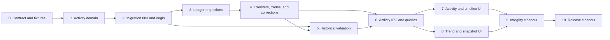

# v0.1.3 Implementation Plan

> **Archive notice:** Inherited unchanged from the Rust/Tauri repository. It has
> not been corrected or validated for Nestworth-go and is not current evidence.

> **Migration status:** Historical implementation plan copied from the previous implementation line. Re-plan its phases in the current Go + Fyne architecture before execution.

## Execution Contract

This plan turns the [v0.1.3 release contract](v0.1.3.md) and [technical design](v0.1.3-technical-design.md) into reviewable implementation phases.

**Status:** Feature implementation is development-complete and this closeout records implemented truth. Linux Phase 10 closeout synchronized versions to `0.1.3` and re-ran automated evidence. Named macOS distribution checks remain. The product is not `Released`. No phase is implemented merely because an earlier release contains a similarly named observation or command.

Execute phases in dependency order. A phase is complete only when its domain, migration, transaction, IPC, frontend, localization, compatibility, and documentation responsibilities are proven by the normal repository gate.

Do not run Tauri development or release bundles against the only copy of real financial data. Migration and smoke tests use committed sanitized fixtures or explicit isolated application-data directories.

## Dependency Flow

## Phase 0 — Contract, Baseline, and Fixtures

### Deliverables

- Approve the release contract, technical design, Activity taxonomy, timezone contract, and v0.1.4 foundation.
- Freeze migration `002`, current generated bindings, current Overview/Portfolio golden values, and current command allowlist as the compatibility baseline.
- Add sanitized v0.1.2 fixtures containing:
  - Balance, Manual Value, liability, and Holdings Accounts
  - Multiple Members and exact Ownership
  - Active and archived Accounts/Holdings/Institutions/Groups
  - Multiple Account Value and Account Cash observations
  - Instruments, Manual/provider quote preferences, Instrument Quotes, and FX Quotes
  - The `62190 CNY` portfolio scenario
- Define exact origin baseline and Activity golden fixtures with no real personal data.
- Define a DST-capable History Origin timezone fixture and a UTC fallback fixture.
- Record expected query counts for current Overview, Portfolio, Account detail, and new ledger/history reads.

### Required decisions

- Confirm raw legs remain internal and every user command uses a tagged kind-specific input.
- Confirm settlement currency equals Instrument quote currency in v0.1.3.
- Confirm snapshots are append-only revisions and closed-day only.
- Confirm future/pending Activities remain deferred.
- Confirm no live provider is selected or required.

### Exit checks

- No open decision can change migration shape, Activity correction semantics, History Origin, historical cutoff, or transfer/trade invariants.
- Current `bun run check` and `git diff --check` pass before migration work.
- Fixtures contain no credentials, filesystem paths, or personal financial data.

## Phase 1 — Activity Domain and Time

### Deliverables

- Add typed UUID v7 IDs for Activity, leg, origin, state observation, Quantity observation, and snapshot entities.
- Implement closed enums for Activity kind, leg role, component kind, direction, income kind, fee kind, and derived classification.
- Implement kind-specific input structs and one validated internal Activity/leg representation.
- Implement History Origin timezone parsing and local date/time to UTC resolution.
- Implement checked leg application and non-negative resulting-state rules.
- Require positive persisted leg magnitudes and reject no-change Activities.
- Implement transfer, trade, debt, fee, adjustment, and manual-valuation domain validators.
- Implement exact reversal-leg construction from persisted Activity facts.

### Required tests

- ID type separation and UUID v7 generation.
- Enum parsing and unknown-value rejection.
- Same-currency transfer exact equality.
- Cross-currency transfer direction, rate, one-time Money rounding, and mismatch rejection.
- Position transfer same-Instrument and exact-Quantity rules.
- Buy/Sell gross amount, settlement currency, explicit fee, zero trade Quantity, insufficient state, and overflow.
- Debt Draw/Payment principal and fee separation.
- Absolute adjustment and valuation targets derive exactly one additive increase/decrease leg; no absolute-set leg is persisted.
- Zero-state component creation writes no Activity; unchanged adjustment and valuation targets are rejected.
- Derived classification cannot be caller-controlled.
- DST nonexistent and ambiguous local time behavior.
- Before-origin, future, malformed, and deterministic equal-time ordering.
- Reversal produces exact inverse facts without binary floating point.

### Exit checks

- Domain code has no SQL, Tauri, React, provider, or filesystem dependency.
- No persisted financial fact uses `f32`, `f64`, SQLite `REAL`, or JavaScript `number`.
- Rust unit tests, formatting, and Clippy pass.

## Phase 2 — Migration 003, Repositories, and History Origin

### Deliverables

- Add `003_activity_history.sql` with all approved tables, nullable Activity references, indexes, constraints, and foreign keys.
- Add repositories for origins, Activities/legs, projection observations, effective-dated state, preferences, snapshots, items, and dirty state.
- Add post-migration History Origin initialization before runtime readiness.
- Capture v0.1.2 current state, exact Ownership, relevant archive/inclusion metadata, Holding Quantity, cash, and preferences once.
- Create an empty origin atomically during fresh onboarding.
- Block incomplete or failed origin initialization with a stable error.
- Preserve the existing pre-migration snapshot and unsupported-future-version state machine.

### Required tests

- Fresh database reaches migration version 3 once.
- Sanitized v0.1.1 and v0.1.2 fixtures migrate to version 3.
- Every old ID, observation, reference, archive state, latest current value, Overview total, and Portfolio total is unchanged.
- Migrated current Holding Quantity appears exactly once in origin baseline and zero times in Activities.
- Origin captures all baseline component and Ownership rows in one transaction.
- Origin initialization failure exposes no partial origin and blocks Activity commands.
- Reopen is idempotent and creates no duplicate origin or baseline row.
- Empty database defers origin to onboarding; onboarding creates it atomically.
- Resolved host timezone is confirmed at origin creation; unresolved host timezone records UTC as unconfirmed and blocks Activity/snapshot writes.
- Timezone confirmation accepts UTC or one valid IANA replacement only before the first Activity or snapshot, recomputes the origin local date, and is immutable afterward.
- Future migration version 4 remains byte-for-byte unchanged and performs no origin or snapshot write.
- Pre-migration snapshot includes WAL/SHM and still blocks migration on copy failure.
- `foreign_key_check` and `integrity_check` pass.
- Repository ordering and cursor indexes match the contract.

### Exit checks

- Migration contains no trigger, generic financial JSON, or rewrite of v0.1.2 business facts.
- Physical schema is documented without copying full SQL into prose.
- Migration and origin tests run under `bun run rust:test`.

## Phase 3 — Ledger Core and Current Projections

### Deliverables

- Implement ActivityService transaction scaffolding and endpoint locking/loading.
- Implement Opening, Balance Adjustment, Position Adjustment, Deposit, Withdrawal, Income, Fee, Debt Adjustment, and Manual Valuation.
- Update post-origin Balance and Manual Value Account creation so positive initial state, Account, Activity-linked initial projection, state observation, and explicitly classified Opening Adjustment commit atomically; zero-state creation writes no Activity and may be followed by a Deposit for a genuine external contribution.
- Append Account Value, Account Cash, and Holding Quantity projections with Activity references.
- Keep `holdings.quantity` synchronized with latest Quantity observation for v0.1.2 compatibility.
- Route post-origin user-facing balance, cash, valuation, and Quantity mutations through ActivityService.
- Split Holding metadata update from Quantity mutation.
- Create a Holding plus Activity-linked Quantity observation and Opening Adjustment atomically when it starts positive; zero-Quantity creation writes no Activity.
- Mark the earliest affected snapshot date dirty in the same transaction.

### Required tests

- Every accepted Activity inserts header, exact legs, projections, and dirty state atomically.
- Failure at every persistence step rolls back all rows and timestamps.
- Unknown, wrong-Household, archived, wrong-TrackingMode, and invalid endpoint cases write nothing.
- Derived increase/decrease legs for absolute adjustment targets cannot produce negative Account, cash, liability, or Quantity state.
- Concurrent operations serialize and the second validates against the first committed result.
- Current Account detail, Overview, and Portfolio read the same resulting state as before.
- Direct post-origin Quantity or value mutation without Activity is rejected.
- Legacy observations remain `activity_id = NULL` and resolve correctly.
- Activity and projection decimal values retain canonical strings and full checked precision.

### Exit checks

- No current-state financial mutation can bypass ledger history through a public command.
- Existing current ValuationService output remains authoritative and unchanged for equivalent state.

## Phase 4 — Transfers, Trades, Debt Principal, and Corrections

### Deliverables

- Implement same-currency and explicit cross-currency cash Transfer.
- Implement exact same-Instrument position Transfer.
- Implement Buy and Sell with settlement cash, Quantity, gross amount, and explicit fee.
- Implement Debt Draw and Debt Payment with optional paired cash endpoint and explicit fee.
- Implement `reverse_activity` and atomic `correct_activity`.
- Preserve and expose original/reversal/replacement links.
- Reject second reversal and correction of a non-current correction-chain node.

### Required tests

- Golden `10,000 -> 7,000 + 3,000` internal transfer leaves net worth and external flow unchanged.
- Same-currency amount mismatch writes nothing.
- Cross-currency transfer retains both native amounts and a Rust-derived FxRate.
- Cross-currency conversion spread is computed against market FX at effective time, or marked unavailable when no quote exists.
- Position Transfer keeps total Quantity and portfolio value unchanged.
- Golden `2 × 100 USD + 5 USD fee` Buy produces `795 USD` cash, Quantity `2`, and explicit Fee `5`.
- Sell cannot exceed Quantity; Buy and fees cannot exceed cash.
- Buy/Sell principal is not external flow.
- Debt principal payment is separated from interest/fee.
- Reversal exactly undoes every supported Activity shape when current state permits.
- Correction writes reversal and replacement once or nothing.
- Correction chain remains readable after Account, Holding, or Instrument archive.
- Backdated correction invalidates the correct earliest local day.
- Concurrent reversal attempts permit exactly one winner.

### Exit checks

- Internal movement never appears as external flow in backend DTOs.
- No frontend code constructs legs, gross amount, resulting state, or reversal facts.
- Trade facts required by v0.1.4 are durable and queryable.

## Phase 5 — Effective-Dated State and Historical Valuation

### Deliverables

- Append Account financial-state/Ownership observations for relevant updates, archive, and restore.
- Append Holding active-state and Instrument/FX preference observations.
- Implement reconstruction from History Origin plus ordered Activities and effective-dated state.
- Implement historical Instrument Quote and FX Quote selection with cutoff enforcement.
- Implement HistoricalValuationService with the same Money, liability, Ownership, inclusion, archive, and incomplete rules as current valuation.
- Implement closed-day cutoff conversion in the immutable History Origin timezone.
- Add exact comparison helpers between current ValuationService and same-cutoff historical state.

### Required tests

- No quote with `quoted_at` after cutoff can be selected.
- Backdated quote is selected only after its timestamp and wins by quoted/created/ID order.
- Effective Manual/provider preference is used for the target day.
- Direct, inverse, and identity FX preserve existing rules.
- Origin Quantity remains opening state and never becomes a trade.
- Account archive, restore, inclusion, Category sign, Ownership, Institution, and Group use the effective state for that day.
- Missing quote excludes only its component and marks all parent results incomplete.
- Full precision is retained through historical aggregation; Money rounds once at boundaries.
- Reconstruction starts at origin and rejects pre-origin trend requests.
- State at the current instant agrees exactly with current ValuationService for the same read snapshot.
- DST transition days use the correct exclusive next-midnight UTC cutoff.

### Exit checks

- Historical valuation has no dependency on current frontend state or provider availability.
- No reconstruction path starts from current totals and subtracts guessed changes.

## Phase 6 — Snapshot Revisions, Queries, and IPC

### Deliverables

- Implement dirty-range state and `min(existing, affected)` invalidation.
- Implement bounded, cancellable closed-day snapshot rebuild.
- Persist append-only snapshot headers and component items with quote/FX provenance.
- Preserve old revisions and select the latest deterministically.
- Implement cursor-paginated Activity list and filters.
- Implement side-effect-free `preview_activity` with the same domain validation and derived effects as posting, while submit always revalidates against current state.
- Implement Activity detail and correction chain.
- Implement Account timeline query.
- Implement History status and net-worth trend query with current live point.
- Add thin Tauri commands in `ipc.rs`, update frozen allowlist, and regenerate bindings.

### Required tests

- Snapshot totals, liabilities, coverage, and incomplete diagnostics match historical valuation.
- Missing items remain explicit and never appear as zero rows.
- Rebuild appends a new revision and never mutates or deletes the previous one.
- Activity, quote, preference, correction, Account-state, and archive mutations set the correct dirty date.
- Rebuild processes at most 366 days and leaves the earliest unprocessed day dirty after cancellation or failure.
- Snapshot calculation holds no long write transaction.
- Ordinary current reads and bootstrap do not rebuild history or call providers.
- Activity cursor has no gaps or duplicates under equal effective times and concurrent inserts.
- Filters enforce same-Household references and bounded page size.
- Account timeline merges origin, Activities, observations, and state changes deterministically without N+1 queries.
- Generated bindings contain the approved union DTOs and command set only.
- New errors expose no SQL, financial values, notes, symbols, or paths.

### Exit checks

- `bun run ipc:generate` and `bun run ipc:check` pass with no manual generated-file edit.
- Query-count and consistent-snapshot tests cover list, detail, timeline, trend, and rebuild paths.

## Phase 7 — Activity and Account Timeline UI

### Deliverables

- Add `/activity` as a lazy top-level route and navigation destination.
- Implement URL-backed Account, Instrument, kind, classification, date-range, and cursor filters.
- Implement type-specific Activity forms and Rust-produced preview.
- Implement Activity detail, reversal confirmation, and correction flow.
- Add Account Timeline to Account detail.
- Clearly label History Origin, legacy observation, reversed, reversal, and corrected records.
- Add English and Simplified Chinese strings.

### Required tests

- Each Activity kind submits its tagged input without raw legs or calculated totals.
- Double submit is disabled; input survives validation or command failure.
- Transfer endpoint/currency changes invalidate stale preview before posting.
- Reversal and correction require explicit confirmation and restore focus on cancellation.
- URL filters survive refresh and back/forward navigation.
- Cursor pagination appends or replaces deterministically according to UI contract.
- Timeline uses backend order and classifications without inference.
- Loading, empty, error, pending, legacy-origin, reversed, and archived-reference states are accessible.
- Keyboard-only creation, filtering, reversal, correction, and timeline navigation pass.
- Locale key sets remain identical.

### Exit checks

- A manual offline user can complete every non-history acceptance Activity.
- Frontend source contains no authoritative balance, trade, transfer, fee, or external-flow formula.

## Phase 8 — Net-Worth Trend and Snapshot Experience

### Deliverables

- Add one-month, three-month, one-year, and all-history ranges to Overview.
- Render backend daily points and live current point.
- Distinguish complete, incomplete, dirty, rebuilding, and unavailable dates.
- Add accessible table/list representation for every chart value.
- Add rebuild progress, bounded continuation, cancellation, and retry.
- Keep current Overview available when historical data is dirty or incomplete.

### Required tests

- Chart and table use exact Money strings returned by Rust.
- Presentation coordinate scaling cannot change displayed financial values.
- Incomplete points expose missing counts and are not connected as complete data without visual distinction.
- Pre-origin ranges explain that history is unavailable instead of displaying zero.
- Dirty range prompts rebuild but does not trigger provider/network work.
- Cancellation preserves completed revisions and correct dirty state.
- Live current point matches current Overview net worth.
- Keyboard navigation and screen-reader labels expose date, value, currency, and completeness.
- Empty and one-point histories render without chart errors.

### Exit checks

- No return, gain, benchmark, or attribution claim appears in v0.1.3 UI.
- Main bundle size remains controlled through route-level lazy loading.

## Phase 9 — Integrity, Privacy, and Compatibility Closeout

### Deliverables

- Re-audit every Activity shape, transaction boundary, correction chain, projection equality, origin invariant, state observation, quote cutoff, dirty range, snapshot revision, and query bound.
- Re-run all v0.1.1 and v0.1.2 fixtures and golden totals.
- Verify old public mutation commands cannot bypass Activity after origin.
- Audit frozen IPC allowlist, capabilities, CSP, plugins, dependencies, logs, and error shielding.
- Verify `delete_all_data` removes migration snapshots and schema-3 database artifacts.
- Update canonical domain, data/IPC, system, engineering, roadmap, README, changelog, and release documents to implemented truth.

### Required tests

- Unsupported migration version 4 receives zero application writes from bootstrap and every Activity/history command.
- Activity notes, amounts, quantities, Account names, Instrument symbols, quote values, and raw legs never appear in logs.
- No frontend HTTP/filesystem capability or provider call is added.
- Database reset safely closes and deletes schema-3 database, sidecars, and migration snapshots.
- `foreign_key_check`, `integrity_check`, generated binding drift, locale drift, and documentation links pass.
- All full-suite test counts and clean-machine evidence are recorded.

### Exit checks

- `bun run check` and `git diff --check` pass.
- Every release criterion has code/test evidence or one named manual macOS check.
- No unresolved discrepancy remains between current ValuationService and historical current-point valuation.

## Phase 10 — Release Closeout

### Deliverables

- Exercise v0.1.2-to-v0.1.3 migration on an isolated copy and verify origin readback.
- Exercise origin, every Activity kind, reversal/correction, timeline, backdated quote, incomplete snapshot, rebuild, and trend on isolated data.
- Exercise offline launch and all manual workflows with production providers unconfigured.
- Complete keyboard-only and VoiceOver smoke tests.
- Build and verify arm64 `.app` and `.dmg` with version and minimum-macOS metadata.
- Apply the chosen signing/notarization policy; unsigned artifacts remain controlled-test only.
- Finalize version synchronization, changelog date, annotated tag, checksums, and exact artifact retention.

### Exit checks

- Release PR is approved and backed by green CI or recorded clean-machine evidence.
- The exact tested artifacts are the artifacts retained or published.
- No real financial database was the only migration or smoke-test copy.
- v0.1.4 prerequisites and unknown-basis limitations are documented for the next design cycle.

### Linux closeout recorded

Completed in this Cloud Agent environment:

- Synchronized package, Cargo, lockfile, and Tauri versions to `0.1.3`; `bun run version:check` passes
- Changelog remains `## [0.1.3] - Unreleased` with no fake publish date
- README and engineering-guide examples use `0.1.3` and `Nestworth_0.1.3_aarch64.dmg`
- Re-ran isolated automated evidence: v0.1.2 fixture migrate plus origin, golden `62190`/`63190`, Activity kinds, future-version zero-write
- Recorded v0.1.4 prerequisites: unknown-basis origin/adjustment; do not manufacture lots from v0.1.2 Holding Quantity

Remaining named macOS checks (not executed here):

- Isolated-data application launch with production providers unconfigured
- Keyboard-only smoke of Activity, timeline, reversal/correction, and trend workflows
- VoiceOver smoke testing
- arm64 `.app` and `.dmg` build with version and minimum-macOS metadata
- Chosen signing/notarization policy; unsigned artifacts remain controlled-test only
- Annotated tag, checksums, artifact retention, and GitHub release

The product is not `Released`. No git tag or GitHub release was created.

## Phase Status Table

| Phase | Deliverable | Status |
| --- | --- | --- |
| 0 | Contract, baseline, and fixtures | `Implemented` |
| 1 | Activity domain and time | `Implemented` |
| 2 | Migration 003, repositories, and History Origin | `Implemented` |
| 3 | Ledger core and current projections | `Implemented` |
| 4 | Transfers, trades, debt principal, and corrections | `Implemented` |
| 5 | Effective-dated state and historical valuation | `Implemented` |
| 6 | Snapshot revisions, queries, and IPC | `Implemented` |
| 7 | Activity and Account Timeline UI | `Implemented` |
| 8 | Net-worth trend and snapshot experience | `Implemented` |
| 9 | Integrity, privacy, and compatibility closeout | `Implemented` |
| 10 | Release closeout | `Implemented` |

## Agent Handoff Rules

At the start of each phase, the implementing agent must:

1. Read all three v0.1.3 documents and the canonical document for the layer being changed.
2. Inspect current code, migration, fixtures, tests, generated bindings, and worktree state instead of assuming planned names exist.
3. State the phase boundary and avoid implementing later analytics, automation, provider, import, or performance scope.
4. Preserve unrelated worktree changes and use only isolated or sanitized data.
5. Keep Activity commands in `ipc.rs`, financial calculations in Rust, and generated bindings machine-owned.

At handoff, report:

- Files and contracts changed
- Migration and transaction evidence
- Tests added and exact command results
- Generated binding, frozen allowlist, locale, and documentation status
- Query-count and compatibility evidence where applicable
- Known limitations and next-phase prerequisites
- Committed/uncommitted state without implying a push, merge, tag, or release
