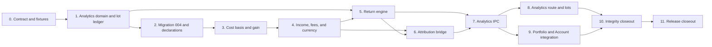

# v0.1.4 Implementation Plan

> **Archive notice:** Inherited unchanged from the Rust/Tauri repository. It has
> not been corrected or validated for Nestworth-go and is not current evidence.

> **Migration status:** Historical implementation plan copied from the previous implementation line. Re-plan its phases in the current Go + Fyne architecture before execution.

## Execution Contract

This plan turns the [v0.1.4 release contract](v0.1.4.md) and [technical design](v0.1.4-technical-design.md) into reviewable implementation phases.

**Status:** Phases 0–10 implemented. Phase 11 is partially implemented: Linux automated closeout is recorded; named macOS distribution checks remain pending. The product is not `Released`. No later phase is implemented merely because an earlier release contains a similarly named service, observation, or command.

Execute phases in dependency order. A phase is complete only when its domain, migration, transaction, IPC, frontend, localization, compatibility, and documentation responsibilities are proven by the normal repository gate.

Do not run Tauri development or release bundles against the only copy of real financial data. Migration and smoke tests use committed sanitized fixtures or explicit isolated application-data directories.

One rule governs every phase: v0.1.4 interprets the ledger and never extends it. If a phase appears to need a new column on `activities` or `activity_legs`, stop and raise it as a contract change rather than adding it.

## Dependency Flow

## Phase 0 — Contract, Baseline, and Fixtures

### Deliverables

- Approve the release contract, technical design, lot policy, unknown-basis policy, return methods, and scope definitions.
- Freeze migration `003`, current generated bindings, current Overview/Portfolio/Activity golden values, and the 71-command allowlist as the [compatibility baseline](v0.1.4-baseline.md).
- Add a sanitized v0.1.3 fixture at `src-tauri/test-fixtures/v0.1.3.sql` containing:
  - A complete History Origin with a confirmed timezone and baseline holdings
  - Posted Activities covering Buy, Sell, Transfer, position Transfer, Income, Fee, Deposit, Withdrawal, and both adjustment kinds
  - One reversal and one complete correction chain
  - At least one unknown-basis position from the origin baseline
  - At least one closed-day snapshot with a later revision, and one incomplete snapshot day
  - Manual Instrument and FX quotes spanning the fixture's date range
- Add `src-tauri/test-fixtures/v0.1.4-analytics-goldens.md` with the exact FIFO, currency-decomposition, unknown-basis, TWR, XIRR, and attribution values.
- Record expected analytics query families and the prohibition on per-lot and per-day queries.

### Required decisions

- Confirm FIFO is the only lot policy and that lots are derived rather than persisted.
- Confirm a reversed Activity and its reversal are both excluded from the lot replay.
- Confirm fees are never capitalized into cost basis.
- Confirm the start-of-day flow assumption for daily TWR.
- Confirm benchmarks are deferred and no provider is selected.

### Exit checks

- No open decision can change migration shape, lot identity, declaration semantics, return method, or scope definitions.
- Current `bun run check` and `git diff --check` pass before any v0.1.4 code.
- Fixtures contain no credentials, filesystem paths, or personal financial data.

## Phase 1 — Analytics Domain, Signed Values, and Lot Ledger

### Deliverables

- Add `SignedMoney` and `ReturnRate` with canonical parsing, formatting, and DTO rounding rules.
- Enable the `rust_decimal` `maths` feature and add checked decimal `powd`, `ln`, and `exp` helpers with explicit overflow handling.
- Add `LotRef` as a tagged origin-item or Activity-leg reference.
- Implement `LotLedger` FIFO replay in `src-tauri/src/domain/lot_ledger.rs` with open lots, consumptions, unexplained disposals, and diagnostics.
- Implement the event mapping table from the technical design, including the reversed-pair exclusion and transfer lot relocation.
- Implement scope membership and scope-relative flow classification as pure domain functions.

### Required tests

- `SignedMoney` and `ReturnRate` parse, round, and reject malformed values; neither accepts an unsigned `Money` string as a balance.
- Signed values never leak into `Money`, `Quantity`, `UnitPrice`, or `FxRate`.
- Golden FIFO scenario produces consumed cost `440`, realized gross `160`, allocated fees `14`, realized net `146`, and one open lot of `2` at cost `240`.
- Replay is deterministic and byte-identical across repeated runs and across shuffled input that resolves to the same order.
- A reversed Buy and its reversal both leave the lot ledger untouched; a correction replacement opens the only lot.
- A position Transfer preserves `LotRef`, cost, acquisition time, and basis status and produces zero gain.
- Origin baseline, Opening Adjustment, and Position Adjustment increases open unknown-basis lots.
- Position Adjustment decrease produces an unexplained disposal and zero realized gain.
- A zero-gross confirmed Buy opens a known-basis lot with cost zero, distinct from unknown basis.
- Consumption order ties break by acquisition time, then opening Activity creation time, then opening leg ID.
- Scope flow classification returns zero for a transfer internal to the scope and a signed flow for a boundary crossing.
- Instrument-scope income and fees attributed by `related_instrument_id` count as return, not flow.
- Quantity remeasurement inside a scope sets `basisComplete = false`.

### Exit checks

- Domain code has no SQL, Tauri, React, provider, or filesystem dependency.
- No persisted or computed financial value uses `f32`, `f64`, SQLite `REAL`, or JavaScript `number`.
- Rust unit tests, formatting, and Clippy pass.

## Phase 2 — Migration 004, Declarations, and Unknown-Basis Identity

### Deliverables

- Add `004_analytics.sql` creating `cost_basis_declarations` with mutually exclusive typed foreign keys, revocation flag, currency check, and selection indexes.
- Add the declarations repository with latest-per-lot selection and Household-scoped listing.
- Implement `declare_lot_cost_basis` and `revoke_lot_cost_basis` service logic with full validation inside `BEGIN IMMEDIATE`.
- Resolve unknown-basis lot identity from the replay so a declaration can only target a real unknown-basis lot.
- Preserve the pre-migration snapshot and unsupported-future-version state machine at version `4`.

### Required tests

- Fresh database reaches migration version `4` once.
- Sanitized v0.1.1, v0.1.2, and v0.1.3 fixtures migrate to version `4` with every ID, observation, Activity, leg, snapshot revision, correction link, archive state, and current total unchanged.
- Migration `004` creates zero declarations and zero Activities.
- v0.1.1 and v0.1.2 golden totals and the v0.1.3 Activity goldens are unchanged after migrating to `4`.
- A declaration writes no Activity, no leg, no projection, no snapshot, and no dirty marker, verified by comparing every affected table before and after.
- Net worth, Overview, Portfolio, and Account detail are byte-identical before and after a declaration.
- A declaration targeting a known-basis lot, a nonexistent reference, another Household, a mismatched Instrument, or a reversed Activity's leg writes nothing.
- A declared cost currency other than the Instrument quote currency is rejected.
- An acquisition date after the lot's ledger acquisition time is rejected; a date before History Origin is accepted.
- Revocation returns the lot to unknown basis and preserves the earlier declaration row.
- Latest-declaration selection is deterministic under equal timestamps.
- Concurrent declarations for the same lot serialize and both rows persist.
- Future migration version `5` remains byte-for-byte unchanged and receives no declaration write.
- `foreign_key_check` and `integrity_check` pass.

### Exit checks

- Migration contains no trigger, no generic financial JSON, and no column added to any v0.1.3 table.
- Declarations are the only new write surface in v0.1.4.
- Migration and declaration tests run under `bun run rust:test`.

## Phase 3 — Cost Basis, Realized Gain, and Unrealized Gain

### Deliverables

- Implement `application::cost_basis_service` combining the replay with effective declarations.
- Implement `application::gain_service` producing realized gross and net gain, unrealized gross gain, and unexplained disposals.
- Implement pro-rata allocation of acquisition and disposal fees across consumptions using full checked precision.
- Implement aggregation at Instrument, Account, Portfolio, and Household scope with `basisComplete`, `inputComplete`, unknown-basis quantity, and unknown-basis value.
- Reuse the existing current `ValuationService` quote selection for unrealized value; add no second quote path.

### Required tests

- The golden FIFO scenario reproduces every contract value exactly, including the `80` unrealized gross gain at a `160` quote.
- Unknown-basis positions are excluded from gain, counted in the unknown-basis totals, and set `basisComplete = false`.
- Declaring a basis for the `3 QQQ` origin position produces `600 USD` unrealized gross gain and flips `basisComplete` to true.
- Revoking that declaration restores the unknown-basis result exactly.
- A disposal consuming a mix of known and unknown lots reports the known portion's gain and marks the aggregate incomplete.
- A missing current quote excludes only its component and never assigns a zero cost or a zero value.
- Fees never appear inside a cost basis and never disappear from fee totals.
- Gross and net gain differ by exactly the allocated fees.
- Aggregates at the four scopes are internally consistent: Instrument sums match Account sums match Portfolio and Household sums for the same lot set.
- Full precision is retained through allocation; rounding happens once at the DTO boundary.

### Exit checks

- No gain path reads or writes current projection state.
- Existing Overview, Portfolio, and Account detail output is byte-identical with and without gain calculation in the same process.

## Phase 4 — Income, Fees, and Currency Decomposition

### Deliverables

- Implement income totals grouped by `income_kind` with Instrument attribution and an explicit unattributed bucket.
- Implement fee totals grouped by `fee_kind` plus a `tradeCommission` bucket for trade fee legs that carry no kind.
- Implement historical acquisition FX selection reusing the existing at-or-before-cutoff quote rule and effective FX preference.
- Implement the exact currency decomposition identity for realized and unrealized gain.
- Implement decomposition availability, marking only the affected lot undecomposed and its parents incomplete.

### Required tests

- The contract's decomposition scenario produces base cost `1300`, base value `2070`, base gain `770`, instrument movement `650`, and currency movement `120`.
- Instrument movement plus currency movement equals base gain exactly for every lot in every fixture, asserted as an identity rather than a tolerance.
- Identity currency produces exactly zero currency movement and requires no FX quote.
- A missing acquisition FX quote marks only that lot undecomposed and never substitutes the most recent rate, one, or a reciprocal.
- A declared lot without an acquisition date is undecomposed; adding one enables decomposition without changing base gain.
- No quote with a timestamp after the acquisition cutoff is selectable.
- Trade fees with no `fee_kind` land in `tradeCommission` and are not dropped.
- Income and fees attributed to an Instrument appear in that Instrument's totals and in the Household totals exactly once.

### Exit checks

- Currency decomposition has no dependency on current frontend state or provider availability.
- No decomposition path reconstructs an input from a rounded DTO string.

## Phase 5 — Return Engine

### Deliverables

- Implement `application::return_service` with daily-linked TWR and XIRR for all four scopes.
- Aggregate scope daily values from `daily_valuation_snapshot_items` using effective-dated scope membership.
- Implement the start-of-day flow assumption, skipped-day rules, and blocking-date reporting.
- Implement annualization with the 365-day minimum.
- Implement the bounded Newton-Raphson solver with bisection fallback, convergence tolerances, and non-convergence reporting.

### Required tests

- The contract's TWR scenario produces day returns of `2%` and `2%` and a cumulative `4.04%`.
- The naive `4.444%` simple change appears in no DTO and no test expectation.
- A period containing a missing or incomplete snapshot day returns unavailable and names the blocking dates.
- A period reaching before the first complete closed-day snapshot returns `ANALYTICS_PERIOD_UNAVAILABLE`.
- The current local day is never included in a TWR period.
- A day with a zero or negative denominator is skipped, counted, and reported rather than treated as zero return.
- Annualization is withheld below 365 days and correct at and above it.
- XIRR of `−100000` at day 0 and `+110000` at day 365 is exactly `0.1`.
- XIRR of `−100000`, `−100000`, and `+230000` at annual intervals converges to `0.096872` at six fractional digits.
- A flow series with no sign change returns `RETURN_NOT_COMPUTABLE`.
- A non-converging series returns `RETURN_NOT_COMPUTABLE` and never the last iterate.
- No solver iteration uses binary floating point, verified by the absence of `f32` and `f64` in the return module.
- Household, Portfolio, Account, and Instrument scopes share one engine and differ only in flow set and value series.
- Instrument-scope return includes attributed dividends and therefore exceeds the price-only return in a fixture that pays one.

### Exit checks

- Return calculation performs no write, no provider call, and no snapshot rebuild.
- Return calculation runs over one consistent read transaction.

## Phase 6 — Net-Worth Attribution Bridge

### Deliverables

- Implement `application::attribution_service` producing the named bridge components and the explicit unexplained residual.
- Implement daily per-component market and currency decomposition for monetary and Holding components.
- Implement conversion-spread aggregation from cross-currency Transfers, reusing the v0.1.3 overlay rule.
- Implement debt principal movement aggregation, netting paired draws and payments.
- Implement bridge availability rules for incomplete endpoints and unconvertible flows.

### Required tests

- The contract's bridge scenario reproduces every component and an unexplained residual of `+100`, summing exactly to `18000`.
- The bridge balances exactly for every fixture period whose endpoints are complete.
- A zero residual is present in the DTO and rendered rather than omitted.
- The residual is never redistributed into a named component.
- A same-day execution price differing from the previous close lands in unexplained and not in instrument movement.
- Monetary remeasurement lands in unexplained; quantity remeasurement lands in unknown-basis flow.
- A paired debt draw nets to zero; an unpaired draw does not.
- Conversion spread matches the v0.1.3 golden `9.43 CNY` loss for the fixture transfer.
- An incomplete endpoint snapshot or an unconvertible flow returns unavailable with blocking reasons and produces no partial bridge.

### Exit checks

- The bridge never forces balance by adjusting a named component.
- Attribution reuses the same scope and flow rules as the return engine with no second implementation.

## Phase 7 — Analytics IPC and Queries

### Deliverables

- Implement the nine analytics commands with tagged scope and period inputs and availability unions.
- Implement `get_analytics_status` covering the usable history range, blocking dates, and unknown-basis counts.
- Implement cursor pagination and bounded page size for lot and declaration lists.
- Add thin Tauri commands in `ipc.rs`, update the frozen allowlist to 80 commands, and regenerate bindings.
- Add the new error codes and extend the forbidden tracing field list with `cost`, `basis`, `gain`, `proceeds`, `return`, and `rate`.
- Register all nine new commands in the `vi.fn()` mock map in `src/test/setup.ts`; existing page tests fail on an undefined command otherwise.

Implement analytics functions as modules of free `pub async fn`s taking `state: &AppState`, with `_in_tx` variants where needed. Do not introduce a service struct; the application layer has none.

### Required tests

- Every read command is provably read-only, verified by comparing every table before and after.
- Generated bindings contain the approved union DTOs and command set only.
- Scope and period inputs enforce same-Household references and bounded page size.
- Availability unions never encode a missing result as zero, null, or an empty string.
- Lot and declaration cursors have no gaps or duplicates under equal timestamps and concurrent declarations.
- Analytics reads add no query inside a loop over lots, Activities, snapshot days, or snapshot items.
- Query-count tests cover status, gain, return, attribution, lot list, and declaration list.
- New errors expose no SQL, cost, gain, rate, quantity, symbol, note, or path.
- Analytics commands write nothing against an unsupported future database.

### Exit checks

- `bun run ipc:generate` and `bun run ipc:check` pass with no manual generated-file edit.
- `bun run rust:test` passes with the updated allowlist and capability tests.

## Phase 8 — Analytics Route, Lots, and Basis Declarations

### Deliverables

- Add `/analytics` as a lazy top-level route and navigation destination, extending the hardcoded `to` union on `NavLink` in `src/components/app-shell.tsx` and adding the `nav` locale key.
- Implement URL-backed scope and period state using the route search validation pattern already used by `/activity`.
- Implement the return, gain, currency-decomposition, and attribution panels with accessible tabular alternatives.
- Implement the lot table and the unknown-basis worklist using the manual URL-driven cursor pattern from `src/features/activity/activity-page.tsx`; `useInfiniteQuery` is not used in this codebase.
- Implement the declaration and revocation forms with explicit confirmation and consequence copy.
- Add an `analytics` top-level locale namespace to both `src/locales/en/common.json` and `src/locales/zh-CN/common.json` covering every label, method name, availability state, error, and empty state.
- Build charts as hand-rolled SVG following `net-worth-trend.tsx` and `net-worth-trend-model.ts`. Do not add a chart dependency.

### Required tests

- Every chart value is also present in an accessible table with the same string.
- Presentation coordinate scaling cannot change a displayed financial value.
- Unavailable results explain the reason and name the blocking dates instead of rendering zero.
- Unknown-basis positions are visible with their exclusion explained.
- The declaration form states that no net worth, quantity, or history changes, and requires confirmation.
- Revocation requires its own confirmation and explains the return to unknown basis.
- Double submit is disabled; input survives validation or command failure.
- URL scope and period survive refresh and back/forward navigation.
- Keyboard-only navigation of every panel, the lot table, the worklist, and both forms passes.
- Locale key sets remain identical between English and Simplified Chinese.
- Frontend source contains no gain, rate, annualization, reciprocal FX, or allocation formula.

### Exit checks

- A manual offline user can inspect every v0.1.4 result and declare a basis without a provider.
- Main bundle size remains controlled through route-level lazy loading.

## Phase 9 — Portfolio, Account, and Overview Integration

### Deliverables

- Add an unrealized gain column and basis-status indicator to the Investments page.
- Add a gain summary and scoped analytics link to Account detail.
- Add an attribution link to the Overview trend for the displayed range.
- Deliberately update the four scope-guard assertions in `src/features/overview/overview-page.test.tsx` that currently require `return`, `gain`, `benchmark`, and `attribution` to be absent. Narrow them rather than deleting them, so Overview still cannot display a return or a benchmark.
- Keep every existing Overview, Portfolio, and Account value unchanged.
- Add the corresponding English and Simplified Chinese strings.

### Required tests

- Overview, Portfolio, and Account detail totals are byte-identical to their v0.1.3 values in every golden fixture.
- The Investments gain column shows unknown-basis positions as unknown rather than zero.
- Links carry the correct scope and period into `/analytics`.
- Loading, empty, error, incomplete, and unknown-basis states are accessible on every integrated surface.
- A declaration invalidates only gain and lot queries. It does not call `invalidateValuation`, and `overview`, `portfolio`, `net-worth-trend`, `history-status`, and `activities` queries are not refetched.
- Overview still displays no return, no benchmark, and no performance claim after the attribution link is added.

### Exit checks

- No integrated page gains an authoritative calculation.
- No existing valuation query result changes shape or value.

## Phase 10 — Integrity, Privacy, and Compatibility Closeout

### Deliverables

- Re-audit lot replay determinism, declaration immutability, gain identities, decomposition identities, return availability, bridge balance, scope consistency, and query bounds.
- Re-run all v0.1.1, v0.1.2, and v0.1.3 fixtures and golden totals.
- Verify no v0.1.4 command can post an Activity, change current state, or mark a snapshot dirty.
- Audit the frozen IPC allowlist, capabilities, CSP, plugins, dependencies, logs, and error shielding.
- Verify `delete_all_data` removes schema-4 database artifacts, sidecars, and `.pre-migrate-*` snapshots.
- Update canonical domain, data/IPC, system, engineering, roadmap, README, changelog, and release documents to implemented truth.

### Required tests

- Unsupported migration version `5` receives zero application writes from bootstrap, Activity/history commands, and every analytics command.
- Cost, basis, gain, proceeds, return, rate, quantity, Account names, Instrument symbols, and notes never appear in logs.
- No frontend HTTP, filesystem, clipboard, shell, or opener capability is added, and no provider call is added.
- Database reset safely closes and deletes the schema-4 database, sidecars, and migration snapshots.
- `foreign_key_check`, `integrity_check`, generated binding drift, locale drift, and documentation links pass.
- Full-suite test counts and clean-machine evidence are recorded.

### Exit checks

- `bun run check` and `git diff --check` pass.
- Every release criterion has code/test evidence or one named manual macOS check.
- No unresolved discrepancy remains between current valuation output and any analytics-derived value for the same read snapshot.

### Linux closeout recorded

Completed in this Cloud Agent environment:

- Package, Cargo, lockfile, and Tauri versions remain `0.1.3`; `bun run version:check` prints `version 0.1.3; Bun 1.3.14`
- Changelog remains `## [0.1.4] - Unreleased` with no fake publish date
- README and engineering-guide examples still use `0.1.3` and `Nestworth_0.1.3_aarch64.dmg`
- `cargo fmt --manifest-path src-tauri/Cargo.toml --all` applied; `cargo fmt ... -- --check` is clean
- `cargo test --manifest-path src-tauri/Cargo.toml --all-targets --target x86_64-unknown-linux-gnu`: `nestworth_lib` `377 passed; 0 failed; 0 ignored`; `nestworth` bin `0` tests
- Isolated fixture re-runs inside that suite: v0.1.1 migrate (`120000` CNY), v0.1.2 schema-2 load (`62190` / `63190`), v0.1.3 schema-3 load plus migrate-to-4 with zero declarations, and `v012_goldens_unchanged_after_migrate_to_4`; `foreign_key_check` / `integrity_check` remain in those fixture tests
- Future migration version `5` receives zero writes from bootstrap, Activity/history commands, and all nine analytics commands (`future_version_5_is_unchanged_and_writes_no_origin_snapshot_or_declaration` plus `assert_activity_history_commands_write_nothing`)
- `delete_all_data` after initialize reports schema version `4`, keeps the found-2 snapshot, requires `cost_basis_declarations`, then removes the schema-4 database, WAL/SHM, `.pre-migrate-2`, and a stray `.pre-migrate-3`
- `cargo clippy --manifest-path src-tauri/Cargo.toml --all-targets --target x86_64-unknown-linux-gnu -- -D warnings` is clean
- `cargo run --manifest-path src-tauri/Cargo.toml --bin export-bindings --features export-bindings --target x86_64-unknown-linux-gnu -- --check` is clean
- `bun run lint` and `bun run typecheck` pass
- `bun run test`: 24 files / 150 tests passed
- `git diff --check` is clean
- `bun run rust:test` / `bun run check` were not executed: they use the default `aarch64-apple-darwin` target on this Linux host

Remaining named macOS checks (not executed here; Phase 11):

- Isolated-data application launch with production providers unconfigured
- Keyboard-only smoke of Analytics, lot table, declaration, attribution, and integrated Overview/Investments/Account workflows
- VoiceOver smoke testing
- arm64 `.app` and `.dmg` build with version and minimum-macOS metadata; versions remain `0.1.3` until Phase 11
- Chosen signing/notarization policy; unsigned artifacts remain controlled-test only
- Package/Cargo/Tauri version bump to `0.1.4`, annotated tag, checksums, artifact retention, and GitHub release

The product is not `Released`. No git tag or GitHub release was created.

## Phase 11 — Release Closeout

### Deliverables

- Exercise v0.1.3-to-v0.1.4 migration on an isolated copy and verify that no ledger, snapshot, or total changed.
- Exercise FIFO gain, unknown-basis declaration and revocation, currency decomposition, TWR, XIRR, and the attribution bridge on isolated data.
- Exercise offline launch and all analytics workflows with production providers unconfigured.
- Complete keyboard-only and VoiceOver smoke tests.
- Synchronize package, Cargo, lockfile, and Tauri versions to `0.1.4` and pass `bun run version:check`.
- Update README and engineering-guide examples to `0.1.4` and `Nestworth_0.1.4_aarch64.dmg`.
- Build and verify arm64 `.app` and `.dmg` with version and minimum-macOS metadata.
- Apply the chosen signing/notarization policy; unsigned artifacts remain controlled-test only.
- Finalize the changelog entry, annotated tag, checksums, and exact artifact retention.

### Exit checks

- Release PR is approved and backed by green CI or recorded clean-machine evidence.
- The exact tested artifacts are the artifacts retained or published.
- No real financial database was the only migration or smoke-test copy.
- v0.1.5 prerequisites are documented, including that a declared basis is not an imported transaction.

### Linux closeout recorded

Completed in this Cloud Agent environment:

- The v0.1.4 closeout synchronized package, Cargo, lockfile, and Tauri versions to `0.1.4`; the next development line is now synchronized to `0.1.5` and passes `bun run version:check`.
- The changelog retains `## [0.1.4] - Unreleased` with no fake publish date; the `0.1.5` development entry is now at the top.
- The v0.1.4 release documents retain the tested `Nestworth_0.1.4_aarch64.dmg` name; the current development-line engineering example uses `Nestworth_0.1.5_aarch64.dmg`.
- Latest frontend evidence: `bun run test` reports 24 files / 155 tests passed. The Rust count and host-target gates in the earlier Linux closeout require revalidation on a machine with the configured target; this environment does not have `x86_64-unknown-linux-gnu` installed.
- Recorded v0.1.5 prerequisites: a declared basis is not an imported transaction; must not backfill acquisition history from a declaration; must not silently reinterpret an existing FIFO result
- `bun run rust:test` / `bun run check` remain pending on the configured macOS or equivalent Rust target host.

Remaining named macOS checks (not executed here):

- Isolated-data application launch with production providers unconfigured
- Keyboard-only smoke of Analytics, lot table, declaration, attribution, and integrated Overview/Investments/Account workflows
- VoiceOver smoke testing
- arm64 `.app` and `.dmg` build with version and minimum-macOS metadata
- Chosen signing/notarization policy; unsigned artifacts remain controlled-test only
- Annotated tag, checksums, artifact retention, and GitHub release

The product is not `Released`. No git tag or GitHub release was created.

## Phase Status Table

| Phase | Deliverable | Status |
| --- | --- | --- |
| 0 | Contract, baseline, and fixtures | `Implemented` |
| 1 | Analytics domain, signed values, and lot ledger | `Implemented` |
| 2 | Migration 004, declarations, and unknown-basis identity | `Implemented` |
| 3 | Cost basis, realized gain, and unrealized gain | `Implemented` |
| 4 | Income, fees, and currency decomposition | `Implemented` |
| 5 | Return engine | `Implemented` |
| 6 | Net-worth attribution bridge | `Implemented` |
| 7 | Analytics IPC and queries | `Implemented` |
| 8 | Analytics route, lots, and basis declarations | `Implemented` |
| 9 | Portfolio, Account, and Overview integration | `Implemented` |
| 10 | Integrity, privacy, and compatibility closeout | `Implemented` |
| 11 | Release closeout | `RC validation pending` |

## Agent Handoff Rules

At the start of each phase, the implementing agent must:

1. Read all four v0.1.4 documents and the canonical document for the layer being changed.
2. Inspect current code, migration, fixtures, tests, generated bindings, and worktree state instead of assuming planned names exist.
3. State the phase boundary and avoid implementing later benchmark, automation, provider, import, or export scope.
4. Preserve unrelated worktree changes and use only isolated or sanitized data.
5. Keep analytics commands in `ipc.rs`, financial calculations in Rust, and generated bindings machine-owned.
6. Refuse to add a column to `activities`, `activity_legs`, or any snapshot table. Raise a contract change instead.
7. Follow the existing application-layer shape: modules of free `pub async fn`s taking `&AppState`, with `_in_tx` variants. Do not introduce a service struct, a chart library, a UI component library, or a query-key factory.

At handoff, report:

- Files and contracts changed
- Migration and transaction evidence, including proof that reads wrote nothing
- Tests added and exact command results
- Generated binding, frozen allowlist, locale, and documentation status
- Query-count and compatibility evidence where applicable
- Known limitations and next-phase prerequisites
- Committed/uncommitted state without implying a push, merge, tag, or release
