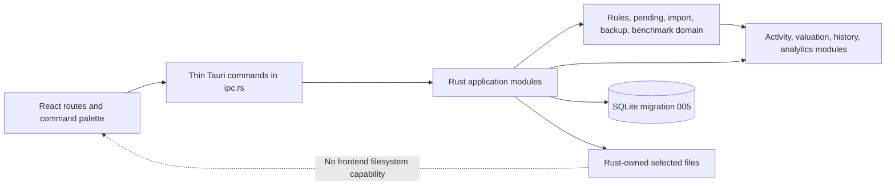
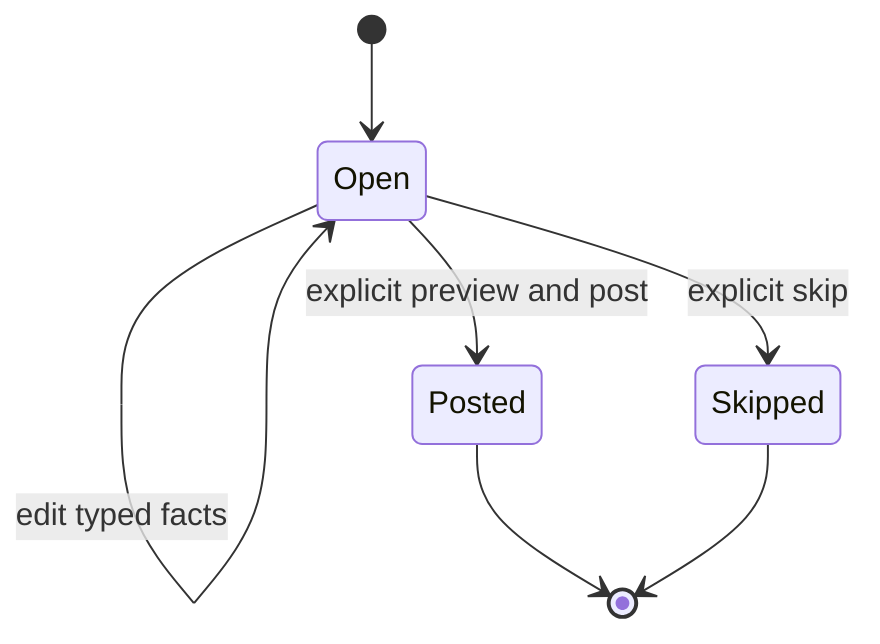

# v0.1.5 Technical Design

> **Archive notice:** Inherited unchanged from the Rust/Tauri repository. It has
> not been corrected or validated for Nestworth-go and is not current evidence.

> **Migration status:** Historical technical design copied from the previous implementation line. Its Tauri/Rust paths are not current Go + Fyne implementation evidence.

## Design Boundary

This document defines the planned technical contract for [v0.1.5](v0.1.5.md). The implemented v0.1.4 code, migration `004`, tests, generated bindings, and [compatibility baseline](v0.1.5-baseline.md) remain executable truth until each phase lands.

v0.1.5 adds preparation, maintenance, portability, comparison, and navigation around the existing ledger. It does not relax any financial invariant and does not introduce a second posting path.



The frontend may choose files through the dialog plugin and pass the selected path to a typed command. Only Rust reads or writes file contents. No generic filesystem, HTTP, shell, clipboard, process, or notification capability is added.

## Shared Domain Contract

### New Typed Identities

Add UUID v7 wrappers for:

- `RecurringActivityRuleId`
- `PendingActivityId`
- `FreshnessPolicyId`
- `MaintenanceSnoozeId`
- `ImportBatchId`
- `ImportItemId`
- `BenchmarkId`
- `BenchmarkObservationId`
- `BackupId`

They follow the existing typed-ID parser and cannot be interchanged across domain types. Backup format IDs and CSV schema versions are closed strings rather than UUIDs.

### Existing Financial Types

- `Money`, `Quantity`, `UnitPrice`, and `FxRate` remain unsigned canonical decimal strings with their existing scales and bounds.
- `SignedMoney` and `ReturnRate` remain output types only.
- Benchmark level adds `BenchmarkLevel`, a positive canonical Decimal with up to 18 integer and 8 fractional digits.
- Schedule intervals and day counts are bounded integers, not financial values.
- No v0.1.5 persistence, DTO, calculation, CSV parser, checksum progress value, or benchmark calculation uses binary floating point for a financial value.
- All timestamps remain UTC RFC 3339 milliseconds with `Z`; schedule, due, snooze, and Benchmark dates use `YYYY-MM-DD` in the confirmed History Origin timezone.

## Pending Activity Model

### Boundary

A Pending Activity is an editable proposal. It has no legs, no projection, no classification, no snapshot effect, and no analytics effect.

Manual pending creation supports these existing Activity inputs:

- Deposit and Withdrawal
- Same-currency or cross-currency cash Transfer
- Position Transfer
- Buy and Sell
- Income and Fee
- Debt Draw and Debt Payment

Opening Adjustment, Balance Adjustment, Position Adjustment, Debt Adjustment, Manual Valuation, Reversal, and Correction are observation- or ledger-state-dependent and cannot be stored as future pending items. They remain direct current workflows.

Recurring rules support the smaller predictable subset:

- Deposit and Withdrawal
- Same-currency cash Transfer
- Income and Fee
- Debt Draw and Debt Payment

Cross-currency Transfer, Position Transfer, Buy, and Sell may be prepared manually only after all native execution facts are known. They are never generated by a rule.

### State Machine



An `open` pending row is mutable and carries `updated_at`. `posted` and `skipped` rows are terminal and immutable except for safe display-label changes resolved from current references. There is no delete or reopen command.

Each pending item records:

- Household and optional recurring rule identity/revision
- Scheduled local date
- Creation source: `manual` or `recurring`
- One closed kind-specific typed payload
- Optional note
- Status and timestamps
- Optional posted Activity ID or skipped timestamp, mutually exclusive

Financial payloads use typed columns and foreign keys. Generic JSON is prohibited. The row shape is checked in SQL and fully validated in Rust.

### Preview and Posting

`preview_pending_activity` converts the current pending payload into the existing `CreateActivityInput`, with a user-supplied effective local time and DST choice where required. It delegates to the existing Activity preview path and writes nothing.

`post_pending_activity` uses `BEGIN IMMEDIATE`:

1. Load the open pending item and current referenced entities.
2. Require `scheduled_local_date <= local_today`.
3. Resolve the chosen non-future effective time.
4. Revalidate all facts through ActivityService.
5. Post the Activity, projections, and dirty range.
6. Set the pending item to `posted` and persist the Activity ID.
7. Commit once.

The pending payload is not copied into the posted Activity beyond facts that ActivityService already persists. Import or rule provenance is a separate link and cannot reinterpret the Activity.

Concurrent post attempts allow exactly one winner. If state has changed since preview, posting fails and leaves the pending item open.

## Recurring Rule Model

### Schedule

A rule records:

- Cadence: `daily`, `weekly`, `monthly`, or `yearly`
- Positive interval
- Start local date and optional inclusive end local date
- Anchor local date
- Typed recurring payload
- Monotonic revision
- Active/archive state and timestamps

Bounds:

| Cadence | Interval |
| --- | --- |
| Daily | 1–365 days |
| Weekly | 1–52 weeks |
| Monthly | 1–24 months |
| Yearly | 1–10 years |

All schedule arithmetic runs in Rust calendar types using the immutable History Origin timezone. Monthly and yearly dates clamp to the last valid day while preserving the original anchor. A January 31 monthly rule therefore produces February 28/29 and March 31. A February 29 yearly rule produces February 28 in non-leap years and February 29 in leap years.

### Generation

`generate_due_pending_activities` is explicit application work:

- It is never part of bootstrap, migration, an ordinary read, or background work.
- The frontend may invoke it after the ready screen is interactive and from a visible Refresh action.
- It generates only occurrences with `scheduled_local_date <= local_today`.
- It generates at most 366 occurrences per command across all rules and returns a continuation flag.
- `UNIQUE(rule_id, scheduled_local_date)` makes retries idempotent.
- An archived rule produces nothing.
- A rule whose typed payload now references an archived or otherwise invalid endpoint is reported as `blocked` and generates nothing until its payload is updated or the reference is restored.
- A rule created with a past start date may catch up within the same bounded generation contract.

Anchor, cadence, interval, and start date are immutable after rule creation. Updating the typed payload, note, or a valid end date increments the revision. Already generated pending items retain copied facts and the old revision. Changing a schedule requires archiving the old rule and creating a new one. The next ungenerated schedule date is calculated from the immutable anchor, not from the last application-open date, preventing drift.

## Freshness and Maintenance

### Policy Shape

`FreshnessPolicyKind` is closed:

```text
account_value
account_cash
instrument_quote
fx_quote
```

Each Household has one default per kind. A typed override may target exactly one Account, Instrument, or normalized FX pair compatible with the kind. `review_interval_days` is `1..=3650` or null for disabled. Rust rejects wrong-Household, archived-new-reference, wrong-shape, and duplicate active policies.

Migration `005` creates defaults without changing any observation or existing `Freshness` enum. Initial defaults are:

| Kind | Default review interval |
| --- | --- |
| Account Value | 30 days |
| Holdings cash | 30 days |
| Manual Instrument Quote | 7 days |
| Manual FX Quote | 7 days |

Provider quote Fresh/Delayed/Stale behavior remains the existing fixed quote-source contract. v0.1.5 policies govern manual-review reminders and do not relabel provider facts. Maintenance includes active Balance/Manual Value Accounts, existing currency components in active Holdings Accounts, active Instruments whose selected preference is Manual, and currently required FX pairs whose selected preference is Manual. Archived targets are omitted while their policies remain retained for restore.

### Status Derivation

For local today `D`, latest eligible observation date `O`, and interval `N`:

```text
due_on = O + N calendar days
current  when D < due_on
due      when D = due_on
overdue  when D > due_on
missing  when no observation exists
snoozed  when snoozed_until > D
```

Snooze is an overlay and does not replace the underlying status. DTOs return both underlying status and effective queue status. Snooze is keyed to the typed target and policy kind, not to an observation ID. A new observation makes the due calculation current even if an older snooze remains; expired and superseded snoozes may be ignored but are retained.

Maintenance queries batch latest observations, policies, snoozes, and due pending items. They do not query once per Account, Instrument, or FX pair.

## Backup Bundle Contract

### Format

The extension is `.nestworth-backup`. Format ID is `com.nestworth.backup` and format version is `1`.

The ZIP container has exactly two regular-file entries with exact names:

```text
manifest.json
database.sqlite3
```

`manifest.json` contains:

- Format ID and version
- Backup ID
- Product version
- Database migration version
- Created-at timestamp
- Household ID and display name
- Database byte length
- SHA-256 of the uncompressed database entry

The manifest contains no balances, positions, notes, media, paths, credentials, or quote values. The database entry contains the full active SQLite database, including media and all schema-5 tables. WAL/SHM files, pre-migration snapshots, pre-restore recovery copies, logs, and temporary files are excluded.

The bundle is not encrypted. The UI must state this before creation and restore inspection.

### Creation

Rust owns the entire write:

1. Validate a supported writable database and destination extension.
2. Create a randomized application-owned temporary directory.
3. Use SQLite `VACUUM INTO` to create a consistent compact database copy at a path generated entirely by Rust.
4. Run `integrity_check`, `foreign_key_check`, migration readback, and stable Household readback on the copy.
5. Stream SHA-256 and byte count.
6. Write the two-entry ZIP to a destination-adjacent temporary file.
7. Flush and sync the file, reopen the bundle, and verify its manifest, size, and checksum.
8. Atomically rename the temporary bundle to the selected destination and sync the destination directory before reporting success.

An existing destination requires explicit overwrite confirmation and is replaced only after the new temporary bundle verifies. Failure removes only application-owned temporary files and leaves any existing destination unchanged.

No SQL statement interpolates a user-selected path. `VACUUM INTO` receives only the randomized app-owned temporary path, encoded by a dedicated SQLite string-literal helper with injection tests.

### Inspection and Structural Safety

Inspection is read-only and rejects:

- Wrong format ID or unsupported format version
- Missing, duplicate, extra, directory, symlink, encrypted, or non-regular entries
- Absolute or traversal entry names
- Manifest larger than 1 MiB
- Database entry size different from the manifest
- Truncated stream or SHA-256 mismatch
- Non-SQLite content or wrong Nestworth core tables
- Invalid migration metadata

The database entry is streamed to an app-owned temporary file by exact entry name; archive paths are never joined to a filesystem destination. Declared and streamed sizes must agree, preventing unbounded decompression independent of the actual database size. Any SQLite inspection opens staging read-only with `query_only=ON` and `trusted_schema=OFF`, verifies migration metadata and the expected schema-object fingerprint before reading application tables, and never follows schema-supplied SQL.

### Restore

Restore is a two-command flow:

1. `inspect_backup` returns an opaque inspection token bound to the canonical source path, file identity, size, modification time, and SHA-256.
2. `restore_backup` requires that token and explicit confirmation, then reopens and revalidates the bundle before any mutation.

Restore processing:

1. Extract the database entry to a randomized application-owned staging path.
2. Reject migration greater than `005`.
3. Open staging with `trusted_schema=OFF`, reject triggers, views, virtual tables, attachments, or schema objects outside the exact allowlist/fingerprint for the declared supported migration.
4. For migration `001..004`, run embedded migrations only against staging, then run the same idempotent History Origin and policy-default initializers required by normal bootstrap. Retain the original selected bundle unchanged.
5. Recheck the exact schema-5 fingerprint and run SQLite integrity/foreign-key checks plus application consistency validation covering Household, History Origin, Activities/legs, current projections, snapshots, declarations, automation rows, and Benchmark rows.
6. Create and verify a timestamped format-v1 recovery Backup bundle in the application-data directory. It uses the same manifest/checksum writer and is addressable by its typed Backup ID, never by a frontend path.
7. Close the active pool and block all further commands in the current process.
8. Remove live WAL/SHM only after the pool closes.
9. Atomically replace the live database with staged data. A short-lived app-owned raw rollback copy may support the rename sequence; if replacement fails, restore the database entry from the verified recovery Backup before returning failure.
10. Persist no source path. Return `restartRequired=true`.

The current process never opens the restored database as writable after replacement. The frontend presents a restart-required screen. The next normal bootstrap validates and opens the database. Recovery Backups are never automatically deleted. `list_recovery_backups` returns safe manifest metadata and opaque IDs; inspection and Restore reuse the same bundle validation without returning a path. `delete_all_data` removes application-owned recovery Backups but never user-selected backups outside application data.

## Export Contract

### Canonical JSON v1

Format ID is `com.nestworth.export`, version `1`, UTF-8 JSON. The exporter reads from one consistent SQLite read transaction and streams deterministic sections in stable identity/order. Decimal values remain strings.

Included sections:

- Household, settings, reference-backed persisted values, Members, Institutions, Groups, Accounts, Ownership, and media
- Instruments, Holdings, cash observations, Account Value observations, Instrument Quotes, FX Quotes, and preferences
- History Origin and items, Activities and legs, state observations, snapshot revisions and items
- Cost-basis declarations
- v0.1.5 recurring rules, pending items, policies, snoozes, import provenance, Benchmarks, and Benchmark observations

Excluded derived or transient data:

- Derived FIFO lots, gain, return, attribution, and search results
- Provider fake-adapter state
- Logs, selected paths, inspection tokens, temporary files, migration/recovery snapshots, and WAL/SHM

Snapshot rows are included because they are immutable historical evidence and may contain selected quote provenance. Snapshot rebuild cursor/progress is omitted and can be reconstructed from snapshot and dirty-state facts.

The JSON exporter is for inspection and data liberation. v0.1.5 does not import it. Full-fidelity recovery uses Backup/Restore.

### CSV Export

Each CSV export has a fixed template/version and one dataset. Headers are exact and ordered. UTF-8, comma delimiter, CRLF rows, and RFC 4180 quoting are required.

Free-text cells are spreadsheet-hardened on export when their first non-space character is `=`, `+`, `-`, `@`, tab, or carriage return. A leading apostrophe is added and the export includes an `escaped_for_spreadsheet` boolean for reversible Nestworth re-import. JSON export remains the exact unescaped representation.

CSV financial values are canonical strings. Timestamps and local dates retain their existing formats. CSV export never includes media bytes.

## CSV Import Contract

### Templates

The first comment line identifies the template, for example:

```text
# nestworth-csv:activity:v1
```

Unknown template versions, missing required columns, duplicate headers, unknown columns, malformed quoting, NUL bytes, non-UTF-8 input, and more than 2,000 data rows are rejected. Empty trailing lines are ignored. No locale-specific decimal, date, boolean, or enum spelling is accepted.

Activity CSV represents kind-specific `CreateActivityInput`, not raw legs. Stable Account/Instrument IDs are authoritative; optional display labels are ignored for identity and checked only for diagnostics. Activity order is effective local date/time, then CSV row number. It cannot post before History Origin or in the future.

Quote and Benchmark imports append observations. They never update or delete prior rows. Provider source kinds are forbidden; imported quotes are Manual.

### Preview Token

`preview_csv_import`:

- Reads and hashes the selected file.
- Parses every row and validates syntax, catalog values, typed references, archive policy, effective time, duplicate identity, and a dry-run domain sequence against one consistent read snapshot.
- Returns bounded row diagnostics, aggregate counts, exact SHA-256, and an opaque process-memory token.
- Writes no database or file.

Diagnostics contain row number, stable error code, and field name, but not the raw row, path, amount, Account name, note, or symbol.

`commit_csv_import` requires the token and explicit confirmation. It reopens the same canonical path, checks file identity and SHA-256, reparses and revalidates under `BEGIN IMMEDIATE`, and commits all accepted rows plus import provenance once. Transaction-scoped `_in_tx` variants of Activity and observation append operations are the only mutation helpers; the importer cannot nest transactions or call a second public write path. Preview tokens expire after 30 minutes, application exit, or a different file identity.

### Idempotency

An import may provide one file-wide `source_namespace` matching `[a-z0-9][a-z0-9._-]{0,79}` and one trimmed `external_id` of 1–200 Unicode scalar values with no control characters per row. External IDs are invalid without a namespace. The canonical row fingerprint is lowercase SHA-256 over a versioned canonical byte encoding; it excludes display-only labels and includes every persisted financial fact.

| Prior identity | New content | Outcome |
| --- | --- | --- |
| None | Any valid content | Post/append |
| Same namespace/external ID | Same fingerprint | Skip as exact duplicate |
| Same namespace/external ID | Different fingerprint | Reject conflict |
| No external ID | Same-looking row | No global deduplication; preview warns |

`import_items` stores identity, fingerprint, row number, outcome, and exactly one typed target reference for a committed or exact-duplicate row. It stores no raw CSV row. Import provenance never authorizes update or deletion of the referenced entity.

## Benchmark Contract

### Entity and Observation

A Benchmark records:

- Household, name, currency, and series kind
- `max_carry_days` from 0 to 31; default 7
- Active/archive state and timestamps

Currency and series kind are immutable. Name and carry window may change without rewriting observations. Changing currency or interpreting the same levels under a different series kind requires a new Benchmark.

An observation records Benchmark ID, positive `BenchmarkLevel`, local date, optional note, source kind `manual` or `csv`, optional Import Item ID, and created time. Observations are append-only and cannot be archived or deleted. A correction appends a new observation for the same local date. New observations for an archived Benchmark are rejected.

Archiving a selected default Benchmark retains the preference and existing comparison with an archived badge. Archived Benchmarks are excluded from new-selection pickers; an update may retain the existing archived preference but cannot newly select another archived Benchmark.

Selected observation for target date `D`:

```text
observed_on <= D
ORDER BY observed_on DESC, created_at DESC, id DESC
```

It is eligible only when `D - observed_on <= max_carry_days`. A carry of zero requires an exact-date observation.

### Base-Adjusted Level and Return

If Benchmark currency equals Household base currency:

```text
base_level = level
```

Otherwise HistoricalValuationService selects eligible FX at the target closed-day cutoff using the existing direct/inverse/identity rules. A carried Benchmark level stays native while FX may continue to move through the target day:

```text
base_level = level × selected FX
```

The same orientation and one-time Decimal rounding rules used by valuation apply, except BenchmarkLevel retains full Decimal precision until ReturnRate output.

For closed-day period endpoints `S` and `E`:

```text
benchmark_return = base_level(E) / base_level(S) - 1
excess_return    = portfolio_cumulative_twr - benchmark_return
```

Excess return is a percentage-point difference, not a ratio and not annualized independently. Benchmark return may expose the same annualization rule as portfolio cumulative TWR only when the period is at least 365 days. XIRR is never compared with a Benchmark.

Benchmark comparison is unavailable if either endpoint, carry window, required FX, or portfolio TWR is unavailable. It never substitutes zero, one, a later observation, or a future FX Quote. Benchmark unavailability does not hide portfolio analytics.

## Search and Command Palette

### Rust Search

`global_search` accepts a trimmed query of 2–100 Unicode scalar values, an optional result-type filter, `include_archived`, and a total limit from 1–50. Results are Household-scoped and partitioned with per-type caps so one large category cannot starve the others.

Searchable fields:

| Result | Fields |
| --- | --- |
| Account | Name and note |
| Instrument | Name, symbol, and provider symbol when present |
| Institution | Name |
| Group | Name |
| Member | Name |
| Activity | Note and stable kind label; no amount search |

SQL uses escaped `LIKE ... ESCAPE` predicates and bound user input. SQLite's existing ASCII-insensitive `LIKE` behavior applies; scripts without case such as Chinese match literally, and v0.1.5 makes no locale-sensitive Unicode case-folding promise. Ranking is deterministic: exact match, prefix match, substring match, type priority, display label, then ID. No FTS table or search index migration is added.

Activity results expose a short bounded excerpt only when the query matched the note. Search does not expose financial amounts, raw legs, media, archived references from another Household, or error details.

### Frontend Action Registry

Static commands such as navigation, New Activity, New pending item, Maintenance, Create backup, Restore inspection, Export, and Import are defined in a typed frontend registry and filtered locally. Registry actions may navigate or open a dialog. They cannot call a final financial or destructive command.

`Command+K` opens the palette except while another modal owns focus. Shortcut handlers ignore editable elements and IME composition. Escape closes and restores focus. Arrow keys, Home/End, Enter, and screen-reader status follow the ARIA combobox/listbox pattern.

## Persistence Contract

Migration `005_sustainable_use.sql` adds these responsibilities without triggers or changes to existing Activity/leg/declaration rows:

| Table | Responsibility and key constraints |
| --- | --- |
| `recurring_activity_rules` | Typed recurring payload, immutable anchor, revision, cadence, and archive state |
| `pending_activities` | Typed editable proposal, copied rule revision, scheduled date, terminal status, optional posted Activity link |
| `freshness_policies` | One Household default or one typed target override per policy kind |
| `maintenance_snoozes` | Append-only typed target snooze dates |
| `import_batches` | Template/version, file SHA-256, source namespace, counts, status, and timestamps; no path |
| `import_items` | Row identity, fingerprint, outcome, and exactly one typed target reference for committed or exact-duplicate rows |
| `benchmarks` | Household Benchmark metadata and archive state |
| `benchmark_observations` | Append-only dated levels with optional import provenance |
| `household_benchmark_preferences` | One current default Benchmark per Household, preserving archived retained reference |

Migration `005` creates schema only. An idempotent post-migration initializer creates the four Household default policies before runtime becomes ready; these are settings, not financial observations. Initialization failure blocks the runtime rather than exposing a partial default set. Fresh onboarding creates the defaults atomically. Migration and initialization create no rules, pending items, import batches, Benchmarks, Benchmark observations, Activities, quotes, declarations, or snapshots.

Foreign keys use `RESTRICT` for audit/provenance references and existing archive semantics instead of permanent deletion. Table `CHECK`s enforce closed enums, positive schedule intervals, row shape, terminal-state shape, normalized FX pairs, Benchmark level positivity, and exactly one import target. Rust enforces cross-row, Household, current-reference, Activity, recurrence, and atomic-import rules.

Indexes support due generation, pending cursor pagination, target policy resolution, snooze selection, external-import identity, Benchmark date selection, and global-search predicates. Query plans and counts are frozen in Phase 0 and tested before closeout.

## Transaction and File Boundaries

### Runtime Operation Gate

Current `AppState` owns one long-lived `SqlitePool`, and current reset closes it without a lifecycle state transition. Restore requires an explicit concurrency boundary.

v0.1.5 adds an application-wide asynchronous operation gate and terminal runtime state:

- Every ordinary Tauri command acquires a shared operation permit before reading providers, SQLite, or selected files.
- Restore and `delete_all_data` acquire the exclusive permit before closing SQLite or replacing/removing files.
- A terminal `restart_required` state with reason `restore` or `reset` is set before the pool closes. `writable_db` and every later command return `APP_RESTART_REQUIRED` without touching the closed pool.
- The exclusive permit waits for already-started commands to finish; no new command may start once terminal transition begins.
- Backup, export, import preview, and ordinary database work use shared permits and never close the pool.

The gate is infrastructure coordination, not business authorization. Application tests that call service functions directly keep their existing transaction tests, while IPC/gate tests prove quiescence and terminal behavior.

| Operation | Boundary |
| --- | --- |
| Generate due occurrences | One `BEGIN IMMEDIATE`, maximum 366 inserts, uniqueness-idempotent |
| Create/update/skip pending | One short `BEGIN IMMEDIATE` |
| Post pending | Existing ActivityService and pending terminal update in one `BEGIN IMMEDIATE` |
| Update policy or snooze | One short `BEGIN IMMEDIATE`; no financial invalidation |
| CSV preview | Consistent read transaction; no write |
| CSV commit | Reparse and one `BEGIN IMMEDIATE`, maximum 2,000 rows |
| Append Benchmark level | One short `BEGIN IMMEDIATE` |
| Benchmark comparison/search | One consistent read transaction; no write |
| Backup | Online consistent SQLite copy plus filesystem temp/verify/rename; no business write |
| Restore inspection | App-owned temp file and read-only validation; no active-database write |
| Restore replacement | Exclusive runtime permit, verified recovery copy, terminal state, pool close, atomic filesystem replacement or rollback |

Ordinary bootstrap, Overview, Accounts, Investments, Activity, Analytics, and search reads never generate rules, post pending items, export, backup, restore, import, refresh providers, or rebuild snapshots.

## IPC Contract

Planned command groups:

| Group | Commands |
| --- | --- |
| Pending | `preview_pending_activity`, `list_pending_activities`, `create_pending_activity`, `update_pending_activity`, `skip_pending_activity`, `post_pending_activity` |
| Recurring | `list_recurring_activity_rules`, `create_recurring_activity_rule`, `update_recurring_activity_rule`, `archive_recurring_activity_rule`, `restore_recurring_activity_rule`, `generate_due_pending_activities` |
| Maintenance | `list_maintenance_items`, `list_freshness_policies`, `update_freshness_policy`, `snooze_maintenance_item` |
| Backup | `create_backup`, `inspect_backup`, `list_recovery_backups`, `inspect_recovery_backup`, `restore_backup` |
| Export/Import | `export_canonical_json`, `export_csv`, `preview_csv_import`, `commit_csv_import`, `list_import_batches` |
| Benchmarks | `list_benchmarks`, `create_benchmark`, `update_benchmark`, `archive_benchmark`, `restore_benchmark`, `list_benchmark_observations`, `append_benchmark_observation`, `set_default_benchmark`, `get_benchmark_comparison` |
| Search | `global_search` |

All commands remain thin functions in `ipc.rs`. Inputs use generated discriminated unions. Pending/recurring commands never accept raw legs. Backup/import inspection tokens are opaque, process-local, short-lived strings and are never persisted or logged.

List commands use bounded page sizes and opaque keyset cursors. File commands return progress totals as non-financial integers. Frontend-selected paths are never returned after the command and never appear in error messages or logs.

## Error Contract

Add stable errors:

```text
INVALID_RECURRING_RULE
INVALID_PENDING_ACTIVITY
PENDING_ACTIVITY_NOT_OPEN
PENDING_ACTIVITY_NOT_DUE
RECURRENCE_GENERATION_FAILED
INVALID_FRESHNESS_POLICY
BACKUP_INVALID
BACKUP_CORRUPT
BACKUP_UNSUPPORTED_VERSION
BACKUP_CREATE_FAILED
RESTORE_VALIDATION_FAILED
APP_RESTART_REQUIRED
EXPORT_FAILED
IMPORT_INVALID
IMPORT_PREVIEW_EXPIRED
IMPORT_FILE_CHANGED
IMPORT_DUPLICATE_CONFLICT
IMPORT_COMMIT_FAILED
INVALID_BENCHMARK
BENCHMARK_COMPARISON_UNAVAILABLE
SEARCH_INVALID
```

Import diagnostics use row and field context. Restore validation exposes a safe reason category, never SQLite paths, query text, raw manifest content, Household financial values, or driver errors. Logs contain stable event, format/version, row counts, byte counts, duration, and safe status only. They never contain selected paths, hashes, source namespaces, external IDs, names, notes, symbols, amounts, quantities, levels, rates, or archive contents.

## Frontend Contract

### Maintenance Route

Add `/maintenance` as a lazy top-level route with:

- Due and overdue pending items
- Valuation-review items grouped by status and kind
- Generate/Refresh action with continuation state
- Rule list and type-specific rule form
- Pending preview, edit, skip confirmation, and post confirmation
- Policy defaults and per-target overrides
- Snooze workflow

The page remains useful when generation or one maintenance query fails. It never posts on mount.

### Data Management

Settings adds a Data Management section:

- Create Backup
- Inspect and Restore Backup
- Canonical JSON Export
- CSV Export
- CSV Import preview and commit
- Import history
- Application-owned recovery-file explanation

Every file mutation has a visible selected destination/source summary, explicit confirmation where required, progress, cancellation before commit where safe, final verification state, and privacy warning. Restore success replaces the app with a restart-required screen.

### Benchmark Experience

Analytics adds:

- Benchmark selector and management entry
- Current selected Benchmark metadata
- Benchmark and excess-return values alongside cumulative TWR
- Availability diagnostics without hiding portfolio analytics
- Accessible comparison table; chart overlay is optional and may only use Rust-returned points/values

Benchmark management supports manual level append, history, CSV import, archive/restore, and default selection.

### Command Palette

The palette is mounted once inside the ready application shell. It combines static actions immediately and debounced Rust entity results. It provides loading, empty, error, archived, and result-type states, keeps keyboard selection stable as results arrive, and restores focus on close.

### Accessibility and Localization

- All new workflows are keyboard-complete and usable at 200% zoom.
- Destructive and financial confirmation cannot rely on color or icon alone.
- Import and restore diagnostics use semantic lists/tables with row association.
- Progress uses an announced status region without excessive updates.
- The palette follows combobox/listbox semantics and has an explicit accessible name.
- English and Simplified Chinese key sets remain identical.
- CSV template identifiers, enum values, and machine-readable headers remain English and are not localized.

## Security and Privacy

- All automation, policy, import, Benchmark, and search data remains in local SQLite.
- Backup and export are explicit user-initiated disclosure surfaces and always show a privacy warning.
- No backup is represented as encrypted.
- Archive extraction never trusts entry paths and never writes outside a randomized app-owned directory.
- Restore never executes SQL text supplied by the bundle. It rejects unexpected schema objects before running embedded migrations and rechecks the target fingerprint afterward.
- CSV fields are data, never SQL, formulas, shell input, URLs, or command names.
- Unsupported future databases are rejected before migration, automation generation, import, policy defaults, Benchmark writes, backup restore, or search writes.
- Search results and errors do not cross Household boundaries.
- The only new Tauri capability is `dialog:allow-save`; Rust retains all filesystem access. `dialog:allow-open` remains for import/restore.
- `delete_all_data` removes the schema-5 active database, WAL/SHM, pre-migration snapshots, restore staging/rollback files, and application-owned recovery copies after confirmation. It never removes user-selected backups or exports outside application data.

## Design Invariants Checklist

- No rule or reminder posts an Activity.
- No pending item affects a financial read before posting.
- No future date enters the posted ledger.
- No recurring workflow guesses execution price, FX, fee, or received amount.
- No stale label changes a value or completeness result.
- No backup success is reported before checksum readback.
- No restore touches the active database before staging validation and confirmation.
- No import bypasses the existing domain/application write path.
- No duplicate conflict overwrites a fact.
- No declaration becomes a transaction.
- No Benchmark changes net worth or v0.1.4 analytics definitions.
- No frontend code calculates authoritative financial or Benchmark results.
- No file path or financial content enters logs.
- No provider, cloud, or network is required.
