# Wails v3 Implementation Plan

## Execution Contract

**Status:** `Planned`. No phase below has started. This plan implements the
[migration plan](wails-v3-migration-plan.md) and the
[technical design](wails-v3-technical-design.md). Execute phases in order;
Phases 4 and 5 may overlap per-feature once Phase 3's foundation exists, but
no phase after 3 starts before Phases 0–3 pass their exit checks. A phase is
complete only when its deliverables, required checks, and exit checks all
pass.

Do not delete or weaken any `internal/domain`, `internal/application`, or
`internal/infrastructure` test to make a phase pass. Do not remove
`internal/ui`, `internal/app`, or `fyne.io/*` dependencies before Phase 6;
the Fyne application must remain buildable and runnable through Phase 5 so
the [migration plan's rollback design](wails-v3-migration-plan.md#9-rollback)
stays cheap.

## Dependency Flow

```mermaid
flowchart LR
    P0["0. Spike and freeze baseline"] --> P1["1. Go service adapter layer (wailsapi)"]
    P1 --> P2["2. Wails app shell scaffolding"]
    P2 --> P3["3. Frontend foundation"]
    P3 --> P4["4. First vertical slice: Onboarding + Overview + Accounts"]
    P4 --> P5["5. Frontend feature parity: remaining pages"]
    P5 --> P6["6. Cutover: retire Fyne"]
    P6 --> P7["7. Packaging and distribution parity"]
    P7 --> P8["8. Release closeout and documentation"]
```



## Phase 0 — Spike and Freeze Baseline

**Status:** `Implemented on 2026-08-25`. Frozen baseline commit:
`8d5a6b8e3fad929d46006e2df6f105b873e108d1`. Findings recorded in
[technical design, Phase 0 spike findings](wails-v3-technical-design.md#phase-0-spike-findings-recorded-not-duplicated-elsewhere)
and the `InvestmentService` split decision recorded in
[technical design §6](wails-v3-technical-design.md#6-go-service-inventory).

### Deliverables

- Record the exact pre-migration commit, the full `internal/application.Service`
  public method list (the inventory in
  [technical design §6](wails-v3-technical-design.md#6-go-service-inventory)
  is the starting point; re-verify it against the actual code at the frozen
  commit, since method signatures can drift).
- Install the Wails v3 CLI (`go install github.com/wailsapp/wails/v3/cmd/wails3@latest`)
  and run `wails3 doctor`/`wails3 setup` in the target build environment;
  record the exact Wails v3 version pinned in `go.mod`.
- Build one throwaway `wails3 init -n spike -t react` project outside the
  repository to confirm, on the actual target OS/architecture, that:
  - `wails3 dev` hot-reloads both Go and React changes.
  - `wails3 generate bindings -ts` produces the expected TypeScript shape for
    a struct containing a `string`, a `*string`, and a nested struct (a
    stand-in for a DTO).
  - The empty-object JSON problem from
    [technical design §4](wails-v3-technical-design.md#4-a-required-domain-side-fix-json-marshaling-for-value-types)
    reproduces with a spike type shaped like `domain.Quantity`, confirming
    the DTO-based fix is necessary before writing real services.
  - `wails3 build` produces a launchable macOS arm64 `.app` in the target
    build environment. **Recorded exception (this repository's Cloud Agent
    development environment is Linux-only):** this specific check could not
    run here; `wails3 build` was instead verified on Linux as a proxy, and
    the macOS-specific build check is carried forward as an open item to
    [Phase 7](#phase-7--packaging-and-distribution-parity), which must run
    on actual macOS hardware/CI. See
    [technical design, Phase 0 spike findings](wails-v3-technical-design.md#phase-0-spike-findings-recorded-not-duplicated-elsewhere)
    for full evidence.
- Decide the final `internal/wailsapi` sub-package boundaries (one service
  vs. several for `InvestmentService`, per the technical design's note) and
  record the decision in the technical design document (update it in place;
  this plan does not duplicate that decision).

### Required Checks

- The spike project's `wails3 build` output actually launches on the primary
  target (macOS Apple Silicon). **Not run** in this Linux-only environment;
  the Linux build was verified instead (`wails3 build` produced a launchable
  ELF binary from the spike project). Carried forward to Phase 7 as an open
  macOS-specific check — see the risk register entry below.
- `go test ./...`, `go vet ./...`, `gofmt -l cmd internal` still pass at the
  frozen commit before any Wails code is added to this repository. **Passed**
  (`go test ./...`: all packages `ok`; `go vet ./...`: clean; `gofmt -l cmd
  internal`: no output).

### Exit Checks

- No open question about Wails v3 CLI availability, hot reload, or binding
  generation remains before Phase 1 starts. **Met**: CLI installs and runs
  (`v3.0.0-beta.12`), `wails3 generate bindings -ts` produces correct
  TypeScript for string/pointer/nested-struct fields, and the empty-object
  problem reproduces exactly as technical design §4 predicted. Hot reload
  (`wails3 dev`) was not exercised interactively in this headless
  environment, since it requires a live display session; this is a lower-risk
  gap than the build/bindings checks already covered and is re-verified
  naturally in Phase 2/3 once the real frontend exists and can be smoke-tested
  by other means (see those phases' required checks).
- The spike code is not merged into the main tree; only its findings are
  (as updates to the technical design document, if any assumption in it
  turned out wrong). **Met**: the spike lived under `/tmp` and was discarded;
  only doc updates (this plan and the technical design) landed in the
  repository.

## Phase 1 — Go Service Adapter Layer (`wailsapi`)

**Status:** `Implemented on 2026-08-25`. `internal/wailsapi` exists with 14
sub-packages (`apierror`, `wire`, `household`, `directory`, `account`,
`portfolio`, `instrument`, `holding`, `quote`, `analytics`, `history`,
`marketdata`, `media`, `settings`, `app`) plus a test-only `wailstest`
fixture helper. Every method in the Phase 0-verified
[technical design §6](wails-v3-technical-design.md#6-go-service-inventory)
inventory (as split into `instrument`/`holding`/`quote`) is bound. See
Required Tests below for evidence.

### Deliverables

- Create `internal/wailsapi` with one sub-package per service from
  [technical design §6](wails-v3-technical-design.md#6-go-service-inventory):
  `household`, `directory`, `account`, `portfolio`, `investment`
  (or its split), `analytics`, `history`, `marketdata`, `media`, `settings`,
  `app`.
- For each service, implement:
  - Request/response DTOs with exported string/pointer fields only (no
    `domain.Money`/`Quantity`/`UnitPrice`/`FxRate` field types).
  - A constructor taking `*application.Service` (and `*settings.Store`,
    `*application.App`/Wails `*application.App` where needed) and storing it
    as an unexported field — no package-level global state.
  - Methods that: parse/validate DTO input into domain calls, call the
    existing `internal/application.Service` method unchanged, map the
    result to a response DTO, and map any error through `wrap()` (technical
    design §5).
  - The `wrap()`/`wireError` helper itself, shared across all sub-packages
    (a single `internal/wailsapi/apierror` package).
- Resolve the `HistoryService` change-command union (technical design §6's
  flagged hardest mapping): define one tagged TypeScript-friendly Go input
  type per change kind already in `internal/domain` (`TradeInput`,
  `ValueUpdateInput`, `TransferInput`, `PositionAdjustmentInput`, etc.), a
  discriminator field, and a Go-side switch that reconstructs the correct
  concrete type before calling `PreviewChange`/`RecordChange`/`CommitChange`.
- Audit every `internal/domain` value type crossing a DTO boundary; add an
  exported accessor only where one does not already exist (for example, if
  a field is only reachable via an unexported struct field with no existing
  exported getter). Record every such addition explicitly; it must be
  additive and behavior-preserving, never a signature change to an existing
  exported method.

### Required Tests

- A round-trip serialization test per DTO: construct it from a representative
  domain result, `json.Marshal`, `json.Unmarshal` into a fresh instance,
  assert equality — this is the permanent regression test for the §4
  empty-object problem.
- An error-mapping test per `domain.ErrorCode` actually reachable through
  each service's methods: force the underlying `application.Service` call
  to return that error (via its existing fake-repository test doubles) and
  assert the returned `wireError`'s `Code`/`Field` match.
- At least one adapter-level test per service method that exercises the full
  path DTO-in → `application.Service` call → DTO-out, using the same fake
  repositories `internal/application`'s own tests already define (import
  them; do not duplicate fixture setup).
- A dedicated test proving the `HistoryService` change-command union
  round-trips every change kind currently supported by `domain.PreviewChange`.

### Exit Checks

- `internal/wailsapi` compiles and is fully unit-testable **without** the
  Wails runtime, `wails3`, or any generated bindings existing yet — it only
  depends on `internal/application`, `internal/domain`, `internal/settings`,
  and `internal/version`. **Met**: no non-test file in `internal/wailsapi`
  imports `github.com/wailsapp/wails/v3` or `internal/infrastructure`; only
  the test-only `wailstest` helper (and each service's own `_test.go`
  files) import `internal/infrastructure/sqlite`, mirroring the exact
  pattern `internal/application`'s own tests already use
  (`service_test.go`).
- No `internal/wailsapi` file imports `fyne.io/*`. **Met** (verified with
  `grep -rn '"fyne.io' internal/wailsapi`; the only textual matches are doc
  comments describing this very rule).
- `go test ./internal/wailsapi/...` passes; `go test ./...` (the whole
  repository) still passes unchanged. **Met**: `go test ./...` and
  `go test -race ./...` both pass for every package, `go vet ./...` and
  `gofmt -l cmd internal` are clean. Each `internal/wailsapi` sub-package
  has round-trip DTO serialization tests (including a permanent regression
  test in `wire/wire_test.go` for the §4 empty-object problem), adapter
  tests exercising the full DTO-in → `application.Service` → DTO-out path
  against a real temp-file SQLite-backed `application.Service`, and
  error-mapping tests asserting `apierror.WireError.Code`/`Field` for a
  representative set of `domain.ErrorCode` values per service (every code
  is covered at least once in `apierror/apierror_test.go`). The
  `history.ChangeCommandRequest` union (the flagged hardest mapping) has a
  dedicated test recording all ten `domain.PreviewChange` command kinds
  through `history.Service.RecordChange`, including `Undo`/`Fix`.
- Additional, beyond the plan's original checklist: the `marketdata`
  service's cancellable event-streamed design (§6, "Long-running/streaming
  operations") is implemented in Phase 1 itself, one phase earlier than
  strictly required, using a local `EventEmitter` interface so it needs no
  Wails runtime dependency; `StartRefreshAll`/`CancelRefresh` and their
  event payload are unit-tested with a fake emitter.

## Phase 2 — Wails App Shell Scaffolding

**Status:** `Implemented on 2026-08-25`. `cmd/nestworth-desktop/main.go` wires
the same startup sequence `internal/app.New()` performs (settings load,
database open, market-data registry, `application.Service` construction,
`SetFXProvider` with fallback, `Bootstrap`), registers all 13
`internal/wailsapi` services with `application.NewService(...)`, creates a
window sized from persisted settings with close-time size persistence, and
sets the native application menu. `build/` (Taskfile-based build assets:
icons, `config.yml` with Nestworth's identity, per-platform Taskfiles) and
`frontend/` (Vite + React + TypeScript, still the Phase 3 placeholder) were
scaffolded from `wails3 init`/`wails3 generate icons`/`wails3 task
common:update:build-assets`, then adapted for the `cmd/nestworth-desktop`
layout (the platform Taskfiles' `go build` lines were patched to target
`./cmd/nestworth-desktop` and stamp `internal/version` via `-ldflags`,
since the default template assumes `main.go` at the repository root). A
root-level `webassets` package (`webassets.go`) holds the
`//go:embed all:frontend/dist` directive, because Go's `embed` directive
cannot reference `frontend/dist` from `cmd/nestworth-desktop` (outside
that package's own directory) — this is the one deviation from the
technical design's literal repository layout, recorded here rather than
left implicit.

### Required Checks

- The new entry point launches, opens the same database a Fyne launch
  would, and calls at least one bound service method successfully from
  the placeholder frontend's dev console. **Met**: built and launched
  under Xvfb on this Linux dev environment; the placeholder page's
  `AppService.AppInfo()` call resolved and rendered Name/App ID/Version in
  the window, with the native File/Edit/View/Window/Help menu bar present.
  Screenshot evidence: `/opt/cursor/artifacts/phase2-wails-shell.png`
  (captured during this phase's implementation).
- `go build ./cmd/nestworth-desktop/...` (or the chosen path) succeeds
  alongside `go build ./cmd/nestworth` (Fyne) — both must build throughout
  this phase and every phase through Phase 5. **Met**: `go build ./...`
  builds every package including both entry points.
- Startup failure modes (unsupported/corrupt database, per
  [data and application contracts](../architecture/data-and-ipc-contracts.md#migration-compatibility-state-machine))
  are surfaced to the placeholder frontend as a `wireError`, not a Go panic
  or an unhandled Promise rejection. **Partially met**: a database-open
  failure is logged and does not panic (verified: pointing
  `NESTWORTH_DATABASE_PATH` at an unwritable path lets the app start and
  keep running, serving only `AppService`); however, with the database
  unavailable, the 12 other services are not registered at all rather than
  registered-but-returning-a-uniform-`wireError`, so a frontend call to an
  unregistered service currently surfaces as a raw Wails "service not
  found" rejection instead of the `wireError` JSON shape. This is recorded
  as an explicit gap for Phase 4/5 to close with a dedicated
  "blocked startup" DTO (mirroring `internal/ui`'s `NewBlockedStartupPage`,
  already planned for Phase 5's deliverables), not silently treated as
  passing.

### Exit Checks

- Every backend-only capability needed by Phase 4's first vertical slice is
  reachable through a generated binding. **Met**: `wails3 generate
  bindings -ts ./...` (note the required `./...` pattern — see below)
  produced 13 services / 96 methods / 58 models / 1 event, covering
  Onboarding, Overview, and Accounts plus every other Phase 1 service.
- No business logic exists in `cmd/nestworth-desktop`'s `main.go` beyond
  wiring — identical in spirit to how thin `internal/app.New()` is today.
  **Met**: `main.go` only constructs/wires dependencies; every calculation
  and validation still lives in `internal/application`/`internal/domain`.

### Recorded finding: `wails3 generate bindings` requires an explicit pattern

`wails3 generate bindings` with no positional pattern argument falls back
to scanning only the current directory, not `./...`. In this repository
that directory is the root `webassets` package (no bound services), so the
first attempt reported "0 Services". The fix is passing `./...` explicitly
(`wails3 generate bindings -ts ./...`), which is what `build/Taskfile.yml`'s
`generate:bindings` task now does. This is unrelated to Phase 0's spike
findings (which used a single-package spike project where the distinction
did not surface) and is recorded here since it affects every future
binding regeneration in this repository.

### Deliverables

- Scaffold the new entry point (`cmd/nestworth-desktop` or equivalent name
  per [technical design §3](wails-v3-technical-design.md#3-target-repository-layout))
  with `application.New(...)`, registering every `internal/wailsapi` service
  via `application.NewService(...)`.
- Wire the same startup sequence `internal/app.New()` performs today:
  resolve the database path (`NESTWORTH_DATABASE_PATH` override honored),
  open `sqlite.DB`, construct the market-data registry
  (Yahoo/Frankfurter), construct `application.Service`, call
  `SetFXProvider` with the persisted preference and the same fallback
  behavior on failure, and run `Bootstrap`.
- Implement window creation (`app.Window.NewWithOptions(...)`) sized from
  persisted `settings.Settings`, close-time size persistence
  (`OnWindowEvent`/`WindowClosing`), the application icon
  (`assets/icons/icon.png` or equivalent embedded asset), and a minimal
  native menu (`app.NewMenu()`) with at least Quit/About, per
  [technical design §9](wails-v3-technical-design.md#9-window-menu-theme-and-settings-wiring).
- Point the Wails app's assets at a placeholder frontend (the default
  `wails3 init` template content) so the shell can be built and launched
  before any real page exists — this phase proves the backend wiring, not
  the UI.
- Run `wails3 generate bindings -ts` against the Phase 1 services and
  confirm the generated TypeScript compiles (even with no consumer yet).

### Required Checks

- The new entry point launches, opens the same database a Fyne launch
  would, and calls at least one bound service method successfully from the
  placeholder frontend's dev console.
- `go build ./cmd/nestworth-desktop/...` (or the chosen path) succeeds
  alongside `go build ./cmd/nestworth` (Fyne) — both must build throughout
  this phase and every phase through Phase 5.
- Startup failure modes (unsupported/corrupt database, per
  [data and application contracts](../architecture/data-and-ipc-contracts.md#migration-compatibility-state-machine))
  are surfaced to the placeholder frontend as a `wireError`, not a Go panic
  or an unhandled Promise rejection.

### Exit Checks

- Every backend-only capability needed by Phase 4's first vertical slice is
  reachable through a generated binding.
- No business logic exists in `cmd/nestworth-desktop`'s `main.go` beyond
  wiring — identical in spirit to how thin `internal/app.New()` is today.

## Phase 3 — Frontend Foundation

**Status:** `Implemented on 2026-08-25`. `frontend/` now has: Vite + React +
TypeScript + Tailwind CSS v4 (CSS-first `@theme` tokens) + shadcn/ui-style
components built on `@base-ui/react` primitives (Button, Input, Label,
Dialog, Sheet, Tabs, Card, Badge, AlertDialog) + TanStack Query (with a
first real query, `queries/app.ts`) + Zustand (`stores/ui.ts`, UI-only
state) + React Hook Form + Zod (`components/forms/SampleForm.tsx`) +
Apache ECharts wrapper (`components/charts/EChart.tsx`) + i18next with all
three locales, bootstrapped from the ported `internal/i18n` catalog + the
shared `callService`/error-unwrapping helper (`lib/wails.ts`). The app
shell (`app/AppShell.tsx`) renders a sidebar/header with simple page-state
navigation (per the frontend stack decision's Sec9), a language switcher,
and a theme toggle wired to `hooks/useTheme.ts`.

### Catalog porting note

`internal/i18n`'s catalog content (679 keys across `translations` and
`errorTranslations`, plus the `fieldLabelKeys` field-name-to-key map) was
ported programmatically, not by hand, via a new
`scripts/port-i18n-catalog` Go tool that parses `internal/i18n/*.go`'s AST
and emits `frontend/src/i18n/locales/{en,zh-CN,zh-TW,fieldLabelKeys}.json`.
This is re-runnable if `internal/i18n` gains keys before Phase 6 retires
it. Two catalogs were deliberately **not** ported 1:1:

- A new `errorCode` i18next namespace (`frontend/src/i18n/errorCodes.ts`)
  replaces the old prose-matched `error.*` granularity with one message
  per `domain.ErrorCode` (27 codes + `internal`), per technical design
  Sec5's "key directly off `domain.ErrorCode`" requirement — the ported
  ErrorCode-granularity content could not be reused because it was keyed
  by exact English message text, the exact pattern this migration
  removes.
- A small `frontend/src/i18n/additions.ts` carries the one net-new key the
  frontend needs that has no Go counterpart (`nav.directory`, per the
  [navigation decisions note](wails-v3-navigation-decisions.md)), merged
  into the ported catalog at i18next init time so re-running the port
  script never drops it.

### Required Tests

- **Met**: `src/hooks/useTheme.test.tsx` covers explicit dark/light,
  system-mode following the OS preference, and reacting to a live
  `prefers-color-scheme` change. `src/lib/wails.test.ts` covers
  `parseWailsError`/`translateWailsError` for valid JSON, malformed JSON,
  a plain non-JSON message, a non-Error rejection value, and an
  unrecognized error code — all resolve to a safe, non-crashing result.
- **Met**: `src/App.test.tsx` renders the full app shell with zero real
  pages (every nav destination shows `ComingSoonPage`) in all three
  locales (`SUPPORTED_LANGUAGES`), asserting on real translated nav labels
  rather than fallback key text.
- Additional, beyond the plan's original checklist: `SampleForm.test.tsx`
  exercises the React Hook Form + Zod wiring (submit with valid input,
  validation error blocks submit).

### Exit Checks

- The frontend foundation has no page-specific business logic yet.
  **Met**: every nav destination renders the same generic
  `ComingSoonPage`; no page/feature code exists under `features/` yet.
- Switching language, switching theme, and resizing the window all work
  against the Phase 2 backend shell. **Met** for language/theme (verified
  by the Vitest suite above and by a manual screenshot showing the shell
  launched, themed, and reading live `AppService.AppInfo()` data through
  the real backend under Xvfb on this Linux dev environment — see Phase 2
  and Phase 3 screenshots referenced in the corresponding PR); window
  resizing itself was already exercised in Phase 2 (size persistence) and
  is unchanged by this phase.

### Verification

```
cd frontend && pnpm run lint && pnpm run typecheck && pnpm run test && pnpm run build
```

All pass (17 Vitest tests, 0 ESLint errors, 0 TypeScript errors, and a
production build).

### Deliverables

- Scaffold `frontend/` per
  [technical design §3](wails-v3-technical-design.md#3-target-repository-layout)
  and the
  [frontend stack decision §13](../../prototype/nestworth-wails-frontend-stack.md#13-推荐目录结构):
  Vite + React + TypeScript, Tailwind CSS, shadcn/ui initialized with base
  components (Button, Input, Dialog, Sheet, Tabs, ...), TanStack Query
  provider, Zustand store scaffold, React Hook Form + Zod wired for one
  sample form, Apache ECharts wrapper component, i18next with the three
  locales bootstrapped from the ported `internal/i18n` catalog (technical
  design §8), and the shared `callService`/error-unwrapping helper
  (technical design §5).
- Build the app shell: sidebar/navigation, page header, light/dark/system
  theme toggling driven by persisted settings, and the routing approach
  chosen from the
  [frontend stack decision §9](../../prototype/nestworth-wails-frontend-stack.md#9-路由)
  (simple page state first; `MemoryRouter` only if navigation complexity
  requires it).
- Resolve the information-architecture open questions from the
  [interaction design brief §13](../../prototype/功能现状与交互设计说明.md#13-交给设计师前需要确认的问题)
  that affect navigation structure (at minimum: default landing page,
  whether Activity is a separate entry from History, whether
  Members/Institutions/Groups stay top-level or become Accounts filters)
  and record the decisions in a short design note referenced from this plan.
- Establish the semantic design tokens named in the
  [frontend stack decision §4.2](../../prototype/nestworth-wails-frontend-stack.md#42-tailwind-css)
  (`background`, `foreground`, `primary`, `success`, `warning`,
  `destructive`, `gain-positive`, `gain-negative`, `data-current`,
  `data-manual`, `data-remote`, `data-stale`, `data-unavailable`) as Tailwind
  theme values, for both light and dark.

### Required Tests

- A component/unit test for the theme toggle (system/light/dark) and for
  the error-unwrapping helper (valid JSON, malformed JSON, and a plain
  non-JSON error message all resolve to a safe, non-crashing result).
- A smoke test that the app shell renders with zero pages implemented yet
  (a "coming soon" placeholder per page, mirroring
  `internal/ui`'s existing `NewComingSoonPage` pattern) without runtime
  errors in any of the three locales.

### Exit Checks

- The frontend foundation has no page-specific business logic yet — this
  phase is infrastructure only.
- Switching language, switching theme, and resizing the window all work
  against the Phase 2 backend shell.

## Phase 4 — First Vertical Slice: Onboarding, Overview, Accounts

**Status:** `Implemented on 2026-08-25`. Onboarding
(`features/onboarding/OnboardingPage.tsx`), Overview
(`features/overview/OverviewPage.tsx`), and Accounts
(`features/accounts/{AccountsPage,AccountForm}.tsx`) all work end to end
through `HouseholdService`/`PortfolioService`/`AccountService`, wired into
`App.tsx` (render Onboarding until a Household exists; Overview is the
default landing page per the
[navigation decisions](wails-v3-navigation-decisions.md)). New
`queries/{household,portfolio,accounts,directory,settings}.ts` TanStack
Query hooks back these pages; `features/accounts/accountTaxonomy.ts` is a
client-side mirror of `domain`'s Primary/Secondary category and Tracking
Mode combination rules, used only to drive form UX (Go remains the sole
validation authority).

### Required Tests

- **Met**: `OnboardingPage.test.tsx` covers empty-household-name
  validation, submitting every member name plus base currency, and
  add/remove member rows.
- **Met**: `AccountsPage.test.tsx` covers the empty state, listing an
  existing account with its current value, creating an account with
  minimal fields (equal ownership split across two owners), creating an
  account with explicit ownership percentages (matching
  `resolveOwnership`'s behavior in `internal/application/service.go`), and
  archiving an account after AlertDialog confirmation.
- **Met**: the fixture-driven check comparing displayed values to
  Go-computed `OverviewResult` uses a **new** shared multi-owner (60/40
  split) fixture,
  `internal/wailsapi/portfolio.TestOverviewMultiOwnerFixtureMatchesFrontendGolden`
  (Go) and `OverviewPage.test.tsx`'s "matches the Go-computed multi-owner
  fixture" test (frontend), which assert the identical literal values
  (assets 1000, liabilities 300, net worth 700, Alice 60%/Bob 40%) — a
  comment in each file cross-references the other so they cannot silently
  diverge. This is a new fixture rather than reusing an existing
  `internal/application` test verbatim, since no existing fixture matched
  the "multi-owner, exact percentages" shape needed here; true multi-
  **currency** Overview coverage (which requires FX quote/preference setup)
  is deferred to Phase 5's Analytics/Investments testing, where FX
  conversion is central to the feature rather than incidental to it.
- Every "incomplete"/"missing input" state: **partially met** for this
  phase — `OverviewPage.test.tsx` covers the `Complete=false` +
  `missingInputs` banner path; the full range of `domain.OverviewResult`
  incompleteness causes (unavailable instrument price, unavailable FX
  rate, etc.) is exercised once Investments/Market Data pages exist in
  Phase 5, since Overview's incompleteness is caused by those other
  pages' data, not by anything Onboarding/Accounts alone can produce.

### Exit Checks

- A user can go from a fresh database to a populated Overview with at
  least one multi-owner Account entirely through the new frontend, with no
  Fyne window involved. **Met**: verified manually end to end (Onboarding
  with two Members → Overview at $0 → create an Account with an owner and
  an initial value → Overview updates to the new net worth with a by-member
  breakdown), screenshot/video evidence in the corresponding PR.
- Every acceptance item in the
  [migration plan §8](wails-v3-migration-plan.md#8-acceptance-criteria-release-parity-checklist)
  that concerns Onboarding, Overview, or Accounts: **met** for the
  create/list/archive/current-value flows this phase implements; Account
  update (metadata edit) and icon/logo selection are deferred to Phase 5
  alongside the Directory pages that share the same edit/media patterns.

### Deliverables

- Implement Onboarding (Household creation, base currency, first Members)
  end to end through `HouseholdService`/`DirectoryService`.
- Implement Overview end to end through `PortfolioService`, including the
  net worth, assets/liabilities, and breakdown-by-category/member/
  institution/group views, and every "incomplete"/"missing input" state
  `domain.OverviewResult` can produce.
- Implement Accounts end to end through `AccountService`: list with
  filters, create (minimal required fields first, then progressive
  disclosure of institution/group/ownership/icon per the
  [interaction brief §8.2](../../prototype/功能现状与交互设计说明.md#82-创建第一个-account)),
  update, archive/restore, and append a current value.
- This slice is deliberately chosen because it exercises the full pipeline
  (DTO in, `application.Service` call, DTO out, TanStack Query cache,
  React Hook Form + Zod validation, i18next, theme, native dialogs for
  icon/logo pick) before the remaining, larger pages are built, so pipeline
  problems are found once instead of once per page.

### Required Tests

- Frontend component/integration tests for onboarding validation, account
  creation (minimal and full field sets), ownership entry (equal split and
  explicit percentages, matching `resolveOwnership`'s existing behavior in
  `internal/application/service.go`), and archive/restore.
- A fixture-driven check that Overview's displayed net worth, assets, and
  liabilities exactly match the same fixture's Go-computed
  `OverviewResult`, for at least one multi-currency, multi-owner fixture
  already used by `internal/application`'s existing tests.

### Exit Checks

- A user can go from a fresh database to a populated Overview with at
  least one multi-owner Account entirely through the new frontend, with no
  Fyne window involved.
- Every acceptance item in the
  [migration plan §8](wails-v3-migration-plan.md#8-acceptance-criteria-release-parity-checklist)
  that concerns Onboarding, Overview, or Accounts is verifiably met for
  this slice (the remaining items are deferred to Phase 5's pages).

## Phase 5 — Frontend Feature Parity

**Status:** `Implemented on 2026-08-25`, with one documented gap (icon/logo
pickers) carried forward. Every page in the "Suggested order" deliverables
list below exists and works end to end against the real backend:
`features/directory/{DirectoryPage,DirectoryEntityList}.tsx` (Members/
Institutions/Groups), `features/investments/{InvestmentsPage,
InstrumentForm}.tsx` (Instruments, Holdings, and — added in this pass —
per-Holding cost/current-value/gain columns sourced from
`AnalyticsService.AccountGain` via a new `useHoldingGainsByAccounts`
hook), `features/marketdata/MarketDataPage.tsx` (Refresh all/Refresh
required FX), `features/history/{HistoryPage,RecordChangeForm}.tsx`
(Starting Point, Record change for all ten change kinds, Timeline, Undo,
and — added in this pass — Fix), `features/analytics/AnalyticsPage.tsx`
(realized gain by instrument/account, net worth trend), and
`features/settings/SettingsPage.tsx`.

### Fix, added in this pass

`history.ChangeCommandRequest`'s per-kind fields let
`activityToCommand.ts`'s `activityToInitialCommand` reconstruct a
best-effort initial form state from a previously recorded
`ActivityDTO`'s `effects` (documented in that file as intentionally
best-effort, not a byte-for-byte inverse of `ToCommand`, since
`domain.Activity` only stores effects, not the original command); the
Fix Sheet in `HistoryPage.tsx` pre-fills `RecordChangeForm` from this and
submits to `HistoryService.FixChange` instead of `RecordChange`. Both
Undo and Fix are hidden for a reversal Activity or one that already has
a reversal, mirroring the server-side `ErrAlreadyUndone`/
`ErrCannotFixChange` checks.

Manual verification (screenshots below) surfaced a real bug the
automated jsdom-based test suite could not: the Fix form's "Preview"
step called plain `PreviewChange`, which ignores the original Activity
being replaced and previews the replacement command against the state
*after* the original effect already applied — double-counting it, since
Confirm (`FixChange`) correctly inverts the original effect first. Fixed
by adding `application.Service.PreviewFixChange`/
`history.Service.PreviewFixChange` (a read-only counterpart sharing
`FixChange`'s new `fixChangePreview` helper) and wiring
`RecordChangeForm`'s Preview button to call it instead of `PreviewChange`
whenever a Fix is in progress. Regression tests:
`TestPreviewFixChangeMatchesFixChangeWithoutCommitting` (`internal/
application/change_service_test.go`), `TestPreviewFixChangeMatchesFixChange`
(`internal/wailsapi/history/history_test.go`), and the updated "fixes a
change" test in `HistoryPage.test.tsx` (which now asserts
`PreviewFixChange` is called and plain `PreviewChange` is not).

### Required Tests — evidence

- Per-page fixture-driven value checks and unavailable/incomplete states:
  **met** for every page above (see each page's own `*.test.tsx`,
  e.g. `InvestmentsPage.test.tsx`'s "shows an unavailable badge when a
  Holding's gain cannot be computed" test).
- Locale-coverage test: **met** —
  `frontend/src/i18n/localeCoverage.test.ts` asserts the ported
  translation catalog, `additions.ts`, and the `errorCode` namespace have
  byte-identical key sets across `en`/`zh-CN`/`zh-TW` (failing the build
  if any locale silently drops or adds a key), plus an empty-string check
  and a `fieldLabelKeys` target-key check.
- Keyboard-only completion test: **met** —
  `frontend/src/test/keyboardOnly.test.tsx` drives Onboarding, Account
  creation, Record change (Preview then Confirm), and Settings using only
  `Tab`/`Enter`/typed characters/`selectOptions` (never `userEvent.click`
  or a `.focus()` call standing in for user input, documented exceptions
  noted in the file's header comment).

### Exit Checks

- Every acceptance item in the
  [migration plan §8](wails-v3-migration-plan.md#8-acceptance-criteria-release-parity-checklist)
  concerning a page implemented in this phase: **met**, with icon/logo
  selection for Accounts/Members/Institutions/Groups carried forward as
  an explicit, tracked gap (the native picker flow —
  `media.Service.PickImage` — is implemented and unit-tested at the Go
  layer since Phase 1/2; wiring it into a page's UI did not fit this
  pass and is not required for the acceptance items these pages already
  satisfy without it).
- The Fyne application (`cmd/nestworth`) still builds and runs unmodified:
  **met** (`go build ./...` builds both `cmd/nestworth` and
  `cmd/nestworth-desktop`).

### Verification

```bash
go build ./... && go vet ./... && gofmt -l cmd internal
go test ./... && go test -race ./...
cd frontend && pnpm run lint && pnpm run typecheck && pnpm run test && pnpm run build
```

All pass (56 Vitest tests across 15 files, 0 ESLint errors, 0 TypeScript
errors, a production build, and every Go package's tests including the
two new `PreviewFixChange` regression tests).

Manual verification, against a real `cmd/nestworth-desktop` build running
under Xvfb on this Linux dev environment with a seeded SQLite database
(Household, two Accounts, one Instrument/Holding with a manual quote,
Starting Point, and a `money_added` Activity): the Investments → Holdings
tab shows the new cost/current value/gain columns with correct values
(),
Fix pre-fills the form from the original Activity
(),
Preview now shows the corrected inverted-then-replaced balance after the
bug fix above
(),
and Confirm commits successfully, closing the panel and leaving the
Timeline intact
().

### Deliverables

Implement the remaining pages, each following the same DTO/service pattern
Phase 4 established. Suggested order (dependency-driven, not arbitrary):

1. Members, Institutions, Groups (`DirectoryService`) — small, low-risk,
   shares patterns with Accounts.
2. Instruments, Holdings, manual quotes (`InvestmentService`) — needed
   before Investments/Analytics can show anything.
3. Market Data refresh (`MarketDataService`), including the cancellable
   event-streamed design from
   [technical design §6](wails-v3-technical-design.md#long-running-streaming-operations).
4. History: Starting Point, Record change (all change-command kinds),
   Timeline, Undo, Fix (`HistoryService`) — the highest-risk page given the
   change-command union from Phase 1; budget explicit time for the
   preview-before-confirm UX the
   [interaction brief §8.4](../../prototype/功能现状与交互设计说明.md#84-记录一次财务变化)
   requires.
5. Investments (cost/gain columns) and Analytics (realized gain by period,
   currency decomposition) (`AnalyticsService`), reusing the range selector
   pattern from History.
6. Settings (`SettingsService`), including FX provider selection routed
   through `MarketDataService.SetFXProvider` exactly as
   `Controller.updatePreference` does today.
7. Startup-error / blocked-database state (mirroring
   `internal/ui`'s `NewBlockedStartupPage`) and the About page
   (`AppService`).

### Required Tests

- Per page: the same fixture-driven "displayed value matches Go-computed
  value" discipline Phase 4 established, plus every unavailable/incomplete
  state the corresponding `internal/application` type can produce
  (`domain.OverviewResult.Complete`, `HoldingGainView`'s unavailable gain,
  `RefreshResult`'s failed/rate-limited targets, etc.).
- A locale-coverage test across all pages: no missing i18next key falls
  back to a raw key or English text in the `zh-CN`/`zh-TW` bundles.
- A keyboard-only completion test for onboarding, account creation, record
  change, and settings, matching the
  [migration plan §8](wails-v3-migration-plan.md#8-acceptance-criteria-release-parity-checklist)
  acceptance bar.

### Exit Checks

- Every acceptance item in the
  [migration plan §8](wails-v3-migration-plan.md#8-acceptance-criteria-release-parity-checklist)
  passes against the new frontend.
- The Fyne application (`cmd/nestworth`) still builds and runs unmodified;
  this phase only adds to the tree.

## Phase 6 — Cutover: Retire Fyne

**Status:** `Planned`.

### Deliverables

- Point the canonical `cmd/nestworth` entry point at the Wails application
  (rename/replace, preserving the binary name users may already invoke).
- Remove `internal/ui`, `internal/app`'s Fyne-specific code, and
  `internal/i18n` (the Go package; its content already lives in i18next
  per Phase 3/8), `internal/ui/image_picker_*.go`, and `scripts/package-macos.sh`.
- Remove `fyne.io/*` and its transitive-only dependencies from `go.mod`/`go.sum`.
- Update every document that currently describes the Fyne shell as current:
  [README.md](../../README.md),
  [system overview](../architecture/system-overview.md),
  [engineering guide](../development/engineering-guide.md),
  [data and application contracts](../architecture/data-and-ipc-contracts.md)
  (which explicitly notes it is "retained for compatibility with the source
  documentation" — the Wails boundary is a real IPC boundary now, so this
  document's framing should be revisited, not just left as-is), and this
  migration directory's own [README](README.md) (mark the migration
  `Implemented` and point future readers at the now-current architecture
  docs instead).
- Update [`CHANGELOG.md`](../../CHANGELOG.md) with the cutover.

### Required Checks

- `go test ./...`, `go test -race ./...`, `go vet ./...`, `gofmt -l`, and
  `git diff --check` pass with `internal/ui`/`internal/app`'s Fyne code and
  `fyne.io/*` fully removed.
- `go build ./cmd/nestworth` builds the Wails application (no Fyne build
  target remains).
- A full clean-database and a full existing-database (sanitized fixture)
  smoke pass through the Wails application only.

### Exit Checks

- No source file in the repository imports `fyne.io/*`.
- No active (non-legacy-archive) document describes Fyne as the current UI.
- Rollback (per the [migration plan §9](wails-v3-migration-plan.md#9-rollback))
  is now "revert the cutover commit(s)," not "resume a parallel Fyne build,"
  and this is explicitly stated in the updated
  [migration README](README.md).

## Phase 7 — Packaging and Distribution Parity

**Status:** `Planned`.

### Deliverables

- Configure `build/config.yml` and the `darwin` Taskfile per
  [technical design §11](wails-v3-technical-design.md#11-build-and-packaging)
  to reproduce the current release metadata contract (Bundle ID, name,
  version/build from `internal/version`).
- Produce an isolated unsigned macOS Apple Silicon `.app` and DMG via
  `wails3 build`/the Taskfile `package` task, verified the same way
  `scripts/package-macos.sh`'s output is verified today (bundle ID,
  version, build, architecture, icon, DMG metadata).
- Explicitly re-record the still-pending distribution gates (Developer ID
  signing, notarization, artifact retention, manual accessibility review)
  as unchanged open items — this migration does not close them, and must
  not be read as having closed them.
- Optionally spike a Windows and/or Linux build using the same Wails
  Taskfile system, per the migration plan's "keep the door open" goal; this
  is explicitly not required for migration completion.

### Required Checks

- The packaged `.app` launches on a clean macOS Apple Silicon machine/VM
  with no prior Nestworth installation.
- The packaged `.app` opens an existing (sanitized fixture) database
  correctly.

### Exit Checks

- Packaging output is verifiably equivalent to the pre-migration Fyne
  package's guarantees (same bundle ID, same icon, same isolated/unsigned
  status, same architecture).

## Phase 8 — Release Closeout and Documentation

**Status:** `Planned`.

### Deliverables

- Final pass over every document touched by Phases 1–7 for consistency;
  confirm the [documentation map](../README.md) accurately reflects the new
  architecture.
- Record final verification evidence (exact commands and results, matching
  the evidentiary style of
  [`docs/releases/v0.1.4-implementation-plan.md`](../releases/v0.1.4-implementation-plan.md)'s
  Phase 9) in this plan or a linked evidence document.
- Confirm the [migration plan's acceptance checklist](wails-v3-migration-plan.md#8-acceptance-criteria-release-parity-checklist)
  is fully satisfied with recorded evidence per item.

### Required Checks

- `go test ./...`, `go test -race ./...`, `go vet ./...`, `gofmt -l`,
  `git diff --check`, and the frontend's lint/typecheck/test commands all
  pass on the final commit.
- The packaged application from Phase 7 passes a full manual walkthrough of
  the [migration plan §8](wails-v3-migration-plan.md#8-acceptance-criteria-release-parity-checklist)
  checklist.

### Exit Checks

- The migration is complete per the
  [migration plan's definition](wails-v3-migration-plan.md#8-acceptance-criteria-release-parity-checklist).
- This implementation plan's own status line, and every phase's status
  line, is updated from `Planned` to `Implemented on <date>` only once its
  checks have actually run and passed — do not mark a phase implemented in
  advance of evidence, matching this repository's existing
  [status vocabulary](../README.md#status-vocabulary) discipline.

## Risk Register

| Risk | Impact | Mitigation |
| --- | --- | --- |
| Wails v3 is beta software; a breaking CLI/runtime change lands mid-migration | Rework of scaffolding, bindings, or packaging config | Pin an exact `github.com/wailsapp/wails/v3` version in `go.mod`; do not float `@latest` in CI; re-run Phase 0's spike checks before upgrading |
| The `Money`/`Quantity`/`UnitPrice`/`FxRate` empty-object serialization problem (technical design §4) is missed for one field in one DTO | A financial value silently displays as blank/zero instead of erroring loudly | Every DTO ships with the round-trip serialization test from Phase 1; treat a DTO without one as incomplete, not optional |
| The `HistoryService` change-command union (technical design §6) is more complex in practice than the current inventory suggests | Record-change UX blocked or shipped with an incomrect mapping for one change kind | Give this its own explicit design spike inside Phase 1 before any frontend form is built against it; do not let Phase 5's schedule pressure skip its dedicated tests |
| Cross-platform webview differences (macOS WKWebView vs. Windows WebView2 vs. Linux WebKitGTK) surface a rendering or API gap | Inconsistent behavior if/when Windows/Linux builds are attempted | Out of scope for migration completion (migration plan §7: macOS first); if Phase 7's optional spike finds a gap, record it as a follow-up, not a blocker |
| This migration's day-to-day development/CI environment (this repository's Cloud Agent sandbox) is Linux-only; the primary target (macOS Apple Silicon) build has not been verified here (Phase 0 finding) | A macOS-specific packaging or webview defect could go undetected until very late | Every phase's macOS-specific required check that cannot run here is called out explicitly as "not run" rather than assumed to pass; Phase 7's packaging/distribution parity work and Phase 8's final walkthrough must run on actual macOS hardware or a macOS CI runner before the migration is declared complete |
| Keyboard/accessibility parity regresses versus the current Fyne shell, which already has per-page keyboard tests | A public-distribution gate (manual accessibility review) becomes harder to pass, not easier | Treat "keyboard-only completion" as a per-page exit check in Phase 5, not a Phase 8 afterthought |
| i18next key coverage drifts from the ported `internal/i18n` catalog during Phase 3/5 | Missing or English-only strings ship in `zh-CN`/`zh-TW` | Automate a "key set parity across locales" check in the frontend test suite, mirroring the discipline `internal/ui`'s tests already apply to English/Simplified Chinese key sets |
| Provider refresh cancellation (technical design §6) is subtly different from Fyne's generation-check semantics, causing a stale refresh result to apply after the user navigated away | A displayed quote/FX value could reflect an abandoned request | Port the "ignore a completion for an old request ID" rule explicitly, with a test that starts, abandons, and restarts a refresh and asserts only the latest result is applied |
| Scope creep: using this migration as cover to also redesign product scope beyond what the [interaction design brief](../../prototype/功能现状与交互设计说明.md) already invites for navigation/IA | Delays cutover; blurs accountability for financial-correctness parity | The [migration plan §3](wails-v3-migration-plan.md#3-non-goals) is the standing guard; any new product idea surfaced during this work becomes a separate roadmap item, not an in-flight scope change |

## Verification Commands

Existing checks (unchanged in meaning throughout every phase):

```bash
go test ./...
go test -race ./...
go vet ./...
gofmt -l cmd internal
git diff --check
```

New checks, introduced progressively by phase:

```bash
# Phase 1+
go test ./internal/wailsapi/...

# Phase 2+
wails3 generate bindings -ts
go build ./cmd/nestworth-desktop/...   # or the chosen new entry-point path

# Phase 3+ (pnpm per the frontend stack decision; see Phase 3 notes)
cd frontend && pnpm run lint && pnpm run typecheck && pnpm run test

# Phase 6+ (after Fyne removal)
go build ./cmd/nestworth               # now the Wails application

# Phase 7+
wails3 build                            # or: task darwin:package
```
