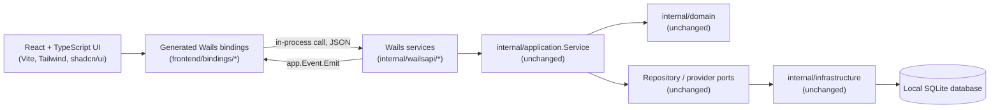

# Wails v3 Technical Design

**Status:** `Planned`. This document implements the
[migration plan](wails-v3-migration-plan.md). It owns architecture, project
layout, the Go service/binding design, the serialization and error contract,
frontend architecture, build/packaging, and the testing strategy. It does
not own delivery order; see the [implementation plan](wails-v3-implementation-plan.md)
for phases.

## 1. Target Architecture



This is the same layered shape as the
[current system overview](../architecture/system-overview.md#application-layers),
with one substitution: `Fyne views and widgets` becomes `React UI +
generated bindings`, and a new thin `internal/wailsapi` package (name
proposed; see §3) takes over the role Fyne's `Controller` and page
constructors currently play — calling application use cases and shaping
results for presentation — except the "presentation" it shapes results for
is now a wire format, not Fyne widgets.

**Dependency rules are unchanged:** the UI (now React, calling generated
bindings) still never opens SQLite or recomputes a financial total; only
`internal/wailsapi` may call `internal/application`, and only
`internal/application`/`internal/infrastructure` may call the repository.

## 2. A Note on Wails v3 Maturity

Wails v3 is beta software as of this writing (its own site states "v3 is
beta software with a stable desktop API. Applications are running in
production with it, but test thoroughly before deployment. v2 remains the
current stable release."). This plan proceeds with v3 anyway because:

- v2's single-window, context-threaded runtime API is a worse fit for a
  growing multi-page application than v3's explicit
  `application`/`window`/`service`/`event` model.
- v3's binding generator produces richer, better-typed TypeScript than v2's
  reflection-based approach, which matters for a codebase with as many
  domain types as this one.
- The user's explicit direction is Wails v3 (this document exists because of
  that direction), and the [frontend stack decision](../../prototype/nestworth-wails-frontend-stack.md)
  already assumes it.

The [implementation plan's risk register](wails-v3-implementation-plan.md#risk-register)
tracks v3's beta status as an explicit, monitored risk (API churn, packaging
bugs, platform-specific webview issues) rather than treating it as a solved
problem.

### Phase 0 spike findings (recorded, not duplicated elsewhere)

Verified directly against `github.com/wailsapp/wails/v3/cmd/wails3@latest`,
which resolved to `v3.0.0-beta.12` at spike time:

- The scaffold template name is **`react`**, not `react-ts`. Every
  reference to `wails3 init -t react-ts` / `wails init -t react-ts` in this
  migration's source documents (the
  [frontend stack decision](../../prototype/nestworth-wails-frontend-stack.md#31-react--typescript)
  and the [implementation plan Phase 0](wails-v3-implementation-plan.md#phase-0--spike-and-freeze-baseline))
  is corrected to `-t react` (TypeScript is that template's default
  language; a separate `react-js` template exists for JavaScript). This is
  a documentation correction only; it does not change any locked decision.
- `wails3 doctor` succeeds on Linux (the development/CI environment used by
  this migration) once `libgtk-4-dev` and `libwebkitgtk-6.0-dev` are
  installed; `wails3 generate bindings -ts` and `wails3 build` both work
  end-to-end on Linux against a throwaway spike project, confirming the CLI
  itself is usable in this repository's build environment.
- The §4 empty-object problem reproduces exactly as described: marshaling a
  struct shaped like `quantityLike{ value string }` (unexported field, no
  `MarshalJSON`) with `encoding/json` produces `{}`; a type with **no**
  exported field also produces no usable field in the generated TypeScript
  model. This confirms the DTO-based fix (§4) is required, not optional.
- The generated bindings correctly render a `*string` Go field as
  `field?: string | null` in TypeScript, confirming the "optional pointer
  fields" rule in [§5](#5-serialization-and-error-contract-across-the-wails-boundary)
  produces the expected shape without further configuration.
- **macOS Apple Silicon build verification (a Required Check for this
  phase) could not be performed from this Linux-only development
  environment** — Wails v3's macOS target requires the macOS SDK/Xcode
  toolchain, which is unavailable here. The Linux build (`webkitgtk-6.0`
  backend) was built and launched successfully as the closest available
  proxy for "the CLI and generated bindings produce a working native
  build." The macOS Apple Silicon `.app` build called for by
  [Phase 7](wails-v3-implementation-plan.md#phase-7--packaging-and-distribution-parity)
  remains an open check that must run on actual macOS hardware or a macOS
  CI runner before that phase can close; it is tracked as a carried-forward
  risk below, not silently assumed to pass.
- The spike project was built outside this repository (`/tmp`, not
  committed) and discarded after these findings were recorded, per this
  phase's exit checks.

## 3. Target Repository Layout

```text
cmd/
  nestworth/            # Existing Fyne entry point; retired at cutover (Phase 6)
  nestworth-desktop/    # New Wails v3 entry point (name proposed; final cmd
                         # replaces cmd/nestworth only at cutover, per the
                         # migration plan's rollback design)
internal/
  domain/               # Unchanged, plus the JSON marshaling addition (§4)
  application/          # Unchanged
  infrastructure/       # Unchanged
  settings/             # Unchanged
  version/              # Unchanged
  i18n/                 # Retired at cutover; catalog content ported to
                         # frontend/src/i18n (§8) before removal
  wailsapi/             # New: one Go package per bound service (§6), each a
                         # thin adapter with its own unit tests. Phase 0
                         # decided the final sub-package list (superseding
                         # "investment (or its split)" below):
                         # apierror, household, directory, account,
                         # portfolio, instrument, holding, quote, analytics,
                         # history, marketdata, media, settings, app.
                         # `InvestmentService` from §6's inventory is split
                         # three ways (`instrument`, `holding`, `quote`)
                         # because its combined method count (24) is the
                         # largest in the inventory and the three concerns
                         # (instrument identity, holding positions, and
                         # quote/FX values) already have distinct DTOs.
  ui/                   # Fyne UI; retired at cutover (Phase 6)
  app/                  # Fyne app/window wiring; retired at cutover
build/                  # New: Wails build assets (icons, platform Taskfiles,
                         # build/config.yml) generated by `wails3 init` /
                         # `wails3 generate build-assets`
frontend/               # New: Vite + React + TypeScript application
  src/
    app/                # App shell, providers, navigation (see the frontend
                         # stack decision's §13 recommended structure)
    features/
    components/
    queries/
    stores/
    hooks/
    lib/
    i18n/
    bindings/           # Generated by `wails3 generate bindings -ts`; not
                         # hand-edited
  package.json
  vite.config.ts
  tsconfig.json
Taskfile.yml             # New: root Wails v3 build orchestrator
docs/
scripts/                 # package-macos.sh retired at cutover once the
                         # Wails Taskfile packaging replaces it (§9)
```

**Phase 2 deviation, recorded in place:** Go's `//go:embed` directive
cannot reference a path outside its own source file's directory, so
`cmd/nestworth-desktop/main.go` cannot directly embed the sibling
`frontend/dist`. A tiny root-level package (`webassets.go`, `package
webassets`) holds the `//go:embed all:frontend/dist` directive and is
imported by `cmd/nestworth-desktop`; this is the only place the literal
layout above differs from what was implemented, and it is additive (a new
file), not a restructuring of `frontend/`'s location.

`internal/wailsapi` is a new package boundary, not a rename of `internal/ui`.
It must depend only on `internal/application`, `internal/domain` (for typed
IDs/enums used in method signatures), `internal/settings`, and
`internal/version` — never on `fyne.io/*`, and never directly on
`internal/infrastructure`.

## 4. A Required Domain-Side Fix: JSON Marshaling for Value Types

This is a concrete blocker discovered while designing this plan, not a
theoretical concern. The financial value types the whole application is
built on — `domain.Money`, `domain.SignedMoney`, `domain.Quantity`,
`domain.UnitPrice`, `domain.FxRate` — wrap an **unexported**
`decimal.Decimal` field (for example, `type Quantity struct{ value
decimal.Decimal }` in `internal/domain/decimal.go`). Go's default
`encoding/json` cannot see unexported fields, so today, without changes,
marshaling any of these types produces an **empty object**, silently
discarding the financial value. This was verified directly:

```go
m, _ := domain.ParseMoney("123.45", "USD")
b, _ := json.Marshal(m)
// b == []byte("{}")   — verified by a throwaway test against internal/domain
```

This has never mattered before because Fyne never serializes application
results — it calls Go methods and reads fields directly. It matters now
because every value returned by a bound Wails service method crosses the
boundary as JSON.

**Rejected fix:** adding `MarshalJSON`/`UnmarshalJSON` methods directly to
`domain.Money` and friends. This is rejected for two reasons: (1) Wails v3's
binding generator produces TypeScript **models from static analysis of Go
struct declarations**, not from a type's runtime JSON output — a struct
whose only field is unexported still has nothing for the generator to
expose, so a custom `MarshalJSON` would fix a hand-written `encoding/json`
caller but not the generated TypeScript model; (2) it would start coupling
`internal/domain` — which the
[system overview](../architecture/system-overview.md#dependency-rules)
already keeps free of presentation and transport concerns — to the specific
needs of one IPC mechanism.

**Adopted fix:** every Wails service method returns explicit, exported-field
DTOs (see §5), never a bare `domain.Money`/`domain.Quantity`/etc. Each DTO
field that represents a financial value is a `string` produced by the
existing `.Canonical()` / `.String()` methods those types already implement
(for example, `Quantity.CanonicalString()`, `Money`'s existing formatting
helpers). This requires **no change to `internal/domain`** beyond, at most,
adding an exported accessor if a value's amount is not already reachable
through an existing exported method — an audit item for
[Phase 1](wails-v3-implementation-plan.md#phase-1-go-service-adapter-layer-wailsapi).
`domain.CurrencyCode` and every typed ID (`type AccountID string`, etc.) are
plain string-backed types and already serialize correctly today; only the
`decimal.Decimal`-wrapping struct types are affected.

A related, smaller finding: bare `decimal.Decimal` fields used directly
inside result structs (for example, `OverviewResult.Assets`) already
marshal safely as a quoted JSON string, because `shopspring/decimal`
defaults `MarshalJSONWithoutQuotes` to `false`. The DTO layer must **never**
flip that global to `true` and must never let a monetary value cross the
wire as a bare JSON number — JavaScript's `JSON.parse` decodes bare numbers
as IEEE 754 `float64`, which can silently lose precision, violating the
"no binary floating point for financial values" rule in the
[engineering guide](../development/engineering-guide.md#financial-implementation-rules).

## 5. Serialization and Error Contract Across the Wails Boundary

The [data and application contracts](../architecture/data-and-ipc-contracts.md#serialization-and-view-models)
document already specifies the exact rules a UI boundary must follow. Wails
makes that boundary literal (real JSON over a real IPC channel) instead of
implicit (Go method calls inside one process). The rules do not change; they
become directly testable:

| Rule (already stated for Fyne) | Wails DTO implementation |
| --- | --- |
| IDs are typed in Go and serialized as lowercase hyphenated UUID strings | Typed ID types (`domain.AccountID`, etc.) are used as DTO field types directly — they already are strings |
| Timestamps are UTC RFC 3339 strings with millisecond precision | DTO fields use `string`, populated by the same formatting the domain layer already produces for timestamps; add a shared `internal/wailsapi/timefmt.go` helper if one does not already exist as an exported domain function |
| Currency codes are three uppercase ASCII letters | `domain.CurrencyCode` used as a DTO field type (already a string) |
| Money, Quantity, FX, and return values are canonical decimal strings | DTO fields are `string`, populated via `.Canonical()`/`.CanonicalString()`/equivalent — never a bare `decimal.Decimal` or a wrapped value type (§4) |
| Optional values are explicit pointers or nullable result fields | DTO fields use Go pointers (`*string`, `*DTO`) so the generated TypeScript models `?: string \| null` correctly |
| Errors contain a stable code, safe message, and optional field context | See the error contract below — now literally the JSON payload of the rejected Promise |
| Raw SQL, credentials, provider payloads, local paths, and sensitive values do not enter user-facing view models | Unchanged: DTOs are built only from `internal/application` results, which already exclude these; a DTO must never embed a raw `error.Error()` string from below the application layer |

### Error contract

Wails v3 propagates a Go method's non-nil `error` return to JavaScript as a
rejected Promise whose `message` is `err.Error()` — a plain string. Calling
`domain.Error.Error()` directly loses the structured `Code`/`Field` the rest
of the application already relies on (see `internal/i18n/errors.go`, which
today maps the exact English `Message` text to a catalog key — a pattern
this migration should not carry forward, since it is unnecessarily brittle
and Wails gives an opportunity to fix it).

**Adopted design:** every `internal/wailsapi` method wraps a returned error
before returning it:

```go
// internal/wailsapi/apierror.go
type wireError struct {
    Code    string `json:"code"`
    Field   string `json:"field,omitempty"`
    Message string `json:"message"`
}

func (e *wireError) Error() string {
    b, _ := json.Marshal(e) // never fails for this shape
    return string(b)
}

// wrap converts any error into the stable wire shape. A *domain.Error
// keeps its Code/Field; any other error (a programming bug, not a domain
// rule) becomes a generic "internal" code so no raw Go error string, SQL
// detail, or stack trace ever reaches the frontend.
func wrap(err error) error {
    if err == nil {
        return nil
    }
    var domainErr *domain.Error
    if errors.As(err, &domainErr) {
        return &wireError{Code: string(domainErr.Code), Field: domainErr.Field, Message: domainErr.Message}
    }
    return &wireError{Code: "internal", Message: "an unexpected error occurred"}
}
```

On the frontend, a shared `callService()`/query-error-handling helper parses
`error.message` as JSON, falls back to a generic "internal" error if parsing
fails (defensive: a future Wails runtime error that never reaches this
wrapper must not crash the UI), and looks up the localized message by
`code`/`field` through i18next — the same "translate by stable code, not by
matching English text" principle
[data and application contracts](../architecture/data-and-ipc-contracts.md#error-contract)
already states, now enforced by construction because the wire format has no
room for a translated string. `internal/domain.ErrorCode` (23 stable values
today, e.g. `validation`, `not_found`, `conflict`, `unavailable`,
`history_not_started`, `cost_basis_required`, `insufficient_quantity`) is the
single source of truth for the i18next `error.<code>` key namespace; a new
domain error code and a new i18next key must ship together.

### DTO ownership and review discipline

- One `internal/wailsapi` sub-package per service (§6), each with its own
  `dto.go` (types), `service.go` (methods calling `internal/application`),
  and `dto_test.go` (round-trip serialization tests).
- A DTO mirrors only the fields a page actually needs; it does not need to
  mirror an entire domain struct. Trimming is encouraged — it is easier to
  add a field later than to discover an accidentally-exposed internal field
  in production.
- No `internal/wailsapi` method performs validation, computation, or
  branching beyond input parsing and DTO mapping. Anything resembling a
  business rule belongs in `internal/application`, matching the existing
  "Fyne performs no cost, gain, or decomposition arithmetic" rule from the
  [v0.1.4 release contract](../releases/v0.1.4.md#release-acceptance),
  which now reads as "neither React nor `internal/wailsapi` perform one."

## 6. Go Service Inventory

Wails v3 "services" are plain Go structs registered with
`application.NewService(&FooService{...})`; each public method becomes a
bound frontend function. The table below groups the **current**
`internal/application.Service` public method surface (verified directly
against `internal/application/*.go`) into proposed services. This is a
starting inventory for [Phase 1](wails-v3-implementation-plan.md#phase-1-go-service-adapter-layer-wailsapi)
to refine, not a promise that method names are final.

| Proposed service | Fyne page(s) it replaces | Representative underlying `application.Service` methods | Notes |
| --- | --- | --- | --- |
| `HouseholdService` | Onboarding, app bootstrap | `Bootstrap`, `CompleteOnboarding` | Called once at startup and after every mutation that can change Household existence |
| `DirectoryService` | Members, Institutions, Groups | `ListMembers`/`CreateMember`/`UpdateMember`/`ArchiveMember`/`SetMemberAvatar`; `ListInstitutions`/`CreateInstitution`/`UpdateInstitution`/`ArchiveInstitution`/`SetInstitutionIcon`/`SetInstitutionLogo`; `ListGroups`/`CreateGroup`/`UpdateGroup`/`ArchiveGroup`/`SetGroupIcon`/`SetGroupLogo` | One service; these three entities share the same CRUD/archive/icon shape today in both Fyne and the release contracts |
| `AccountService` | Accounts | `CreateAccount`, `UpdateAccount`, `ListAccounts`, `ArchiveAccount`, `AppendAccountValue`, `AccountValuation`, `AccountValuations`, `SetAccountIcon`, `SetAccountLogo` | `AccountInput` (currently an `internal/application` struct with many optional/`*Set` fields) becomes an explicit request DTO; see the "Set flags" note below |
| `PortfolioService` | Overview | `Overview`, `Portfolio`, `NetWorthTrend` | Read-only; no mutation methods |
| `InstrumentService` | Investments, Market Data (instrument identity part) | `CreateInstrument`/`UpdateInstrument`/`ArchiveInstrument`/`ListInstruments`/`SetInstrumentLogo`/`SetInstrumentQuoteSource` | **Decided in Phase 0** (superseding the earlier "single `InvestmentService`" proposal): split three ways because the combined 24-method surface was the largest in this inventory and instrument identity, holding positions, and quote/FX values already have distinct DTOs — see [target repository layout](#3-target-repository-layout) |
| `HoldingService` | Investments, Market Data (holding/position part) | `CreateHolding`/`UpdateHolding`/`UpdateHoldingQuantity`/`ArchiveHolding`/`ListHoldings`/`HoldingsByAccounts`; `AppendAccountCashValue`/`ListAccountCashValues` | Same Phase 0 split as `InstrumentService` |
| `QuoteService` | Market Data (quote/FX part), Settings (FX preference) | `CurrentInstrumentQuote`/`InstrumentQuoteHistory`/`SaveManualInstrumentQuote`/`AppendManualInstrumentQuote`; `CurrentFXQuote`/`FXQuoteHistory`/`SaveManualFXQuote`/`AppendManualFXQuote`/`SetFXPreference`/`ListFXPreferences` | Same Phase 0 split as `InstrumentService` |
| `AnalyticsService` | Investments (gain columns), Analytics | `HoldingGain`, `AccountGain`, `RealizedGain`, `RealizedGainInRange` | Read-only; depends on `InvestmentService` data already being loaded by the frontend |
| `HistoryService` | History/Timeline, Starting Point, Record change, Undo/Fix | `HistoryOrigin`, `HistoryStarted`, `StartHistory`, `StartHistoryWithCosts`, `StartingPointDraft`, `PreviewChange`, `RecordChange`, `CommitChange`, `UndoChange`, `FixChange`, `HistoryMutationAllowed`, `ListActivities`, `ListActivityPage`, `BuildDailyValuationSnapshot`, `RebuildHistoricalSnapshots`, `CompleteDailySnapshotRange`, `DailySnapshotState` | `PreviewChange`/`RecordChange`/`CommitChange`/`UndoChange`/`FixChange` take `command any` in Go today (a discriminated union by Go type, e.g. `domain.TradeInput`, `domain.ValueUpdateInput`); the DTO layer must define one exported, tagged "change command" TypeScript union and a Go-side `switch` that reconstructs the correct concrete `domain` input type — this is the single trickiest mapping in the whole inventory and needs its own design note and tests in Phase 1 |
| `MarketDataService` | Market Data refresh, Settings' FX provider control | `RefreshAll`, `RefreshRequiredFX`, `RefreshInstrument`, `RefreshFX`, `SetFXProvider`, `FXProviderKey` | Long-running/cancellable; see §7 for the event-based design replacing `internal/ui/refresh_worker.go`'s Fyne-thread pattern |
| `MediaService` | Avatar/logo/icon pickers across Members, Institutions, Groups, Accounts, Instruments | `CreateMediaAsset`, `MediaAsset`, `NormalizeImage` | Binary image bytes cross as base64 (Go's `encoding/json` already encodes a `[]byte` field as a base64 string by default — unlike `Money`/`Quantity`, no §4-style fix is needed here); combine with `app.Dialog.OpenFile()` for picking (§10) |
| `SettingsService` | Settings | Wraps `internal/settings.Store.Load`/`Save`, plus delegates FX-provider changes to `MarketDataService`'s `SetFXProvider` exactly as `Controller.updatePreference` does today | Not a wrapper of `application.Service`; a separate small adapter over `internal/settings` |
| `AppService` | About, window-close persistence | `internal/version` metadata (`Version`, `Build`); window-size persistence can instead be wired directly in `main.go` via `app.Window.OnWindowEvent`, with no frontend-callable method needed | Keep intentionally tiny |

Methods not listed (`Bootstrap`'s private helpers, `changeState`,
`refreshTarget`, etc.) are lowercase/unexported in
`internal/application.Service` and are not candidates for binding; they stay
internal exactly as they are today.

### The `AccountInput` "Set flags" pattern

`internal/application.AccountInput` today uses a pattern of paired fields
like `InstitutionID string` / `InstitutionIDSet bool` so `UpdateAccount` can
distinguish "leave unchanged" from "clear to empty." This pattern must be
preserved through the DTO layer (an `UpdateAccountRequest` DTO needs the
same explicit-optional shape, most naturally as Go pointers —
`InstitutionID *string`, `nil` meaning "unchanged," `*"": ""` meaning
"clear") rather than collapsed into plain optional strings, or the update
semantics silently change.

### Long-running / streaming operations

Provider refresh (`RefreshAll`, `RefreshRequiredFX`, `RefreshInstrument`,
`RefreshFX`) and historical snapshot rebuild
(`RebuildHistoricalSnapshots`) are the two operations
`internal/ui/refresh_worker.go` and `internal/ui/snapshot_worker.go`
currently run off the Fyne UI thread with generation-based cancellation.
Wails v3's method call itself is just an async call the frontend already
awaits (TanStack Query's `useMutation` handles pending/error/success
without extra plumbing), but **cancellation** needs an explicit design (see
[implementation plan Phase 1](wails-v3-implementation-plan.md#phase-1-go-service-adapter-layer-wailsapi)):

- `MarketDataService`/`HistoryService` keep a per-request `context.CancelFunc`
  keyed by a request ID the frontend generates and passes in.
  `StartRefresh(requestID, ...)` launches the work in a goroutine and
  returns immediately; `CancelRefresh(requestID)` cancels it.
- Progress and completion are reported via `app.Event.Emit("marketdata.refresh.progress", ...)`
  /`"marketdata.refresh.completed"` (or the equivalent snapshot-rebuild event
  names), carrying the same `RefreshResult`/`RefreshTargetResult` DTOs the
  synchronous call would have returned.
- The frontend subscribes with `Events.On(...)` (from `@wailsio/runtime`) for
  the duration of the operation and invalidates the relevant TanStack Query
  keys (`["accounts"]`, `["overview"]`, `["instruments", id, "quote"]`, ...)
  on completion — the same invalidation shape the
  [frontend stack decision §5.1](../../prototype/nestworth-wails-frontend-stack.md#51-tanstack-query)
  already describes.
- This replaces Fyne's `asyncTask[T]` generation-check pattern
  (`internal/ui/async_task.go`) one-for-one in spirit: "a stale completion
  cannot corrupt current UI state" becomes "an event for an abandoned
  request ID is ignored by the frontend," and "a route change cancels the
  in-flight task" becomes "unmounting the page calls `CancelRefresh`."

## 7. Events

Beyond the long-running-operation events above, `app.Event` is the general
replacement for any case where Fyne currently pushes an update proactively
rather than the UI pulling it. This migration does not require any new
proactive push beyond what already exists (refresh progress, snapshot
rebuild progress); it must not introduce a background poller or a
network-triggered push that the current architecture's
"core operation requires no network connection" and "no background
automatic refresh" rules (system overview; roadmap's "Deferred Beyond v0.1":
background agents) would forbid.

## 8. Internationalization

`internal/i18n`'s **catalog content** (the English/简体中文/正體中文 key-value
pairs already curated in `internal/i18n/i18n.go` and the error-key mapping
in `internal/i18n/errors.go`) is the input for the new i18next resource
files (`frontend/src/i18n/{en,zh-CN,zh-TW}.json` or equivalent), not
something to redesign from scratch. Two changes accompany the port:

1. Error translation switches from matching exact English `Message` text
   (`internal/i18n/errors.go`'s current `errorMessageKeys` map) to keying
   directly off `domain.ErrorCode` plus an optional `field`, per §5's error
   contract. This removes an entire class of "the Go message text changed
   and silently broke translation" risk.
2. `internal/settings.Language` (`system`, `en`, `zh-CN`, `zh-TW`) remains
   the persisted preference; `SettingsService` still owns loading/saving it,
   but i18next (not Go) owns applying it to rendered text. Locale-aware
   number/date formatting (`internal/format`) is ported the same way: its
   **rules** (which separators, which date order, which currency symbols
   per `format.CurrencySymbol`) move to a TypeScript formatting module; Go
   keeps producing canonical decimal/timestamp strings and stays out of
   locale display formatting entirely, which is arguably a cleaner
   separation than today's split between `internal/format` and
   `internal/i18n`.

`internal/i18n` (the Go package) is retired at cutover once its content has
a verified-complete TypeScript counterpart (a Phase 5 exit check in the
[implementation plan](wails-v3-implementation-plan.md#phase-5-frontend-feature-parity)).

## 9. Window, Menu, Theme, and Settings Wiring

| Fyne behavior today | Wails v3 replacement |
| --- | --- |
| `app.NewWindow(...)`, `window.Resize(...)` from persisted `WindowWidth`/`WindowHeight` | `app.Window.NewWithOptions(application.WebviewWindowOptions{Width: ..., Height: ...})` using the same persisted `settings.Settings` values |
| `window.SetCloseIntercept(...)` persisting size via `controller.PersistWindowSize` | `window.OnWindowEvent(events.Common.WindowClosing, func(e *application.WindowEvent) { ... settingsStore.Save(...) })`, reading the window's current size from the event/window object |
| `window.SetMainMenu(NewMainMenu(...))`, rebuilt per `Controller.Refresh()` | `app.NewMenu()` built once at startup from the current language/theme; rebuilt only when language actually changes (menus are native chrome, not per-navigation UI, so this is simpler than Fyne's per-refresh rebuild) |
| `ApplyTheme(fyneApplication, preference)` (Appearance/Accent → Fyne theme) | Tailwind `dark`/light class toggling driven by `preference.Appearance`, plus a `prefers-color-scheme` listener for `AppearanceSystem`; accent tokens become CSS custom properties per the [frontend stack decision §4.2](../../prototype/nestworth-wails-frontend-stack.md#42-tailwind-css) |
| `fyne.Do(...)` marshaling background work back to the UI thread | Not needed: the frontend already runs its own single-threaded JS event loop; `internal/wailsapi` methods run on Go's normal goroutine scheduler and return through the binding's Promise |
| `settings.Store.Load()`/`Save()` called directly by `internal/app.New()`/`Controller` | Called by `SettingsService` (frontend-facing) and by the new Wails `main.go` at startup (same as `internal/app.New()` does today) — the store's own code is unchanged |

## 10. Media and Native Dialogs

`internal/ui/image_picker_darwin.go` (NSOpenPanel via cgo) and
`internal/ui/image_picker_other.go` (the non-macOS stub) are replaced by
Wails's cross-platform `app.Dialog.OpenFile()`:

```go
func (s *MediaService) PickImage() (*MediaAssetDTO, error) {
    path, err := s.app.Dialog.OpenFile().
        SetTitle(s.title). // localized by the caller, not hardcoded Go text
        AddFilter("Images", "*.png;*.jpg;*.jpeg;*.webp").
        PromptForSingleSelection()
    if err != nil {
        return nil, wrap(err)
    }
    if path == "" {
        return nil, nil // user cancelled; not an error
    }
    data, err := os.ReadFile(path)
    if err != nil {
        return nil, wrap(err)
    }
    normalized, err := s.appService.NormalizeImage(bytes.NewReader(data))
    if err != nil {
        return nil, wrap(err)
    }
    asset, err := s.appService.CreateMediaAsset(ctx, mimeType, normalized)
    if err != nil {
        return nil, wrap(err)
    }
    return toMediaAssetDTO(asset), nil
}
```

This removes the macOS-only cgo/Cocoa dependency entirely — a net
simplification, and it makes the picker available on Windows/Linux builds
for free, consistent with the migration plan's "keep the door open" platform
goal. `internal/infrastructure/media.Normalize`/`ReadAndNormalize` are
reused unmodified.

## 11. Build and Packaging

`wails3 init` (or the equivalent `wails3 create`) scaffolds `Taskfile.yml`,
`build/config.yml`, and per-platform `build/{darwin,windows,linux}/`
directories. The existing `scripts/package-macos.sh` behavior is replaced
by the generated `darwin:package` Taskfile task, reconfigured to preserve
the current release metadata contract:

- Bundle ID `com.nestworth.app`, product name `Nestworth`, version/build
  sourced from `internal/version` exactly as today.
- `assets/icons/icon.icns` (and the PNG sources under `assets/icons/`)
  become the input to `wails3 generate icons`, replacing the Fyne packager's
  icon embedding; `assets/README.md` is updated to describe the new
  consumer.
- Output remains an isolated, unsigned `.app` plus a DMG for local/CI
  verification; Developer ID signing and notarization remain separate,
  already-deferred distribution gates exactly as the
  [v0.1.4 release contract](../releases/v0.1.4.md#release-acceptance)
  already states for the current Fyne build.
- `go.mod`'s module path and Go version (`go 1.26.0`) are unchanged; only
  `fyne.io/fyne/v2` and its transitive dependencies are removed (at cutover,
  not immediately — see the migration plan's rollback design) and
  `github.com/wailsapp/wails/v3` is added.
- `frontend/package.json` is new; the
  [frontend stack decision §12](../../prototype/nestworth-wails-frontend-stack.md#12-推荐依赖)
  dependency list is the starting point, installed with `pnpm` as that
  document recommends.

## 12. Testing Strategy

| Layer | What changes | What does not change |
| --- | --- | --- |
| `internal/domain` | Nothing (or, if an exported accessor is added per §4, a small additive test) | Every existing table-driven test keeps passing unmodified |
| `internal/application` | Nothing | Every existing use-case test (fakes, transaction outcomes) keeps passing unmodified |
| `internal/infrastructure` | Nothing | Migration, integrity, and repository tests keep passing unmodified |
| `internal/wailsapi` (new) | New: DTO round-trip serialization tests (`json.Marshal`/`Unmarshal` produces the exact shape §5 specifies, including the empty-object regression from §4 as a permanent regression test), error-mapping tests (every `domain.ErrorCode` reaches a `wireError` with the same code/field), and adapter tests using the same fake-repository pattern `internal/application`'s tests already use | — |
| Frontend unit/component | New: Vitest + React Testing Library for components, hooks, and query wrappers, per standard practice for this stack | — |
| Frontend integration | New: exercise generated bindings against a real `wails3 dev` backend pointed at an isolated `NESTWORTH_DATABASE_PATH`/`NESTWORTH_SETTINGS_PATH`, mirroring how Fyne UI tests today avoid touching a real user database | — |
| End-to-end / manual | New: a `computerUse`-style walkthrough of the acceptance checklist in the [migration plan §8](wails-v3-migration-plan.md#8-acceptance-criteria-release-parity-checklist) before cutover, plus keyboard-only and locale-switch passes matching the bar `internal/ui`'s existing tests already set per page | Manual accessibility review remains a named distribution gate exactly as it is today for Fyne |
| Release gate | `wails3 build` / the Taskfile `package` task replaces `./scripts/package-macos.sh` in the [engineering guide](../development/engineering-guide.md#setup-and-daily-commands)'s command list once cutover happens | `go test ./...`, `go test -race ./...`, `go vet ./...`, `gofmt -l`, `git diff --check` remain required and unchanged in meaning |

No test in `internal/domain`, `internal/application`, or
`internal/infrastructure` may be deleted, skipped, or weakened to make this
migration land; a failing test in those packages after a "Wails-only" change
is evidence of an accidental behavior change and must be treated as a
regression, not adjusted away.
