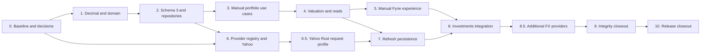

# v0.1.2 Implementation Plan

## Execution Contract

**Status:** `Phases 0–9 and 6.5 implemented; Phase 10 in progress`.

This plan implements the [release contract](v0.1.2.md) and
[technical design](v0.1.2-technical-design.md) in the current Go + Fyne
repository. Execute phases in order. A phase is complete only when its code,
tests, localization, documentation, and stated exit checks are complete.

Do not use a real user database as the only migration or smoke-test copy. Do
not treat a fixture-only provider test as evidence that Yahoo is currently
available.

## Dependency Flow

## Phase 0 — Baseline, Fixtures, and Locked Decisions

### Deliverables

- Approve the release contract and technical design.
- Record the current facts: application version `v0.1.1`, database schema `2`,
  Go/Fyne boundary, `shopspring/decimal`, and current test/package gates.
- Commit a sanitized schema-2 v0.1.1 fixture with Household, Members,
  Institutions, Groups, Accounts, Ownership, values, archives, retained
  references, and the exact pre-migration Overview result.
- Add the CNY/SGD/USD `62190` golden portfolio fixture and a partial-value
  `40990` case.
- Add sanitized Yahoo JSON fixtures for regular price, close fallback, FX,
  null/misaligned close arrays, currency mismatch, malformed decimal, unknown
  symbol, API error, oversized body, 401/403, 429, and 5xx.
- Lock standard `net/http`, the fixed Yahoo host, eight-second timeout, redirect
  rejection, 2 MiB limit, two-request semaphore, and fake-transport seam.

### Exit Checks

- No open decision can change schema shape, quote orientation/selection,
  aggregate incompleteness, provider identity, or network trigger policy.
- Fixtures contain no personal data, credentials, local paths, symbols tied to
  a real user's portfolio, or raw production logs.
- `go test ./...`, `go vet ./...`, and `git diff --check` pass before feature
  work begins.

## Phase 1 — Decimal Values and Portfolio Domain

### Deliverables

- Add typed IDs and parsers for every v0.1.2 entity.
- Implement Quantity, UnitPrice, and FxRate canonical parsing and serialization.
- Add Instrument types, quote-source kinds, Instrument, Holding, cash
  observation, quote, FX preference, freshness, and valuation-result types.
- Enable Holdings only for Investment Accounts and make initial Account Value
  mode-dependent.
- Preserve immutable TrackingMode and Account default currency.

### Required Tests

- Decimal syntax, maxima, zero rules, positive FX, canonical output, checked
  multiplication/division, overflow, and banker's rounding.
- No financial parser or operation accepts a binary-float input.
- Instrument binding, type, Household, archive, and provider-preference rules.
- Holding same-Household, mode, uniqueness, quantity, archive, and restore rules.
- Holdings Account initial-value rejection and unchanged Balance/Manual behavior.

### Exit Checks

- Domain imports no Fyne, SQLite, HTTP, or Yahoo package.
- `go test ./internal/domain/...`, `go vet ./internal/domain/...`, and formatting
  pass.

## Phase 2 — Schema 3 Migration and Repositories

### Deliverables

- Refactor the migration switch only as needed to add ordered schema `2 -> 3`.
- Add all six v0.1.2 tables, constraints, foreign keys, and latest-value indexes.
- Extend `DB.Verify` with schema-3 table/column/index fingerprints.
- Add bounded repositories for Instruments, Holdings, cash, quotes, and FX
  preferences.
- Add one consistent portfolio/valuation snapshot read without N+1 queries.
- Change Account creation persistence to accept the mode-valid optional initial
  Account Value.

### Required Tests

- Fresh database ends at `3`; schema-2 fixture migrates once and reopens
  idempotently.
- Pre-migration snapshot is created before changing an existing schema-2 file.
- All old rows, foreign keys, archive states, relationships, and the pre-feature
  Overview result are preserved.
- Future schema `4` remains byte-for-byte unchanged and performs no provider or
  settings write.
- Failed migration blocks startup and preserves the original database.
- Latest cash and quote ordering uses effective/quoted time, created time, ID.
- Duplicate, cross-Household, invalid-mode, invalid-pair, and restore-conflict
  writes roll back completely.
- Query-count tests prove bounded snapshot loading.

### Exit Checks

- Migration has no trigger and rewrites no old business row.
- `foreign_key_check`, `integrity_check`, repository tests, migration tests, and
  `go test -race` for transaction-sensitive packages pass.

## Phase 3 — Manual Portfolio Application Use Cases

### Deliverables

- Add Instrument create/read/update/archive/restore and logo attachment.
- Add Holding create/read/current-quantity update/archive/restore.
- Add append-only Holdings Account cash observations.
- Add manual Instrument Quote and FX Quote append.
- Add explicit Instrument and FX source-preference changes.
- Update Account creation for Holdings and foreign-currency Balance/Manual
  Accounts.
- Keep application errors stable, localized, and free of SQL detail.

### Required Tests

- Every multi-row mutation commits once or leaves all tables unchanged.
- Saving a manual quote appends the quote and selects Manual in one transaction;
  a standalone source switch appends nothing; quote history is never updated in
  place.
- Archived references may be retained but not newly selected.
- Wrong Household, duplicate Holding, invalid decimal, missing target, wrong
  mode, and invalid quote currency write nothing.
- All manual workflows succeed with an empty provider registry and no network.

### Exit Checks

- Application interfaces expose domain/application structs, not SQL rows.
- Default tests have zero external network dependency.

## Phase 4 — ValuationService and Authoritative Reads

### Deliverables

- Implement selected-source Instrument and FX quote resolution.
- Implement identity, direct, and inverse base conversion.
- Value Balance, Manual Value, Holdings, and Account cash through one service.
- Replace Overview's base-currency-only loop with ValuationService output.
- Add Account valuation, Portfolio summary, allocation, provenance,
  completeness, and missing-input view models.
- Preserve existing category/ownership/institution/group semantics.

### Required Tests

- Golden total is exactly `62190 CNY`; missing ES3 price yields valued subtotal
  `40990 CNY` and `complete=false`.
- Direct and inverse FX agree after one boundary rounding.
- Manual and Provider observations with equal decimals agree in value and differ
  in provenance.
- Identity conversion requires no FX quote and does not obscure price evidence.
- Stale and delayed quotes remain valued and labeled.
- Full-precision components aggregate before Money conversion.
- Archived/excluded components contribute nothing.
- Overview, Account, and Portfolio agree under one fixture and one read snapshot.
- Missing inputs are stable, deduplicated, deterministic, and never zero-filled.

### Exit Checks

- Fyne needs no authoritative price, FX, ownership, or allocation formula.
- Existing v0.1.1 Overview tests pass with base-currency-only fixtures.

## Phase 5 — Manual Portfolio Fyne Experience

### Deliverables

- Add Holdings to Investment Account creation with mode-specific fields.
- Add Account-detail Holding and cash management.
- Add Instrument management and manual price entry.
- Add required-FX list, manual rate entry, orientation explanation, and source
  choice.
- Add native/base values, separate price/FX evidence, freshness, completeness,
  and missing-input presentation.
- Add paired English and Simplified Chinese strings.

### Required Tests

- Holdings creation never submits a fake initial amount.
- Decimal forms preserve strings and input after validation/persistence failure.
- Navigation refreshes affected local read models while preserving unrelated
  form and filter state.
- Loading, empty, pending, partial, stale, unavailable, conflict, and retry
  states are visible and keyboard-operable.
- Locale key sets are identical.

### Exit Checks

- The complete `62190` scenario can be created and inspected offline.
- Fyne performs formatting only and no financial recomputation.

## Phase 6 — Provider Registry and Yahoo Normalization

### Deliverables

- Add provider-neutral application request/result types and registry port.
- Implement deterministic fake providers and fake HTTP transport.
- Implement `YahooChartProvider` with fixed host, URL escaping, strict envelope
  and currency validation, decimal-preserving decode, regular-price/fallback
  rules, timeout, redirects disabled, body cap, and safe error mapping.
- Report capabilities: latest Instrument and FX only; no search or history.
- Build the production arm64 application early to validate the native network
  dependency and packaging path.

### Required Tests

- Every Phase 0 Yahoo fixture maps to the expected normalized result or safe
  error without panic or raw payload leakage.
- Instrument symbols are escaped as one path segment; FX symbols are derived,
  not user-supplied.
- Financial JSON numbers reach decimal parsers without float conversion.
- Timeout, cancellation, 2 MiB cap, redirect, 401/403, 404, 429, 5xx, API error,
  cardinality, array alignment, and currency mismatch are deterministic.
- Shared concurrency never exceeds two.
- Logs/errors contain no URL, symbol, ID, header, payload, value, quantity, or
  balance.

### Exit Checks

- Domain, valuation, SQLite, and UI contain no Yahoo response field or URL.
- Default tests use fake transport only; live Yahoo diagnostic is opt-in.

## Phase 6.5 — Yahoo Rust-Compatible Request Profile

### Deliverables

- Copy the non-compression browser headers from the Rust
  `src-tauri/src/infrastructure/yahoo.rs` `browser_headers()` function into
  the Go Yahoo adapter without allowing those headers to cross package
  boundaries.
- Request `Accept-Encoding: identity` rather than advertising Brotli or
  Zstandard, and reject an unexpected `Content-Encoding` response.

### Required Tests

- Assert every Rust browser-header value on Instrument and FX requests,
  including `User-Agent`, `Accept`, `Accept-Language`, `Priority`, the
  `Sec-CH-UA*` and `Sec-Fetch-*` families, and `Upgrade-Insecure-Requests`.
- Assert the identity encoding contract and safe handling of an unexpectedly
  encoded response.

### Exit Checks

- The Go adapter has no Brotli/Zstandard dependency solely for Yahoo request
  handling, and all default provider tests continue to use fake transport.

## Phase 7 — Refresh Eligibility and Partial Persistence

### Deliverables

- Add current refresh for one Instrument, all eligible Instruments, required FX,
  and all eligible targets.
- Derive targets only from active data and explicit Provider preferences.
- Deduplicate targets and process in deterministic order with at most two Yahoo
  requests.
- Keep network I/O outside transactions; persist each successful target in one
  short transaction.
- Deduplicate exact observations, append corrections, preserve last quotes, and
  return per-target `fetched/cached/skipped/failed/rate_limited`.
- Stop starting later Yahoo targets after the first 429; do not retry.

### Required Tests

- Manual-selected targets produce zero provider calls.
- Three Holdings of one Instrument produce one request.
- Direct and inverse needs for one normalized FX pair produce one direct native
  to Household-base request.
- Archived, unbound, wrong-Household, unsupported, and duplicate targets make no
  request and no write.
- Mixed success preserves successful commits and old valid quotes after later
  failure.
- Same observation is cached; same timestamp with changed value appends.
- Refresh never changes preference, Instrument currency, Holding quantity,
  Account Value, cash, or Ownership.
- Startup, bootstrap, Overview, Account, Portfolio, and view construction make
  zero provider calls.

### Exit Checks

- Provider fixture tests remain offline in `go test ./...`.
- Race tests cover concurrent refresh/dedup paths.

## Phase 8 — Investments and Refresh Experience

### Deliverables

- Add Investments navigation and page with valued subtotal, completeness,
  positions, Accounts, missing inputs, and allocations.
- Add Yahoo binding and explicit current-price action to Instrument management.
- Add explicit required-FX and bulk refresh actions.
- Add cancellable worker execution, generation-token result ordering, duplicate
  submit protection, progress, partial results, retry, and safe UI-thread
  completion.
- Add the required bilingual Yahoo disclaimer to every provider-facing surface.

### Required Tests

- Provider controls require capability plus a complete valid binding; no symbol
  search is displayed.
- Refresh never starts on route mount, focus, startup, timer, or passive read.
- Leaving a view cancels its work; a late older result cannot overwrite newer
  state; no worker mutates widgets directly.
- Partial success refreshes successful local values and keeps failed targets
  actionable.
- Empty, cash-only, manual-only, mixed-source, incomplete, archived, offline,
  timeout, and 429 states are covered.
- Keyboard focus, status text, pending disablement, error recovery, and paired
  locale/disclaimer text are verified.

### Exit Checks

- The release scenarios work end to end from one consistent local snapshot.
- Fyne contains no HTTP call or financial calculation.

## Phase 8.5 — Additional FX Providers and Settings Routing

### Deliverables

- Add a provider-neutral FX routing choice persisted in Settings, defaulting
  to Yahoo for existing installations and affecting only explicit FX refresh.
- Add the Frankfurter v2 latest-rate adapter at the fixed public API host with
  decimal-preserving response parsing, daily-rate freshness semantics, safe
  error mapping, timeout, cancellation, redirect rejection, body limit, and a
  deterministic fake-transport seam.
- Register Yahoo and Frankfurter in production; expose only providers with
  `latestFX` capability in Settings. Instrument bindings remain explicit and
  provider-specific; Frankfurter is FX-only.
- Add paired locale strings, provider attribution/disclaimer text, sanitized
  Frankfurter fixtures, and settings migration/round-trip coverage.

### Required Tests

- Existing settings files without a provider choice load with Yahoo selected;
  invalid or unsupported selections are not persisted.
- Frankfurter latest FX parses exact decimal rates and date metadata without
  binary floating-point conversion or raw response leakage.
- Frankfurter 400/404/422, 429, 5xx, timeout, cancellation, redirects, body
  limits, malformed JSON, currency mismatch, and unsupported FX pairs map to
  safe deterministic errors.
- Settings selection changes only FX refresh routing; Instrument refresh and
  all passive reads remain provider-free. Empty, manual-only, offline, partial,
  and rate-limited workflows remain usable with either registered provider.

### Exit Checks

- Default tests use sanitized Frankfurter fixtures and never require the live
  API. Fyne exposes provider selection but contains no HTTP or FX arithmetic.
- Release and technical documents describe user-selectable FX provider
  routing as implemented, without claiming live Frankfurter availability.

## Phase 9 — Integrity and Compatibility Closeout

### Deliverables

- Re-audit transactions, quote precedence, FX orientation, partial totals,
  archive retention, query bounds, decimal overflow, refresh eligibility,
  cancellation, log redaction, and future-schema blocking.
- Re-run all v0.1.1 regression and v0.1.2 golden fixtures.
- Update architecture, domain, data/application, engineering, roadmap, release,
  README, and changelog documents from planned to implemented truth only after
  evidence exists.

### Exit Checks

- `go test ./...`, `go test -race` for affected concurrency packages,
  `go vet ./...`, formatting, locale checks, provider fixtures, migration
  fixtures, and `git diff --check` pass.
- Every acceptance item has automated evidence or an explicitly named manual
  release check.

### Phase 9 Verification Record

- `GOCACHE=/tmp/nestworth-go-cache go test ./...` passed, including the
  schema-2 migration, future-schema zero-write, v0.1.2 golden/partial
  valuation, quote precedence, archive retention, and sanitized provider
  fixtures.
- `GOCACHE=/tmp/nestworth-go-cache go test -race ./internal/application
  ./internal/infrastructure/marketdata ./internal/ui` passed for refresh,
  provider, and cancellable Fyne-worker paths.
- `GOCACHE=/tmp/nestworth-go-cache go vet ./...`, `gofmt -l cmd internal`,
  `GOCACHE=/tmp/nestworth-go-cache go build ./cmd/nestworth`, and
  `git diff --check` passed. The macOS linker emitted only the existing
  duplicate `-lobjc` warning.
- The audit confirmed that current reads and valuation do not call providers,
  refresh resolves Instrument bindings separately from Settings FX routing,
  refresh results contain only safe status/error-code fields, and no logging
  path records provider payloads or financial context. Phase 10's isolated
  desktop, accessibility, packaging, signing, and distribution checks remain
  explicitly unverified.

## Phase 10 — Release Closeout

### Deliverables

- Exercise fresh onboarding, schema-2 migration, manual-only valuation, Yahoo
  Instrument refresh, Yahoo FX refresh, offline fallback, malformed response,
  timeout, and 429 partial behavior using isolated application data.
- Complete keyboard and VoiceOver smoke tests.
- Synchronize version metadata only after feature acceptance.
- Build the arm64 `.app` and `.dmg`, sign/notarize under the chosen distribution
  policy, and verify exact published artifacts and checksums.
- Finalize changelog date, release evidence, annotated tag, and artifact
  retention only when actually executed.

### Exit Checks

- No real database was the only migration/smoke copy.
- A fixture-only test is not reported as live Yahoo availability.
- Published artifacts, if any, are exactly the verified artifacts.

### Phase 10 Verification Record

- Version metadata is synchronized to `v0.1.2`, build `1`; the version package
  regression test covers the default values.
- `NESTWORTH_VERSION=0.1.2 NESTWORTH_BUILD=1 ./scripts/package-macos.sh`
  completed on macOS arm64. The generated `.app` and UDZO DMG passed the
  script's Bundle ID, version, build, ICNS, arm64, and `hdiutil imageinfo`
  checks. The DMG SHA-256 is
  `7cb5317a596779feba012ffab2f8ade4584e87a3e90464f5b5f479e166b14ae9`.
- The artifacts are intentionally unsigned. A real-data desktop launch,
  keyboard/VoiceOver review, signing/notarization, and publication are not
  claimed. The checked-in isolated launch path is
  `NESTWORTH_DATABASE_PATH` plus `NESTWORTH_SETTINGS_PATH`; it must be used
  with a temporary task directory rather than a user's application data.
- An isolated packaged-app launch was attempted with both paths under a fresh
  temporary directory. Fyne aborted in `glfwInit` because this execution
  environment has no graphical session; the temporary directory remained
  empty, so no database or settings data was touched.

## Phase Status

| Phase | Deliverable | Status |
| --- | --- | --- |
| 0 | Baseline, fixtures, decisions | `Implemented` |
| 1 | Decimal and portfolio domain | `Implemented` |
| 2 | Schema 3 and repositories | `Implemented` |
| 3 | Manual portfolio use cases | `Implemented` |
| 4 | Valuation and authoritative reads | `Implemented` |
| 5 | Manual Fyne experience | `Implemented` |
| 6 | Provider registry and Yahoo | `Implemented` |
| 7 | Refresh and partial persistence | `Implemented` |
| 8 | Investments integration | `Implemented` |
| 8.5 | Additional FX providers and Settings routing | `Implemented` |
| 9 | Integrity closeout | `Implemented` |
| 10 | Release closeout | `In progress` |

## Agent Handoff Rules

At each phase start:

1. Read the release contract, technical design, this plan, and current code for
   the affected layer.
2. State the exact phase boundary and do not implement later-phase behavior.
3. Inspect current schema, APIs, tests, and worktree instead of assuming planned
   names exist.
4. Use temporary or explicitly isolated database paths.

At handoff report changed files, test commands and exact results, migration and
transaction evidence where relevant, locale/provider-fixture status, known
limitations, next-phase prerequisites, and committed/uncommitted state without
implying a push or release.
