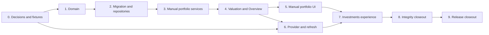

# v0.1.2 Implementation Plan

> **Migration status:** Historical implementation plan copied from the previous implementation line. Re-plan its phases in the current Go + Fyne architecture before execution.

## Execution Contract

This plan turns the [v0.1.2 release contract](v0.1.2.md) and [technical design](v0.1.2-technical-design.md) into reviewable phases. Execute phases in dependency order. A phase is complete only when its code, tests, generated bindings, localization, and documentation are committed together.

**Status:** `Implemented`. All feature phases are complete. Release closeout still lists macOS packaging and VoiceOver as named remaining checks.

Do not launch Tauri development or production bundles against the only copy of real Nestworth data. Migration and smoke tests use temporary or explicitly isolated application-data directories.

## Dependency Flow

## Phase 0 — Decisions, Baseline, and Fixtures

**Deliverables**

- Approve the release contract and technical design.
- Close the market-data and FX provider decision: no live vendor is configured for v0.1.2; production adapters remain unconfigured and tests use deterministic fakes.
- Capture a committed sanitized v0.1.1 database fixture containing Household/settings, Members/Ownership, Institutions/Groups, Balance and Manual Value investment Accounts, liabilities, Account Value history, archives, and retained references.
- Add the v0.1.2 golden valuation fixture and expected exact decimals.
- Record the generated IPC surface, pre-migration v0.1.1 Overview output, and post-migration relationship checks as compatibility evidence.
- Record that v0.1.2 uses no live vendor and therefore does not approve a macOS Keychain boundary.

**Exit checks**

- No open decision can change migration shape, quote precedence, FX orientation, or release acceptance. Provider selection may remain open only if it does not change the approved provider traits or privacy boundary.
- Fixtures contain no personal financial data, credentials, or local filesystem paths.
- The current `bun run check` passes before feature work begins.

## Phase 1 — Domain Values and Portfolio Entities

**Deliverables**

- Add typed UUID v7 IDs for all v0.1.2 entities.
- Implement Quantity, UnitPrice, and FxRate parsers and canonical serializers.
- Implement Instrument type and quote-source enums.
- Implement Instrument, Holding, Account Cash Value, Instrument Quote, FX Quote, preference, freshness, and valuation-result domain types.
- Extend Account creation policy so Holdings is valid only for Investment and has no initial Account Value.
- Preserve immutable TrackingMode and default currency.

**Required tests**

- Decimal syntax, normalization, maxima, zero rules, positive FX, overflow, and rounding.
- FX orientation and direct/inverse equivalence.
- Instrument identity and type parsing.
- Holding same-Household, mode, uniqueness, quantity, and archive rules.
- Mode-dependent Account initial-value rules and unchanged v0.1.1 Account behavior.

**Exit checks**

- Domain code has no SQL, Tauri, provider, or frontend dependency.
- No financial value uses binary floating point.
- `bun run rust:test`, formatting, and Clippy pass.

## Phase 2 — Migration and Repositories

**Deliverables**

- Add migration `002` with the planned tables, constraints, foreign keys, and latest-value indexes.
- Add repositories for Instruments, Holdings, Account cash observations, Instrument Quotes, FX preferences, and FX Quotes.
- Implement deterministic default ordering and latest-observation selection.
- Add bounded batch loaders required by Account, Portfolio, and Overview reads.

**Required tests**

- Fresh database reaches schema version 2 once.
- v0.1.1 fixture migrates with every prior row and v0.1.1 result preserved.
- Reopen is idempotent; `foreign_key_check` and `integrity_check` pass.
- Unsupported schema version 3 remains byte-for-byte unchanged and invokes no provider.
- Failed pre-migration snapshot or failed migration produces the existing blocked state.
- Latest quote and cash ordering uses `quoted/effective_at`, `created_at`, then ID.
- Cross-Household and invalid row shapes fail without partial writes.
- Repository list paths use bounded queries and deterministic ordering.

**Exit checks**

- Migration SQL contains no trigger and does not rewrite v0.1.1 Account Values.
- Migration and compatibility tests run through the normal Rust test command.

## Phase 3 — Manual Portfolio Application and IPC

**Deliverables**

- Implement Instrument create, read, update, archive, restore, and logo attachment.
- Implement Holding create, read, quantity/note update, archive, and restore.
- Implement append-only Account cash updates.
- Implement manual Instrument Quote and FX Quote creation with explicit source preference.
- Update Account creation for Holdings and foreign-currency Balance or Manual Value Accounts.
- Add thin Tauri commands in `ipc.rs` and regenerate TypeScript bindings.

**Required tests**

- Every multi-row mutation commits once or leaves all involved tables unchanged.
- Duplicate Holding, archived reference, wrong Household, wrong Account mode, and invalid decimal cases write nothing.
- Manual quote creation and preference change are atomic.
- Existing archived references can be retained but cannot be newly selected.
- Generated bindings contain only the registered command set and expected DTOs.
- Raw SQL and provider internals never cross CommandError.

**Exit checks**

- All manual portfolio behavior works with no network adapter configured.
- `bun run ipc:generate` has been run and `bun run ipc:check` passes.

## Phase 4 — ValuationService and Overview Integration

**Deliverables**

- Implement deterministic Instrument and FX quote selection.
- Implement direct and inverse base-currency conversion with checked decimal arithmetic.
- Value Balance, Manual Value, Holdings, and Account cash through one service.
- Extend Account and Overview DTOs with native/base values, provenance, freshness, completeness, and unvalued diagnostics.
- Preserve liability, inclusion, archive, Ownership, and breakdown semantics after conversion.
- Make Portfolio total include every complete active non-liability included Account, including legacy Balance and Manual Value investment Accounts; report incomplete included Accounts without treating missing values as zero.
- Add portfolio allocation read models for currency, country, and Instrument type, including explicit manual/unclassified buckets for non-Holdings investment Accounts.
- Keep full checked Decimal precision through component valuation and aggregation; round only Money DTO boundaries to four fractional digits midpoint-nearest-even.

**Required tests**

- Golden CNY/SGD/USD scenario totals exactly `62190 CNY`.
- Direct and inverse FX produce the same rounded base result.
- Identity conversion needs no FX quote and preserves Instrument Quote freshness for Manual, Fresh, Delayed, and Stale states.
- Manual and provider quotes with identical values produce identical totals and different provenance.
- Full-precision components aggregate before rounding for Account, Portfolio, and Overview totals.
- Included Manual Value plus Holdings Accounts agree in `accounts`, `total`, completeness, coverage, and allocations.
- Missing quote excludes only the affected component and marks all parent aggregates incomplete.
- Stale and Delayed selected quotes remain valued and labeled.
- Archived and excluded data contributes nothing.
- Overview, Account, and Portfolio outputs agree under the same fixture.
- Query-count tests prove no N+1 path, and read-snapshot tests prevent mixed-version summaries.

**Exit checks**

- No frontend financial formula is needed to render the DTOs.
- Existing v0.1.1 Overview golden tests remain valid.

## Phase 5 — Manual Portfolio UI

**Deliverables**

- Add Holdings as an Investment Account creation choice with mode-specific fields.
- Extend Account detail with Holdings, cash by currency, native/base valuation, and diagnostics.
- Add Instrument create/edit/archive/restore and manual price workflows.
- Add required FX-pair list, manual rate entry, and source-preference controls.
- Add quote provenance, quote time, and Fresh/Delayed/Stale/Manual/Unavailable labels.
- Add English and Simplified Chinese copy for all new states and validation errors.

**Required tests**

- Holdings Account creation does not send a fake initial amount.
- Holding and cash mutations invalidate Account, Overview, Portfolio, quote-status, and affected list queries.
- Forms preserve decimal strings and user input after failure.
- Missing, stale, partial, empty, loading, validation, conflict, and pending states are visible and accessible.
- Keyboard-only creation and manual quote flows restore focus correctly.
- Locale key sets remain identical.

**Exit checks**

- Manual-only users can complete the entire release acceptance scenario offline.
- The frontend does not parse authoritative decimal strings into JavaScript numbers for calculation.

## Phase 6 — Provider Adapters and Batch Refresh

**Entry requirement:** Phase 0 provider decision is approved. v0.1.2 records no live vendor; this phase implements provider traits, unconfigured production adapters, fake test adapters, and batch refresh against those fakes.

**Deliverables**

- Implement QuoteProvider and FxProvider traits plus unconfigured production adapters and deterministic fake adapters.
- Implement provider Instrument search and provider-identity attachment for test/future integration paths.
- Implement refresh for one Instrument, required FX, all prices, and everything; target only Provider-selected Instruments and FX pairs with valid identities.
- Deduplicate work, cap concurrency at four or the stricter provider limit, apply timeouts, and support cancellation.
- Persist successful normalized quotes in short independent transactions.
- Return per-item partial success and safe error categories.
- Do not store provider secrets; v0.1.2 has no live vendor and no Keychain boundary.

**Required tests**

- Deterministic fake-provider tests cover success, timeout, malformed decimal, currency mismatch, authentication failure, rate limit, duplicate requests, cancellation, and mixed partial results.
- Manual FX pairs result in zero provider calls; Provider FX pairs refresh once per normalized pair; mixed preferences refresh only Provider pairs.
- Manual-selected Instruments are not refreshed by the provider; three Holdings of one Provider Instrument trigger one provider quote request.
- Direct and inverse needs for one Provider FX pair trigger one normalized request.
- A failed item does not erase the last quote, manual data, or successful results.
- Refresh holds no write transaction during network I/O.
- Startup, bootstrap, onboarding, and ordinary reads make zero provider calls.
- Logs and errors contain no credentials, raw payloads, quantities, balances, or quote values.

**Exit checks**

- Provider-fixture tests run offline in `bun run check`.
- Live-provider tests are opt-in, documented, and excluded from the default gate.
- Existing CSP and frontend capability allowlist remain unchanged.

## Phase 7 — Investments Experience

**Deliverables**

- Present current portfolio value, completeness coverage, positions, account totals, quote status, and refresh progress.
- Present allocation by native currency, country, and Instrument type, including explicit manual/unclassified buckets for legacy investment Accounts.
- Preserve navigation context between Investments, Account detail, and Instrument editing.
- Keep Activity, performance, return, and chart affordances absent rather than disabled placeholders.

**Required tests**

- Portfolio total and allocation render backend DTOs without recomputation.
- Included Manual Value and Holdings Accounts agree across account rows, total, completeness, coverage, and allocation buckets.
- Incomplete totals identify all missing inputs and never display them as complete.
- Partial refresh updates successful rows and keeps failed rows actionable; Manual pairs are never sent to the provider.
- Empty portfolio, cash-only portfolio, manual-only portfolio, mixed-provider portfolio, and archived data are covered.
- Route refresh, back navigation, keyboard navigation, and accessible announcements work.
- The existing Vite main-chunk warning is reduced through route-level lazy loading rather than hidden by raising the threshold.

**Exit checks**

- The acceptance Household can be created, valued, refreshed, and inspected end to end.
- All user-facing strings exist in both supported languages.

## Phase 8 — Integrity and Compatibility Closeout

- Re-audit transactions, retained archive references, query counts, decimal overflow, quote precedence, freshness clocks, error shielding, Provider-only refresh targeting, and neutral identity conversion.
- Re-run v0.1.1 regression suites and all v0.1.2 golden cases.
- Test migration and blocked startup using isolated databases, including WAL/SHM snapshot behavior and the committed released v0.1.1 fixture.
- Audit provider privacy, capabilities, CSP, dependency licenses, credentials, logs, and network failure behavior.
- Update canonical architecture, domain, data/IPC, engineering, roadmap, and release documentation to implemented truth.

**Exit checks**

- `bun run check` and `git diff --check` pass.
- Generated bindings and locale keys have no drift.
- Every release acceptance criterion has repository evidence or a named manual release check.

## Phase 9 — Release Closeout

**Deliverables**

- Exercise the complete v0.1.1 regression and v0.1.2 portfolio workflow on a fresh isolated database.
- Exercise migration from a copy of a v0.1.1 database and verify readback.
- Exercise offline launch, provider failure, manual fallback, and partial refresh.
- Complete keyboard and VoiceOver smoke tests.
- Build, sign according to the chosen distribution policy, notarize when public, and verify the arm64 `.app` and `.dmg`.
- Finalize version synchronization, changelog date, release contract status, annotated tag, checksums, and artifact retention.

**Exit checks**

- The release PR is reviewable, approved under the chosen policy, and backed by green CI or recorded clean-machine evidence.
- No real database was used as the only migration or smoke-test copy.
- The exact published artifacts are the artifacts that passed verification.

## Phase Status Table

| Phase | Deliverable | Status |
| --- | --- | --- |
| 0 | Decisions, baseline, and fixtures | `Implemented` |
| 1 | Domain values and portfolio entities | `Implemented` |
| 2 | Migration and repositories | `Implemented` |
| 3 | Manual portfolio application and IPC | `Implemented` |
| 4 | ValuationService and Overview integration | `Implemented` |
| 5 | Manual portfolio UI | `Implemented` |
| 6 | Provider adapters and batch refresh | `Implemented` |
| 7 | Investments experience | `Implemented` |
| 8 | Integrity and compatibility closeout | `Implemented` |
| 9 | Release closeout | `Planned` remaining macOS packaging, signing, notarization, isolated-data launch, and VoiceOver |

## Agent Handoff Rules

At the start of each phase, the implementing Agent must:

1. Read the release contract, technical design, this plan, and the canonical document for the layer being changed.
2. Inspect current code, migration, tests, and generated bindings instead of assuming the planned names already exist.
3. State the phase boundary and avoid implementing later-phase UI or provider behavior opportunistically.
4. Preserve unrelated worktree changes and use isolated database fixtures.

At handoff, report:

- Files and contracts changed
- Commands and exact test results
- Generated binding and locale status
- Migration and transaction evidence where applicable
- Known limitations and next-phase prerequisites
- Uncommitted or committed state without implying a push or release
