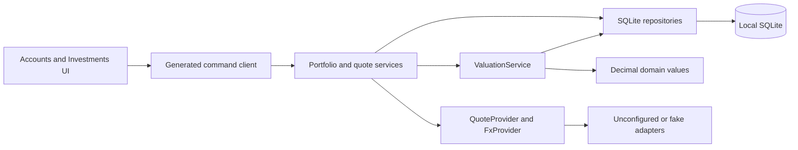

# v0.1.2 Technical Design

> **Migration status:** Historical technical design copied from the previous implementation line. Its Tauri/Rust paths are not current Go + Fyne implementation evidence.

## Purpose and Status

This document is the implementation contract for the [v0.1.2 release](v0.1.2.md). It is intentionally detailed enough to implement migrations, domain types, services, commands, and UI without inventing financial behavior inside a phase.

**Status:** `Implemented`. Names describe the current contract. Migration SQL and generated bindings remain authoritative for physical schema and IPC shape.

Stable v0.1.1 rules remain in the [domain model](../architecture/domain-model.md), [system overview](../architecture/system-overview.md), and [data and IPC contracts](../architecture/data-and-ipc-contracts.md). v0.1.2 additions are recorded there as implemented truth.

## Architecture



Provider calls are optional inputs to local state. They do not run during database bootstrap, migration, onboarding, or ordinary read commands. The frontend never calls a market-data endpoint directly.

## Domain Additions

### Identity

Add typed UUID v7 identifiers for `InstrumentId`, `HoldingId`, `AccountCashValueId`, `InstrumentQuoteId`, and `FxQuoteId`. A provider symbol or provider-specific identifier is metadata, never a Nestworth business ID.

### Decimal Values

All inputs use canonical non-negative decimal strings. Signs are expressed by business meaning, not by negative persisted numbers.

| Type | Accepted scale | Additional rule |
| --- | --- | --- |
| Money | Up to 4 fractional digits | Existing maximum `999999999999.9999` |
| Quantity | Up to 8 fractional digits | Up to 18 integer digits; zero is allowed |
| UnitPrice | Up to 8 fractional digits | Up to 12 integer digits; zero is allowed and remains distinct from a missing quote |
| FxRate | Up to 12 fractional digits | Up to 8 integer digits; must be greater than zero |

Leading-zero, sign, exponent, separator, whitespace, and non-canonical rules follow Money. Persist decimal text, never SQLite `REAL`, Rust `f32` or `f64`, or JavaScript `number`.

Valuation uses checked `rust_decimal` operations at full available precision. Aggregate first and round only values crossing the Money DTO boundary to four fractional digits using midpoint-nearest-even. Overflow returns `DECIMAL_OVERFLOW`; it never clamps, wraps, or substitutes zero.

### Instrument

An Instrument describes what a Holding represents. It belongs to one Household and has:

- Name and optional normalized symbol
- Type: Stock, ETF, Mutual Fund, Crypto, Bond, Precious Metal, Bank Investment Product, or Other
- Quote currency
- Optional market code, two-letter country code, ISIN, provider key, and provider symbol
- Quote preference: Manual or Provider
- Optional logo MediaAsset reference, note, sort order, timestamps, and archive timestamp

Instrument reuse is Household-scoped. When both are present, `(provider key, provider symbol)` must be unique among a Household's non-null provider identities. Symbol alone is not unique because exchanges and asset types overlap. Manual Instruments need no symbol or provider metadata.

### Holding

A Holding belongs to one Holdings Account and references one Instrument. It has a current Quantity, optional note, sort order, timestamps, and archive timestamp.

- The Account and Instrument must belong to the same Household.
- The Account must be an active Investment Account with `TrackingMode::Holdings` when a new Holding is created.
- The same active Instrument appears at most once in one Account.
- Quantity edits replace current state atomically and update `updated_at`; they do not create or imply Activities.
- Zero quantity is valid so a position can be retained before archive. Negative and short quantities are rejected.
- Ownership is inherited from the Account; a Holding has no independent Ownership rows.

### Account Cash Value

Cash inside a Holdings Account is an append-only observation per Account and Currency. Each observation has amount, effective time, creation time, and typed ID. The latest value uses the same deterministic ordering as Account Value.

- An Account may have multiple cash currencies.
- A new observation appends; it does not update a prior row.
- Zero is valid, contributes zero when it is the latest observation, and does not remove prior observations.
- Negative cash and margin are deferred.

### Instrument Quote

An Instrument Quote is an append-only observation with Instrument, UnitPrice, quote currency, source kind, source key, provider metadata, `quoted_at`, and `created_at`.

The quote currency must equal the Instrument quote currency. `source_kind` is `manual` or `provider`. Provider payloads are normalized before persistence; raw payloads are neither durable business data nor exposed through IPC.

### FX Quote

An FX Quote is an append-only observation with base currency, quote currency, FxRate, source kind, source key, provider metadata, `quoted_at`, and `created_at`.

The stored orientation is:

```text
1 base currency = rate quote currency
```

For example, `base=USD`, `quote=CNY`, `rate=6.9` means `1 USD = 6.9 CNY`. Base and quote currencies must differ.

### Quote Preferences

Each Instrument owns its Instrument Quote preference. Each normalized unordered FX pair has one Household-scoped FX preference row identifying Manual or Provider selection. Changing a preference changes future quote selection but never deletes quote history.

## Account Contract Changes

- Balance and Manual Value Accounts may use any syntactically valid CurrencyCode as their default currency.
- Holdings remains valid only for the Investment primary category.
- Creating a Balance or Manual Value Account requires `initialAmount` and appends the corresponding Account Value.
- Creating a Holdings Account requires `initialAmount = null` and writes no Account Value.
- Updating an Account may repeat but not change its TrackingMode or default currency in v0.1.2.
- Existing v0.1.1 Accounts and values require no content rewrite. Their default currency already equals the Household base currency.
- A Holdings Account total is derived from active Holdings and latest cash observations; it is never stored as an Account Value.

The create-account DTO must express these mode-dependent rules explicitly. It must not use a fake zero initial Account Value for Holdings.

## Quote Selection

Instrument and FX selection are deterministic:

1. Read the configured Manual or Provider preference.
2. Filter to matching source kind, required identity, and currency pair.
3. Select by `quoted_at DESC`, `created_at DESC`, `id DESC`.
4. If no selected-source quote exists, return Unavailable. Do not silently fall back to the other source kind.

Manual fallback is an explicit user action: enter the quote and select Manual. Returning to automatic refresh is also explicit: select Provider. This prevents a later network refresh from unexpectedly overriding a manual valuation.

For conversion from native currency `N` to Household base currency `H`:

1. If `N == H`, use identity conversion without an FX Quote.
2. Prefer the selected direct pair `N/H`: `baseValue = nativeValue × rate`.
3. Otherwise use selected inverse pair `H/N`: `baseValue = nativeValue ÷ rate`.
4. If neither exists, return Unavailable.

Direct and inverse records for the same unordered pair share one preference and must not both be fetched in one refresh. Multi-hop conversion through a third currency is deferred.

## Freshness

Freshness is presentation metadata and does not alter deterministic quote selection.

| State | Rule |
| --- | --- |
| Manual | Selected source is Manual |
| Fresh | Provider quote is at most 24 hours old |
| Delayed | Provider explicitly labels a quote that is at most 24 hours old as delayed |
| Stale | Provider quote is more than 24 hours old, regardless of provider metadata |
| Unavailable | No quote exists for the selected source, or conversion cannot be completed |

Identity conversion (`native currency == Household base currency`) has no FX provenance or freshness of its own. It preserves the selected Instrument Quote's Manual, Fresh, Delayed, or Stale state. Stale and Delayed quotes remain usable and visibly labeled. Provider failure never deletes or invalidates the last successful quote. Time comparisons use the current UTC clock through an injectable clock in tests.

## Valuation Service

ValuationService is the only authoritative valuation path.

```text
Balance or Manual Value Account = latest native Account Value × selected FX
Holding native value            = current Quantity × selected Instrument Quote
Holding base value              = Holding native value × selected FX
Holdings Account value          = sum(active Holding base values) + sum(latest cash base values)
Liability contribution          = -(converted Account value)
```

Quote currency is the Holding native-value currency. Account default currency does not force an Instrument into that currency.

Each valuation result carries:

- Native amount and currency
- Base amount and Household base currency when complete
- Selected Instrument Quote reference when applicable
- Selected FX Quote reference when applicable
- Freshness and source labels
- `complete` flag and a stable missing-input reason

An incomplete component is excluded from numeric aggregates and returned in `unvaluedItems`. Aggregate DTOs include `isComplete`; the UI must show an incomplete-total warning whenever it is false. Unknown values must not appear as zero-value allocation rows. The Portfolio total sums every complete, active, non-liability Account with `include_in_investment`, including legacy Balance and Manual Value investment Accounts. An incomplete included Account remains in `accounts`, is reported in `unvaluedItems`, lowers coverage, and contributes no total.

The service retains full checked `Decimal` precision through component valuation, FX conversion, and aggregation. It constructs Money DTOs only at output boundaries, rounding to four fractional digits with midpoint-nearest-even; aggregate inputs are never parsed back from rounded DTO strings.

Overview continues to apply archive and inclusion flags, liability signs, Ownership, and breakdown rounding after base-currency valuation. All combined read models use one SQLite read transaction.

## Allocation

v0.1.2 preserves Category, Member, Institution, and Group breakdowns and adds portfolio allocation by:

- Native currency
- Instrument country, with Unknown bucket
- Instrument type

Portfolio allocation uses the same complete-account denominator as the total. Holdings Account holdings and cash are allocated only when their parent Account is complete. Balance and Manual Value investment Accounts are allocated to their native-currency bucket, an Unknown-country bucket, and an explicit `manual` Instrument-type bucket because they have no Instrument identity. Liabilities are not part of portfolio allocation.

Percentages use total complete portfolio assets as denominator and apply the existing deterministic remainder distribution. An incomplete aggregate displays coverage diagnostics next to allocation. Allocation values and percentages are returned by Rust; the frontend formats them without recomputation.

## Persistence Contract

Migration `002` adds responsibilities without rewriting v0.1.1 financial values:

| Table | Responsibility and key constraints |
| --- | --- |
| `instruments` | Household-scoped Instrument metadata, quote preference, provider identity, archive state |
| `holdings` | Current Account-Instrument quantity, unique active pair, archive state |
| `account_cash_values` | Append-only cash observations by Account and currency, deterministic latest index |
| `instrument_quotes` | Append-only manual/provider Instrument prices and deterministic latest index |
| `fx_quote_preferences` | One selected source per Household and normalized currency pair |
| `fx_quotes` | Append-only oriented FX observations and deterministic latest index |

Use foreign keys, `NOT NULL`, `UNIQUE`, and `CHECK` constraints for row-level shape. Cross-row Household ownership, active-reference, selected-source, and aggregate rules remain in Rust transactions. Do not introduce triggers.

Migration tests must use a committed v0.1.1 fixture and assert row preservation, foreign-key integrity, idempotent reopen, and unchanged v0.1.1 Overview output.

## Application Services and Transactions

Add narrow services for Instruments, Holdings, Quotes, Portfolio reads, provider refresh, and Valuation. Commands remain thin adapters in `ipc.rs`.

- CRUD or archive mutations use `BEGIN IMMEDIATE` and commit once.
- A Holding mutation validates Account, Instrument, Household, archive, and uniqueness inside the same transaction.
- Manual quote creation and preference selection are one transaction.
- Network requests never run while a SQLite write transaction is open.
- Batch refresh collects and normalizes responses first, then persists each successful quote in a short independent transaction.
- A failed item does not roll back unrelated successful refresh results.
- Combined Account, Portfolio, and Overview reads use one read snapshot and bounded queries; N+1 queries are prohibited.

## IPC Surface

Exact DTO names may change once generated, but command responsibilities are locked:

| Group | Commands |
| --- | --- |
| Instruments | list, get, create, update, archive, restore, set logo |
| Holdings | list for Account, create, update quantity and note, archive, restore |
| Account cash | list latest by currency, append value |
| Instrument quotes | list history, append manual quote, change source preference |
| FX | list required pairs and status, list history, append manual quote, change source preference |
| Portfolio | get portfolio summary and allocation |
| Refresh | search provider instruments, refresh selected Instrument, refresh required FX, refresh all |

Account, Overview, and bootstrap DTOs may be extended but must remain backward-compatible at the persisted-data level. Decimal values cross IPC as strings. Refresh returns per-item success or safe failure; it does not reduce partial results to one boolean.

Add stable errors for invalid Quantity, UnitPrice, FxRate, duplicate Holding, quote unavailable, unsupported provider symbol, provider authentication, rate limit, provider unavailable, malformed provider response, decimal overflow, and incomplete valuation. Provider errors expose no credentials, request headers, raw response bodies, or sensitive query parameters.

## Provider Boundary

Define provider traits in Rust application or infrastructure code, outside Account and Valuation services:

```text
QuoteProvider: search instruments, fetch one quote, fetch many quotes
FxProvider: fetch one pair, fetch many pairs
```

Adapters accept normalized requests and return normalized decimals, currencies, source timestamps, provider identifiers, and delayed-state metadata. v0.1.2 production adapters are unconfigured. Tests use deterministic fake adapters. Live network tests are opt-in, excluded from the default gate, and unused because no vendor is selected.

Batch refresh must:

- Derive only quotes required by active included data whose Instrument or FX preference is Provider and whose provider identity is valid.
- Skip every Manual-selected Instrument and normalized FX pair; manual data is never sent to a provider.
- Deduplicate Provider Instruments and normalized FX pairs.
- Use bounded concurrency of four requests unless a stricter provider limit applies.
- Apply a finite timeout and cancellation.
- Respect explicit provider rate-limit responses.
- Log stable event names and counts, never symbols tied to balances, credentials, raw payloads, quantities, or values.

## Frontend Contract

Add `/investments` as a top-level route. Keep Account detail as the owner of Holdings and cash editing for one Account. Instrument and FX dialogs may be nested experiences; storage tables must not dictate navigation.

TanStack Query owns read caching and mutation invalidation. Quote preference, provider search terms, forms, and short-lived refresh progress are UI state. Financial values, coverage, conversion, freshness, and allocation come from Rust DTOs.

When production provider capability is unavailable, the UI must not offer Provider selection, provider search, or automatic refresh that can submit a null provider identity. Manual Instrument, price, and FX workflows remain fully usable. If a capability status is shown, it explains that no production provider is configured.

Every new flow requires:

- Loading, empty, error, partial, stale, unavailable, and pending states
- Duplicate-submit protection and preserved form input on error
- Keyboard operation, visible focus, accessible labels, and announced refresh status
- Matching English and Simplified Chinese locale keys
- Locale-aware decimal display without parsing authoritative amounts into JavaScript numbers

The existing production CSP and frontend capability allowlist remain unchanged. If provider networking requires a new native dependency, its permissions and data handling must be reviewed without granting frontend HTTP or broad filesystem access.

## Security and Privacy

- Provider use is opt-in and local manual operation remains complete. v0.1.2 ships with unconfigured adapters and no stored secrets.
- Secrets never cross IPC or enter SQLite business tables, frontend storage, logs, test fixtures, screenshots, or error messages.
- Provider requests include only the minimum symbol, market, or currency-pair data required for quotes.
- Quote responses are untrusted input and pass the same decimal, currency, time, and size validation as manual input.
- Startup never contacts a provider.
- Unsupported future databases remain blocked before any write or provider action.
