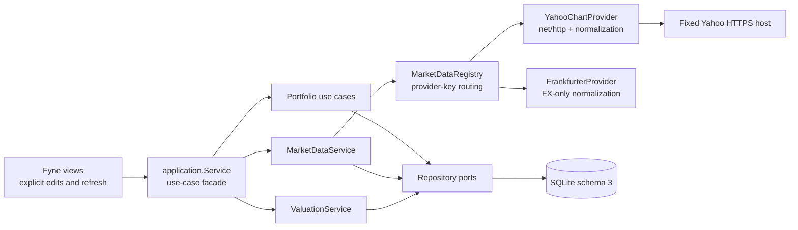

# v0.1.2 Technical Design

## Purpose and Status

**Status:** `Implemented through Phase 9; release closeout in progress`.

This is the Go + Fyne implementation contract for the
[v0.1.2 release](v0.1.2.md). It replaces the copied Rust/Tauri plan. Current
code, schema, and tests remain authoritative for the implemented phases below;
Phase 10 release work remains pending.

The design borrows the current-quote boundary from the original Nestworth
v0.1.6 Yahoo Finance design but intentionally excludes daily history, coverage
cache, snapshot invalidation, and every post-v0.1.2 concept.

## Architecture



`application.Service` remains the single facade held by the Fyne controller so
v0.1.1 view ownership does not fork. Internally it delegates to explicit
portfolio, valuation, and market-data collaborators. Production composition in
`internal/app` injects the provider registry; tests inject fakes through the
same application port.

Suggested package ownership:

```text
internal/domain/decimal.go       Quantity, UnitPrice, FxRate
internal/domain/portfolio.go     Instrument, Holding, cash and quote facts
internal/domain/valuation.go     valuation result vocabulary only
internal/application/service.go  facade and existing v0.1.1 use cases
internal/application/portfolio.go
internal/application/valuation.go
internal/application/marketdata.go
internal/infrastructure/sqlite/migrations.go
internal/infrastructure/sqlite/portfolio_repository.go
internal/infrastructure/marketdata/registry.go
internal/infrastructure/marketdata/yahoo.go
internal/infrastructure/marketdata/frankfurter.go
internal/ui/investments_page.go
internal/ui/instrument_dialog.go
internal/ui/fx_dialog.go
```

Domain and application packages do not import Fyne, SQLite, `net/http`, or a
Yahoo response type. UI code does not import SQLite or market-data
infrastructure.

## Domain Model

### Typed Identity

Add distinct UUID v7-backed types and parsers:

```text
InstrumentID
HoldingID
AccountCashValueID
InstrumentQuoteID
FXQuoteID
```

An external symbol is metadata. It is never parsed as or substituted for a
Nestworth ID.

### Exact Decimal Types

All inputs are canonical decimal strings persisted as SQLite `TEXT` and parsed
directly into `shopspring/decimal.Decimal`.

| Type | Integer digits | Fractional digits | Rule |
| --- | ---: | ---: | --- |
| Money | 12 | 4 | Non-negative; existing maximum applies |
| Quantity | 18 | 8 | Non-negative; zero allowed |
| UnitPrice | 12 | 8 | Non-negative; zero is distinct from unavailable |
| FxRate | 8 | 12 | Strictly greater than zero |

Input rejects signs, leading-zero variants, exponent notation, grouping,
whitespace, and excess scale. Canonical output removes insignificant trailing
zeros. Financial JSON numeric lexemes are retained with `json.Number` and
parsed as strings; they never pass through `float32` or `float64`.

Checked operations wrap decimal-library results with explicit magnitude and
scale validation. Overflow maps to `decimal_overflow`; reciprocal division by
zero is structurally impossible because `FxRate` is positive. Aggregation keeps
full precision. `domain.NewMoney` performs one midpoint-nearest-even rounding
at the returned Money boundary.

### Instrument

An Instrument belongs to one Household and contains:

- ID, Household ID, name, Instrument type, and quote currency
- optional normalized symbol, market code, two-letter country code, ISIN, note,
  logo MediaAsset ID, and sort order
- quote source preference: `manual` or `provider`
- optional `provider_key` and `provider_symbol`
- created, updated, and archived timestamps

Instrument types are `stock`, `etf`, `mutual_fund`, `crypto`, `bond`,
`precious_metal`, `bank_investment_product`, and `other`.

Provider preference requires a complete registered provider binding. Production
accepts `provider_key=yahoo_finance`; Manual needs no provider metadata. Symbol
alone is not unique. Active non-null `(household_id, provider_key,
provider_symbol)` bindings are unique.

### Holding

A Holding belongs to one Holdings Account and references one Instrument. It has
current Quantity, optional note, sort order, timestamps, and optional archive
time.

- Account and Instrument must belong to the same Household.
- New Holding requires an active Investment Account in Holdings mode and an
  active Instrument.
- One active Instrument appears at most once in an Account.
- Quantity replacement is atomic current-state editing, not an Activity.
- Zero quantity is valid; negative quantity is invalid.
- Ownership is inherited from Account.
- Restoring fails with conflict if another active Holding now owns the same
  `(account, instrument)` slot.

### Account Cash Value

Cash in a Holdings Account is an append-only observation per currency. The
latest observation is ordered by `effective_at`, `created_at`, then ID,
descending. Multiple currencies and zero are supported; negative cash is not.

### Quote Facts

Instrument Quote fields:

```text
id, instrument_id, unit_price, currency,
source_kind, source_key, quoted_at, created_at, delayed
```

FX Quote fields:

```text
id, household_id, base_currency, quote_currency, rate,
source_kind, source_key, quoted_at, created_at, delayed
```

FX orientation is `1 base_currency = rate quote_currency`. The two currencies
must differ. Instrument Quote currency must equal the Instrument quote currency.
Quotes are append-only and are never archived, updated, or deleted.

`source_kind` is `manual` or `provider`. Manual rows use `source_key=manual`;
provider rows use their registry key. An exact provider observation duplicate
(target, orientation/currency, source, timestamp, value, delayed flag) is a
cached no-op. A changed value at the same provider timestamp appends a newer
row so deterministic ordering selects the correction.

### FX Pair Preference

FX preference is Household-scoped and keyed by canonical unordered currencies
`currency_a < currency_b`. It stores only selected source kind and timestamps.
It does not store a rate or orientation. Manual entry may use either direction;
the selected FX provider always requests and stores the required
native-to-Household-base direction.

Changing a preference is explicit and atomic but never changes quote rows.
Saving a new manual Instrument or FX quote is itself an explicit Manual action:
the command appends the quote and selects Manual in the same transaction. A
separate source-change command may select an already populated Manual source or
a completely bound Provider source without appending a quote. Provider refresh
never changes either preference.

## Account Contract Changes

- Balance and Manual Value Account currency may differ from Household base.
- A new Holdings Account is Investment only, requires empty `initialAmount`, and
  writes no Account Value.
- Balance and Manual Value still require `initialAmount` and append one Account
  Value in the Account-creation transaction.
- Update may repeat but never change TrackingMode or default currency.
- Existing schema-2 Accounts need no row rewrite.
- A Holdings Account derives current value from active Holdings and latest cash;
  it never stores an aggregate Account Value.

Repository creation must accept an optional Account Value rather than a
required value. It must validate the mode-dependent shape again inside the
single write transaction.

## Quote Selection and Freshness

For an Instrument or normalized FX pair:

1. Read the explicit selected source.
2. Filter quotes to the target, selected source, and required currency/pair.
3. For FX, include both stored orientations of the normalized unordered pair.
4. Select `quoted_at DESC, created_at DESC, id DESC` across the candidates.
5. Return Unavailable when the selected source has no matching quote.

There is no implicit fallback from Provider to Manual or Manual to Provider.
The user changes preference explicitly.

Provider freshness uses the injected valuation clock:

- `Fresh`: not delayed and age is at most 24 hours.
- `Delayed`: adapter marks the selected observation delayed and age is at most
  24 hours.
- `Stale`: older than 24 hours, regardless of delayed flag.
- `Manual`: selected source is Manual; do not imply live freshness.
- `Unavailable`: no selectable quote.

Identity FX uses no quote and has no FX freshness. A valued position exposes
Instrument and FX provenance separately rather than collapsing two quote states
into one ambiguous badge.

## ValuationService

All current value reads use one `ValuationService` over one repository read
snapshot.

### Component Algorithm

```text
Balance or Manual Value:
  native = latest Account Value

Holding:
  native = Quantity * selected Instrument UnitPrice

Account cash:
  native = latest cash Money

Base conversion:
  native currency == Household base  -> identity
  selected direct native/base quote  -> native * rate
  selected inverse base/native quote -> native / rate
  otherwise                          -> unavailable
```

No multi-hop graph is built. Full-precision native and converted decimals are
aggregated before returned Money values are rounded.

### Result Shape

Application view models expose canonical strings through typed fields:

```text
MoneyView              amount, currency
QuoteEvidenceView      source, sourceKey, quotedAt, freshness
MissingInputView       kind, accountId, optional instrumentId, currencies
ValuedComponentView    native, optional base, priceEvidence, fxEvidence
AccountValuationView   valuedSubtotal, complete, components, missingInputs
OverviewView           assets, liabilities, netWorth, complete, missingInputs
PortfolioView          valuedSubtotal, complete, accounts, positions,
                       allocations, missingInputs
```

Missing data excludes only its component. Parent results retain other valued
components and set `complete=false`. `netWorth` is the valued asset subtotal
minus valued liability subtotal and is also explicitly incomplete when any
included component is missing.

Portfolio includes active non-liability Accounts with
`include_in_investment=true`, including legacy Manual Value investment
Accounts. Allocations are computed from valued components using the same valued
subtotal denominator. Manual Value investments use `manual`, `unknown_country`,
and their native-currency buckets. Missing components appear only in
diagnostics, never as zero-valued allocation rows.

Overview preserves current Category, Member, Institution, and Group meanings.
Ownership weighting is applied to full-precision base values before rounding,
with deterministic basis-point remainder distribution.

## Persistence and Migration

### Schema Version

The current Go database is schema `2`; v0.1.2 is migration `2 -> 3`. Fresh
database creation continues through the same ordered migration runner and ends
at `3`. Do not label these tables as migration `002`.

Add:

```text
instruments
holdings
account_cash_values
instrument_quotes
fx_quote_preferences
fx_quotes
```

Required constraints and indexes include:

- Household and target foreign keys with retained-reference-safe delete rules.
- decimal text shape checks as defense in depth; Go owns canonical parsing.
- Instrument active provider-binding partial unique index.
- Holding active `(account_id, instrument_id)` partial unique index.
- latest cash index `(account_id, currency, effective_at DESC, created_at DESC,
  id DESC)`.
- latest Instrument Quote index `(instrument_id, source_kind, quoted_at DESC,
  created_at DESC, id DESC)`.
- canonical FX preference primary key `(household_id, currency_a, currency_b)`
  plus `currency_a < currency_b` check.
- FX lookup index on Household, pair currencies, source, quote/create time, ID.

Migration creates no Instrument, Holding, quote, FX preference, provider
binding, or network request and rewrites no v0.1.1 financial row.

`DB.Verify` must fingerprint new required tables/columns/indexes in addition to
running `foreign_key_check` and `integrity_check`. An existing schema-2 file gets
the current recoverable pre-migration sibling snapshot before migration.
Schema `4` blocks before any migration, business write, settings write, or
provider request.

### Repository Boundaries

Keep application-facing interfaces semantic and bounded. Do not expose
`*sql.Tx`, SQL rows, or provider payloads. Read methods needed by valuation must
load all active Accounts, ownership, latest Account Values, Instruments,
Holdings, latest cash, preferences, and candidate quotes in a single consistent
snapshot without N+1 queries.

Multi-row use cases use one `DB.WithTx` transaction. Provider network calls
occur before any write transaction. Each successful refresh target persists in
its own short transaction so one failure cannot roll back another success.

## Market Data Boundary

### Stable Application Port

`internal/application` owns provider-neutral types:

```go
type MarketDataProvider interface {
    Key() string
    Capabilities() MarketDataCapabilities
    LatestInstrument(context.Context, InstrumentMarketIdentity) (LatestInstrumentQuote, error)
    LatestFX(context.Context, FXMarketIdentity) (LatestFXQuote, error)
}
```

`MarketDataRegistry` resolves compiled-in provider keys and exposes a
deterministic provider list for Settings. Production registers
`yahoo_finance` and `frankfurter`; tests register deterministic fakes.
Settings selects the provider used only by explicit FX refresh, defaulting to
Yahoo for existing installations. Instrument refresh uses its saved provider
key and symbol, independently of the FX selection. Frankfurter advertises
`latestFX` only.

The capability vocabulary for v0.1.2 is `latestInstrument`, `latestFX`,
`instrumentSearch`, and `dailyHistory`. Yahoo advertises the two latest-quote
capabilities; Frankfurter advertises `latestInstrument=false` and
`latestFX=true`. Search and daily history remain false for both.

### Yahoo Chart Adapter

The only Yahoo-specific route is:

```text
GET https://query1.finance.yahoo.com/v8/finance/chart/{encoded_symbol}
    ?range=1m&interval=1d
```

Build the URL with `net/url`; treat the symbol as one escaped path segment and
use a fixed HTTPS scheme and host. Disable redirects. Send no cookie,
credential, Account ID, Holding ID, quantity, balance, ownership, or other
financial context.

The Go adapter copies the Rust REST client's browser header profile exactly for
`Accept`, `Accept-Language`, `Priority`, `Sec-CH-UA*`, `Sec-Fetch-*`,
`Upgrade-Insecure-Requests`, and `User-Agent`. It intentionally sends
`Accept-Encoding: identity` instead of advertising the Rust client's gzip,
deflate, Brotli, and Zstandard codecs; this keeps the Go adapter dependency-
light while making the response encoding explicit. An unexpected encoded
response is rejected as malformed.

The response decoder uses `json.Decoder.UseNumber`, requires exactly one chart
result, and accepts:

1. valid `meta.regularMarketPrice` plus `meta.regularMarketTime`; otherwise
2. the last valid non-null close with an aligned timestamp.

The first path is not delayed. Close fallback is delayed. Instrument
`meta.currency` must equal configured quote currency. FX requests derive the
symbol as `{FROM}{TO}=X`, require a positive direct rate, and store exactly that
orientation. Missing value/time, API error, non-single result, array mismatch,
currency mismatch, invalid decimal scale, invalid timestamp, or oversized body
fails the target without a write.

Use standard `net/http` with:

- total request timeout of eight seconds;
- redirects rejected by `CheckRedirect`;
- 2 MiB Content-Length precheck plus a limit-plus-one streamed read that rejects
  any body whose actual bytes exceed the cap;
- one shared semaphore of size two;
- deterministic target ordering in bulk operations;
- no automatic retry.

HTTP 429 maps to `provider_rate_limit` and stops later Yahoo requests in that
bulk operation. Timeout, transport errors, and 5xx map to
`provider_unavailable`; 401/403 to `provider_authentication`; validated 404 or
chart unknown-symbol errors to `unsupported_provider_symbol`; contract/parse
errors to `malformed_provider_response`.

### Frankfurter FX Adapter

The Frankfurter adapter uses only the fixed public HTTPS route:

```text
GET https://api.frankfurter.dev/v2/rate/{base}/{quote}
```

It sends no API key or financial context. The response must contain the
expected three-letter `base` and `quote`, an ISO date, and a positive decimal
`rate`. `json.RawMessage` plus a decimal lexeme parser preserves the provider's
numeric representation without a binary floating-point conversion. The
returned date is stored as `quoted_at` and the observation is marked delayed
because the public rate is daily. Frankfurter is FX-only; it cannot satisfy an
Instrument refresh.

Frankfurter maps 400/404/422 to `unsupported_provider_symbol`, 429 to
`provider_rate_limit`, 5xx and transport/timeout/cancellation errors to
`provider_unavailable`, redirects and malformed payloads to
`malformed_provider_response`, and oversized bodies to
`market_data_response_too_large`. Its request timeout, redirect rejection,
2 MiB body cap, shared two-request semaphore, and fake transport seam match
the bounded provider contract. No raw URL, response body, or provider error is
returned to the UI.

Logs contain operation, target counts, status counts, and duration only. They
must not contain URLs, symbols, IDs, headers, response bodies, price/rate
values, quantities, balances, or credentials.

### Refresh Result

Each item reports a stable target key and one status:

```text
fetched | cached | skipped | failed | rate_limited
```

It may include a stable error code but no raw provider message or financial
amount. Successful normalization persists before reporting fetched. A provider
refresh never changes Manual/Provider preference.

## Fyne Contract and Concurrency

Add Investments to the existing top-level navigation. Account detail owns
Holding and cash editing for one Account. Instrument and required-FX management
may use dialogs or secondary pages; table layout does not dictate navigation.

Provider calls run in a cancellable worker goroutine. The initiating view owns
its `context.CancelFunc`; leaving/rebuilding that view cancels outstanding work.
Only the completion callback crosses back with `fyne.Do`. The callback
checks an operation generation token before applying state so a cancelled or
older result cannot overwrite a newer request. Duplicate submit is disabled
while one action is pending.

Ordinary local reads remain synchronous only if bounded enough not to stall the
UI; valuation/list reads introduced here should use the same worker/result
pattern when they can exceed one frame. No goroutine directly mutates a Fyne
widget.

Every new flow covers loading, empty, validation, conflict, pending, partial,
stale, unavailable, provider error, and retry. Decimal form values remain
strings. On error, preserve form input and restore focus. Status is expressed
with text as well as color, and completion is announced accessibly where Fyne
supports it.

FX provider selection appears in Settings only for registered providers with
`latestFX`. Instrument provider selection still requires a complete registered
binding, and Yahoo has no symbol-search UI. Every provider-facing view displays
the applicable bilingual unofficial/unaffiliated availability disclaimer.

## Security and Privacy

- Native Go infrastructure is the only network surface.
- Fixed scheme/host, escaped path, redirects disabled, timeout, size cap, and
  strict normalization prevent an arbitrary-fetch capability.
- Startup, migration, bootstrap, passive read, view construction, focus, and
  timer paths make zero provider requests.
- Manual workflows remain complete without network access.
- No secret is required or stored.
- Provider errors and UI results expose no raw response or sensitive request
  detail.
- A malicious provider value cannot persist without passing decimal, currency,
  timestamp, target, Household, archive, and preference validation.

## Stable Error Codes

Add domain/application codes where current categories are insufficient:

```text
invalid_quantity
invalid_unit_price
invalid_fx_rate
decimal_overflow
duplicate_holding
quote_unavailable
provider_unavailable
provider_authentication
provider_rate_limit
unsupported_provider_symbol
malformed_provider_response
market_data_response_too_large
incomplete_valuation
```

User-facing errors remain localized and safe. SQLite and raw provider errors
stay in redacted local diagnostics.

## Design Invariants Checklist

- No Yahoo type, URL, or field leaves its infrastructure adapter.
- No financial value crosses a binary floating-point boundary.
- No read path contacts a provider.
- No provider request starts while a database write transaction is held.
- No invalid response writes a quote.
- No refresh changes preference or old quote rows.
- No Manual-selected target is sent to Yahoo.
- No missing quote becomes zero, one, or a multi-hop estimate.
- Overview, Account, and Portfolio use the same snapshot and valuation service.
- Provider failure never blocks startup or local manual work.
