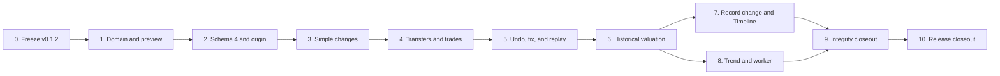

# v0.1.3 Implementation Plan

## Execution Contract

**Status:** `Phases 0-10 implemented and committed; public distribution checks pending`.

This plan implements the [release contract](v0.1.3.md) and
[technical design](v0.1.3-technical-design.md). Execute phases in order. A
phase is complete only when its code, tests, localization, documentation, and
exit checks are complete.

Do not implement schema 4 on an assumed v0.1.2 shape. Do not test migration or
history work against a real user database. Do not turn the internal effect model
into a professional ledger UI.

## Dependency Flow

## Phase 0 — Freeze the Actual v0.1.2 Baseline

### Deliverables

- Complete and verify v0.1.2 first; record its commit, application version,
  schema fingerprint, migration path, interfaces, query bounds, and Fyne page
  ownership in the compatibility baseline.
- Commit the sanitized schema-3 fixture, `62190 CNY` complete golden, `40990
  CNY` partial golden, and all v0.1.3 golden starting cases.
- Resolve every difference between actual v0.1.2 and the assumed schema-3
  design, including optional Account initial values and portfolio snapshot
  shape. Renumber schema 4 before work if necessary.
- Prototype English/Simplified Chinese labels and the one-page Record change
  workflows with non-accountant review. Keep the seven family-facing choices;
  do not expose effects or classifications.

### Required Checks

- Fresh, migrated schema-2, frozen schema-3, corrupt, and future-schema fixtures
  behave deterministically and contain no personal data.
- Baseline Overview, Account, Investments, selected-source, and completeness
  results are exact before any history table exists.
- Normal Go tests, vet, race-sensitive package tests, formatting, and diff
  checks pass at the frozen commit.

### Exit Checks

- No open decision can change migration number, origin shape, effect targets,
  ordering, timezone, projection compatibility, or friendly vocabulary.
- Phase 0 evidence is current Go/Fyne evidence, not copied Rust/Tauri results.

## Phase 1 — Change Domain, Time, and Preview

### Deliverables

- Add typed IDs, Activity kinds/reasons/classifications, effects, correction
  links, and exact trade/transfer detail.
- Add typed friendly commands and one effect builder per workflow.
- Add local-time resolution for confirmed IANA timezone, including ambiguous
  and nonexistent wall times.
- Implement `PreviewChange` as a pure application operation over injected state;
  return friendly sentences and resulting endpoint views.

### Required Tests

- Every command accepts only its approved fields and emits exactly its approved
  effect roles/classifications.
- Cross-currency rate and trade unit price use exact decimal operations; binary
  floats never enter the path.
- Future, pre-origin, ambiguous, nonexistent, overflow, negative, no-change,
  cross-Household, wrong-mode, and archived-target cases return stable errors.
- Preview performs zero writes and zero network calls.

### Exit Checks

- Domain imports no Fyne, SQLite, HTTP, or provider package.
- UI can render preview without reproducing financial arithmetic.

## Phase 2 — Schema 4, Repositories, and Starting Point

### Deliverables

- Add ordered migration `3 -> 4`, all technical-design tables, indexes,
  constraints, foreign keys, and projection metadata.
- Extend database verification and future-schema refusal.
- Add bounded repositories for origin, Activity/effects, state/preference
  observations, Quantity projections, snapshot revisions, and dirty state.
- Implement existing-Household and fresh-onboarding Starting point transactions,
  idempotent retry, and mutation gate.

### Required Tests

- Fresh schema 4 and frozen schema-3 migration preserve every old row, selected
  current result, archive state, quote preference, identity, and foreign key.
- Migration writes no Activity/origin, makes no network call, and rolls back
  completely on injected failure.
- Starting point captures one consistent state, writes zero Activities, commits
  all or none, and returns the same origin on retry.
- Concurrent attempts produce one origin; unresolved timezone blocks mutation;
  future schema is byte-for-byte unchanged.
- Repository query counts are bounded and `foreign_key_check`/integrity pass.

### Exit Checks

- Opening or migrating a database cannot fabricate income, spending, trade, or
  transfer history.
- A sanitized migrated fixture reopens idempotently.

## Phase 3 — Money, Value, and Debt Changes

### Deliverables

- Implement Money added/removed, value update, debt draw, and debt payment.
- Append Activity/effects and compatible Account Value/cash projections in one
  `BEGIN IMMEDIATE` transaction.
- Route post-origin financial mutations and non-zero Account/Holding starting
  values through ChangeService.
- Mark the earliest affected closed day dirty after successful commit.

### Required Tests

- Current results match effect replay and existing v0.1.2 latest-observation
  rules after every workflow.
- Income/contribution/expense/fee/principal/remeasurement classification is
  exact; debt interest or fee is separate from principal.
- No-change, insufficient balance, negative endpoint, stale preview, wrong
  Household, and injected projection failure write nothing.
- A today-only change leaves no closed-day pending work.

### Exit Checks

- No public post-origin amount mutation can bypass an Activity.
- Ordinary saves perform zero provider calls and keep current reads available.

## Phase 4 — Transfers and Investment Trades

### Deliverables

- Implement same-currency and cross-currency cash transfer.
- Implement same-Instrument Quantity transfer between Holdings Accounts.
- Implement Buy/Sell with gross amount, derived unit price, settlement cash,
  and optional explicit fee.
- Add backend-generated previews and stable saved-entry read models.

### Required Tests

- Transfers are atomic, conserve their native endpoints, and contribute zero
  external flow; both cross-currency amounts and derived rate survive roundtrip.
- Buy/Sell exactly updates Quantity and cash; principal is internal and only an
  explicit fee is external.
- Currency mismatch, different Instrument, insufficient cash/Quantity, zero
  Quantity, invalid gross/fee, overflow, and partial insert roll back fully.
- The release acceptance examples produce their exact expected values.

### Exit Checks

- Saving needs no historical/market quote and performs no provider request.
- No Fyne package computes rate, unit price, effect, or resulting balance.

## Phase 5 — Effective State, Undo, Fix, and Backdated Replay

### Deliverables

- Append effective Account state, Ownership, Instrument preference, and FX
  preference observations after origin.
- Implement Undo and atomic Fix entry with correction-group relationships.
- Implement deterministic ordered endpoint replay and append current `replay`
  projections after accepted backdated changes.
- Require zero Quantity before Holding archive.

### Required Tests

- Replay uses exact total ordering and rejects any intermediate negative state.
- Undo is an exact inverse, a second undo is rejected, and archived references
  remain resolvable.
- Fix commits inverse plus replacement together or neither; current state and
  effective history agree after reopen.
- Backdated state/preference/Ownership changes affect only their valid interval
  and mark the earliest closed date dirty.
- Concurrent writes serialize or return a stable conflict without partial rows.

### Exit Checks

- No evidence row is edited or deleted in place.
- Timeline can collapse a correction while still exposing original evidence.

## Phase 6 — Historical Valuation and Snapshot Revisions

### Deliverables

- Implement origin-plus-effect reconstruction at an arbitrary cutoff.
- Reuse v0.1.2 valuation semantics with effective state/preferences and quotes
  at or before cutoff.
- Implement daylight-saving-safe closed-day cutoffs, snapshot header/items,
  provenance, completeness, content hash, and append-only revisions.
- Implement dirty-range coalescing and resumable batches of at most 31 days.

### Required Tests

- Historical value never selects a future Activity, state observation,
  preference, price, or FX quote.
- DST transition days, timezone immutability, same-timestamp ordering, direct/
  inverse FX, identity conversion, archive intervals, and Ownership pass.
- Missing quote/FX retains valued subtotal and a deterministic missing component;
  incomplete days do not halt later days.
- Unchanged rebuild appends no revision; changed input appends and supersedes
  one revision; cancellation resumes without holes.
- Today-only dirtiness is not pending; all snapshot work makes zero network
  calls and has bounded queries.

### Exit Checks

- Origin and Activity facts are sufficient to regenerate every closed-day cache
  row from persisted local inputs.
- Snapshot failure cannot corrupt current financial state.

## Phase 7 — Fyne Record Change and Timeline

### Deliverables

- Rename the Activity navigation destination to History and add Timeline.
- Add Start history here setup and the seven family-facing Record change forms.
- Add backend preview, optional advanced time/note, saved detail, Undo, and Fix.
- Add Account/date/type filters with keyset pagination and Account-history
  integration.
- Add paired English/Simplified Chinese strings and accessible keyboard flow.

### Required Tests

- Draft input survives validation, persistence, and navigation refresh errors.
- The UI sends typed strings and IDs, renders backend results, and performs no
  financial calculation.
- Loading, empty, starting-point, partial, corrected, archived-reference,
  insufficient-state, and retry states are visible and keyboard-operable.
- Timeline ordering, pagination, filter reset, cancellation, and stale-generation
  suppression are deterministic; locale key sets match.

### Exit Checks

- A family user can complete every release scenario without seeing Activity
  effects, debit/credit, snapshot revision, or dirty-range controls.
- Fyne race-sensitive tests and isolated-data smoke launch pass.

## Phase 8 — Net-Worth Trend and Foreground Worker

### Deliverables

- Add 30-day, one-year, and all-history trend plus accessible table.
- Use live current ValuationService for today and latest closed-day snapshot
  revisions for earlier dates.
- Start a cancellable foreground worker after relevant save and while History or
  a trend is open; expose simple progress, partial, failed, and retry states.
- Add direct navigation from missing input to dated manual quote entry where the
  v0.1.2 workflow supports it.

### Required Tests

- Chart/table values, dates, completeness, and selected range agree exactly;
  pre-origin dates are absent.
- Current Overview remains responsive during rebuild; worker yields, cancels on
  page disposal, resumes, and ignores stale UI generations.
- Provider fakes prove zero calls during open, save, rebuild, retry, and missing
  manual-quote repair.
- All-history reads page data and stay within frozen query/memory bounds.

### Exit Checks

- Users see only updating/complete/partial/failed language, never internal
  rebuild machinery.
- Closing the app safely stops work; reopening resumes from persisted state.

## Phase 9 — Integrity, Privacy, and Compatibility Closeout

### Deliverables

- Run the baseline fixture through migration, start, all workflows, correction,
  rebuild, archive/restore, reopen, and future-schema refusal.
- Add transaction-failure, concurrency, corruption, query-bound, memory-bound,
  localization, log-redaction, and no-network regression suites.
- Audit all direct financial mutation paths and remove/bind any bypass.
- Update architecture, domain model, manual testing, privacy, and release docs to
  describe shipped behavior only.

### Required Checks

- `go test ./...`
- `go test -race ./...`
- `go vet ./...`
- formatting and `git diff --check`
- SQLite `foreign_key_check` and `integrity_check` for fresh and migrated fixtures
- deterministic test proving zero external requests in all non-refresh paths

### Exit Checks

- Every release acceptance item maps to a named automated or manual check.
- No copied Rust/Tauri status, command, count, or evidence remains in active
  v0.1.3 documents.

## Phase 10 — Release Closeout

### Deliverables

- Set application/version metadata to `v0.1.3` only after Phases 0-9 pass.
- Build/package macOS arm64 with isolated data; run clean-install and migrated-
  fixture smoke tests without touching a real user database.
- Complete keyboard, VoiceOver, English/Simplified Chinese, partial-history,
  cancellation/resume, and offline manual QA.
- Complete signing/notarization where available and record gaps honestly.
- Update release status, roadmap, and evidence with exact commands and results.

### Exit Checks

- Public artifacts start, preserve data, create/replay changes, display partial
  history honestly, and make no implicit provider request.
- Any unperformed packaging, accessibility, signing, or notarization step remains
  explicitly pending; green unit tests do not imply it.

## Release Completion Rule

v0.1.3 is complete only when all phases and release-contract acceptance checks
pass against both a fresh database and the sanitized migrated v0.1.2 fixture.
The release must remain a simple family timeline in presentation even though
its internal evidence and replay rules are rigorous.
