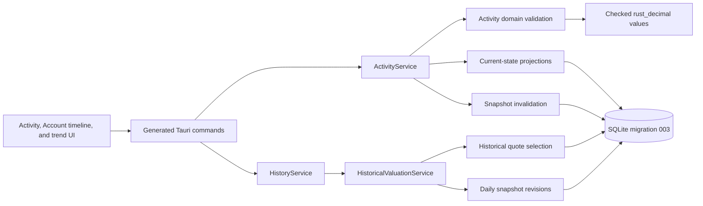

# v0.1.3 Technical Design

> **Migration status:** Historical technical design copied from the previous implementation line. Its Tauri/Rust paths are not current Go + Fyne implementation evidence.

## Purpose and Status

This document is the implementation contract for the [v0.1.3 release](v0.1.3.md). It defines the ledger, projection, origin, correction, and historical-valuation semantics that implementation phases must preserve.

**Status:** `Implemented`. Names describe the current contract in code: `ActivityService`, `HistoricalValuationService`, History Origin repositories, snapshot rebuild, and the `/activity` plus Overview trend UI. Migration SQL and generated bindings remain authoritative for physical schema and IPC shape.

## Architecture



The Activity ledger records why state changed. Account Values, Account Cash Values, and Holding Quantity observations represent resulting state. Daily snapshots record how that state was valued. These are related but distinct facts:

```text
Activity fact        -> why a change occurred
Projection fact      -> resulting current component state
Quote fact           -> observed market or FX input
Snapshot revision    -> value calculated from state and quotes for one day
```

No frontend layer writes SQLite, derives ledger legs, calculates resulting balances, or calculates historical totals.

## Domain Additions

### Typed Identity

Add distinct UUID v7 Rust types:

- `ActivityId`
- `ActivityLegId`
- `HistoryOriginId`
- `HistoryOriginItemId`
- `AccountStateObservationId`
- `HoldingQuantityValueId`
- `QuotePreferenceObservationId`
- `ValuationSnapshotId`
- `ValuationSnapshotItemId`

IDs cross SQLite and IPC as lowercase hyphenated strings. A reversal or correction link references an `ActivityId`; it is not encoded in notes or external metadata.

### Activity Header

An Activity header contains:

| Field | Contract |
| --- | --- |
| ID | Typed UUID v7 |
| Household | Required root owner |
| Kind | Closed enum defined below |
| Effective time | UTC RFC 3339 milliseconds derived in Rust from local date/time and the History Origin timezone |
| Effective local date | Persisted `YYYY-MM-DD` used for filters, daily invalidation, and display |
| Created time | Backend-generated UTC RFC 3339 milliseconds; immutable |
| Note | Optional bounded text |
| Reverses | Optional original Activity ID; unique when present |
| Corrects | Optional original Activity ID on the replacement record |
| Correction group | Optional typed link shared by reversal and replacement |

Activity kinds are:

```text
opening_adjustment
balance_adjustment
position_adjustment
deposit
withdrawal
transfer
buy
sell
income
fee
debt_draw
debt_payment
debt_adjustment
manual_valuation
reversal
```

`reversal` retains the original kind through its `reverses` link and inverse legs. It does not erase or mutate the original record.

### Activity Legs

An Activity contains ordered legs. A leg is not a free-form double-entry row exposed to users. Rust constructs legs from a kind-specific command and validates the complete set.

Each leg contains:

| Field | Contract |
| --- | --- |
| ID and Activity ID | Typed identity and parent |
| Account ID | Required Account endpoint |
| Role | Source, destination, holding, settlement, fee, income, liability, or adjustment |
| Component | Account Value, Holdings Cash, or Holding Quantity |
| Direction | Increase or decrease |
| Currency and amount | Required together for monetary components; positive canonical magnitude |
| Instrument, Holding, and Quantity | Required together for Quantity components; positive canonical magnitude |
| FX rate | Present on cross-currency cash transfer legs; derived by Rust from destination / source |
| Sort order | Stable order within the Activity |

Direction carries the sign. Adjustment and valuation inputs are absolute targets, but Rust converts the difference from current state into an increase or decrease leg before posting. A target equal to current state is rejected as a no-change Activity. This keeps every persisted leg additive, non-zero, and exactly reversible even when later Activities touch the same endpoint. Persisted `Money`, `Quantity`, `UnitPrice`, and `FxRate` values remain unsigned canonical decimal text. Rust may use signed intermediate `Decimal` values while validating and aggregating, but no negative financial string crosses IPC or persistence.

Exactly one component shape is valid per leg:

- Account Value: Account, currency, amount, and direction
- Holdings Cash: Holdings Account, currency, amount, and direction
- Holding Quantity: Holdings Account, Instrument, Holding, Quantity, and direction

The database enforces row shape with `CHECK`, `NOT NULL`, and foreign keys. Rust enforces cross-leg balance, same-Household, TrackingMode, archive, sufficient-state, and Activity-kind rules.

### User-Facing Activity Inputs

IPC uses a tagged union of kind-specific inputs. It never accepts raw legs.

| Input | Required facts and rules |
| --- | --- |
| Opening Adjustment | New component and positive absolute opening state; only after History Origin and only when no prior post-origin financial state exists |
| Balance Adjustment | Balance Account and absolute resulting Money |
| Position Adjustment | Holdings Account, Instrument, and absolute resulting Quantity |
| Deposit | One monetary destination and Money |
| Withdrawal | One monetary source and Money |
| Transfer | Source, destination, exact source and destination amounts; same-currency equality or derived cross-currency rate; optional explicit fee |
| Buy / Sell | Holdings Account, Instrument, Quantity, UnitPrice, gross amount, settlement currency, optional explicit fee |
| Income | Monetary destination, Money, income kind, optional Instrument reference |
| Fee | Monetary source, Money, fee kind, optional Instrument or related Activity reference |
| Debt Draw | Liability increase and optional equal-currency or explicit-FX cash destination |
| Debt Payment | Liability decrease and cash source; optional separately classified fee |
| Debt Adjustment | Liability Account and absolute resulting principal |
| Manual Valuation | Manual Value Account and absolute resulting Money |

Monetary endpoints are Balance Accounts or a specific currency inside a Holdings Account. Manual Value Accounts accept Manual Valuation, not Deposit, Withdrawal, or Transfer. A liability endpoint uses Debt commands, not a generic Transfer.

### Transfer Invariants

Cash transfer is one Activity with at least two legs.

For the same currency:

```text
source.currency = destination.currency
source.amount   = destination.amount
external flow   = 0
```

For different currencies the two native amounts are the ledger facts:

```text
1 source currency = (destination / source) destination currency
```

Rust derives that transaction FxRate, stores the canonical value (at most 12 fractional digits) on both cash legs, and returns both orientations on the Activity overlay. The user does not enter a transaction rate. A platform display quote such as `5.35 CNY → 1 SGD` is not an input.

A fee is an additional explicit Fee leg on the source endpoint, or a linked Fee Activity; it is never inferred from a worse transaction rate. Conversion spread is not a leg. It is a recomputable overlay:

```text
spread = dest_base(market FX at effective_at) − source_base(market FX at effective_at)
external flow = 0
```

If the required market FX quote is missing, the transfer still posts and the overlay status is `unavailable`. A later quote with `quoted_at` at or before effective time makes the overlay `computed` without rewriting the Activity. Subsequent market FX movement after the transfer remains ordinary FX movement and is not an Activity.

A position transfer has one decrease and one increase for the same Instrument and exact Quantity. Both Accounts must be active Holdings Accounts in the same Household. It changes neither external flow nor cost-basis identity. v0.1.3 does not transfer tax lots because lots do not exist yet.

### Trade Invariants

A Buy or Sell is one Activity with a Quantity leg, a settlement-cash leg, and an optional Fee leg.

```text
gross amount = Quantity × UnitPrice
```

The multiplication uses full checked Decimal precision and crosses Money scale once. In v0.1.3, settlement currency must equal the Instrument quote currency. A different settlement currency requires an explicit cash FX Transfer before or after the trade.

- Buy increases Quantity and decreases cash by gross amount plus explicit fee.
- Sell decreases Quantity and increases cash by gross amount minus an explicit fee.
- A Sell cannot exceed current Quantity.
- A Buy cannot make settlement cash negative.
- Zero Quantity trades are invalid even though a current Holding Quantity of zero is valid.
- Unit Price may be zero only when the domain already allows it, but a zero-price trade requires explicit confirmation and remains distinguishable from missing price data.

The Activity permanently records side, Quantity, Unit Price, gross amount, settlement currency, and fee. v0.1.4 may derive cost basis from these facts but must choose its own lot policy.

### Debt Invariants

Liability principal remains stored as non-negative Money.

- Debt Draw increases liability principal. When paired with a cash destination, the principal movement is internal and net-worth neutral at the recorded transaction basis.
- Debt Payment decreases liability principal and its cash source. Principal is internal; interest or fees use an explicit Fee leg.
- Debt Adjustment sets principal to an observed value and is classified as remeasurement, not external flow.
- A Debt Payment cannot make liability principal or cash negative.

### External Flow and Change Classification

Rust derives classification from Activity kind and leg role; callers cannot supply an arbitrary class.

```text
external_inflow
external_outflow
internal_transfer
trade_principal
income
fee
debt_principal
remeasurement
```

Market-price and FX movements are not Activities. They are differences between snapshot valuations after removing recorded Activity effects. v0.1.3 labels snapshot provenance and reports FX conversion spread on cross-currency Transfers, but defers formal market/FX attribution to v0.1.4. Manual FX and instrument quote edits remain append-only observations.

## Time Contract

### History Timezone

Each Household has one History Origin timezone using an IANA identifier such as `Asia/Singapore`. The first v0.1.3 initialization captures the host IANA timezone; if it cannot be resolved, it records `UTC` with `timezone_confirmed=false` and requires the user to accept UTC or select another valid IANA timezone before posting the first Activity. A fresh Household captures it during onboarding.

Before the first Activity or persisted snapshot, `confirm_history_timezone` may replace an unconfirmed UTC fallback and recompute the origin local date. The command then sets `timezone_confirmed=true`. After confirmation the timezone is immutable in v0.1.3 because changing it would move daily cutoffs and Activity local dates. A future release may support an explicit history rebasing operation.

### Effective and Created Time

The Activity form supplies local `YYYY-MM-DD` and `HH:mm`. Rust resolves them using the History Origin timezone:

- A nonexistent daylight-saving local time is rejected.
- An ambiguous local time requires an explicit earlier/later offset choice.
- The resolved UTC timestamp is authoritative for projection ordering.
- The local date is persisted for stable filtering and dirty-range calculation.
- `created_at` is backend-generated and never user-editable.
- Effective time may be now or in the past, but not before History Origin and not in the future.

Ordering is deterministic:

```text
effective_at DESC, created_at DESC, id DESC
```

For two Activities with identical effective times, creation time then typed ID determine application order. Corrections always validate against the state produced by all earlier ordered Activities.

## Immutability, Reversal, and Correction

Posted Activity headers and legs are immutable. There is no update, archive, or delete command.

### Reversal

`reverse_activity`:

1. Loads the original and verifies it is not already reversed.
2. Reconstructs exact inverse legs from persisted facts.
3. Applies the inverse to current projections, rejecting negative results or invalid retained references.
4. Inserts a new Reversal linked to the original.
5. Marks the earliest affected snapshot day dirty.
6. Commits all changes once.

The default reversal effective time is now. A backdated reversal is allowed only at or after the original effective time and is validated against the historical ordered state.

Because every persisted leg is additive, an exact inverse is well-defined. Before posting a backdated reversal or correction, Rust replays every affected endpoint from the reversal time through the current state and rejects any sequence that would become negative. It never trusts a stale stored resulting balance.

### Correction

`correct_activity` accepts the original ID and one new kind-specific Activity input. In one `BEGIN IMMEDIATE` transaction it posts the inverse at the original effective time, posts the replacement at its approved effective time, replays all later affected endpoint legs, links all three records, updates current projections, and invalidates history. Failure writes nothing.

An Activity can have at most one direct reversal. Correcting a correction targets the latest unreversed replacement rather than rewriting the earlier chain.

## Current-State Projection

### Projection Sources

- Balance and Manual Value projection writes append `account_values` with nullable `activity_id` added by migration `003`.
- Holdings cash projection writes append `account_cash_values` with nullable `activity_id`.
- Holding Quantity projection writes append `holding_quantity_values`; `holdings.quantity` remains a v0.1.2-compatible current projection during v0.1.3 and must equal the latest Quantity observation.
- Activity-free legacy observations keep `activity_id = NULL`.

All user-facing post-origin financial mutations route through ActivityService:

- Creating a Balance or Manual Value Account with a positive initial amount requires the user to classify it as existing state. Account, Activity-linked initial projection, Account state, and Opening Adjustment commit atomically. A zero-state Account creates its zero projection and lifecycle state without an Activity; a genuinely new external contribution then uses a Deposit.
- `update_account_value` becomes Balance Adjustment or Manual Valuation.
- `append_account_cash` becomes Deposit, Withdrawal, Transfer, Fee, Income, or cash Adjustment.
- Holding creation with positive Quantity creates an Opening Adjustment and Activity-linked Quantity observation atomically. A zero-Quantity Holding creates no Activity.
- `update_holding` may change note metadata directly, but a Quantity change requires an Activity.

This prevents a gap between ledger history and current state. Internal repository helpers may write projections only inside origin initialization, migration compatibility tests, or ActivityService transactions.

### Non-Negative State

Before persistence, Rust locks and loads every affected endpoint, applies the ordered legs with checked Decimal arithmetic, and rejects any result below zero. Validation occurs inside the same `BEGIN IMMEDIATE` transaction as Activity and projection writes.

## History Origin

### Purpose

History Origin is a cutover boundary, not an Activity. It states: “Nestworth knows this state existed at this time but does not know how it was acquired.”

One origin records:

- Household, IANA timezone, and confirmation state
- Origin UTC timestamp and local date
- Creation source: migrated v0.1.2 or fresh onboarding
- Schema version and created time

Origin items capture:

- Latest Account Value for each Balance or Manual Value Account
- Latest cash amount for every Holdings Account currency
- Current Quantity and active state for every Holding
- Financially relevant Account state, including Category, inclusion flags, archive state, Institution, and Group
- Exact Ownership rows
- Instrument and FX quote-source preferences

Origin capture does not duplicate Quote observations; snapshots select existing quote IDs at or before their cutoff.

### Initialization

Migration `003` creates schema only. A post-migration initialization transaction creates the origin and all baseline items before the runtime becomes ready:

- Existing Household: capture the complete v0.1.2 current state once.
- Empty database: defer origin creation to onboarding.
- Fresh onboarding: create the empty origin atomically with Household/settings creation.
- Existing complete origin: do nothing on reopen.
- Missing or partial origin: block with `HISTORY_INITIALIZATION_FAILED`; never expose Activity commands against a partial baseline.
- Complete origin with unconfirmed fallback timezone: current reads remain available, but Activity and snapshot commands return `HISTORY_TIMEZONE_CONFIRMATION_REQUIRED` until confirmation.

The pre-migration database snapshot is created before migration `003` under the existing bootstrap contract.

### Legacy Presentation

Pre-origin Account Value, Account Cash, Instrument Quote, and FX Quote rows remain queryable as legacy observations. They may appear in an Account timeline with an explicit observation label. They do not produce Activities, external flows, trades, or a pre-origin daily trend.

## Effective-Dated State

Historical valuation must not apply today's archive or inclusion flags to an earlier day. Migration `003` therefore introduces append-only observations for relevant state:

- Account financial state: Category, inclusion flags, Institution, Group, archived/active state
- Account Ownership snapshot linked to each Account state observation
- Holding active/archive state with Quantity observations
- Instrument quote preference
- Normalized FX pair preference

Origin initialization writes the first observations. Later Account update, Ownership update, archive/restore, Holding archive/restore, and preference change commands append new observations atomically with their current projection update.

Metadata with no valuation effect, such as display name, note, logo, or sort order, does not require historical state for v0.1.3. Timeline rows may still show its current label while retaining stable identity.

## Historical Valuation

### State Reconstruction

HistoricalValuationService reconstructs state for cutoff `T` from:

1. History Origin baseline.
2. Every ordered posted Activity leg with `effective_at <= T`, including explicit inverse reversal legs and correction replacements. Original evidence remains in the sequence and is neutralized only by its posted inverse.
3. Latest effective-dated Account, Ownership, Holding-state, and quote-preference observations at or before `T`.
4. Instrument and FX Quotes whose `quoted_at <= T`.

It does not start from current projection and run backward. It does not infer an Activity from the difference between two observations.

### Historical Quote Selection

For an Instrument at cutoff `T`:

1. Select the source preference effective at `T`.
2. Filter quotes to that Instrument and source with `quoted_at <= T`.
3. Select `quoted_at DESC, created_at DESC, id DESC`.

FX follows the same rule for the normalized pair and stored direct/inverse orientation. A quote created later but backdated with `quoted_at <= T` becomes eligible only after the affected history range is rebuilt. No quote after `T` may be used.

Identity conversion needs no FX Quote and retains Instrument Quote provenance. Missing inputs follow the existing incomplete-valuation rule.

### Daily Cutoff

A persisted daily snapshot represents the end of one closed local calendar day in the History Origin timezone. Rust converts the next local midnight to an exclusive UTC cutoff, correctly handling daylight-saving transitions.

The current local day is not persisted as final history. Trend DTOs append a live current point from the existing current ValuationService. Once the local day closes, it becomes eligible for persisted snapshot generation.

### Snapshot Content

A snapshot header contains:

- Household, local date, UTC cutoff, revision number
- Optional `supersedes_snapshot_id`
- Assets, liabilities, and net worth in Household base currency
- `is_complete`, valued-component count, total-component count, and coverage basis points
- Generation reason and created time

Snapshot items contain:

- Account and optional Holding/Instrument identity
- Component kind
- Native amount and currency
- Optional base amount
- Optional Instrument Quote ID and FX Quote ID
- Account state observation and origin/activity boundary used
- Complete flag and stable missing-input reason

Snapshot totals aggregate full-precision Decimal components and round only Money DTO/persistence boundaries. A missing component is omitted from numeric totals and retained as an incomplete item.

Snapshot revisions are append-only. The current revision is selected by:

```text
snapshot_on DESC, revision DESC, created_at DESC, id DESC
```

### Dirty Ranges and Rebuild

`history_snapshot_state` stores the earliest dirty local date and last completed closed date. Any mutation that can change historical valuation sets:

```text
dirty_from = min(existing dirty_from, affected local date)
```

Affected mutations include backdated Activity, reversal/correction, quote append, quote preference change, Account financial-state change, Ownership change, and relevant archive/restore.

Snapshot rebuild:

- Is explicit application work, never required for bootstrap or ordinary current reads.
- Runs entirely locally and never fetches providers.
- Uses one consistent read snapshot per bounded batch, then short write transactions for completed snapshot revisions.
- Processes at most 366 days per command; longer history is cursor/batch driven.
- Is cancellable between days and reports per-day progress.
- Leaves the dirty marker at the earliest incomplete day after failure.
- Never removes older revisions.

## Persistence Contract

Migration `003_activity_history.sql` adds these responsibilities:

| Table or change | Responsibility and key constraints |
| --- | --- |
| `history_origins` | One origin per Household, timezone confirmation and cutover metadata; financial baseline is immutable and the unconfirmed timezone is mutable only before the first Activity or snapshot |
| `history_origin_account_values` | Baseline Balance/Manual Value state |
| `history_origin_cash_values` | Baseline Holdings cash by Account/currency |
| `history_origin_holdings` | Baseline Holding Quantity and active state |
| `history_origin_account_states` | Baseline Category, inclusion, archive, Institution, and Group state |
| `history_origin_ownership` | Exact baseline Ownership rows |
| `activities` | Immutable Activity headers and correction links |
| `activity_legs` | Immutable additive typed Account/cash/Quantity effects |
| `holding_quantity_values` | Append-only Quantity projection observations |
| `account_state_observations` | Append-only valuation-relevant Account state |
| `account_state_ownership` | Ownership snapshot for an Account state observation |
| `holding_state_observations` | Append-only active/archive state |
| `instrument_preference_observations` | Effective-dated Manual/Provider preference |
| `fx_preference_observations` | Effective-dated normalized-pair preference |
| `daily_valuation_snapshots` | Append-only daily snapshot revisions |
| `daily_valuation_snapshot_items` | Component values, provenance, and missing diagnostics |
| `history_snapshot_state` | Earliest dirty day and rebuild progress |
| Existing observations | Add nullable `activity_id` to `account_values` and `account_cash_values` |

Migration SQL contains no triggers and does not rewrite v0.1.2 business rows. Cross-row leg shapes, exact transfers, correction uniqueness, complete origin capture, and projection equality are enforced in Rust transactions. Foreign keys use `RESTRICT` for ledger evidence that must survive archive; permanent deletion remains unavailable.

Indexes must support:

- Household Activity order and cursor pagination
- Account/Instrument Activity filters
- Reversal and correction lookup
- Latest effective-dated component/state/preference observation
- Snapshot date and revision selection
- Snapshot item lookup by Account and Instrument

Do not add generic JSON payload columns for financial facts. Typed columns and enums remain queryable and validated.

## Transactions and Concurrency

Every financial mutation uses `BEGIN IMMEDIATE` and commits once.

Create Activity transaction:

1. Load History Origin and affected current endpoints.
2. Resolve and validate effective time.
3. Validate kind-specific input and construct legs.
4. Apply checked changes and reject negative state.
5. Insert Activity and legs.
6. Append Account Value, cash, or Holding Quantity projections.
7. Update v0.1.2-compatible current Holding projection where required.
8. Mark snapshot history dirty.
9. Assemble DTO and commit.

Concurrent Activities against the same endpoint serialize through `BEGIN IMMEDIATE`; the second writer validates against the first committed result. No check-then-write invariant occurs outside the transaction.

Reversal/correction follows the same boundary. Snapshot generation never holds a write transaction while performing a multi-day calculation.

## IPC Contract

Required command responsibilities:

| Group | Commands |
| --- | --- |
| Origin | `get_history_origin`, `confirm_history_timezone` when fallback UTC requires confirmation |
| Activities | `preview_activity`, `list_activities`, `get_activity`, `create_activity`, `reverse_activity`, `correct_activity` |
| Timeline | `get_account_timeline` |
| History | `get_history_status`, `rebuild_history_snapshots`, `get_net_worth_trend` |

`CreateActivityInput` and correction replacement use a generated discriminated union. Raw legs, resulting balances, derived gross values, classification, base amounts, and snapshot totals are output-only.

Activity list filters include:

- Cursor and bounded page size, maximum 100
- Inclusive local start and end dates
- Account ID
- Instrument ID
- Activity kind
- Derived classification

Cursor ordering is based on `(effective_at, created_at, id)` and the cursor is opaque to the frontend. Offset pagination is prohibited for a changing ledger.

DTOs return canonical decimal strings and explicit native currencies. Activity detail includes all legs, linked correction chain, derived classification, and safe display labels. Trend DTOs return already-calculated Money values, completeness, coverage, and missing counts. Frontend chart scaling may map returned coordinates to pixels but may not recalculate financial values.

## Error Contract

Add stable errors:

```text
HISTORY_INITIALIZATION_FAILED
HISTORY_TIMEZONE_CONFIRMATION_REQUIRED
INVALID_ACTIVITY
INVALID_ACTIVITY_TIME
INVALID_ACTIVITY_LEGS
INSUFFICIENT_BALANCE
INSUFFICIENT_QUANTITY
ACTIVITY_ALREADY_REVERSED
ACTIVITY_NOT_CORRECTABLE
TRANSFER_MISMATCH
TRADE_TOTAL_MISMATCH
SNAPSHOT_REBUILD_REQUIRED
SNAPSHOT_REBUILD_FAILED
```

Validation fields identify user-editable inputs without exposing raw SQL, database paths, balances from unrelated Accounts, or internal query details. Logs contain stable event names, Activity kind, counts, and durations only; they do not log amount, Quantity, Instrument symbol, note, Account name, raw legs, or quote values.

## Frontend Contract

### Activity Route

Add `/activity` as a top-level route. URL search owns filters and cursor state. The page provides:

- New Activity action
- Type-specific form
- Date range, Account, Instrument, kind, and classification filters
- Deterministic list and explicit correction/reversal badges
- Loading, empty, error, pending, and pagination states

The form never exposes raw ledger legs. Selecting a kind determines the fields and explanatory copy. Before final submission it shows a Rust-produced preview containing endpoints, native effects, resulting state, and classification. The preview command performs no writes; submit revalidates everything inside the write transaction.

### Account Timeline

Account detail adds a Timeline view containing:

- History Origin marker
- Activities touching the Account
- Reversal and correction chains
- Legacy observations explicitly labeled as observations
- Account financial-state and archive changes
- Incomplete or unavailable valuation markers where relevant

Timeline display names may use current Account/Instrument labels, but stable IDs and historical financial facts remain unchanged.

### Net-Worth Trend

Overview adds one-month, three-month, one-year, and all-history ranges. The chart:

- Uses Rust-returned daily points and current live point.
- Distinguishes incomplete points and gaps.
- Provides an accessible table or list with date, value, completeness, and missing count.
- Does not calculate returns, interpolation, moving averages, or attribution.
- May perform non-financial SVG coordinate scaling using already-calculated DTO amounts.

Snapshot rebuild status is visible and cancellable between batches. Ordinary current Overview remains available when historical snapshots are dirty or incomplete.

### Accessibility and Localization

- Every Activity form works by keyboard and restores focus after cancellation or completion.
- Reversal and correction require explicit confirmation and explain permanence.
- Errors use `role="alert"`; rebuild progress uses an announced status region.
- Chart points are not the only representation of historical values.
- English and Simplified Chinese key sets remain identical.
- Decimal strings remain strings through forms and rendering.

## Security and Privacy

- All facts remain in local SQLite.
- Activity and snapshot work requires no network request.
- Historical rebuild never triggers provider calls.
- Notes and financial values do not appear in logs.
- The frozen command allowlist expands only for the approved Activity/history commands.
- No filesystem, shell, HTTP, clipboard, or broad Tauri capability is added.
- Unsupported future databases are rejected before History Origin initialization, Activity writes, snapshot invalidation, or rebuild.
- `delete_all_data` continues to remove migration snapshots and the complete active database after explicit confirmation.

## v0.1.4 Data Foundation

v0.1.3 deliberately records, without yet interpreting:

- Buy/Sell side, Quantity, Unit Price, gross amount, settlement currency, and fee
- Exact origin and adjustment quantities that have unknown acquisition history
- Position-transfer links across Accounts
- Income and fee kind with optional Instrument relation
- Debt principal separate from interest/fee
- External versus internal flow classification
- Cross-currency transfer native amounts, derived transaction FX, and conversion-spread overlay versus market FX
- Historical native/base values and exact quote/FX references
- Immutable correction chains

v0.1.4 must treat origin and adjustment positions as unknown-basis unless the user supplies a later basis correction. It must not manufacture lots from v0.1.2 Holding Quantity or assign cost based on the first historical quote.

## Design Invariants Checklist

- No v0.1.2 current state becomes a fabricated Activity.
- No accepted Activity can partially update projections.
- No internal transfer becomes external flow.
- No hidden fee is embedded in principal.
- No historical snapshot uses a future quote.
- No missing value becomes zero.
- No correction mutates posted evidence.
- No projection becomes negative.
- No frontend code calculates authoritative financial results.
- No provider or network is required for ledger or history.
