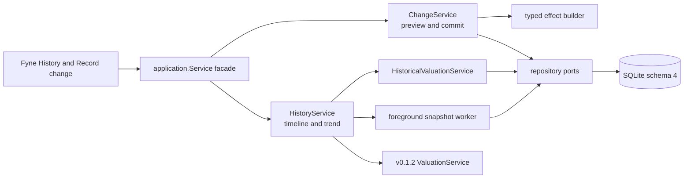

# v0.1.3 Technical Design

## Purpose and Status

**Status:** `Implemented through Phase 10; public distribution checks pending`.

This document implements the family-first behavior in the
[v0.1.3 release contract](v0.1.3.md). Accounting-grade structure exists only
inside Go so the UI can stay simple. The
[compatibility baseline](v0.1.3-baseline.md) records the completed v0.1.2
surface against which schema and history work were implemented.

## Architecture and Ownership



- `application.Service` remains the facade held by the Fyne controller.
- Go owns validation, effect construction, replay, balance/Quantity arithmetic,
  valuation, completeness, classification, and snapshot decisions.
- Fyne owns friendly forms, formatting, filters, chart geometry, cancellation,
  and presentation state. It never constructs financial effects.
- Network providers are outside every v0.1.3 path. Historical valuation reads
  only persisted quotes.

Suggested package ownership:

```text
internal/domain/change.go
internal/domain/history.go
internal/application/change_service.go
internal/application/history_service.go
internal/application/historical_valuation.go
internal/infrastructure/sqlite/change_repository.go
internal/infrastructure/sqlite/history_repository.go
internal/ui/change_dialog.go
internal/ui/history_page.go
internal/ui/history_worker.go
```

## Two Vocabularies, One Contract

The UI uses ordinary phrases. Stable internal kinds preserve enough meaning for
replay and later optional analytics.

| User choice | Internal Activity kind | External-flow meaning |
| --- | --- | --- |
| Money added | `cash_in` | Inflow; reason is income, contribution/gift, or other |
| Money removed | `cash_out` | Outflow; reason is expense, fee/tax, or other |
| Move between Accounts | `cash_transfer` or `position_transfer` | Internal |
| Buy or sell an investment | `buy` or `sell` | Principal internal; explicit fee external |
| Update a value | `value_update` | Remeasurement/reconciliation |
| Borrow or repay debt | `debt_draw` or `debt_payment` | Principal internal; explicit interest/fee external |
| Undo | `reversal` | Exact inverse of the selected entry |

Internal classifications are `external_inflow`, `external_outflow`, `income`,
`fee`, `internal_transfer`, `trade_principal`, `debt_principal`, and
`remeasurement`. They are derived from the chosen workflow and reason; users do
not edit them independently.

## Domain Model

### Typed Identity

Add UUID v7-backed IDs for Activity, ActivityEffect, ActivityCorrectionGroup,
HistoryOrigin, HistoryOriginComponent, state/preference observation, Holding
Quantity observation, and DailyValuationSnapshot. External symbols and table
row numbers never substitute for these IDs.

### Activity and Typed Effects

An Activity stores:

```text
id, household_id, kind, reason, effective_at,
effective_local_date, created_at, note,
reverses_activity_id, correction_group_id, transaction_fx_rate
```

Effects store a positive exact magnitude plus direction and one typed target:

```text
account_value | account_cash | holding_quantity
```

Each effect includes Activity ID, sequence, role, direction, relevant
Account/Holding/Instrument ID, and either Money or Quantity. An Activity's
effects are immutable and ordered. A database constraint prevents an Activity
from reversing more than one entry and prevents the same entry from being
undone twice.

Trade detail retains side, Instrument/Holding, Quantity, gross Money,
settlement currency, derived unit price, and explicit fee. Cross-currency
transfers retain both Money effects and the derived destination/source rate.
No generic JSON effects or user-authored debit/credit rows are accepted.

### Friendly Typed Commands

Application commands are separate structs such as `MoneyAddedInput`,
`CashTransferInput`, `TradeInput`, and `ValueUpdateInput`. `PreviewChange`
constructs and validates the same internal shape as `CommitChange` but performs
no write. Commit re-loads state and revalidates inside its transaction; a stale
preview is never authorization to write.

Effective time defaults to now. An optional past local date/time is resolved in
the confirmed Household IANA timezone with explicit ambiguous/nonexistent-time
handling. Future and pre-origin entries are rejected.

## Starting Point

Schema migration creates structures only. It never fabricates history.

An existing Household may continue current read-only browsing, but its next
financial mutation opens **Start history here**. Initialization:

1. resolves and displays the Settings timezone or OS IANA timezone;
2. requires explicit confirmation;
3. starts one immediate transaction;
4. captures current Account values, Holdings cash and Quantity, active/archive
   state, Ownership, and selected-source preferences;
5. writes one immutable origin and typed components; and
6. commits zero Activities.

Fresh onboarding creates an empty origin after timezone confirmation. Retrying
returns the existing complete origin. A partial origin cannot become visible:
the transaction commits all facts or none.

Timezone becomes immutable after the first Activity or daily snapshot. If the
OS timezone changes later, the user may view it but historical local-day
boundaries remain tied to the confirmed Household timezone.

## Mutation and Projection Transaction

Each change uses `BEGIN IMMEDIATE` and follows one write path:

1. load and validate origin, references, current endpoints, and time;
2. construct typed effects from the friendly command;
3. replay the affected endpoints and reject negative balance, cash, debt, or
   Quantity at any ordered point;
4. insert Activity, effects, and optional trade/correction detail;
5. append current Account Value, cash, and Holding Quantity projections;
6. mark the earliest affected closed local date dirty; and
7. commit and return the saved friendly view.

No network or chart work occurs in the transaction. After History starts,
public amount/Quantity mutations delegate to ChangeService. Metadata edits
remain direct but valuation-relevant state/preference changes append an
effective observation and mark history dirty.

Current projection rows gain optional `activity_effect_id` and a projection
kind of `legacy`, `event`, or `replay`. Pre-v0.1.3 rows remain valid with null
links. A backdated correction appends a current replay projection at now so the
v0.1.2 latest-observation rule remains correct; historical reconstruction uses
origin plus Activity effects, never current projections copied backward.

Creating an Account or Holding with a non-zero starting value after History
starts asks one simple question: **Did this already exist, or is it new money?**
“Already existed” records a reconciliation; “new money” records an inflow.
Zero starts need no Activity. An active Holding may be archived only at zero
Quantity, which avoids hiding a position from history or valuation.

## Workflow Rules

- Same-currency cash transfer has equal opposite Money effects.
- Cross-currency transfer requires positive Sent and Received values and derives
  `received / sent`; no market quote is required.
- Position transfer requires the same Instrument and exact Quantity.
- Buy/Sell requires Quantity and gross total before fee. Unit price is derived
  as `gross / quantity`; settlement currency equals quote currency.
- A fee or debt-payment interest is an explicit separate cash effect and
  classification. Transfer spread is never inferred as a fee.
- Value update accepts a new absolute value and derives the difference. A zero
  difference writes nothing and returns `no_change`.

### Undo and Fix

Undo creates exact opposite effects at now, validates replay, and links them to
the original. Undoing an undo is not supported in v0.1.3; the user fixes the
original chain instead.

Fix entry uses one transaction to create an inverse and corrected replacement
sharing a correction group. The replacement keeps the intended effective local
time. Both are invisible until the transaction commits. Timeline presentation
collapses the chain into one **Corrected** item with expandable evidence.

## Historical Reconstruction

For cutoff `T`, HistoricalValuationService:

1. loads Starting point components;
2. applies effects ordered by `effective_at`, `created_at`, Activity ID, then
   effect sequence, through `T`;
3. selects Account state, Ownership, Instrument/FX preference effective at `T`;
4. selects only quotes with `quoted_at <= T` using the v0.1.2 selected-source
   ordering; and
5. runs the same exact valuation semantics as current ValuationService.

A closed day cutoff is the instant immediately before the next local midnight,
computed by calendar arithmetic in the confirmed timezone so daylight-saving
days are correct. The current day is live and is not persisted as a closed-day
snapshot.

Account archive/inclusion, Ownership, and source-preference changes append
effective observations. Instrument archive does not erase a retained active
Holding. Historical calculations never consult current metadata to rewrite an
earlier state.

## Daily Snapshot Cache

Snapshots are replaceable calculation cache, not financial evidence. A header
stores Household, local date, cutoff, revision, optional superseded revision,
content hash, asset/liability/net-worth subtotals, completeness, component
counts, and generation reason. Items retain component identity, native/base
values, selected quote IDs, applicable state/preference IDs, completeness, and
missing-input reason.

Rebuild appends a revision only when the content hash changes. The UI always
reads the latest complete computation attempt for a date. An incomplete point
is a successful cache result with explicit missing components; it does not halt
later dates.

One Household snapshot-state row stores `dirty_from` and
`last_completed_closed_on`. Marking dirty keeps the earlier date. Work is shown
as pending only when `dirty_from` is on or before the last closed local day;
today-only changes never create false pending history.

The foreground worker:

- processes at most 31 closed days per batch;
- uses one consistent read snapshot per batch and one short write per day;
- is cancellable between days and resumes from persisted state;
- yields between batches so current reads and edits remain responsive;
- never invokes MarketDataService or any provider; and
- reports progress/failure without exposing cursors, revisions, or dirty dates.

## Schema 4

The planned `3 -> 4` migration adds:

```text
history_origins
history_origin_components
history_origin_account_states
history_origin_ownership
history_origin_instrument_preferences
history_origin_fx_preferences
activities
activity_effects
activity_trade_details
activity_correction_groups
holding_quantity_values
account_state_observations
account_state_ownership
instrument_preference_observations
fx_preference_observations
daily_valuation_snapshots
daily_valuation_snapshot_items
history_snapshot_state
```

It also adds nullable projection metadata to `account_values` and
`account_cash_values`. Origin component tables use typed columns and checks,
not opaque JSON. Foreign keys retain archived references. Financial evidence
has no delete path. Snapshot revisions may later be compacted only under a
separate cache policy that cannot touch origin, Activities, effects, or quotes.

`DB.Verify` checks required columns, indexes, constraints that SQLite can
introspect reliably, `foreign_key_check`, and integrity. Migration is one
transaction, idempotent on reopen, and makes no business-data rewrite.

## Read Models and Bounds

- Timeline ordering is `effective_at DESC, created_at DESC, id DESC` with an
  opaque keyset cursor; default 50 and maximum 100 rows.
- Filters are Household-bound Account, friendly change type, and inclusive
  local date range. Search is excluded.
- Trend accepts `30d`, `1y`, or `all`; `all` pages snapshot rows rather than
  issuing one unbounded component query.
- Account history includes any Activity effect touching the Account plus its
  Starting point marker.
- Repository APIs load affected endpoints and snapshot batches without N+1
  quote, Ownership, or Instrument reads.

## Fyne Experience

The existing Activity navigation slot becomes **History** with Timeline and Net
worth tabs. **Record change** opens one choice screen followed by a short
workflow-specific form and a backend-generated sentence preview. Advanced date
and note fields stay collapsed by default.

The controller owns filters and form drafts. The worker receives a cancellable
context and generation token; UI changes return through `fyne.Do`, and stale
results cannot overwrite a newer page. Charts always have an accessible table,
keyboard focus order, empty/loading/partial/error states, and paired English/
Simplified Chinese keys.

The UI says **Starting point**, **Corrected**, **History is updating**, and
**Some values are missing**. Internal Activity IDs and quote provenance may
appear in an expandable read-only detail, but effects, replay, snapshot
revision, and dirty-state terms never appear in forms.

## Error Contract

Stable application codes include:

```text
history_not_started
history_timezone_required
invalid_change
invalid_change_time
no_change
insufficient_balance
insufficient_quantity
already_undone
cannot_fix_change
transfer_mismatch
invalid_trade
history_update_failed
```

Messages name the friendly Account, Holding, or missing field. They contain no
SQL, provider payload, local path, raw effect, balance dump, or personal note.

## Security, Privacy, and Forward Compatibility

- All facts remain local SQLite data under the existing application-data
  boundary; history introduces no telemetry, sync, credential, or provider
  permission.
- Logs identify operation/error class only and omit financial values, symbols,
  IDs, notes, and paths.
- v0.1.4 may consume preserved classifications and trade facts, but v0.1.3 does
  not claim cost basis, gain, performance, or attribution.
- A reconciled or starting Quantity remains unknown acquisition history; later
  releases must not infer a purchase or tax lot.
