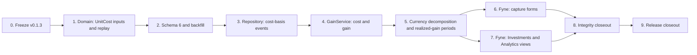

# v0.1.4 Implementation Plan

## Execution Contract

**Status:** `Phases 0–9 implemented on 2026-08-24; public distribution gates pending`.

This plan implements the [release contract](v0.1.4.md) and
[technical design](v0.1.4-technical-design.md). Execute phases in order. A
phase is complete only when its code, tests, localization, documentation, and
exit checks are complete.

Do not implement schema 6 on an assumed v0.1.3 shape. Do not test migration or
replay against a real user database — none exists yet, but this rule still
applies to every fixture used from Phase 0 onward. Do not add a FIFO lot
table, a return/TWR/XIRR calculation, or a benchmark provider; those remain
out of scope regardless of how convenient they seem once cost basis exists.

## Dependency Flow

## Phase 0 — Freeze the Actual v0.1.3 Baseline

**Status:** `Implemented on 2026-08-24`.

### Deliverables

- Record the exact v0.1.3 commit, schema-5 fingerprint, `Repository`
  interface, and Fyne page ownership in the
  [compatibility baseline](v0.1.4-baseline.md), replacing any assumption with
  a verified fact from the actual code.
- Commit a sanitized schema-5 fixture containing a Starting-Point-captured
  Instrument position, a post-history Buy, a Sell, a Position Transfer, an
  Undo, and a Fix entry, per the baseline's Phase 0 Freeze Package.
- Confirm the exact shape of `PositionAdjustmentInput`,
  `HistoryOriginComponent`, `TradeDetail`, and `ValuationService`'s private
  quote-selection helpers used by the design. Renumber schema 6 before work
  if any assumption in the technical design is wrong.
- Explicitly record, as an open item for a later release, that the schema
  `5 -> 6` backfill step is a development-fixture repair and must not run
  against a real user database once one exists.

### Required Checks

- Fresh, migrated schema-4, frozen schema-5, corrupt, and future-schema
  fixtures behave deterministically and contain no personal data.
- Baseline Investments, Overview, and Analytics results are exact before any
  v0.1.4 table or field exists.
- Normal Go tests, vet, race-sensitive package tests, formatting, and diff
  checks pass at the frozen commit.

### Exit Checks

- No open decision can change the migration number, the replay contract, the
  currency-decomposition formula, or the two cost-capture entry points.
- Phase 0 evidence is current Go/Fyne evidence, not copied Rust/Tauri results.

Phase 0 evidence is recorded in `testdata/v0.1.4/baseline-summary.json` and
`testdata/v0.1.4/schema5-fixture.sql`. The focused fixture test and the full
Go gate passed before this Phase 0 commit.

## Phase 1 — Domain: `UnitCost` Inputs and the Replay Algorithm

**Status:** `Implemented on 2026-08-24`.

### Deliverables

- Add `UnitCost *UnitPrice` to `PositionAdjustmentInput` and require it under
  the rule in the technical design; add the `cost_basis_required` error.
- Add `UnitCost *UnitPrice` to `HistoryOriginComponent` and extend its
  `Validate()` for the `holding_quantity` kind.
- Implement `domain.ReplayCostBasis` in `internal/domain/cost_basis.go`: the
  blend formula, realized-gain emission, and reversed/reversing-pair
  exclusion, as pure functions over an in-memory `[]CostBasisEvent`.

### Required Tests

- The golden average-cost scenario from the release contract (`80 USD` start,
  blend to `93.33 USD`, sell realized gain `340.02 USD`) reproduces exactly in
  exact decimal arithmetic.
- A Buy, Sell, Transfer-in, Transfer-out, and `PositionAdjustmentInput`
  increase/decrease each affect the replay exactly as specified in the
  technical design's event table; a decrease never requires or changes
  `UnitCost`.
- A reversed Buy and its reversal leave the average cost exactly as it was
  before the reversed Buy; a Fix-entry correction group leaves it exactly as
  the replacement alone would.
- A Holding whose quantity returns to zero and then receives a new Buy resets
  its average cost to that Buy's own unit price, with no special-cased
  branch required.
- `PositionAdjustmentInput.Added=true` without a resolvable prior cost and
  without `UnitCost` returns `cost_basis_required`; the same call with
  `Added=false` never requires it.
- `HistoryOriginComponent.Validate()` rejects a `holding_quantity` component
  with positive quantity and no `UnitCost`, and accepts one with zero
  quantity and no `UnitCost`.
- No replay function reads a database, a clock, or a provider.

### Exit Checks

- `internal/domain/cost_basis.go` imports no SQLite, Fyne, HTTP, or provider
  package.
- The application layer can compute cost basis and realized gain from an
  in-memory event slice without any repository call, which the tests prove
  directly.

Phase 1 evidence is the pure domain replay implementation, signed realized
gain support, localized `cost_basis_required` errors, and schema-5 read
compatibility. `UnitCost` is captured in application memory and validated on
new writes; persistence of `unit_cost` and `cost_unit_price` is intentionally
owned by Phase 2's schema-6 migration. The compatibility read path permits a
positive schema-5 starting component with no persisted cost until that
migration backfills it; it does not substitute a zero cost.

## Phase 2 — Schema 6 and the Development-Fixture Backfill

**Status:** `Implemented on 2026-08-24`.

### Deliverables

- Add ordered migration `5 -> 6`: the two `ALTER TABLE` statements from the
  technical design.
- Implement the Go-code backfill step for any positive-quantity Holding
  lacking a Starting Point `holding_quantity` component, using the existing
  `ValuationService` quote-selection helper, run once inside the migration
  transaction.
- Extend `DB.Verify` to check that `unit_cost`/`cost_unit_price` columns exist
  with the expected type, and that no `holdings` row with positive quantity
  is left without a resolvable Starting Point or trade-derived cost.
- Extend future-schema (`7+`) refusal to remain byte-for-byte unchanged.

### Required Tests

- Fresh schema 6 and every migrated schema-1 through schema-5 fixture
  preserve every existing row, identity, and current total unchanged.
- The backfill step assigns a cost to every fixture Holding that previously
  had none, using its currently selected quote, and fails loudly (not
  silently) when no quote and no trade exist for such a Holding.
- Migration writes no Activity, no effect beyond the backfilled Starting
  Point component, and makes no network call.
- `foreign_key_check` and `integrity_check` pass for fresh and migrated
  databases.
- Future schema version `7` remains byte-for-byte unchanged and receives no
  v0.1.4 write.

### Exit Checks

- Opening or migrating a database cannot fabricate a Buy, Sell, or Transfer,
  and cannot silently change an existing current total.
- A sanitized migrated fixture reopens idempotently.

Phase 2 evidence is `schema6.sql`, the transactional quote/trade fallback
backfill, persisted `unit_cost`/`cost_unit_price` repository fields, and the
cost-basis invariant in `DB.Verify`. The schema-5 fixture migration assigns
costs `720`, `4.1`, and `720` to its three positive Starting Point holdings;
an unresolved positive holding fails the migration and leaves the schema-5
file unchanged.

## Phase 3 — Repository: Cost-Basis Events

**Status:** `Implemented on 2026-08-24`.

### Deliverables

- Implement `ListCostBasisEvents` and `StartingPointCost` in the SQLite
  repository, each a single bounded query (or a small fixed join set) per
  Holding, excluding reversed/reversing Activity pairs at the query layer
  where practical and at the domain layer otherwise.
- Add query-count regression tests proving no per-Activity query inside a
  loop.

### Required Tests

- `ListCostBasisEvents` returns events in the exact order
  `ReplayCostBasis` expects, for a Holding with a mixed history of Buy, Sell,
  Transfer, and `PositionAdjustmentInput` events.
- A reversed Activity and its reversal are both absent from the returned
  events.
- Query-count tests cover a Holding with zero, one, and many events, and
  confirm the count does not grow per event beyond the documented bound.
- Cross-Household and archived-reference cases return nothing rather than
  another Household's data.

### Exit Checks

- Every new repository method is provably read-only, verified by comparing
  every table before and after a call.

Phase 3 evidence is the single bounded `ListCostBasisEvents` query and the
`StartingPointCost` read. The repository returns the release ordering, omits
both sides of reversed Activities, keeps Fix replacements, retains transfer
source Holding IDs, parses trade fees and adjustment `UnitCost`, and returns
no events or cost for archived Holdings.

## Phase 4 — `GainService`: Cost Basis and Gain

**Status:** `Implemented on 2026-08-24`.

### Deliverables

- Implement `GainService.HoldingGain` and `AccountGain`: load events, call
  `ReplayCostBasis`, resolve current quote/FX through the existing
  `ValuationService` selection helpers, and assemble the view.
- Implement the bounded recursive resolution for Position Transfer described
  in the technical design, with per-request memoization.

Phase 4 evidence is `internal/application/gain_service.go` and its repository
fixture tests. `HoldingGain` and `AccountGain` replay the persisted Starting
Point and cost-bearing events, keep cost and realized gain visible when the
current quote is missing, reuse the existing quote/FX selection helpers, and
resolve transfer-in unit cost from the sending Holding at the transfer time.
The replay context caches each Holding's event list, Starting Point cost, and
cutoff replay result for the duration of one request.

### Required Tests

- `HoldingGain` for the release contract's scenarios (Starting Point cost,
  blended Buy, Sell, Undo) reproduces the exact contract values end to end,
  through the repository rather than only through the pure replay function.
- A missing current quote marks unrealized gain unavailable while cost basis
  and realized gain remain visible.
- A Holding that received a Position Transfer resolves the sending Holding's
  average cost as of the transfer, not its cost today, verified by a fixture
  where the sending Holding's cost changes again after the transfer.
- Memoization is verified by a query-count test on a fixture with multiple
  transfers touching the same Holding.

### Exit Checks

- `GainService` performs no write and no network call, verified the same way
  as `ValuationService`.
- Existing Overview, Portfolio, Investments, and History output is
  byte-identical with and without `GainService` present in the same process.

## Phase 5 — Currency Decomposition and Realized-Gain Periods

**Status:** `Implemented on 2026-08-24`.

### Deliverables

- Implement the two-component currency-decomposition formula, including the
  acquisition-FX blend across multiple cost-bearing events.
- Implement `RealizedGainInRange` for `30d`/`1y`/`all`, grouped by Instrument
  and by Account, using the at-or-before FX rule for each event's own date.

Phase 5 evidence is the base-currency extension of `HoldingGainView` and
`RealizedGainInRange` in `internal/application/gain_service.go`. Acquisition
FX is blended with the same quantity-weighted decimal replay used by average
cost; current value uses `ValuationService` conversion; the currency effect
is the exact remainder of total unrealized gain minus Instrument movement.
Realized period groups use one FX-history read and convert each Sell at its
own effective timestamp, retaining explained unavailable states.

### Required Tests

- The release contract's decomposition scenario (`1660` CNY total, `1360`
  instrument movement, `300` currency movement) reproduces exactly, and
  `InstrumentMove + CurrencyMove == UnrealizedGain` holds as an identity
  across every fixture with complete inputs, not a tolerance.
- An Instrument quoted in the base currency produces exactly zero currency
  movement and requires no FX quote.
- A missing acquisition-time FX quote marks only that Holding's decomposition
  unavailable, never a substituted rate of one or the current rate.
- Realized gain in range correctly includes/excludes Sells at the range
  boundary and converts each event at its own effective date's FX rate, not
  the range's end rate.

### Exit Checks

- No decomposition path reconstructs an input from a rounded display string;
  all arithmetic uses the same exact decimal values the replay produced.
- Currency decomposition and realized-gain-in-range add no query inside a
  loop over Holdings, events, or days.

## Phase 6 — Fyne: Capture Forms

**Status:** `Implemented on 2026-08-24`.

### Deliverables

- Add the per-unit cost field, pre-filled from the current quote and today's
  date, to the Starting Point form for each positive-quantity Instrument
  position.
- Add the same field to the "already existed" `PositionAdjustmentInput`
  dialog.
- Add English and Simplified Chinese strings using plain language ("Average
  cost," "What this was worth when you started tracking it"), never a ledger
  or tax term.

Phase 6 evidence is the editable Starting Point dialog in
`internal/ui/history_page.go`, the post-history Holding capture cost field in
`internal/ui/portfolio_pages.go`, and the application overrides in
`StartHistoryWithCosts` and `HoldingInput.UnitCost`. Both forms prefill the
selected current quote while the application parses the submitted override;
zero Starting Point quantities and decrease adjustments remain exempt.

### Required Tests

- Both forms block save without a valid cost when one is required, and never
  require it when it is not (zero-quantity Starting Point component, or a
  `PositionAdjustmentInput` decrease).
- The pre-filled default matches the currently selected quote at the moment
  the form opens; overriding it and saving persists the override, not the
  default.
- Keyboard-only completion of both forms passes; locale key sets match
  between English and Simplified Chinese.

### Exit Checks

- A family user can complete Starting Point or "already existed" capture
  without seeing the word "basis," "lot," or "ledger."

## Phase 7 — Fyne: Investments and Analytics Views

**Status:** `Implemented on 2026-08-24`.

### Deliverables

- Add average cost, total cost, and unrealized gain columns to the
  Investments page's position rows, reusing the existing
  available/unavailable presentation pattern.
- Add a realized-gain-by-period section and a currency-decomposition section
  to the Analytics page, reusing the existing 30-day/one-year/all-time range
  selector control.
- Add an accessible table alongside every new value; add English and
  Simplified Chinese strings.

Phase 7 evidence is the GainService-backed Investments position table and the
Analytics realized-gain and currency-decomposition tables in
`internal/ui/investments_page.go` and `internal/ui/analytics_page.go`. The
existing range selector refreshes the net-worth trend and realized-gain read
model while keeping current cost and decomposition values in place; unavailable
values use the localized portfolio state.

### Required Tests

- Every displayed gain/decomposition value matches the value
  `GainService` returns for the same Holding/Account and period, with no
  Fyne-side arithmetic.
- Unavailable states render the same explained-unavailable pattern already
  used for missing quotes, never a blank or a zero.
- Switching the period selector re-queries only realized gain; cost basis and
  unrealized gain values on screen do not change when the period changes.
- Keyboard-only navigation of both pages passes; locale key sets match.

### Exit Checks

- No Fyne package computes an average, a gain, or a currency split; every
  value on screen traces to a `GainService` field.

## Phase 8 — Integrity, Privacy, and Compatibility Closeout

**Status:** `Implemented on 2026-08-24`.

### Deliverables

- Re-run the Phase 0 fixture through migration, Starting Point capture,
  every v0.1.3 workflow, Undo/Fix, and the new gain/decomposition reads.
- Add transaction-failure, concurrency, query-bound, memory-bound,
  localization, log-redaction, and no-network regression suites for every
  new path.
- Audit that no v0.1.4 read path can write an Activity, an effect, a
  Starting Point component, or a snapshot row.
- Update the domain model, architecture, roadmap, README, changelog, and
  release documents to describe shipped behavior only.

Phase 8 evidence is the migrated schema-5 fixture gain-read regression,
concurrent/read-only GainService regression, one-query cost-event bound,
provider-free Investments/Analytics construction, and complete locale
catalog checks. The negative-realized-gain FX conversion path now preserves
loss signs while reusing the non-negative valuation converter. Active README,
architecture, domain-model, roadmap, changelog, and release documents now
describe schema 6 and the shipped average-cost/gain scope.

### Required Checks

- `go test ./...`
- `go test -race ./...`
- `go vet ./...`
- formatting and `git diff --check`
- SQLite `foreign_key_check` and `integrity_check` for fresh and migrated
  fixtures
- a deterministic test proving zero external requests across every v0.1.4
  path

### Exit Checks

- Every release-contract acceptance item maps to a named automated check.
- No copied Rust/Tauri lot, declaration, TWR/XIRR, or attribution-bridge
  status remains in any active v0.1.4 document.

## Phase 9 — Release Closeout

**Status:** `Implemented on 2026-08-24; manual distribution gates pending`.

### Deliverables

- Set application/version metadata to `v0.1.4` only after Phases 0-8 pass.
- Build/package macOS arm64 with isolated data; run clean-install and
  migrated-fixture smoke tests without touching a real user database.
- Complete keyboard, VoiceOver, English/Simplified Chinese, missing-input, and
  offline manual QA for every new form and view.
- Record, in the release notes, the explicit open item that the schema `5 ->
  6` development-fixture backfill must be revisited before any public
  release that could encounter a real pre-v0.1.4 database.
- Update release status, roadmap, and evidence with exact commands and
  results.

Phase 9 evidence:

- Release metadata is `v0.1.4`/build `1`; `internal/version` tests cover the
  checked-in value and the packaging script defaults to `0.1.4`.
- `GOCACHE=/tmp/nestworth-go-phase9-gocache go test ./...` — passed.
- `GOCACHE=/tmp/nestworth-go-phase9-gocache go test -race ./...` — passed.
- `GOCACHE=/tmp/nestworth-go-phase9-gocache go vet ./...` — passed.
- `GOCACHE=/tmp/nestworth-go-phase9-gocache go build ./cmd/nestworth` —
  passed; the macOS linker emitted only the known duplicate `-lobjc`
  warning.
- `gofmt -l internal/application internal/domain internal/ui internal/i18n
  internal/infrastructure/sqlite internal/version` and `git diff --check` —
  passed.
- `GOCACHE=/tmp/nestworth-go-phase9-gocache ./scripts/package-macos.sh` —
  passed in the controlled macOS environment. It produced
  `dist/macos/Nestworth.app` and `dist/macos/Nestworth-0.1.4-arm64.dmg`, and
  verified Bundle ID `com.nestworth.app`, version `0.1.4`, build `1`, arm64
  executable architecture, native icon, and DMG metadata.
- Fresh temporary-database tests and the migrated schema-5 fixture gain-read
  test cover clean-install and migration smoke without touching a real user
  database; provider-free UI construction covers offline rendering.
- Before any public release that could encounter a real pre-v0.1.4 database,
  revisit the schema `5 -> 6` development-fixture backfill policy.

Manual keyboard/VoiceOver review, complete manual English/Simplified Chinese
and missing-input walkthroughs, Developer ID signing, notarization, and final
artifact retention are not claimed by these automated checks and remain
explicit public-distribution gates.

### Exit Checks

- Public artifacts capture a Starting Point cost, record trades, undo them,
  and display gain/decomposition honestly, including every unavailable case.
- Any unperformed packaging, accessibility, signing, or notarization step
  remains explicitly pending; green unit tests do not imply it.

## Release Completion Rule

v0.1.4 is complete only when all phases and release-contract acceptance
checks pass against both a fresh database and the sanitized migrated v0.1.3
fixture. Average cost and gain must remain simple, plain-language numbers in
Fyne even though their replay and currency-decomposition rules are exact.
