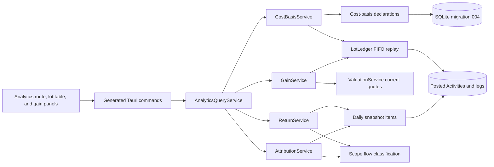

# v0.1.4 Technical Design

> **Migration status:** Historical technical design copied from the previous implementation line. Its Tauri/Rust paths are not current Go + Fyne implementation evidence.

## Purpose and Status

This document is the implementation contract for the [v0.1.4 release](v0.1.4.md). It defines the lot, cost-basis, gain, currency-decomposition, return, and attribution semantics that implementation phases must preserve.

**Status:** `Implemented`. Names in this document exist in code. Migration SQL and generated bindings remain authoritative for physical schema and IPC shape.

v0.1.4 is an interpretation layer. It reads the facts that v0.1.3 made immutable and produces derived results. It does not extend the ledger, does not change current state, and does not change any existing valuation output.

## Architecture



The boxes named `…Service` are **modules of free `pub async fn`s**, not structs. They map to `application::analytics_query_service`, `application::cost_basis_service`, `application::gain_service`, `application::return_service`, `application::attribution_service`, and `application::analytics_repositories`, with the FIFO replay in `domain::lot_ledger`. The existing application layer contains no service struct: `rg "pub struct .*Service"` over `src-tauri/src` returns nothing, and `ValuationService`, `ActivityService`, and `HistoricalValuationService` are documentation names for `application::valuation_service`, `application::activity_service`, and `application::historical_valuation_service`. v0.1.4 follows that convention exactly. Public functions take `state: &AppState`, and their transaction-scoped variants take `&mut Transaction` and carry an `_in_tx` suffix.

The layering rule is:

```text
Activity fact        -> why a change occurred          (v0.1.3, immutable)
Projection fact      -> resulting current state        (v0.1.3, immutable observations)
Snapshot revision    -> value calculated for one day   (v0.1.3, append-only)
Declaration fact     -> user-supplied cost for an unknown lot   (v0.1.4, append-only)
Lot                  -> derived FIFO interpretation    (v0.1.4, computed)
Gain and return      -> derived analytics result       (v0.1.4, computed)
```

Only the declaration is a new persisted fact, and it carries no financial state. Everything else in v0.1.4 is recomputable from data that already exists.

## Domain Additions

### Typed Identity

Add these Rust types:

- `CostBasisDeclarationId` — UUID v7, persisted
- `LotRef` — a derived, stable reference to the event that opened a lot

`LotRef` is not a generated UUID. It is the identity of the opening event, so it survives recomputation:

```text
LotRef = OriginHolding(HoldingId) | Acquisition(ActivityLegId)
```

`history_origin_holdings` is keyed by `(origin_id, holding_id)` and has no origin-item UUID column, so origin lots use `HoldingId`. A lot moved by a position Transfer keeps its original `LotRef`. Transfers relocate a lot; they do not create one. `LotRef` crosses IPC as a tagged pair of `sourceKind` and `sourceId`, never as an opaque index into a list.

### Signed Analytics Values

`Money`, `Quantity`, `UnitPrice`, and `FxRate` remain unsigned and unchanged. Gain and return are the first signed financial results in the product, so they use new types that are output-only.

| Type | Shape | Rules |
| --- | --- | --- |
| `SignedMoney` | Signed `Decimal` plus `CurrencyCode` | Canonical string may carry a leading `-`; four fractional digits at the DTO boundary; midpoint-nearest-even |
| `ReturnRate` | Signed `Decimal` expressed as a fraction, not a percentage | Six fractional digits at the DTO boundary; `0.0404` means 4.04% |

Neither type is accepted as command input, persisted in any table, or used as a valuation input. A `SignedMoney` is never converted back into a `Money` balance. The frontend formats a `ReturnRate` as a percentage but never multiplies, chains, or annualizes it.

### Decimal Mathematics

`rust_decimal` gains the `maths` feature so `powd`, `ln`, and `exp` are available for annualization and XIRR. `f32`, `f64`, SQLite `REAL`, and JavaScript `number` remain prohibited for every financial value, including intermediate solver iterations.

## Lot Ledger

### Replay Contract

`LotLedger` lives in `src-tauri/src/domain/lot_ledger.rs`. It is pure domain code with no SQL, no Tauri, and no provider dependency. It takes an ordered sequence of ledger events and produces open lots, consumptions, and diagnostics.

Input ordering is the existing deterministic Activity order:

```text
effective_at ASC, created_at ASC, id ASC
```

Within one Activity, legs apply in `sort_order` order.

The replay is deterministic and total. Running it twice over the same ledger produces byte-identical output. It never reads current projection state, never reads a snapshot, and never queries a quote.

### Event Mapping

| Ledger event | Lot effect |
| --- | --- |
| Buy holding leg | Opens a lot with `LotRef = Acquisition(leg id)`, quantity from the leg, cost from the settlement leg gross amount, acquisition fee from the fee leg, basis `known` |
| Buy with zero gross | Opens a lot with cost `0` and basis `known`; the confirmed zero price is an execution fact, not a missing input |
| Sell holding leg | Consumes open lots in acquisition order; records one consumption per lot touched |
| Opening Adjustment quantity leg | Opens a lot with `LotRef = Acquisition(leg id)`, basis `unknown` |
| Position Adjustment increase | Opens a lot with basis `unknown` |
| Position Adjustment decrease | Consumes open lots in acquisition order and records an unexplained disposal |
| Transfer quantity legs | Consumes at the source and reopens the same lots at the destination, preserving `LotRef`, cost, acquisition time, and basis status |
| History Origin baseline holding | Opens a lot with `LotRef = OriginHolding(holding id)`, acquisition time equal to the origin timestamp, basis `unknown` |
| Reversal, and the Activity it reverses | Neither participates in the replay |
| Correction replacement | Participates normally; the reversed original does not |
| Income, Fee, Deposit, Withdrawal, Debt, Balance Adjustment, Manual Valuation | No lot effect |

The reversal rule is a locked product decision. A reversed Activity is economically nonexistent, so matching a disposal against a lot it opened would produce a realized gain the user has already declared did not happen. The original, the reversal, and any replacement remain fully visible in the Activity ledger and Account timeline; only the derived lot interpretation excludes the pair.

### Consumption Order and Ties

Lots are consumed by:

```text
acquired_at ASC, opening activity created_at ASC, opening leg id ASC
```

Acquisition time for a transferred lot is its original acquisition time, not the transfer time. This keeps FIFO meaningful across Accounts.

### Insufficient Known Basis

v0.1.3 already rejects a disposal that exceeds current Quantity, so the replay never runs short of quantity for a validly posted ledger. When a disposal consumes an unknown-basis lot, the consumption records `basis = unknown`, contributes no realized gain, and sets `basisComplete = false` on every aggregate that contains it. The disposal proceeds are still reported so the user can see what was sold.

If the replay ever does encounter a quantity shortfall, that is a data-integrity defect. It returns a diagnostic and refuses to produce gain results rather than clamping to zero.

## Cost-Basis Declarations

### Purpose

A declaration supplies the cost of one unknown-basis lot. It states: "this position cost this much." It does not state when or how it was acquired as a Nestworth event.

A declaration:

- Creates no Activity and no leg
- Changes no Account Value, Account Cash, Holding Quantity, Ownership, or Account state
- Changes no net worth, portfolio total, or Overview value
- Marks no snapshot dirty and triggers no rebuild
- Is append-only and immutable once written

### Shape

| Field | Contract |
| --- | --- |
| ID | `CostBasisDeclarationId`, UUID v7 |
| Household | Required root owner |
| Lot reference | Exactly one of an origin holding item or an Activity leg, both foreign keys |
| Instrument | Redundant but enforced; must match the referenced lot's Instrument |
| Declared cost | `Money` in the Instrument quote currency; zero is allowed and distinct from unknown |
| Acquired on | Optional `YYYY-MM-DD`; used for holding-period display and acquisition-FX selection |
| Revokes | Optional previous declaration ID |
| Is revocation | Flag distinguishing a supplied cost from a withdrawal of one |
| Note | Optional bounded text |
| Created at | Backend-generated UTC RFC 3339 milliseconds; immutable |

The effective declaration for a lot is selected by:

```text
created_at DESC, id DESC
```

A revocation returns the lot to unknown basis. There is no update and no delete command, matching the Activity immutability culture.

### Validation

Inside one `BEGIN IMMEDIATE` transaction, Rust verifies that the referenced origin Holding or Activity leg exists, belongs to this Household, actually opens an unknown-basis lot in the current replay, and matches the declared Instrument. A reference to a known-basis lot, a consumed-only leg, a reversed Activity's leg, or another Household is rejected with `INVALID_COST_BASIS_DECLARATION` and writes nothing.

Declared cost currency must equal the Instrument quote currency, matching the v0.1.3 settlement rule. An acquisition date after the lot's ledger acquisition time is rejected; a date before History Origin is accepted because basis is metadata, not history.

## Gain

### Definitions

For a consumption of quantity `q` from a lot with quantity `Q`, cost `C`, and acquisition fee `Fa`, disposed at gross proceeds `P` with disposal fee `Fd` allocated across the consumptions of that disposal:

```text
consumed cost      = C × q / Q
allocated acq fee  = Fa × q / Q
realized gross     = P_share − consumed cost
realized net       = realized gross − allocated acq fee − allocated disposal fee
```

`P_share` is the disposal's gross proceeds allocated across its consumptions by consumed quantity. All allocation uses full checked `Decimal` precision; only the DTO boundary rounds.

For an open lot with cost `C`, remaining quantity `q`, and current unit price `p`:

```text
unrealized gross = q × p − C × q / Q
```

Fees are never added to `C` and never subtracted from `p`. Gross and net gain are separate outputs so the user can always see the fee drag as its own number.

### Aggregation

Gain aggregates at Instrument, Account, Portfolio, and Household scope. Every aggregate carries:

- `basisComplete` — false when any contained lot has unknown basis
- `inputComplete` — false when any contained lot lacks a required quote or FX quote
- `unknownBasisQuantity` and `unknownBasisValue`
- `unexplainedDisposalValue` from Position Adjustment decreases

A missing input excludes only its own component from numeric totals. It is never treated as zero and never treated as a cost of zero.

### Investment Income and Fees

Income totals group Income Activities by `income_kind`. Fee totals group fee-role legs by `fee_kind`, plus a `tradeCommission` bucket for fee legs inside a Buy or Sell, which carry no `fee_kind` in the v0.1.3 schema. Attribution to an Instrument uses `related_instrument_id` when present; otherwise the amount lands in an explicit unattributed bucket.

## Currency Decomposition

For a lot with native cost `C`, native value `V`, acquisition FX `f0`, and ending FX `f1`, all native-to-base:

```text
base cost           = C × f0
base value          = V × f1
base gain           = V × f1 − C × f0
instrument movement = (V − C) × f0
currency movement   = V × (f1 − f0)
base gain           = instrument movement + currency movement
```

The identity is exact by algebra, so implementation must assert it in tests rather than tolerate a rounding drift.

`f0` is the FX quote selected with the existing historical rule at or before the lot's acquisition time, using the effective FX preference for that time. For a declared lot, the declared acquisition date supplies the cutoff; when no acquisition date is declared, `f0` is unavailable and the lot is undecomposed.

`f1` is the current FX quote for an unrealized lot and the FX quote at the disposal's effective time for a realized consumption.

Identity currency, where the Instrument quote currency equals the Household base currency, gives `f0 = f1 = 1`, a currency movement of exactly zero, and never requires an FX quote.

When `f0` is unavailable the lot reports base gain only, decomposition status `unavailable`, and every parent aggregate becomes `inputComplete = false`. No estimate, no most-recent-rate substitution, and no reciprocal invention is permitted.

## Scope and Flow

### Scope Definition

A scope is a set of endpoints, where an endpoint is one Account plus one component.

| Scope | Endpoints |
| --- | --- |
| Household | Every component of every Account included in net worth and active on that day |
| Portfolio | Every component of active non-liability Accounts with `include_in_investment` |
| Account | Every component of one Account |
| Instrument | Every Holding Quantity component for one Instrument across Accounts |

Scope membership is evaluated per day using the effective-dated Account and Holding state observations that v0.1.3 persists, never using today's archive or inclusion flags.

### Flow Classification

For a given scope `S` and local day `d`, a leg contributes a flow when it crosses the boundary of `S`:

| Leg situation | Flow treatment |
| --- | --- |
| Endpoint inside `S`, every other leg of the Activity outside `S` | Signed base value is a flow |
| Endpoint inside `S`, at least one counterparty leg also inside `S` | Internal to `S`; contributes zero flow |
| Income leg inside `S` | Not a flow; it is return |
| Fee leg inside `S` | Not a flow; it is negative return |
| Monetary remeasurement leg inside `S` | Not a flow; it is unexplained return |
| Quantity remeasurement leg inside `S` | A flow of unknown basis; sets `basisComplete = false` |
| Income or Fee with `related_instrument_id = I`, Instrument scope `I` | Return for scope `I` even though its cash endpoint is outside `I` |

The last rule makes Instrument-scope return a total return rather than a price-only return. Without it a dividend would look like value destruction.

A cross-currency internal transfer whose legs are both inside `S` contributes zero flow. The base-value difference between its two legs is the conversion spread and is treated as return, consistent with v0.1.3, which classifies the spread as an overlay rather than external flow.

Base conversion of a flow uses the FX quote at that leg's effective time. If it is unavailable, the flow is unconvertible and the affected return or bridge is reported as unavailable rather than approximated.

## Return

### Time-Weighted Return

For a period whose closed local days are `d1 … dn`, with `V_d` the scope's base-currency value at the close of day `d` and `F_d` the scope's net base-currency flow on day `d`:

```text
r_d = (V_d − V_{d−1} − F_d) / (V_{d−1} + F_d)
TWR = Π (1 + r_d) − 1
```

`V_{d0}` is the close of the day before the period starts.

Flows are assumed to occur at the start of their day because snapshots value only the daily close and no intraday valuation exists. This assumption is a locked decision and is stated in the DTO and in the UI method label.

Rules:

- A day whose denominator `V_{d−1} + F_d` is zero or negative is skipped, counted in `skippedDays`, and reported. It is not treated as a zero return.
- Any day in the period with a missing or `isComplete = false` snapshot makes the whole period unavailable. The response names the blocking local dates.
- The earliest usable start is the first complete closed-day snapshot at or after History Origin. A requested period reaching before that returns `ANALYTICS_PERIOD_UNAVAILABLE`.
- The current local day is never part of a TWR period; it is a live valuation point, not final history.

Annualization uses:

```text
annualized = (1 + TWR)^(365 / days) − 1
```

and is withheld when `days < 365`.

### Money-Weighted Return

XIRR solves for `r` in:

```text
NPV(r) = Σ CF_i / (1 + r)^(t_i)  =  0
t_i    = (date_i − date_0) / 365
```

The cash-flow series for scope `S` over the period is:

1. The scope value at the period start as a negative flow
2. Every scope flow on its local date, signed
3. The scope value at the period end as a positive flow

Local dates come from the History Origin timezone, and the day count is actual/365.

Solver contract:

- Requires at least one positive and one negative flow; otherwise `RETURN_NOT_COMPUTABLE`.
- Newton-Raphson from `r = 0.1`, bounded to at most 100 iterations.
- Bisection fallback bracketed on `(−0.999999, 100]` when Newton leaves the bracket or fails to converge.
- Converged when the absolute NPV is at most `0.0001` base units or the rate step is at most `0.000000001`.
- Non-convergence returns `RETURN_NOT_COMPUTABLE` with a stable reason. It never returns the last iterate.
- All arithmetic uses `rust_decimal` with the `maths` feature. No binary floating point participates in any iteration.

### Scope Coverage

One `application::return_service` module implements both methods for all four scopes. There is no scope-specific formula, only a scope-specific flow set and value series. Household, Portfolio, and Account values come from aggregating `daily_valuation_snapshot_items` by scope membership. Instrument values come from the Quantity and quote provenance recorded on those same items.

## Net-Worth Attribution

### Bridge Contract

For a period `(T0, T1]` where both endpoint snapshots exist and are complete:

```text
ΔNW = NW(T1) − NW(T0)

ΔNW = externalContributions
    + externalWithdrawals
    + instrumentMovement
    + currencyMovement
    + income
    − fees
    + debtPrincipalMovement
    + conversionSpread
    + unexplained
```

Named components come from the ledger and from the daily snapshot decomposition. `unexplained` is defined as the residual:

```text
unexplained = ΔNW − (sum of named components)
```

The bridge therefore balances exactly by construction. `unexplained` is always present in the DTO, always rendered, and never redistributed into a named component. A zero residual is displayed as zero rather than omitted.

### Daily Decomposition

Market and currency movement are computed per day per component and summed, so the identity holds without a period-level approximation.

For a monetary component with native amount `a` and FX rate `f`:

```text
Δbase        = a_d·f_d − a_{d−1}·f_{d−1}
flowBase     = nativeFlow_d × f_{d−1}
currency_d   = a_d × (f_d − f_{d−1})
market_d     = Δbase − flowBase − currency_d
```

For a Holding component with quantity `Q`, unit price `p`, and FX `f`:

```text
nativeValue  = Q × p
quantity_d   = (Q_d − Q_{d−1}) × p_{d−1} × f_{d−1}
price_d      = Q_d × (p_d − p_{d−1}) × f_{d−1}
currency_d   = Q_d × p_d × (f_d − f_{d−1})
```

`quantity_d` is reconciled against the ledger flow for that day. The difference between a trade's execution price and the previous close is a same-day price effect that lands in `unexplained`. This is expected, is documented in the UI method note, and is not silently absorbed into `instrumentMovement`.

### Availability

The bridge is produced only when both endpoint snapshots are complete and every in-period flow converts to base currency. Otherwise it returns `unavailable` with the blocking local dates and unconvertible flow count. It is never produced with a component silently omitted.

## Persistence Contract

Migration `004_analytics.sql` adds exactly one table.

| Table | Responsibility and key constraints |
| --- | --- |
| `cost_basis_declarations` | Append-only user-supplied cost for one unknown-basis lot; Household FK, mutually exclusive origin-holding (`holdings.id`) and Activity-leg foreign keys with `RESTRICT`, Instrument FK, currency shape check, revocation flag, self-referencing `revokes` link |

Constraints:

- Exactly one of `origin_holding_id` and `activity_leg_id` is non-null, enforced by `CHECK`.
- A revocation row has a null declared cost and currency; a supplying row requires both.
- Selection indexes support latest-declaration-per-lot and Household-scoped listing.
- No trigger, no generic JSON financial payload, and no column added to `activities`, `activity_legs`, or any snapshot table.
- No v0.1.1, v0.1.2, or v0.1.3 business row is rewritten.

`max_supported_migration()` becomes `4` because it derives from the embedded migrator. Analytics commands are subject to the same unsupported-future-database zero-write state machine as every other command.

Lots, gains, returns, and attribution results are not persisted. They are recomputed from one consistent read transaction on every request. This removes an entire class of cache-invalidation defects and keeps a correction's effect on past periods immediate and correct.

## Transactions and Concurrency

Analytics reads use one read transaction so the ledger, declarations, snapshots, and quotes come from one SQLite snapshot. A read must never interleave a replay over one snapshot with quotes from another.

Declaration writes use `BEGIN IMMEDIATE` and commit once:

1. Load History Origin and verify the Household.
2. Load the referenced origin Holding or Activity leg.
3. Replay the lot ledger for the affected Instrument and confirm the reference opens an unknown-basis lot.
4. Validate cost, currency, and acquisition date.
5. Insert the declaration row.
6. Assemble the DTO and commit.

A declaration marks no snapshot dirty because it changes no valuation input. Concurrent declarations for the same lot serialize through `BEGIN IMMEDIATE`; both rows persist and the later one wins by selection order.

## IPC Contract

| Group | Commands |
| --- | --- |
| Status | `get_analytics_status` |
| Return | `get_performance_summary` |
| Gain | `get_gain_summary` |
| Attribution | `get_net_worth_attribution` |
| Lots | `list_holding_lots`, `list_unknown_basis_lots` |
| Declarations | `list_cost_basis_declarations`, `declare_lot_cost_basis`, `revoke_lot_cost_basis` |

Shared input shape:

- Scope as a tagged union of `household`, `portfolio`, `account(accountId)`, and `instrument(instrumentId)`
- Period as a tagged union of `oneMonth`, `threeMonths`, `oneYear`, `all`, and `custom(startLocalDate, endLocalDate)`
- Bounded page size, maximum 100, and cursor pagination for lot and declaration lists

Output rules:

- Every amount is a canonical decimal string with an explicit currency.
- Every rate is a `ReturnRate` fraction with an explicit method label.
- Every aggregate carries `basisComplete`, `inputComplete`, and a stable machine-readable reason list when either is false.
- Availability is a tagged union of `available(value)` and `unavailable(reason, blockingDates)`. A missing result is never encoded as zero, null-as-zero, or an empty string.
- Lot references cross IPC as `{ sourceKind, sourceId }`.
- `get_analytics_status` returns the usable history range, the earliest complete snapshot date, blocking dates, unknown-basis lot count, and unknown-basis value so the UI can render availability without provoking failures.

`declare_lot_cost_basis` and `revoke_lot_cost_basis` are the only commands in v0.1.4 that write. Every other analytics command is read-only and must be provably so in tests.

## Error Contract

Add stable errors:

```text
ANALYTICS_PERIOD_UNAVAILABLE
ANALYTICS_INPUT_INCOMPLETE
RETURN_NOT_COMPUTABLE
INVALID_COST_BASIS_DECLARATION
COST_BASIS_LOT_NOT_FOUND
```

Validation fields identify user-editable inputs. Errors expose no raw SQL, database paths, balances from unrelated Accounts, note text, Instrument symbols, or internal query details.

Logs contain stable event names, scope kind, period kind, lot counts, day counts, and durations only. They must not log cost, gain, return, proceeds, quantity, declared amounts, Account names, Instrument symbols, or notes. `cost`, `basis`, `gain`, `proceeds`, `return`, and `rate` are added to the forbidden tracing field list in `capabilities_test.rs`.

## Frontend Contract

### Analytics Route

Add `/analytics` as a lazy top-level route and navigation destination. Adding it requires extending the hardcoded `to` union on the `NavLink` component in `src/components/app-shell.tsx`, which currently enumerates nine literal paths. URL search owns scope and period. The page provides:

- Scope selector for Household, Portfolio, Account, and Instrument
- Period selector for one month, three months, one year, all history, and a custom range
- Return panel showing TWR and XIRR with method labels, cumulative and annualized values, skipped-day counts, and availability states
- Gain panel showing realized gross and net, unrealized gross, income by kind, fees by kind, and unknown-basis exclusions
- Currency decomposition panel showing instrument movement and currency movement
- Attribution bridge with a named bar for every component including `Unexplained`
- Lot table for the selected Instrument with acquisition time, quantity, cost, current value, unrealized gain, basis status, and a declare action
- Unknown-basis worklist with a declare action per lot

Every chart has an accessible table or list with the same values. The frontend may map returned coordinates to pixels. It may not compute a gain, a rate, an allocation, a reciprocal FX rate, an annualization, or a total.

No chart library is installed and none is added. Charts follow the existing hand-rolled pattern established by `src/features/overview/net-worth-trend.tsx` and `net-worth-trend-model.ts`: a fixed-`viewBox` SVG marked `aria-hidden="true" role="presentation"`, geometry derived through explicitly scaled integers rather than parsed floats, and a sibling table that is the accessible representation of the same DTO strings.

### Integration Points

- Investments page adds an unrealized gain column and a basis-status indicator per Holding, plus a link into `/analytics` scoped to that Instrument.
- Account detail adds a gain summary and a link into `/analytics` scoped to that Account.
- Overview keeps its existing net-worth trend unchanged and adds a link to the attribution bridge for the displayed range.

No page gains a new authoritative calculation, and no existing Overview, Portfolio, or Account value changes.

### Declaration Flow

Declaring a basis is a consequential action. The form:

- Shows the lot's quantity, Instrument, Account, and acquisition time
- Requires cost in the Instrument quote currency
- Offers an optional acquisition date and explains that it enables currency decomposition
- States explicitly that the declaration does not change net worth, quantity, or history
- Requires confirmation and explains that declarations are append-only and revoked rather than edited

Revocation requires its own confirmation and explains that the lot returns to unknown basis.

### Accessibility and Localization

- Every panel, chart, and form works by keyboard and restores focus after cancellation or completion.
- Availability and incompleteness use `role="status"` or `role="alert"` as appropriate and are never conveyed by color alone.
- Method labels for TWR, XIRR, FIFO, and the start-of-day flow assumption are localized, not hard-coded English.
- English and Simplified Chinese key sets remain identical.
- Decimal strings remain strings through forms and rendering; a rate is formatted, never recomputed.

## Security and Privacy

- All analytics run against local SQLite with no network request.
- No analytics path triggers a provider call, a snapshot rebuild, or a migration.
- The frozen command allowlist expands only for the nine approved analytics commands.
- No filesystem, shell, HTTP, clipboard, or broad Tauri capability is added.
- Unsupported future databases are rejected before any analytics read or declaration write.
- `delete_all_data` continues to remove migration snapshots and the complete active database, now including schema-4 artifacts.

## v0.1.5 Planning Handoff

v0.1.4 exposes, without yet acting on:

- Unknown-basis worklists that an importer could satisfy
- Named blocking dates that a scheduled rebuild could resolve
- Per-lot acquisition time, cost, and basis status suitable for export
- Scope flow series suitable for a future benchmark comparison
- Income and fee kind totals suitable for future recurring-activity detection

The v0.1.5 design must not treat a declared basis as an imported transaction, must not backfill acquisition history from a declaration, and must not silently reinterpret an existing FIFO result.

## Design Invariants Checklist

- No analytics result changes an Activity, a leg, a projection, a snapshot, or a current total.
- No lot is fabricated from a quote, a quantity observation, or an inferred trade.
- No fee is capitalized into a cost basis.
- No reversed Activity contributes a lot or a realized gain.
- No missing cost, quote, snapshot, or FX rate becomes zero, one, or an estimate.
- No return is reported for a period containing an incomplete day.
- No unconverged solver result is returned as a number.
- No period shorter than 365 days is annualized.
- No attribution residual is hidden or redistributed.
- No signed value leaks into `Money`, `Quantity`, `UnitPrice`, or `FxRate`.
- No binary floating point participates in any financial calculation.
- No frontend code calculates an authoritative financial result.
- No provider or network is required for any analytics output.
