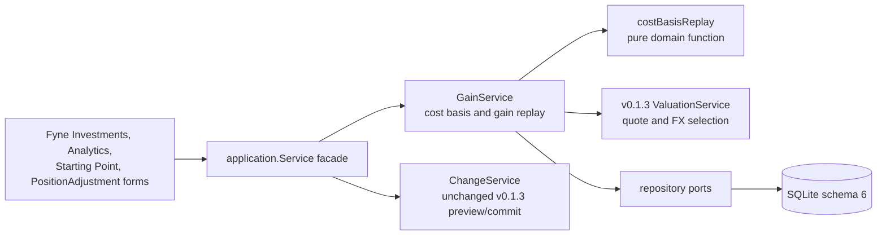

# v0.1.4 Technical Design

## Purpose and Status

**Status:** `Implemented; Phases 1–9 domain, schema, repository reads, GainService, decomposition, realized periods, Fyne capture forms, Investments and Analytics views, integrity closeout, and arm64 packaging smoke completed; manual distribution gates pending`.

**Current persistence rule (2026-08-24):** the shipped generation creates and
verifies one complete schema 6. Non-empty older databases and future schema
versions are rejected without migration or persistent writes. Any `5 -> 6`
migration/backfill paragraphs in this historical design are superseded by the
current implementation and its quality investigation evidence.

This document implements the [v0.1.4 release contract](v0.1.4.md) inside the
Go domain and application layers. The
[compatibility baseline](v0.1.4-baseline.md) records the completed v0.1.3
surface this design extends.

## Architecture and Ownership



- `GainService` is a new application-layer service, sitting beside
  `ValuationService`, `ChangeService`, and `HistoryService`. It performs no
  write and no network I/O.
- Cost basis and gain are **derived read models**, not new mutable projection
  columns. They are computed by replaying a Holding's non-reversed Activities
  plus its Starting Point cost, exactly the way `HistoricalValuationService`
  already replays Starting Point plus effects for a historical cutoff. This
  choice is deliberate: it makes Undo/Fix correct for free, because replay
  already knows how to exclude a reversed/corrected Activity, and it needs no
  new incrementally-mutated column to keep in sync with `holdings.quantity`.
- Fyne owns formatting, the period selector, and the two new cost-entry form
  fields. It never computes an average, a gain, or a currency split.

Suggested package ownership:

```text
internal/domain/cost_basis.go        // pure replay algorithm
internal/domain/change.go            // PositionAdjustmentInput gains UnitCost
internal/domain/history.go           // HistoryOriginComponent gains UnitCost
internal/application/gain_service.go // GainService: replay + valuation + FX
internal/infrastructure/sqlite/schema6.sql
internal/infrastructure/sqlite/cost_basis_repository.go // bounded Activity reads for replay
internal/ui/investments_page.go      // cost/gain columns (extended)
internal/ui/analytics_page.go        // realized-gain and decomposition views (extended)
internal/ui/history_page.go          // Starting Point cost field (extended)
internal/ui/position_adjustment_dialog.go // "already existed" cost field (extended)
```

## Why Replay, Not a Mutable Column

`Holding.Quantity` is already a mutable, incrementally-maintained projection
column (`internal/domain/portfolio.go:174-224`), updated inside the same
transaction as its Activity effects. Average cost could theoretically follow
the same pattern, but a weighted average is not invertible by a simple
opposite-direction effect: undoing a Buy would need to know the exact average
cost *immediately before* that Buy, which no v0.1.3 structure stores.

Two designs were considered:

1. **Mutable column**, storing `average_cost_before` on `activity_trade_details`
   so Undo can restore it directly. This adds a new persisted fact per trade
   and a second write path to keep consistent with the replay-based
   understanding used elsewhere in the codebase (historical valuation).
2. **Replay at read time**, reusing the existing Starting Point + ordered
   Activity model. Undo/Fix correctness falls out of the same exclusion rule
   `HistoricalValuationService` already applies. No new mutable column, no
   second source of truth.

This design adopts **(2)**. The accepted cost is one more read-time
computation per Holding, bounded by that Holding's own Activity count — the
same order of work `ChangeState` already does when it loads Holdings for a
preview, and far smaller than a Household-wide historical rebuild.

## Domain Model

### `PositionAdjustmentInput` Gains `UnitCost`

```go
type PositionAdjustmentInput struct {
    HouseholdID HouseholdID
    HoldingID   HoldingID
    Quantity    Quantity
    Added       bool
    UnitCost    *UnitPrice // required when Added is true and this establishes
                           // the Holding's first positive quantity outside a trade
    EffectiveAt time.Time
    Note        *string
}
```

`buildPositionAdjustment` validates `UnitCost` is present and non-negative
whenever `Added` is true and the Holding's pre-adjustment quantity plus every
earlier non-reversed cost-bearing event would otherwise leave it without a
resolvable cost (in practice: whenever this call is increasing quantity from a
state with no prior cost-bearing event). A decrease (`Added=false`) never
requires `UnitCost`; it remains a remeasurement that does not change the
average cost of the remaining quantity, matching the current
`ClassificationRemeasurement` treatment.

`UnitCost` is not stored as a new `ActivityEffect` field. It is recorded as a
new optional column on `activity_effects` scoped to this one command, `cost_unit_price`,
so the replay in `internal/domain/cost_basis.go` can read it back
deterministically alongside the existing effect. See [Schema 6](#schema-6).

### `HistoryOriginComponent` Gains `UnitCost`

```go
type HistoryOriginComponent struct {
    // ... existing fields unchanged ...
    UnitCost *UnitPrice // required when Kind is holding_quantity and Quantity is positive
}
```

`HistoryOriginComponent.Validate()` is extended: for `HistoryOriginHoldingQuantity`,
`UnitCost` must be present and non-negative whenever `Quantity` is positive.
This is the only Starting Point change; it captures no new business meaning
beyond "this is what the position cost as of the day history started,"
exactly mirroring the plain-language contract already used for quantity and
value components.

### `costBasisReplay` (new, `internal/domain/cost_basis.go`)

A pure function, no SQL, no Fyne, no provider dependency:

```go
type CostLot struct {
    AverageUnitCost UnitPrice // in the Instrument's quote currency
    Quantity        Quantity  // quantity this average applies to, mirrors current Holding.Quantity
}

type RealizedGainEvent struct {
    ActivityID    ActivityID
    EffectiveAt   time.Time
    Quantity      Quantity
    UnitCost      UnitPrice // average cost consumed by this sale
    UnitProceeds  UnitPrice // the sale's derived unit price
    Fee           *Money    // this sale's allocated explicit fee, already in settlement currency
    RealizedGain  SignedMoney // signed result; losses remain negative, settlement currency
}

type CostBasisResult struct {
    Current  CostLot
    Realized []RealizedGainEvent
}

// ReplayCostBasis walks a Holding's Starting Point cost (if any) and its
// ordered, non-reversed Activities, producing the current average cost and
// every realized-gain event. It never reads a quote or performs I/O; the
// caller supplies whatever is already loaded.
func ReplayCostBasis(startingCost *UnitPrice, events []CostBasisEvent) (CostBasisResult, error)
```

`CostBasisEvent` is a small tagged struct built by the application layer from
already-loaded `Activity`/`ActivityEffect`/`TradeDetail` rows, one event per
effect that touches the Holding's quantity:

| Event source | Effect on replay |
| --- | --- |
| Starting Point `UnitCost` | Seeds `(AverageUnitCost, Quantity)` before any Activity is processed |
| Buy (`TradeDetail.UnitPrice`, `Quantity`) | Blends in `(UnitPrice, Quantity)` by quantity-weighted average |
| Sell (`TradeDetail.UnitPrice`, `Quantity`, `Fee`) | Emits a `RealizedGainEvent` using the average cost *before* this event; reduces quantity; average cost of the remainder is unchanged |
| Position Transfer received | Blends in `(sending Holding's AverageUnitCost as of this transfer, Quantity)` |
| Position Transfer sent | Reduces quantity; average cost of the remainder is unchanged |
| `PositionAdjustmentInput` increase with `UnitCost` | Blends in `(UnitCost, Quantity)`, exactly like a Buy |
| `PositionAdjustmentInput` decrease | Reduces quantity; average cost of the remainder is unchanged |
| A reversed Activity and its reversal | Both excluded entirely from replay |

The blend formula, evaluated in exact decimal arithmetic with no binary
float, is:

```text
newAverage = (oldAverage * oldQuantity + incomingUnitCost * incomingQuantity)
             / (oldQuantity + incomingQuantity)
```

The replay normalizes each blended average to two decimal places with decimal
banker's rounding. This makes the release contract's `1400 / 15 = 93.33`
golden case deterministic while retaining exact decimal arithmetic. A realized
gain/loss uses `SignedMoney`, because a loss is a valid result and the existing
non-negative `Money` type remains reserved for balances and value facts.

When `oldQuantity` is zero (a Holding that previously emptied out and is now
receiving quantity again), `newAverage` collapses to `incomingUnitCost`
automatically — no special case is needed, and the acquisition date effectively
resets to the date of this event.

A reversed/reversing pair is identified the same way `HistoricalValuationService`
already orders and excludes them: an Activity with a non-nil `ReversesActivityID`
and the Activity it targets are both skipped. A Fix-entry correction group
(inverse plus replacement) is naturally handled the same way, because the
inverse is itself a reversal of the original and the replacement is an
ordinary new event.

### Position Transfer and the Recursive Read

A transfer's received event needs the sending Holding's average cost **as of
the transfer's `EffectiveAt`**, not its cost today. `GainService` resolves
this by replaying the sending Holding up to and including the transfer
Activity before replaying the receiving Holding past it. Because a transfer
references two distinct Holding IDs and a personal Household's Activity
volume is small, this bounded recursion (at most one extra replay per
transfer event, never a cycle since a transfer cannot reference its own
Holding as its source) is acceptable without new caching. `GainService` must
memoize per-Holding replay results within one request so a Holding involved
in multiple transfers is not replayed redundantly.

## Application Layer: `GainService`

```go
type GainService struct {
    repository Repository
    valuation  *ValuationService
    now        func() time.Time
}

func (g *GainService) HoldingGain(ctx context.Context, holdingID domain.HoldingID) (domain.HoldingGainView, error)
func (g *GainService) AccountGain(ctx context.Context, accountID domain.AccountID) (domain.AccountGainView, error)
func (g *GainService) RealizedGainInRange(ctx context.Context, scope domain.GainScope, from, to domain.LocalDate) (domain.RealizedGainView, error)
```

`HoldingGain`:

1. loads the Holding, its Instrument, the Starting Point cost (if any), and
   its ordered non-reversed cost-bearing events through a bounded repository
   read (`ListCostBasisEvents`, new — see below);
2. calls `domain.ReplayCostBasis`;
3. asks the existing `ValuationService` for the Instrument's currently
   selected quote and the Household's currently selected FX quote/preference,
   reusing `selectInstrumentQuote`/`selectFXQuote`/`findFXPreference` exactly
   as `ValuationService` already does — `GainService` adds no second quote
   selection path;
4. also asks for the FX quote at-or-before the average cost's acquisition
   date (the same at-or-before-cutoff selection rule
   `HistoricalValuationService` already applies for historical valuation, not
   a new rule);
5. computes unrealized gain and its two-way currency decomposition (see
   below);
6. returns a view that is `Available=false` for whichever piece (current
   quote, current FX, or acquisition FX) is missing, while still returning
   cost basis, quantity, and any already-realized gain.

### Currency Decomposition Formula

For a Holding with average unit cost `C` (quote currency), quantity `Q`,
current unit price `P` (quote currency), acquisition FX rate `Ra` (quote
currency to base currency, selected at-or-before the cost's acquisition
date), and current FX rate `Rc`:

```text
CostBase        = C * Q * Ra
ValueBase       = P * Q * Rc
UnrealizedGain  = ValueBase - CostBase
InstrumentMove  = (P - C) * Q * Ra
CurrencyMove    = UnrealizedGain - InstrumentMove
```

`InstrumentMove` values the native price change at the **acquisition-time**
rate, so it isolates price movement alone; `CurrencyMove` is defined as the
exact remainder rather than computed independently, so the two components
always sum to `UnrealizedGain` by construction and there is no unexplained
residual to reconcile. When the Instrument's quote currency equals the
Household base currency, `Ra = Rc = 1` and `CurrencyMove` is exactly zero.

When acquisition cost blends multiple events at different rates (multiple
Buys, or a Starting Point cost plus later Buys), `Ra` is itself the
quantity-weighted blend of each event's own at-or-before FX rate, replayed
with the same blend formula used for average cost, so a partial Sell or
Transfer does not distort the remaining position's acquisition rate.

### Realized Gain in a Period

`RealizedGainInRange` sums `RealizedGainEvent.RealizedGain` for events whose
`EffectiveAt` falls in `[from, to]`, grouped by Instrument and by Account,
after converting each event's settlement-currency gain to base currency using
the FX quote at-or-before that event's own `EffectiveAt` (the existing
at-or-before rule again, not a new one). A missing FX quote for one event
marks only that event's contribution unavailable; it does not zero or drop
the rest of the range.

## Repository Additions

```go
type Repository interface {
    // ... existing v0.1.3 methods unchanged ...

    // ListCostBasisEvents returns, for one Holding, its ordered non-reversed
    // Buy/Sell/Transfer/PositionAdjustment events with the fields needed by
    // ReplayCostBasis, in one bounded read. It excludes any Activity that
    // reverses or is reversed by another, using the same exclusion the
    // historical replay path already applies.
    ListCostBasisEvents(ctx context.Context, holdingID domain.HoldingID) ([]domain.CostBasisEvent, error)

    // StartingPointCost returns the Starting Point's recorded per-unit cost
    // for one Holding, if any.
    StartingPointCost(ctx context.Context, holdingID domain.HoldingID) (*domain.UnitPrice, error)
}
```

Both reads are Household-scoped, single-query (or a small fixed number of
joins), and add no query inside a loop over Holdings or Activities —
preserving the query-bound principle already required of
`HistoricalValuationService`.

## Schema 6

The planned `5 -> 6` migration is additive only, in keeping with every prior
schema change:

```sql
ALTER TABLE history_origin_components
    ADD COLUMN unit_cost TEXT;
ALTER TABLE activity_effects
    ADD COLUMN cost_unit_price TEXT;
```

- `history_origin_components.unit_cost` is populated only for rows where
  `component_kind = 'holding_quantity'` and `quantity` is positive. The
  application layer enforces this; a `CHECK` constraint is not added because
  SQLite cannot express "required when a sibling column is positive" without
  recreating the table, and the existing codebase already prefers
  application-level validation for this class of conditional requirement
  (see `ActivityEffect.Validate()`).
- `activity_effects.cost_unit_price` is populated only for the
  `holding_quantity` effect of a `position_transfer` Activity built from a
  `PositionAdjustmentInput` that carried `UnitCost`. It is `NULL` for every
  other effect, including ordinary Buy/Sell effects, whose cost is already
  fully recoverable from `activity_trade_details.unit_price`.
- No column is added to `holdings`, `activity_trade_details`, or any snapshot
  table. Average cost and gain remain derived, not persisted, matching the
  decision in [Why Replay, Not a Mutable Column](#why-replay-not-a-mutable-column).

### Development-Fixture Backfill

Because no public release exists, the schema `5 -> 6` migration includes one
Go-code backfill step, run once inside the same migration transaction,
immediately after the two `ALTER TABLE` statements:

1. For every Holding with positive current quantity that has no Starting
   Point `holding_quantity` component at all (created entirely before v0.1.4
   through test/dev fixtures), insert one Starting Point component of that
   quantity with `unit_cost` set to the Instrument's currently selected quote
   price, using the same `ValuationService` quote-selection helper the
   application already has. If no quote is selected, `unit_cost` is set to
   the Holding's `activity_trade_details` most recent trade's `unit_price`
   if one exists; otherwise the migration fails loudly rather than guessing.
2. This step touches no Activity, no effect, and no current total; it only
   completes an origin component so every positive-quantity Holding satisfies
   the v0.1.4 invariant.

This backfill is explicitly a development-fixture repair, not a
release-grade migration guarantee, per the
[baseline's product precondition](v0.1.4-baseline.md#product-precondition-no-public-release-exists).
It must not run silently against a database that already has a real user's
data once this application ships; the implementation plan's Phase 0 records
this as an open item to revisit before any public release.

Phases 1–2 implement the domain contract and persist both optional cost
fields. During the schema-5 to schema-6 migration, existing positive starting
components are filled from the selected quote or a non-reversed trade; an
unresolvable holding aborts the transaction instead of receiving a zero cost.

`DB.Verify` gains a check that every `holdings` row with positive quantity
resolves to a `CostBasisResult` with a non-nil `Current.AverageUnitCost`
through the new repository reads, alongside the existing required-column,
index, and constraint checks.

## Error Contract

New stable application codes:

```text
cost_basis_required
cost_basis_unavailable
```

`cost_basis_required` is returned when `PositionAdjustmentInput.Added` is
true, the Holding has no resolvable prior cost, and `UnitCost` is nil or
negative. `cost_basis_unavailable` is never a hard error; it is the
`Available=false` state on a gain/decomposition view, identical in spirit to
the existing `MissingInputView` pattern already used by `ValuationService`.
Messages name the friendly Holding/Instrument and never expose SQL, a raw
replay event, or a personal note.

## Read Models and Bounds

- `HoldingGainView`, `AccountGainView`, and `RealizedGainView` follow the
  existing `MoneyView`/`AllocationView` pattern: canonical decimal strings,
  currency codes, and explicit `Available`/`MissingReason` fields, never a
  substituted zero.
- The realized-gain period query accepts `30d`, `1y`, or `all`, reusing
  `domain.TrendRange` rather than inventing a second range type.
- Every new read is Household-scoped and bounded by one Holding's or one
  Household's own event count; no v0.1.4 read issues a query per Activity in
  a loop.

## Fyne Experience

- **Investments page**: each position row gains average cost, total cost, and
  unrealized gain (native and base currency), with the same
  available/unavailable presentation already used for missing quotes.
- **Analytics page**: a new section beside the existing net-worth trend shows,
  for the selected period, realized gain by Instrument and by Account, and a
  currency decomposition table for currently-held positions. Every chart-like
  element ships with an accessible table using the same values.
- **Starting Point form**: for each Instrument position being captured, one
  additional field for per-unit cost, pre-filled from the current quote and
  explained as "What this was worth when you started tracking it" rather than
  as a ledger term.
- **"Already existed" reconciliation dialog**: gains the same per-unit cost
  field, pre-filled from the current quote.
- Ordinary Buy/Sell forms are unchanged; their existing gross-amount field
  already is the cost input.

The UI says **Average cost**, **Gain**, and **Currency effect** — not "basis,"
"lot," or "unrealized P&L." Internal replay events may appear in an
expandable read-only detail but are never a user input.

## Security, Privacy, and Forward Compatibility

- All facts remain local SQLite data under the existing application-data
  boundary; v0.1.4 introduces no telemetry, sync, credential, or new provider
  permission.
- Logs identify operation/error class only and omit cost, gain, quantity, and
  Instrument identity, matching the existing v0.1.3 log-redaction contract.
- A later release may add FIFO lots, return calculation, or a full
  attribution bridge on top of these read models, but may not reinterpret a
  v0.1.4 average-cost result as if it had always been lot-based, and may not
  silently backfill an acquisition date this release did not capture.
