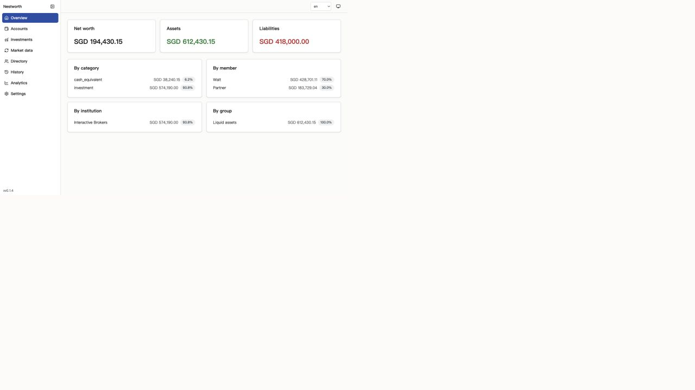
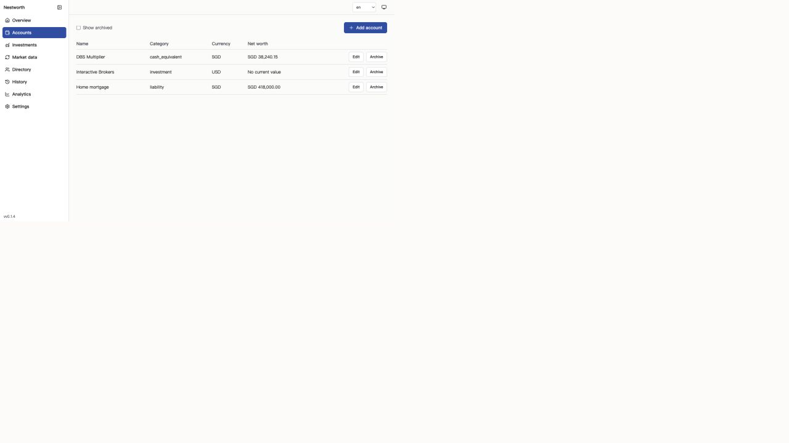
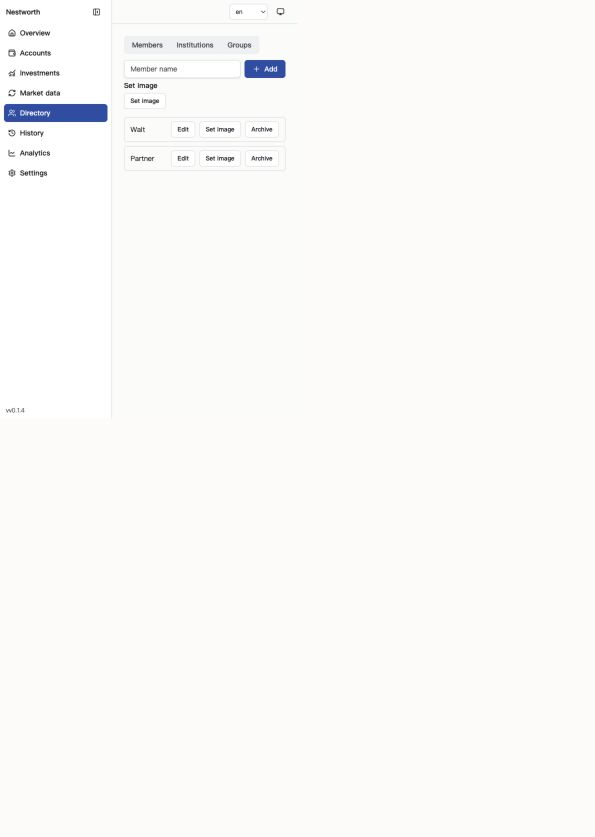
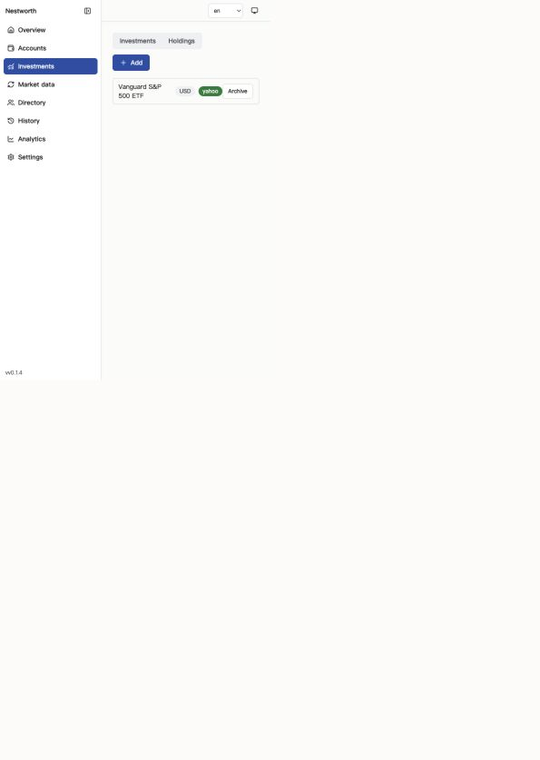
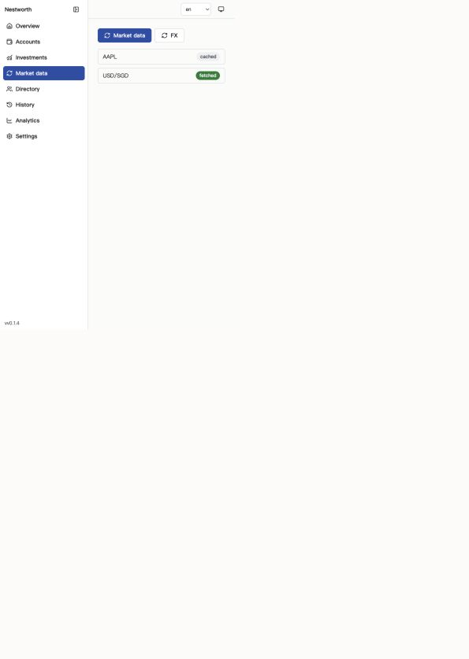
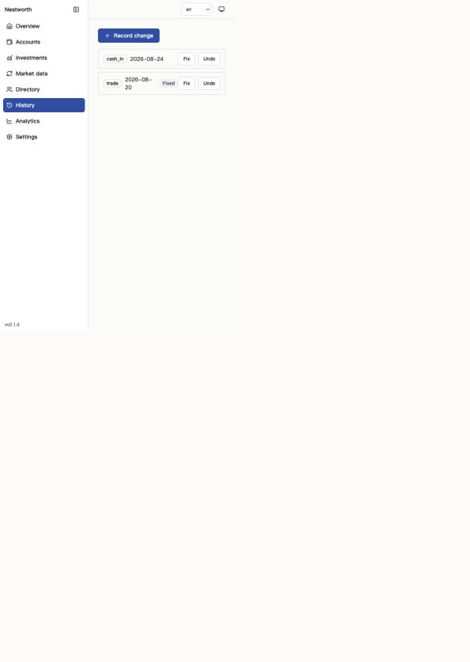
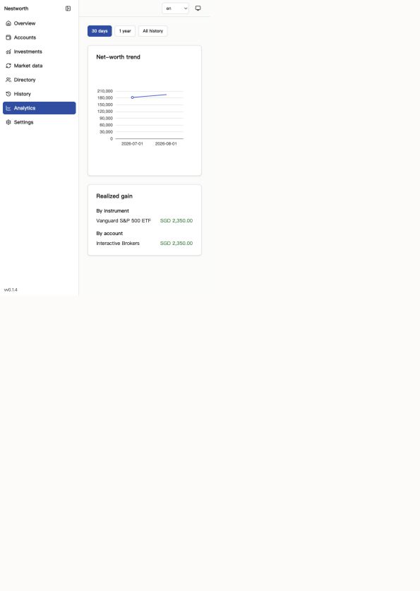
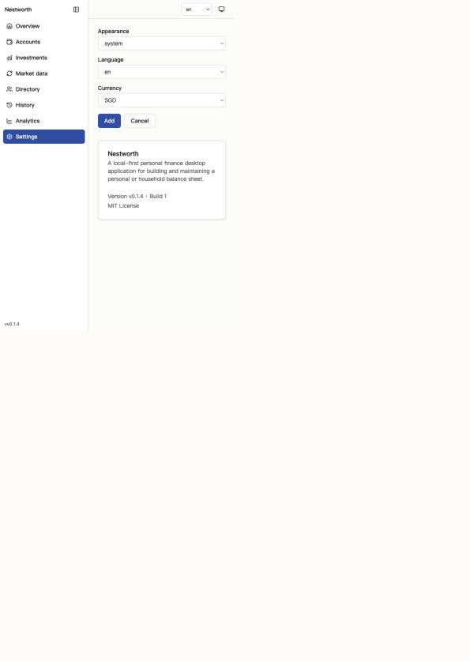

# Nestworth-go 前端体验 Review 与处理建议

- Review 日期：2026-08-26
- Review 对象：`wails-v3` 分支当前 React + TypeScript + Wails v3 前端
- Review 类型：产品体验、视觉层级、文案、i18n、交互逻辑与可访问性综合初审
- 文档状态：临时审查稿，供后续拆解设计与实现任务

## 1. 结论摘要

当前前端已经把主要业务能力连接起来，但整体仍然更接近“工程控制台”或“CRUD 管理后台”，尚未形成可直接交付给普通家庭用户的个人财务产品体验。

问题不是单纯的视觉 polish，而是以下层面同时缺少统一设计：

1. 信息架构没有体现用户任务的主次，8 个一级入口并列展示。
2. 页面缺少稳定的标题、说明、状态、更新时间和下一步行动。
3. 内部领域枚举、状态码和技术术语直接泄露到界面。
4. i18n 只覆盖了部分外壳，核心操作仍大量硬编码英文。
5. 部分按钮文案与真实行为矛盾，Settings 中已经存在高风险误操作。
6. 加载、错误、空状态、部分成功和恢复路径不完整。
7. 视觉层级过弱，内容普遍堆在左上角，屏幕空间利用率低。
8. 键盘与读屏基础存在，但仍有明确的可访问性缺口。

建议不要直接做一轮“换色、加阴影、调圆角”的视觉重绘。应先修正操作语义、i18n、状态模型和信息架构，再统一页面框架和视觉系统。

## 2. 审查范围与证据边界

### 2.1 已检查

- 启动失败状态
- 首次设置 Onboarding
- Overview
- Accounts
- Directory
- Investments
- Market Data
- History
- Analytics
- Settings / About
- 当前前端源码中的加载、错误、空状态和异步交互处理
- 英文、简体中文和繁体中文资源
- 键盘与读屏相关的明显结构问题
- 当前前端测试、TypeScript typecheck 与 ESLint 状态

### 2.2 证据限制

- 原生 Wails 应用在本次审查中未能完整启动；依赖下载长时间卡住。
- 启动失败页来自实际浏览器预览。
- 其余页面截图来自当前 React 组件配合确定性样例数据的渲染，用于检查当前布局、文案、层级和组件行为，不代表原生后端集成已经验证。
- 审查过程中 `Nestworth-go` 工作区被其他进程或 agent 持续修改，从最初的干净状态变为大量未提交改动。因此本文记录的是本次审查期间确认的问题，不应被理解为对后续变更的自动复核。
- 未完成 VoiceOver、完整键盘流、窄窗口、200% 缩放、深色模式、系统语言切换、reduced motion 和真实网络错误恢复测试。

## 3. 优先级定义

| 优先级 | 定义 |
| --- | --- |
| P0 | 可能导致误操作、数据风险、核心任务错误或产品不可理解，发布前必须修复 |
| P1 | 明显阻碍核心任务、信任、可访问性或跨语言体验，应在整体视觉升级前修复 |
| P2 | 主要影响效率、一致性、视觉品质或长期可维护性，可在结构稳定后处理 |

## 4. 核心问题与处理建议

### P0-1 Settings 的按钮语义与真实行为相反

**现状**

- 主按钮显示 `Add`，实际执行保存设置。
- 次按钮显示 `Cancel`，实际调用 Reset，将设置恢复为默认值。
- Reset 没有确认对话框，也没有说明哪些设置会被修改。
- 保存成功 toast 仍显示 `Add`。

**风险**

- 用户会把 “Cancel” 理解为放弃未保存修改，但实际可能覆盖持久化偏好。
- 操作结果违反用户预期，直接损害信任。
- 这是交互逻辑问题，不只是翻译问题。

**建议**

1. 主按钮改为 `Save changes / 保存更改 / 儲存變更`。
2. Reset 使用独立的 `Reset to defaults / 恢复默认设置` 文案。
3. Reset 放在单独的危险或次要操作区域，不与 Save 并排伪装成 Cancel。
4. Reset 前展示确认对话框，并说明将恢复哪些设置。
5. 如果表单有未保存修改，提供真正的 Cancel/Revert 行为。
6. 成功 toast 使用 `Settings saved / 设置已保存`。

**验收标准**

- 没有任何显示为 Cancel 的按钮会写入或重置持久化设置。
- Reset 必须二次确认。
- Save、Cancel、Reset 在三种语言中语义一致。
- 自动化测试按用户可见文案验证真实行为，而不是延续错误文案。

**源码参考**

- `/Users/waltwang/Developer/walt/Nestworth-go/frontend/src/features/settings/SettingsPage.tsx:46`
- `/Users/waltwang/Developer/walt/Nestworth-go/frontend/src/features/settings/SettingsPage.tsx:111`

### P0-2 i18n 未覆盖核心任务，繁中资源混入简体文本

**现状**

- History、Record Change、Holdings、Analytics 和 Market Data 存在大量硬编码英文。
- 语言选项直接显示 `en`、`zh-CN`、`zh-TW`。
- 外观选项直接显示 `system`、`light`、`dark`。
- 繁中资源中存在 `关闭日期`、`编辑账户`、`单独所有`、`计入投资`、`开户日期`、`所有权比例` 等简体文本。
- 状态、来源和领域枚举直接显示原始值，例如 `cash_in`、`cash_equivalent`、`cached`、`fetched`、`yahoo`。
- aria-label、title、placeholder 中也存在硬编码英文。

**风险**

- 切换中文后会出现中英混排，且不同页面完成度差异巨大。
- 繁中用户会看到明显错误的语言变体。
- 原始枚举值暴露实现细节，普通用户难以理解。
- 仅比较 locale key coverage 的测试无法发现 JSX 硬编码和翻译质量问题。

**建议**

1. 建立统一的展示层映射：领域枚举值不得直接展示。
2. 将所有用户可见的 JSX 文本、aria-label、title、placeholder 和 toast 纳入 i18n。
3. 语言选择显示本地化名称，例如 `English`、`简体中文`、`繁體中文`。
4. 外观选择显示 `Follow system / Light / Dark` 的本地化文本。
5. 对繁中资源进行人工校对，不使用简单的字符自动转换作为最终结果。
6. 增加静态检查，阻止 feature 组件新增未豁免的用户可见英文文本。
7. 对关键任务增加三语言截图或 DOM 测试：Onboarding、Account Form、Record Change、Settings、错误状态。

**验收标准**

- 在任意支持语言下完成核心任务时，不出现非专有名词的英文残留。
- UI 不直接显示 snake_case 枚举或内部状态码。
- 繁中资源通过人工语言审查。
- i18n 测试同时覆盖 key parity、硬编码文本和关键页面渲染。

**源码参考**

- `/Users/waltwang/Developer/walt/Nestworth-go/frontend/src/features/history/HistoryPage.tsx:25`
- `/Users/waltwang/Developer/walt/Nestworth-go/frontend/src/features/history/RecordChangeForm.tsx:12`
- `/Users/waltwang/Developer/walt/Nestworth-go/frontend/src/features/investments/InvestmentsPage.tsx:119`
- `/Users/waltwang/Developer/walt/Nestworth-go/frontend/src/features/analytics/AnalyticsPage.tsx:71`
- `/Users/waltwang/Developer/walt/Nestworth-go/frontend/src/features/marketdata/MarketDataPage.tsx:42`
- `/Users/waltwang/Developer/walt/Nestworth-go/frontend/src/i18n/locales/zh-TW.json:13`

### P1-1 加载、错误和恢复状态不完整

**现状**

- App Startup 和 Bootstrap 加载时直接 `return null`，用户看到白屏。
- 数据库启动失败页只有说明，没有重试、退出、打开数据位置或诊断动作。
- Accounts 和 Directory 的 loading 状态使用 `Coming soon`，把“正在加载”错误描述成“功能尚未提供”。
- Settings 加载时同样显示 `Coming soon`。
- History Origin 查询失败时，由于只判断 `!origin.data`，会错误展示 Start History。
- 部分页面没有独立的 loading、error、empty 和 stale 状态。

**风险**

- 白屏会被理解为应用崩溃。
- 查询失败与数据为空混淆，可能诱导用户执行错误操作。
- 用户无法自行恢复或提供有效诊断信息。

**建议**

1. 定义统一页面状态模型：loading、error、empty、partial、stale、ready。
2. Startup 使用带品牌和明确进度的启动画面，并设置超时后的诊断入口。
3. 数据库失败页提供安全、真实可执行的恢复动作。
4. History 显式判断 `isError`，绝不把查询失败当作未初始化。
5. 页面级错误使用统一 ErrorState，包含 Retry 和可选的 Details。
6. 加载状态使用 skeleton 或明确的 Loading 文案，不复用 Coming soon。

**验收标准**

- 正常冷启动期间不出现无内容白屏。
- 每个页面都能区分 loading、error、empty 和 ready。
- History 查询失败时不能出现 Start History CTA。
- 所有 Retry 都实际重新执行对应查询。

**源码参考**

- `/Users/waltwang/Developer/walt/Nestworth-go/frontend/src/App.tsx:29`
- `/Users/waltwang/Developer/walt/Nestworth-go/frontend/src/features/startup/BlockedStartupPage.tsx:10`
- `/Users/waltwang/Developer/walt/Nestworth-go/frontend/src/features/accounts/AccountsPage.tsx:213`
- `/Users/waltwang/Developer/walt/Nestworth-go/frontend/src/features/history/HistoryPage.tsx:174`
- `/Users/waltwang/Developer/walt/Nestworth-go/frontend/src/features/settings/SettingsPage.tsx:40`

### P1-2 信息架构没有围绕用户目标组织

**现状**

- Overview、Accounts、Investments、Market Data、Directory、History、Analytics、Settings 共 8 个入口平铺在侧栏。
- 页面普遍没有 H1、页面说明、上下文状态或主任务提示。
- Directory 中再次嵌套 Members、Institutions、Groups。
- Investments 中再嵌套 Investments 和 Holdings，其中命名重复。
- Market Data 作为一级入口暴露了偏技术性的维护能力。

**风险**

- 新用户无法判断应该从哪里开始，也不理解账户、持仓、机构、分组、历史和市场数据之间的关系。
- 系统结构替代了用户心智模型。
- 高频任务与低频维护操作权重相同。

**建议方向**

建议按用户任务重新分组，而不是按后端 service 分组：

- `Overview`：家庭财务全貌、数据健康、待处理事项。
- `Portfolio`：Accounts、Holdings、Instruments；以资产结构而非数据表为核心。
- `Activity`：History、Record Change、Undo/Fix。
- `Insights`：趋势、收益、分布。
- `Manage`：Members、Institutions、Groups。
- `Settings`：偏好、市场数据来源、About。

Market Data 更适合作为 Settings/Data Sources 或数据健康面板的一部分，而非默认一级导航。

**验收标准**

- 每个一级入口对应一个用户可以说清楚的目标。
- 页面顶部统一包含标题、简短说明和必要的状态/更新时间。
- 核心任务无需理解内部 service 或领域表结构。
- 一级导航数量和分组经过任务流验证，而不是只依据现有代码模块。

**源码参考**

- `/Users/waltwang/Developer/walt/Nestworth-go/frontend/src/app/navigation.ts:16`
- `/Users/waltwang/Developer/walt/Nestworth-go/frontend/src/app/AppShell.tsx:76`

### P1-3 原始领域值和错误术语直接展示

**现状示例**

- Overview：`cash_equivalent`、`investment`。
- Accounts：账户余额列标题使用 `Net worth`。
- History：`cash_in`、`trade`。
- Market Data：`cached`、`fetched`。
- Investments：`yahoo`、`manual` 等来源值直接展示。
- App Shell：如果版本本身已经包含 `v`，界面再次添加 `v`，可能显示为 `vv0.1.4`。

**建议**

1. 为所有领域枚举建立本地化 label、description、icon 和 tone 映射。
2. 将 Account 列标题改为 `Current value`，不要借用 Overview 的 Net Worth key。
3. Activity 使用用户语言描述，例如 `Added SGD 1,000 to DBS Multiplier`。
4. 市场数据状态说明结果与影响，例如 `Using cached quote · updated 2h ago`。
5. 版本格式只由一个层级负责添加前缀。

**验收标准**

- 用户界面不展示 snake_case、内部 provider key 或未解释状态码。
- 每个金额标签表达正确的财务含义。
- Activity 记录无需打开详情即可理解主要变化。

**源码参考**

- `/Users/waltwang/Developer/walt/Nestworth-go/frontend/src/features/accounts/AccountsPage.tsx:96`
- `/Users/waltwang/Developer/walt/Nestworth-go/frontend/src/features/history/HistoryPage.tsx:93`
- `/Users/waltwang/Developer/walt/Nestworth-go/frontend/src/features/marketdata/MarketDataPage.tsx:42`
- `/Users/waltwang/Developer/walt/Nestworth-go/frontend/src/app/AppShell.tsx:111`

### P1-4 可访问性存在明确缺口

**已确认问题**

- 侧栏收起后移除导航文字，但导航按钮没有 aria-label，读屏会遇到无名称按钮。
- Appearance 和 Language 的 aria-label 为硬编码英文。
- EChart 只返回一个无 role、无名称、无替代数据的 div/canvas 图表。
- 部分图标按钮仅依靠 title 或视觉图标表达含义。
- 状态变化与异步保存不一定有稳定的 live-region 反馈。
- 页面标题层级不稳定；大部分页面没有 H1。

**建议**

1. 导航按钮始终提供本地化 accessible name，折叠只改变视觉显示。
2. 图表提供 `role="img"`、本地化说明，以及可切换的数据表或屏幕阅读器摘要。
3. 页面统一使用一个 H1，卡片标题从 H2/H3 继续。
4. 所有 icon-only 控件必须有本地化 aria-label。
5. 对保存、刷新、错误和部分成功状态使用明确的状态通知。
6. 补做键盘、VoiceOver、200% 缩放与窄窗口验证。

**验收标准**

- 侧栏展开和收起时，所有导航项都拥有相同的 accessible name。
- 仅使用键盘可以完成 Onboarding、添加账户、Record Change、Settings 保存和 Reset 取消。
- 图表数据不依赖视觉 canvas 才能获取。
- 200% 缩放与最小支持窗口宽度下，不丢失操作或产生不可访问的横向裁切。

**源码参考**

- `/Users/waltwang/Developer/walt/Nestworth-go/frontend/src/app/AppShell.tsx:90`
- `/Users/waltwang/Developer/walt/Nestworth-go/frontend/src/components/charts/EChart.tsx:34`

### P1-5 创建实体与绑定图片不是一个可理解的用户操作

**现状**

- Account、Member、Institution、Group 先创建实体，再异步创建媒体并绑定。
- 图片阶段使用 `void ...then(...)`，没有 catch、部分成功反馈或重试入口。
- Directory 创建表单会立即清空，即使后续图片保存失败。

**风险**

- 用户看到操作没有完成，可能再次创建实体，造成重复数据。
- 实体已创建但图片未绑定，界面没有解释当前状态。

**建议**

1. 明确区分实体保存和图片上传两个阶段。
2. 如果无法事务化，应在部分成功时关闭主表单并提示：实体已创建，图片保存失败，可重试。
3. 为已有实体提供稳定的图片重试入口。
4. mutation pending 状态应覆盖完整组合操作，而不是只覆盖第一阶段。

**验收标准**

- 任一阶段失败都不会表现为静默无响应。
- 用户能知道实体是否已经创建。
- 重试图片不会重复创建实体。

**源码参考**

- `/Users/waltwang/Developer/walt/Nestworth-go/frontend/src/features/accounts/AccountsPage.tsx:65`
- `/Users/waltwang/Developer/walt/Nestworth-go/frontend/src/features/directory/DirectoryPage.tsx:60`

### P2-1 视觉层级和空间使用不足

**现状**

- 页面内容普遍集中在左上角，存在大量无意义空白。
- 字体和控件整体偏小，财务信息密度高但层级不明显。
- 页面缺少统一标题区、辅助说明、筛选区和状态区。
- 卡片、列表和表格主要依靠相同边框区分，视觉节奏单一。
- 当前蓝灰配色和默认组件组合缺少明确品牌识别。
- 品牌 wordmark、logo、插图和空状态视觉没有进入主要体验。

**建议**

1. 定义统一 `PageHeader`：标题、说明、状态、主要操作。
2. 定义内容最大宽度与桌面响应策略，避免内容无限贴左或过度空旷。
3. Overview 优先展示总览、变化、数据健康和待处理事项，而不只是多个等权卡片。
4. 列表页面统一使用 toolbar、table/list container、empty state 和 pagination/filter 区域。
5. 视觉升级应建立在任务层级和信息结构确定之后。

### P2-2 Onboarding 缺少信任建立和关键决策说明

**现状**

- 首屏只有 Household name、Base currency、Members 三组字段。
- 没有解释 Nestworth 的价值、本地优先、隐私边界和完成后会发生什么。
- `Household` 是领域术语，新用户未必理解。
- Base currency 是重要且可能难以修改的决策，但没有说明。
- 没有步骤感、完成预期或示例。

**建议**

1. 用一句话说明结果：建立家庭资产负债表，并在本机保存。
2. 解释 Household 可用于个人或家庭。
3. 说明 Base currency 的用途和后续修改限制。
4. 提供清晰步骤或至少展示“约 1 分钟完成”。
5. 完成后引导创建第一个账户，而不是直接落到空 Overview。

## 5. 逐页面 Review

| 页面 | 当前健康度 | 主要问题 | 建议目标 |
| --- | --- | --- | --- |
| Startup blocked | 较差 | 无恢复动作，空白过多 | 可诊断、可恢复、可退出 |
| Onboarding | 较弱 | 裸表单、术语重、关键决策无说明 | 建立信任并引导首个成功结果 |
| Overview | 基础可用 | 原始枚举、无更新时间、缺少数据健康与下一步 | 成为家庭财务驾驶舱 |
| Accounts | 基础可用 | 列名错误、字段少、行操作密集 | 快速理解账户状态并完成维护 |
| Directory | 较弱 | CRUD 后台感强，图片操作重复抢眼 | 作为低频管理空间 |
| Investments | 较弱 | 缺少列结构、术语与来源裸露 | 清晰展示持仓、成本、现值与收益 |
| Market Data | 较弱 | CTA 含义不清、状态缺少时间与影响 | 解释数据健康并支持恢复 |
| History | 高风险 | 原始事件码、Fix/Undo 含义弱、错误状态混淆 | 使用自然语言解释变化并安全纠错 |
| Analytics | 部分可用 | 图表语境少、硬编码英文、无无障碍替代 | 提供可解释、可比较的趋势洞察 |
| Settings | 严重 | Save/Reset 文案与行为矛盾 | 安全、明确、可撤销的偏好管理 |

## 6. 截图证据

### 6.1 Startup blocked

### 6.2 Onboarding

### 6.3 Overview

### 6.4 Accounts

### 6.5 Directory

### 6.6 Investments

### 6.7 Market Data

### 6.8 History

### 6.9 Analytics

### 6.10 Settings

## 7. 建议处理顺序

### Phase A：先消除误导和风险

1. 修复 Settings 的 Save / Cancel / Reset 语义和确认流程。
2. 修复 History 查询错误被误判为未初始化的问题。
3. 修复启动白屏和不可恢复的 blocked state。
4. 修正 Accounts 的 `Net worth` 列名和重复 `v` 版本格式。
5. 为组合 mutation 增加部分成功和失败恢复。

### Phase B：建立展示层与 i18n 边界

1. 建立领域枚举到展示模型的统一映射。
2. 清理 History、Investments、Analytics、Market Data 的硬编码文本。
3. 修订语言、外观、Provider 和状态显示名称。
4. 人工校对繁中资源。
5. 增加硬编码文本检查和三语言关键页面测试。

### Phase C：重构产品框架

1. 确认新的一级导航与分组。
2. 引入统一 PageHeader、PageState、EmptyState、ErrorState。
3. 将 Market Data 移入更合理的数据健康或设置入口。
4. 为 Overview 增加数据更新时间、完整度和待处理事项。
5. 将 History 活动改造成自然语言时间线。

### Phase D：视觉系统与可访问性升级

1. 定义桌面内容宽度、间距和响应规则。
2. 调整字号、密度、卡片层级和表格可读性。
3. 引入品牌资产与可信的空状态视觉。
4. 为图表提供可访问名称、摘要和数据表。
5. 完成键盘、VoiceOver、缩放、窄窗口、深色模式测试。

## 8. 建议的全局验收标准

### 产品与交互

- 用户可以从 Onboarding 顺利到达第一个有意义的 Overview。
- 所有按钮文案与实际副作用一致。
- 危险或重置操作可识别、需确认，并尽可能可撤销。
- 查询失败、数据为空和功能未提供不会共用同一状态。
- 部分成功不会静默发生。

### 文案与 i18n

- 英文、简中、繁中均可完成所有核心任务。
- 不展示 snake_case、内部状态码或未解释的 Provider key。
- 繁中无简体残留。
- aria-label、title、placeholder、toast 和错误消息全部进入翻译边界。

### 视觉

- 每个页面有清晰的标题、说明、主要操作和状态区域。
- 在 1100×720 与约定的最小窗口下均可使用。
- 数字、币种、百分比、正负状态和缺失数据的层级一致。
- 空状态包含原因、下一步和必要的主 CTA。

### 可访问性

- 键盘可以完成核心任务，焦点顺序与可见焦点明确。
- 侧栏折叠后导航仍有可访问名称。
- 图表提供非视觉等价内容。
- 200% 缩放不丢失信息或操作。
- 状态变化可被辅助技术感知。

### 验证门槛

- TypeScript typecheck 通过。
- ESLint 无 error，并评估或消除当前 React Compiler warnings。
- 前端测试全部通过。
- 三语言关键流截图或自动化渲染通过。
- 原生 Wails 环境完成冷启动、数据库失败、窄窗口、深色模式和键盘 smoke test。

## 9. 本次自动化检查结果

- TypeScript typecheck：通过。
- ESLint：0 error，3 warnings；warnings 来自 React Hook Form `watch()` 和 TanStack Table 与 React Compiler 的兼容性提示。
- Frontend tests：60/61 通过。
- 当前失败：Settings About 测试仍期待 `v0.1.4`，实际实现已经返回 `v0.2.0`。
- 原生集成：未验证。
- VoiceOver、窄窗口、深色模式、缩放和 reduced motion：未验证。

## 10. 后续建议产物

在开始大规模实现前，建议再形成三份独立产物：

1. **导航与任务流提案**：明确一级导航、页面职责和用户主路径。
2. **三张高保真目标图**：Onboarding、Overview、History，先确定设计方向再推广到其他页面。
3. **i18n 与展示模型清单**：枚举、状态、操作、错误和无障碍文本的统一映射。

这三份产物稳定后，再进行组件级实现，可以避免在现有信息结构上做昂贵但效果有限的视觉润色。
